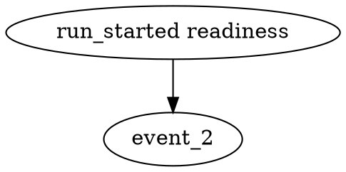

# zigeffect Agent-Observable Causal Runtime Implementation Plan

> **For agentic workers:** REQUIRED SUB-SKILL: Use superpowers:subagent-driven-development (recommended) or superpowers:executing-plans to implement this plan task-by-task. Steps use checkbox (`- [ ]`) syntax for tracking.

**Goal:** Build a Zig-native causal execution graph for `zigeffect` so agents can query runtime facts about effects, services, scopes, resources, fibers, schedules, exits, causes, logs, metrics, and traces.

**Architecture:** Add an opt-in causal event service to the existing `services` domain, then instrument runtime domains only through shared contracts. The deterministic in-memory backend is the reference implementation; JSON, DOT, OpenTelemetry, NenDB, Cockroach/RoachGraph durable history, and async backends are adapters over the same event stream.

**Tech Stack:** Zig stdlib, `zig build test`, Bun workspace scripts, existing `zigeffect` domains (`core`, `effect`, `runtime`, `layer`, `services`, `testing`).

---

## File Structure

- Create: `packages/zigeffect/src/services/causal_backend.zig`
  Owns the adapter contract shared by artifact, observability, graph, durable
  history, and future async exporters.
- Create: `packages/zigeffect/src/services/causal.zig`
  Owns `CausalEventKind`, `CausalEvent`, `CausalStore`, snapshot, lineage, and
  report formatting.
- Modify: `packages/zigeffect/src/services/observability.zig`
  Links causal reports to existing logger, metrics, and tracing reports where
  useful.
- Modify: `packages/zigeffect/src/zigeffect.zig`
  Exports causal runtime APIs through the public facade and `fx.services`.
- Modify: `packages/zigeffect/src/core/context.zig`
  Carries an optional causal store pointer and active run/scope trace ids.
- Modify: `packages/zigeffect/src/core/scope.zig`
  Emits scope and finalizer lifecycle events when a causal store is present.
- Modify: `packages/zigeffect/src/runtime/runner.zig`
  Emits run, effect, exit, and cleanup events from the shared execution path.
- Modify: `packages/zigeffect/src/runtime/runtime.zig`
  Adds `withCausalStore` and passes causal context into managed runs.
- Modify: `packages/zigeffect/src/runtime/fiber.zig`
  Emits fiber fork/start/join/interrupt and fiber-scope events.
- Modify: `packages/zigeffect/src/layer/graph.zig`
  Emits layer startup, requirement, provider, replacement, and graph cleanup
  events.
- Modify: `packages/zigeffect/src/effect/resource.zig`
  Emits resource acquisition events through the active context.
- Modify: `packages/zigeffect/src/effect/schedule.zig`
  Emits retry/repeat decision events when run through a context with a causal
  store.
- Modify: `packages/zigeffect/src/testing/test_env.zig`
  Provides a causal store in test environments and assertion helpers.
- Modify: `packages/zigeffect/test/services_test.zig`
  Tests causal store, formatting, redaction, and observability links.
- Modify: `packages/zigeffect/test/runtime_test.zig`
  Tests run/scope/exit causal events.
- Modify: `packages/zigeffect/test/fiber_test.zig`
  Tests fiber causal events.
- Modify: `packages/zigeffect/test/layer_test.zig`
  Tests layer graph causal events.
- Modify: `packages/zigeffect/test/schedule_test.zig`
  Tests schedule decision events.
- Modify: `packages/zigeffect/test/all_test.zig`
  Ensures causal tests are part of the package test suite.
- Modify: `packages/zigeffect/docs/agent-observable-runtime.md`
  Keeps implementation details synchronized with the canonical vision.
- Modify: `packages/zigeffect/docs/agent-guide.md`
  Adds the agent query workflow once APIs exist.

## Phase 0: Dogfood Development Feedback Lane

This phase is not a smaller substitute for the full system. It is the internal
feedback loop that lets agents use early causal artifacts while building the
rest of the runtime.

Deliverables:

- deterministic causal artifacts for failing `zigeffect` tests
- development-agent report format with owning subsystem, event lineage, and
  next query suggestions
- scenario catalog for missing config, cleanup failure, scoped fiber
  interruption, retry exhaustion, and app incident trace context
- before/after trace comparison as later milestones add runtime hooks

Phase 0 should stay grounded: agents propose tests, docs, or code changes with
event evidence; they do not mutate runtime state.

## Task 1: Causal Event Store

**Files:**
- Create: `packages/zigeffect/src/services/causal.zig`
- Modify: `packages/zigeffect/src/zigeffect.zig`
- Test: `packages/zigeffect/test/services_test.zig`

- [ ] **Step 1: Write the failing store test**

Append this test to `packages/zigeffect/test/services_test.zig`:

```zig
test "causal store records events and snapshots deterministically" {
    var store = fx.CausalStore.init(std.testing.allocator);
    defer store.deinit();

    const run_id = try store.nextRunId();
    const event_id = try store.record(.{
        .kind = .run_started,
        .run_id = run_id,
        .label = "readiness",
        .type_name = "ReadinessEffect",
    });

    var snapshot = try store.snapshot(std.testing.allocator);
    defer snapshot.deinit();

    try std.testing.expectEqual(@as(usize, 1), snapshot.events.len);
    try std.testing.expectEqual(event_id, snapshot.events[0].id);
    try std.testing.expectEqual(run_id, snapshot.events[0].run_id.?);
    try std.testing.expectEqual(fx.CausalEventKind.run_started, snapshot.events[0].kind);
    try std.testing.expectEqualStrings("readiness", snapshot.events[0].label);
}
```

- [ ] **Step 2: Run the test and verify it fails**

Run: `bun run zigeffect:test`

Expected: FAIL because `fx.CausalStore` and `fx.CausalEventKind` are not
exported.

- [ ] **Step 3: Implement the event store**

Create `packages/zigeffect/src/services/causal.zig`:

```zig
const std = @import("std");

pub const Allocator = std.mem.Allocator;

pub const CausalEventKind = enum {
    run_started,
    run_completed,
    effect_started,
    effect_completed,
    layer_started,
    layer_completed,
    service_required,
    service_provided,
    service_replaced,
    scope_opened,
    scope_closed,
    resource_acquired,
    resource_finalized,
    fiber_forked,
    fiber_started,
    fiber_joined,
    fiber_interrupted,
    schedule_decision,
    exit_recorded,
    log_recorded,
    metric_recorded,
    span_recorded,
    assertion_recorded,
};

pub const CausalEvent = struct {
    id: u64 = 0,
    kind: CausalEventKind,
    run_id: ?u64 = null,
    parent_id: ?u64 = null,
    fiber_id: ?u64 = null,
    scope_id: ?u64 = null,
    trace_id: ?u64 = null,
    span_id: ?u64 = null,
    label: []const u8 = "",
    type_name: []const u8 = "",
    status: []const u8 = "",
    redacted_detail: []const u8 = "",
};

pub const CausalSnapshot = struct {
    allocator: Allocator,
    events: []CausalEvent,

    pub fn deinit(self: *CausalSnapshot) void {
        self.allocator.free(self.events);
    }
};

pub const CausalStore = struct {
    allocator: Allocator,
    next_event_id: u64 = 1,
    next_run_id_value: u64 = 1,
    next_scope_id_value: u64 = 1,
    events: std.ArrayList(CausalEvent) = .empty,

    pub fn init(allocator: Allocator) CausalStore {
        return .{ .allocator = allocator };
    }

    pub fn deinit(self: *CausalStore) void {
        self.events.deinit(self.allocator);
    }

    pub fn nextRunId(self: *CausalStore) Allocator.Error!u64 {
        const id = self.next_run_id_value;
        self.next_run_id_value += 1;
        return id;
    }

    pub fn nextScopeId(self: *CausalStore) Allocator.Error!u64 {
        const id = self.next_scope_id_value;
        self.next_scope_id_value += 1;
        return id;
    }

    pub fn record(self: *CausalStore, event: CausalEvent) Allocator.Error!u64 {
        var owned = event;
        owned.id = self.next_event_id;
        self.next_event_id += 1;
        try self.events.append(self.allocator, owned);
        return owned.id;
    }

    pub fn snapshot(self: *const CausalStore, allocator: Allocator) Allocator.Error!CausalSnapshot {
        const events = try allocator.dupe(CausalEvent, self.events.items);
        return .{ .allocator = allocator, .events = events };
    }
};
```

Modify `packages/zigeffect/src/zigeffect.zig` to import and export the new
service:

```zig
pub const causal = @import("services/causal.zig");
pub const CausalEventKind = causal.CausalEventKind;
pub const CausalEvent = causal.CausalEvent;
pub const CausalSnapshot = causal.CausalSnapshot;
pub const CausalStore = causal.CausalStore;
```

- [ ] **Step 4: Run the test and verify it passes**

Run: `bun run zigeffect:test`

Expected: PASS for the new causal store test and no regressions.

- [ ] **Step 5: Commit**

```bash
git add packages/zigeffect/src/services/causal.zig \
  packages/zigeffect/src/zigeffect.zig \
  packages/zigeffect/test/services_test.zig
git commit -m "feat(zigeffect): add causal event store"
```

## Task 2: Causal Reports And Lineage Queries

**Files:**
- Modify: `packages/zigeffect/src/services/causal.zig`
- Test: `packages/zigeffect/test/services_test.zig`

- [ ] **Step 1: Write the failing lineage and report test**

Append this test to `packages/zigeffect/test/services_test.zig`:

```zig
test "causal store reports lineage and formats agent-readable output" {
    var store = fx.CausalStore.init(std.testing.allocator);
    defer store.deinit();

    const run_id = try store.nextRunId();
    const parent = try store.record(.{ .kind = .run_started, .run_id = run_id, .label = "app" });
    _ = try store.record(.{
        .kind = .exit_recorded,
        .run_id = run_id,
        .parent_id = parent,
        .status = "failure",
        .type_name = "MissingConfig",
    });

    var lineage = try store.lineage(std.testing.allocator, parent);
    defer lineage.deinit();
    try std.testing.expectEqual(@as(usize, 2), lineage.events.len);

    const report = try fx.formatCausalReport(std.testing.allocator, "app run", &store);
    defer std.testing.allocator.free(report);

    try std.testing.expect(std.mem.indexOf(u8, report, "zigeffect causal report") != null);
    try std.testing.expect(std.mem.indexOf(u8, report, "run_started") != null);
    try std.testing.expect(std.mem.indexOf(u8, report, "MissingConfig") != null);
}
```

- [ ] **Step 2: Run the test and verify it fails**

Run: `bun run zigeffect:test`

Expected: FAIL because `lineage` and `formatCausalReport` do not exist.

- [ ] **Step 3: Implement lineage and report formatting**

Add to `packages/zigeffect/src/services/causal.zig`:

```zig
pub const CausalLineage = struct {
    allocator: Allocator,
    events: []CausalEvent,

    pub fn deinit(self: *CausalLineage) void {
        self.allocator.free(self.events);
    }
};

pub fn lineage(self: *const CausalStore, allocator: Allocator, event_id: u64) Allocator.Error!CausalLineage {
    var output = std.ArrayList(CausalEvent).empty;
    errdefer output.deinit(allocator);

    for (self.events.items) |event| {
        if (event.id == event_id or event.parent_id == event_id) {
            try output.append(allocator, event);
        }
    }

    return .{ .allocator = allocator, .events = try output.toOwnedSlice(allocator) };
}

pub fn formatCausalReport(
    allocator: Allocator,
    label: []const u8,
    store: *const CausalStore,
) Allocator.Error![]const u8 {
    var output = std.ArrayList(u8).empty;
    errdefer output.deinit(allocator);

    try output.print(allocator, "zigeffect causal report\nprogram: {s}\n", .{label});
    try output.print(allocator, "events: {d}\n", .{store.events.items.len});

    for (store.events.items) |event| {
        try output.print(
            allocator,
            "event: id={d} kind={s} run=",
            .{ event.id, @tagName(event.kind) },
        );
        if (event.run_id) |run_id| {
            try output.print(allocator, "{d}", .{run_id});
        } else {
            try output.appendSlice(allocator, "null");
        }
        try output.print(
            allocator,
            " parent=",
            .{},
        );
        if (event.parent_id) |parent_id| {
            try output.print(allocator, "{d}", .{parent_id});
        } else {
            try output.appendSlice(allocator, "null");
        }
        if (event.label.len > 0) try output.print(allocator, " label={s}", .{event.label});
        if (event.type_name.len > 0) try output.print(allocator, " type={s}", .{event.type_name});
        if (event.status.len > 0) try output.print(allocator, " status={s}", .{event.status});
        if (event.redacted_detail.len > 0) try output.print(allocator, " detail={s}", .{event.redacted_detail});
        try output.appendSlice(allocator, "\n");
    }

    return output.toOwnedSlice(allocator);
}
```

Export `formatCausalReport` from `packages/zigeffect/src/zigeffect.zig`:

```zig
pub const formatCausalReport = causal.formatCausalReport;
```

- [ ] **Step 4: Run the test and verify it passes**

Run: `bun run zigeffect:test`

Expected: PASS for causal lineage and report formatting.

- [ ] **Step 5: Commit**

```bash
git add packages/zigeffect/src/services/causal.zig \
  packages/zigeffect/src/zigeffect.zig \
  packages/zigeffect/test/services_test.zig
git commit -m "feat(zigeffect): add causal reports"
```

## Task 3: Runtime Context Integration

**Files:**
- Modify: `packages/zigeffect/src/core/context.zig`
- Modify: `packages/zigeffect/src/runtime/runtime.zig`
- Modify: `packages/zigeffect/src/runtime/runner.zig`
- Test: `packages/zigeffect/test/runtime_test.zig`

- [ ] **Step 1: Write the failing runtime hook test**

Append this test to `packages/zigeffect/test/runtime_test.zig`:

```zig
test "runtime emits causal run and exit events when store is attached" {
    var env = try fx.TestEnv.init(std.testing.allocator);
    defer env.deinit();

    var store = fx.CausalStore.init(std.testing.allocator);
    defer store.deinit();

    var runtime = fx.Runtime(fx.TestServices)
        .init(std.testing.allocator, &env.services)
        .withCausalStore(&store);

    const Program = fx.Effect([]const u8, error{}, fx.TestServices).succeed("ok");
    try std.testing.expectEqualStrings("ok", try runtime.run(Program));

    var snapshot = try store.snapshot(std.testing.allocator);
    defer snapshot.deinit();

    try env.expectCausalEvent(&store, .run_started);
    try env.expectCausalEvent(&store, .run_completed);
    try env.expectCausalEvent(&store, .exit_recorded);
}
```

- [ ] **Step 2: Run the test and verify it fails**

Run: `bun run zigeffect:test`

Expected: FAIL because `Runtime.withCausalStore` and `expectCausalEvent` do not
exist.

- [ ] **Step 3: Add optional causal context**

Modify `packages/zigeffect/src/core/context.zig`:

```zig
const causal_mod = @import("../services/causal.zig");
pub const CausalStore = causal_mod.CausalStore;

// Inside Context fields:
causal_store: ?*CausalStore = null,
causal_run_id: ?u64 = null,
causal_scope_id: ?u64 = null,
```

Add helper methods to `Context`:

```zig
pub fn withCausal(self: Self, store: *CausalStore, run_id: u64, scope_id: ?u64) Self {
    var ctx = self;
    ctx.causal_store = store;
    ctx.causal_run_id = run_id;
    ctx.causal_scope_id = scope_id;
    return ctx;
}

pub fn recordCausal(self: *Self, event: causal_mod.CausalEvent) Allocator.Error!?u64 {
    if (self.causal_store) |store| {
        var owned = event;
        owned.run_id = owned.run_id orelse self.causal_run_id;
        owned.scope_id = owned.scope_id orelse self.causal_scope_id;
        owned.trace_id = owned.trace_id orelse self.trace_id;
        owned.span_id = owned.span_id orelse self.span_id;
        return try store.record(owned);
    }
    return null;
}
```

Add `withCausalStore` to `Runtime` and pass store metadata into the shared
runner. Add run start, run completed, and exit recorded events in
`runtime/runner.zig` around the existing managed-scope execution.

- [ ] **Step 4: Add test helper**

Modify `packages/zigeffect/src/testing/test_env.zig`:

```zig
pub fn expectCausalEvent(self: *TestEnv, store: *const fx.CausalStore, kind: fx.CausalEventKind) !void {
    _ = self;
    for (store.events.items) |event| {
        if (event.kind == kind) return;
    }
    return error.ExpectedCausalEventMissing;
}
```

- [ ] **Step 5: Run the test and verify it passes**

Run: `bun run zigeffect:test`

Expected: PASS for runtime causal events.

- [ ] **Step 6: Commit**

```bash
git add packages/zigeffect/src/core/context.zig \
  packages/zigeffect/src/runtime/runtime.zig \
  packages/zigeffect/src/runtime/runner.zig \
  packages/zigeffect/src/testing/test_env.zig \
  packages/zigeffect/test/runtime_test.zig
git commit -m "feat(zigeffect): emit runtime causal events"
```

## Task 4: Scope And Resource Lifecycle Events

**Files:**
- Modify: `packages/zigeffect/src/core/scope.zig`
- Test: `packages/zigeffect/test/runtime_test.zig`

- [x] **Step 1: Write failing lifecycle tests**

Add tests that run an `acquireRelease` effect through a causal runtime and
assert these events in order:

```zig
.run_started
.scope_opened
.resource_acquired
.resource_finalized
.scope_closed
.exit_recorded
.run_completed
```

Also add a fallible finalizer test that asserts `resource_finalized` carries
`status = "failure"` and the redacted finalizer error name, while the existing
runtime exit model records the combined cleanup result as an `exit_recorded`
`cause`.

- [x] **Step 2: Run tests and verify they fail**

Run: `bun run zigeffect:test`

Expected: FAIL because scope/resource causal hooks do not exist.

- [x] **Step 3: Add scope ids and finalizer events**

Thread `causal_scope_id` through runtime scope creation. When a scope opens,
record `scope_opened`. When it closes, record `scope_closed`. When a finalizer
runs, record `resource_finalized`; when it fails, record the failure on the
resource finalization event and let the runtime preserve the combined cleanup
cause through `exit_recorded`.

- [x] **Step 4: Add resource acquisition events**

In `packages/zigeffect/src/core/scope.zig`, after successful typed finalizer
registration, record `resource_acquired` with `@typeName(Resource)`. This keeps
`acquireRelease` and manual typed cleanup registration on the same ownership
path.

- [x] **Step 5: Run tests and verify they pass**

Run: `bun run zigeffect:test`

Expected: PASS for scope/resource lifecycle events and existing resource tests.

- [x] **Step 6: Commit**

```bash
git add packages/zigeffect/src/core/scope.zig \
  packages/zigeffect/src/core/context.zig \
  packages/zigeffect/src/runtime/runner.zig \
  packages/zigeffect/test/runtime_test.zig
git commit -m "feat(zigeffect): trace scope and resource lifecycle"
```

## Task 5: Fiber Causal Events

**Files:**
- Modify: `packages/zigeffect/src/runtime/fiber.zig`
- Test: `packages/zigeffect/test/fiber_test.zig`

- [x] **Step 1: Write failing fiber tests**

Add tests for:

- `fiber_forked` when `fork` is called
- `fiber_started` when a pending fiber runs
- `fiber_joined` when `join` returns an exit
- `fiber_interrupted` when `interrupt` is called
- scoped child interruption when parent scope closes
- fiber run id, scope id, trace id, and span id propagation

- [x] **Step 2: Run tests and verify they fail**

Run: `bun run zigeffect:test`

Expected: FAIL because `FiberRuntime` does not accept a causal store.

- [x] **Step 3: Add `FiberRuntime.withCausalStore`**

Mirror `Runtime.withCausalStore`. Set causal store and run ids on contexts
created by `FiberRuntime.context`.

- [x] **Step 4: Emit fiber events**

Record:

```zig
.fiber_forked
.scope_opened
.fiber_started
.scope_closed
.fiber_joined
.fiber_interrupted
```

Include `fiber_id`, `run_id`, `scope_id`, `trace_id`, and `span_id` when
available.

- [x] **Step 5: Run tests and verify they pass**

Run: `bun run zigeffect:test`

Expected: PASS for fiber causal events and existing fiber semantics.

- [x] **Step 6: Commit**

```bash
git add packages/zigeffect/src/runtime/fiber.zig \
  docs/superpowers/plans/2026-06-05-zigeffect-agent-observable-causal-runtime.md \
  packages/zigeffect/test/fiber_test.zig
git commit -m "feat(zigeffect): emit fiber causal events"
```

## Task 6: Layer Graph And Service Events

**Files:**
- Modify: `packages/zigeffect/src/layer/graph.zig`
- Modify: `packages/zigeffect/src/dependency/report.zig`
- Test: `packages/zigeffect/test/layer_test.zig`

- [ ] **Step 1: Write failing layer graph tests**

Add tests asserting:

- `service_required` and `service_provided` events for graph validation
- `service_replaced` for explicit provider replacement
- `layer_started` and `layer_completed` for graph startup
- `exit_recorded` for typed layer startup failure
- already-started layer cleanup is visible when a later layer fails

- [ ] **Step 2: Run tests and verify they fail**

Run: `bun run zigeffect:test`

Expected: FAIL because layer graph startup does not emit causal events.

- [ ] **Step 3: Add graph causal store configuration**

Add `graph.withCausalStore(&store)` and propagate the store to graph startup
contexts, `graph.run`, `graph.runtime`, and `graph.fiberRuntime`.

- [ ] **Step 4: Emit graph and service events**

Emit events from validation and startup:

```zig
.service_required
.service_provided
.service_replaced
.layer_started
.layer_completed
.exit_recorded
```

Use layer names as labels and service type names as `type_name`.

- [ ] **Step 5: Run tests and verify they pass**

Run: `bun run zigeffect:test`

Expected: PASS for graph/service causal events and existing layer tests.

- [ ] **Step 6: Commit**

```bash
git add packages/zigeffect/src/layer/graph.zig \
  packages/zigeffect/src/dependency/report.zig \
  packages/zigeffect/test/layer_test.zig
git commit -m "feat(zigeffect): trace layer graph services"
```

## Task 7: Schedule Decision Events

**Files:**
- Modify: `packages/zigeffect/src/effect/schedule.zig`
- Modify: `packages/zigeffect/src/effect/effect.zig`
- Test: `packages/zigeffect/test/schedule_test.zig`

- [ ] **Step 1: Write failing schedule tests**

Add tests that run retry and repeat programs through a context with a causal
store and assert `schedule_decision` events with:

- attempt number
- decision status
- delay in milliseconds
- schedule label

- [ ] **Step 2: Run tests and verify they fail**

Run: `bun run zigeffect:test`

Expected: FAIL because schedule execution does not emit causal events.

- [ ] **Step 3: Add schedule labels and decision events**

Record schedule decisions inside retry/repeat execution where the active
context is available. Encode attempt and delay in `redacted_detail`, for
example:

```text
attempt=2 delay_ms=50 decision=retry
```

- [ ] **Step 4: Run tests and verify they pass**

Run: `bun run zigeffect:test`

Expected: PASS for schedule causal events and existing schedule tests.

- [ ] **Step 5: Commit**

```bash
git add packages/zigeffect/src/effect/schedule.zig \
  packages/zigeffect/src/effect/effect.zig \
  packages/zigeffect/test/schedule_test.zig
git commit -m "feat(zigeffect): record schedule decisions"
```

## Task 8: Agent Query Surface

**Files:**
- Modify: `packages/zigeffect/src/services/causal.zig`
- Test: `packages/zigeffect/test/services_test.zig`

- [ ] **Step 1: Write failing query tests**

Add tests for:

- `snapshot`
- `cause(event_id)`
- `lineage(event_id)`
- `resources(scope_id)`
- `fibers(status)`
- `requirements(run_id)`
- `retries(run_id)`
- `findings`

- [ ] **Step 2: Run tests and verify they fail**

Run: `bun run zigeffect:test`

Expected: FAIL because query helpers do not exist beyond snapshot and lineage.

- [ ] **Step 3: Implement query helpers**

Use simple scans over the append-only event list. Keep every query
allocator-owned and deterministic. Return typed snapshot structs rather than
formatted strings.

- [ ] **Step 4: Implement findings**

Add derived findings for:

- resource acquired without finalization
- fiber pending after scope close
- finalizer failure
- retry budget exhausted
- service requirement without provider

- [ ] **Step 5: Run tests and verify they pass**

Run: `bun run zigeffect:test`

Expected: PASS for query helpers and findings.

- [ ] **Step 6: Commit**

```bash
git add packages/zigeffect/src/services/causal.zig \
  packages/zigeffect/test/services_test.zig
git commit -m "feat(zigeffect): add causal query helpers"
```

## Task 9: JSON And DOT Export

**Files:**
- Modify: `packages/zigeffect/src/services/causal.zig`
- Test: `packages/zigeffect/test/services_test.zig`

- [ ] **Step 1: Write failing export tests**

Add tests for:

- deterministic JSON output with stable field order
- DOT graph output with event ids as nodes and parent edges
- secret redaction in `redacted_detail`

- [ ] **Step 2: Run tests and verify they fail**

Run: `bun run zigeffect:test`

Expected: FAIL because export helpers do not exist.

- [ ] **Step 3: Implement JSON export**

Add `formatCausalJson(allocator, store)` that renders an object:

```json
{
  "events": [
    {
      "id": 1,
      "kind": "run_started",
      "run_id": 1,
      "parent_id": null,
      "fiber_id": null,
      "scope_id": null,
      "trace_id": null,
      "span_id": null,
      "label": "readiness",
      "type_name": "ReadinessEffect",
      "status": "",
      "redacted_detail": ""
    }
  ]
}
```

- [ ] **Step 4: Implement DOT export**

Add `formatCausalDot(allocator, store)` that renders:



- [ ] **Step 5: Run tests and verify they pass**

Run: `bun run zigeffect:test`

Expected: PASS for JSON and DOT export.

- [ ] **Step 6: Commit**

```bash
git add packages/zigeffect/src/services/causal.zig \
  packages/zigeffect/test/services_test.zig
git commit -m "feat(zigeffect): export causal graphs"
```

## Task 10: App And Engine Examples

**Files:**
- Create: `packages/zigeffect/examples/causal_readiness.zig`
- Modify: `packages/zigeffect/build.zig`
- Modify: `packages/zigeffect/docs/agent-observable-runtime.md`
- Modify: `packages/zigeffect/docs/agent-guide.md`

- [ ] **Step 1: Write the example**

Create an example that:

- builds a graph with config, logger, metrics, tracing, and a database-like
  service
- runs a readiness effect through a causal store
- emits a typed failure on missing config
- prints `formatCausalReport`
- prints `formatCausalJson`

- [ ] **Step 2: Wire the example into `zig build examples`**

Modify `packages/zigeffect/build.zig` so `zig build examples` compiles
`examples/causal_readiness.zig`.

- [ ] **Step 3: Run the example build and verify it passes**

Run:

```bash
cd packages/zigeffect
zig build examples
```

Expected: exit code 0.

- [ ] **Step 4: Update docs**

Update `agent-observable-runtime.md` and `agent-guide.md` with the query loop:

```text
run effect -> inspect causal snapshot -> query lineage -> inspect cause -> propose test or code fix
```

- [ ] **Step 5: Run package verification**

Run: `bun run zigeffect:test`

Expected: PASS for all `zigeffect` tests.

- [ ] **Step 6: Commit**

```bash
git add packages/zigeffect/examples/causal_readiness.zig \
  packages/zigeffect/build.zig \
  packages/zigeffect/docs/agent-observable-runtime.md \
  packages/zigeffect/docs/agent-guide.md
git commit -m "docs(zigeffect): add causal runtime example"
```

## Task 11: Backend And Database Adapter Boundary

**Files:**
- Create: `packages/zigeffect/src/services/causal_backend.zig`
- Modify: `packages/zigeffect/src/services/causal.zig`
- Modify: `packages/zigeffect/src/zigeffect.zig`
- Test: `packages/zigeffect/test/services_test.zig`

- [ ] **Step 1: Write failing backend adapter tests**

Add a test with a fake backend that receives every event recorded by
`CausalStore`. Add named adapter-kind tests for:

- `.memory`
- `.json_lines`
- `.dot`
- `.opentelemetry`
- `.nendb_graph`
- `.cockroach_history`
- `.async_stream`

- [ ] **Step 2: Run tests and verify they fail**

Run: `bun run zigeffect:test`

Expected: FAIL because backend adapters and adapter kinds do not exist.

- [ ] **Step 3: Implement the adapter contract**

Create `causal_backend.zig` with:

```zig
pub const CausalBackendKind = enum {
    memory,
    json_lines,
    dot,
    opentelemetry,
    nendb_graph,
    cockroach_history,
    async_stream,
};

pub const CausalBackend = struct {
    kind: CausalBackendKind,
    state: ?*anyopaque,
    record: *const fn (?*anyopaque, causal.CausalEvent) anyerror!void,
};
```

Allow `CausalStore` to call the backend after storing an event. Keep the
in-memory store authoritative for deterministic tests.

Document adapter intent in code comments:

- memory is the reference deterministic backend;
- JSON Lines and DOT are artifact adapters;
- OpenTelemetry is the production observability bridge;
- NenDB is the embedded graph-query adapter candidate;
- Cockroach/RoachGraph is durable history for app, CI, or fleet audit.

- [ ] **Step 4: Run tests and verify they pass**

Run: `bun run zigeffect:test`

Expected: PASS for backend adapter tests.

- [ ] **Step 5: Commit**

```bash
git add packages/zigeffect/src/services/causal_backend.zig \
  packages/zigeffect/src/services/causal.zig \
  packages/zigeffect/src/zigeffect.zig \
  packages/zigeffect/test/services_test.zig
git commit -m "feat(zigeffect): add causal backend adapter boundary"
```

## Task 12: CI Artifact And Agent Query CLI

**Files:**
- Create: `packages/zigeffect/tools/causal_report.zig`
- Modify: `packages/zigeffect/build.zig`
- Modify: `packages/zigeffect/docs/agent-observable-runtime.md`
- Test: `packages/zigeffect/test/services_test.zig`

- [ ] **Step 1: Write failing CLI-oriented report tests**

Add tests that build a causal store, call the same formatter the CLI will use,
and assert the output contains:

- a summary count for events
- a findings section
- a recommended next query list
- stable event ids for citation

- [ ] **Step 2: Run tests and verify they fail**

Run: `bun run zigeffect:test`

Expected: FAIL because the CI/agent report formatter does not exist.

- [ ] **Step 3: Add CI report formatting**

Add `formatCausalCiReport(allocator, label, store)` to
`packages/zigeffect/src/services/causal.zig`. The report should include:

```text
zigeffect causal ci report
program: readiness
events: 12
findings: 1
next queries:
- causal.cause 8
- causal.lineage 8
- causal.resources 3
```

The report must cite event ids and avoid raw secret values.

- [ ] **Step 4: Add a local report tool**

Create `packages/zigeffect/tools/causal_report.zig` as a tiny executable that
constructs a sample causal store and prints the CI report. This is a dev tool
and demo harness, not the final production CLI.

- [ ] **Step 5: Wire the tool into the build**

Modify `packages/zigeffect/build.zig` so `zig build examples` compiles
`tools/causal_report.zig`.

- [ ] **Step 6: Run verification**

Run:

```bash
bun run zigeffect:test
cd packages/zigeffect
zig build examples
```

Expected: both commands exit 0.

- [ ] **Step 7: Commit**

```bash
git add packages/zigeffect/src/services/causal.zig \
  packages/zigeffect/tools/causal_report.zig \
  packages/zigeffect/build.zig \
  packages/zigeffect/docs/agent-observable-runtime.md \
  packages/zigeffect/test/services_test.zig
git commit -m "feat(zigeffect): add causal ci report tool"
```

## Task 13: Use-Case Scenario Fixtures

**Files:**
- Create: `packages/zigeffect/examples/causal_missing_config.zig`
- Create: `packages/zigeffect/examples/causal_cleanup_failure.zig`
- Create: `packages/zigeffect/examples/causal_scoped_fiber.zig`
- Create: `packages/zigeffect/examples/causal_retry_exhaustion.zig`
- Modify: `packages/zigeffect/build.zig`
- Modify: `packages/zigeffect/docs/agent-observable-runtime.md`
- Modify: `packages/zigeffect/docs/agent-guide.md`

- [ ] **Step 1: Add missing-config scenario**

Create `causal_missing_config.zig` showing a graph startup failure where
`DatabaseLayer` requires `Config` and fails with `MissingConfig`. The example
should print a causal report showing `service_required`, `service_provided`,
`layer_started`, and `exit_recorded`.

- [ ] **Step 2: Add cleanup-failure scenario**

Create `causal_cleanup_failure.zig` showing a typed program failure followed by
a finalizer failure. The example should print the combined cause and resource
lineage.

- [ ] **Step 3: Add scoped-fiber scenario**

Create `causal_scoped_fiber.zig` showing a parent scope interrupting a pending
child fiber. The example should print `fiber_forked`, `fiber_interrupted`, and
`scope_closed`.

- [ ] **Step 4: Add retry-exhaustion scenario**

Create `causal_retry_exhaustion.zig` showing repeated typed failures under a
backoff schedule. The example should print schedule decisions and the first
typed failure.

- [ ] **Step 5: Wire scenarios into `zig build examples`**

Modify `packages/zigeffect/build.zig` so all four scenario files compile.

- [ ] **Step 6: Update agent docs**

Document the four scenarios in `agent-observable-runtime.md` and add this
agent workflow to `agent-guide.md`:

```text
start with finding -> cite event id -> query lineage -> query cause
-> inspect scope/resource/fiber/retry evidence -> propose code or config fix
```

- [ ] **Step 7: Run verification**

Run:

```bash
bun run zigeffect:test
cd packages/zigeffect
zig build examples
```

Expected: both commands exit 0.

- [ ] **Step 8: Commit**

```bash
git add packages/zigeffect/examples/causal_missing_config.zig \
  packages/zigeffect/examples/causal_cleanup_failure.zig \
  packages/zigeffect/examples/causal_scoped_fiber.zig \
  packages/zigeffect/examples/causal_retry_exhaustion.zig \
  packages/zigeffect/build.zig \
  packages/zigeffect/docs/agent-observable-runtime.md \
  packages/zigeffect/docs/agent-guide.md
git commit -m "docs(zigeffect): add causal runtime scenarios"
```

## Task 14: Final Documentation And Verification

**Files:**
- Modify: `packages/zigeffect/README.md`
- Modify: `packages/zigeffect/docs/roadmap.md`
- Modify: `packages/zigeffect/docs/agent-observable-runtime.md`
- Modify: `packages/zigeffect/docs/agent-guide.md`
- Modify: `packages/zigeffect/docs/effectts-parity.md`

- [ ] **Step 1: Update docs**

Document:

- what is real in the current release
- how to attach a causal store
- how to read causal reports
- how agents should query before proposing fixes
- how backend adapters relate to JSON, DOT, OpenTelemetry, NenDB, and async
  runtime streams
- how CI artifacts, agent query tools, and scenario examples fit the maturity
  ladder

- [ ] **Step 2: Run full verification**

Run:

```bash
bun run zigeffect:test
bun run zig:test
bun run typecheck
```

Expected: all commands exit 0.

- [ ] **Step 3: Commit**

```bash
git add packages/zigeffect/README.md \
  packages/zigeffect/docs/roadmap.md \
  packages/zigeffect/docs/agent-observable-runtime.md \
  packages/zigeffect/docs/agent-guide.md \
  packages/zigeffect/docs/effectts-parity.md
git commit -m "docs(zigeffect): document causal runtime APIs"
```

## Self-Review

- Spec coverage: every design phase maps to at least one task.
- Placeholder scan: no task relies on unnamed files or unspecified behavior.
- Type consistency: all tasks use `CausalEventKind`, `CausalEvent`,
  `CausalStore`, `CausalSnapshot`, and `formatCausalReport`.
- Scope check: backend adapters and remediation are separated from the core
  event model so the first implementation remains small and testable.
- Use-case check: the plan includes specific scenario fixtures for missing
  config, cleanup failure, scoped fiber interruption, and retry exhaustion.
