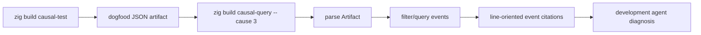

# zigeffect Causal Artifact Query Helper Design

Date: 2026-06-07

## Goal

Make the dogfood causal artifacts immediately queryable by local development
agents. The first helper should read the JSON artifact emitted by
`zig build causal-test` and answer the same query names suggested by
`formatCausalCiReport`.

This is the next step toward making `zigeffect` use its own causal runtime
while `zigeffect` is being built: the harness now writes artifacts, and this
helper lets an agent follow those artifacts without reconstructing the graph by
hand.

## Context

The current dogfood harness writes:

- `.zig-cache/causal-artifacts/zigeffect-causal-dogfood.txt`
- `.zig-cache/causal-artifacts/zigeffect-causal-dogfood.json`
- `.zig-cache/causal-artifacts/zigeffect-causal-dogfood.dot`

The text report suggests queries such as:

- `causal.cause 3`
- `causal.lineage 3`
- `causal.resources 1`
- `causal.fibers pending`
- `causal.requirements 1`
- `causal.retries 1`

Today an agent must inspect the JSON manually. The helper closes that gap by
making the report's query suggestions executable against the saved artifact.

## Scope

Add a new local Zig tool:

```sh
cd packages/zigeffect
zig build causal-query -- <query> [argument]
```

The default input file is:

```text
.zig-cache/causal-artifacts/zigeffect-causal-dogfood.json
```

The tool also accepts:

```sh
zig build causal-query -- --file <path> <query> [argument]
```

## Query Surface

The first helper supports:

- `snapshot`
- `cause <event_id>`
- `lineage <event_id>`
- `resources <scope_id>`
- `fibers <status>`
- `requirements <run_id>`
- `retries <run_id>`

Output is intentionally line-oriented text:

```text
causal.query: cause 3
events: 3
- event id=1 kind=run_started run=1 label=zigeffect dogfood type=DogfoodHarness
- event id=2 kind=scope_opened run=1 scope=1 label=dogfood scope status=opened
- event id=3 kind=service_required run=1 label=Config type=services.config.Config status=missing
```

The format is optimized for agents and humans, not for long-term schema
stability. The JSON artifact remains the machine artifact for now.

## Architecture

Create `packages/zigeffect/tools/causal_query.zig`.

The file owns:

- JSON artifact structs matching `formatCausalJson`
- command parsing
- query execution over the parsed event slice
- text formatting
- executable `main`
- tests for each supported query class

The helper reads artifacts rather than attaching to a live `CausalStore`. That
matters because agents usually receive a saved artifact after a test or CI run.

## Data Flow



## Error Handling

The helper should fail with a readable usage message when:

- the query name is missing
- a required numeric argument is missing
- a numeric argument is invalid
- `--file` is missing its path
- the JSON file cannot be read
- the JSON artifact is malformed

The helper should return an empty result, not an error, when a valid query has
no matching events.

## Non-Goals

- No stable JSON schema wrapper yet.
- No findings rematerialization yet.
- No before/after comparison yet.
- No external graph backend.
- No live runtime query mode.
- No attempt to parse the text report.

## Acceptance Criteria

The slice is complete when:

- `zig build causal-query -- snapshot` prints all dogfood events.
- `zig build causal-query -- cause 3` prints the cause chain for event 3.
- `zig build causal-query -- lineage 2` prints event 2 and its direct children.
- `zig build causal-query -- resources 1` prints scope resource events.
- `zig build causal-query -- fibers pending` prints pending fiber events.
- `zig build causal-query -- requirements 1` prints service requirements for
  run 1.
- `zig build causal-query -- retries 1` prints schedule decisions for run 1.
- tool tests cover the query logic without filesystem dependencies.
- package examples compile and test the query tool.
- docs explain the query command next to the dogfood harness.

## Spec Self-Review

- Placeholder scan: no unresolved placeholders remain.
- Internal consistency: the command, default artifact, query names, and
  acceptance criteria match the existing dogfood artifact and CI report names.
- Scope check: this is one milestone, focused on artifact query execution.
- Ambiguity check: valid empty query results are not errors; malformed commands
  and malformed artifacts are errors.
