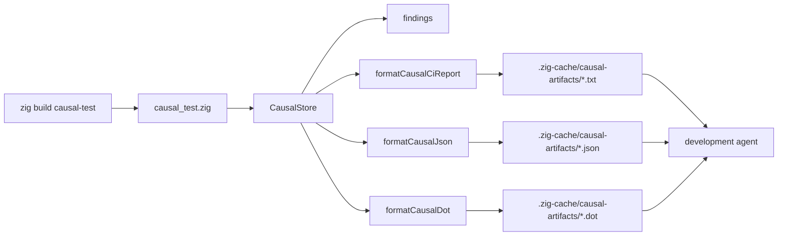

# zigeffect Causal Dogfood Harness Design

Date: 2026-06-07

## Goal

Make `zigeffect` use its own causal runtime while `zigeffect` is being built.
The first milestone is a local development harness that emits stable causal
artifacts from deterministic engine scenarios, so an agent can inspect event
ids, findings, and next-query suggestions while proposing changes to the core
runtime.

This is the first self-improving feedback lane for the project. It does not
make the runtime autonomously rewrite itself. It gives development agents
structured evidence, bounded artifacts, and repeatable workflows they can cite
when improving `zigeffect`.

## Context

The merged causal runtime already provides:

- `CausalStore`
- causal event kinds for runs, effects, layers, services, scopes, resources,
  fibers, schedules, exits, logs, metrics, spans, and assertions
- query helpers for snapshots, cause chains, lineage, resources, fibers,
  service requirements, retries, and findings
- human-readable CI report formatting through `formatCausalCiReport`
- JSON and DOT artifact formatting through `formatCausalJson` and
  `formatCausalDot`
- an adapter boundary for future backends
- examples for missing config, cleanup failure, scoped fibers, and retry
  exhaustion

The existing `zig build causal-report` command prints a sample report to stdout.
That is useful as a formatter proof, but it is not yet a development feedback
system. A dogfood harness needs to write stable artifacts that agents and CI can
load after a run.

## Novelty Claim

The larger project remains:

> `zigeffect` aims to be the first Zig-native agent-observable Effect runtime
> with a first-class causal execution graph spanning typed errors, services,
> layers, scopes, resources, fibers, schedules, logs, metrics, and traces.

This harness adds a sharper internal novelty claim:

> `zigeffect` should become a Zig Effect runtime whose own development process
> is guided by its runtime's causal artifacts before those artifacts are exposed
> as a mature app-facing product surface.

That matters because it creates a realistic compatibility suite for agents. The
runtime proves its usefulness first on its hardest customer: its own engine.

## Audiences

### Core Development Agents

Agents working on `zigeffect` need deterministic evidence about:

- missing service providers
- resource lifetime mistakes
- finalizer failures
- fibers that outlive scopes
- retry budgets and schedule decisions
- exit and cause propagation
- event taxonomy drift
- redaction and bounded-memory assumptions

### Human Maintainers

Humans need a command that is simple enough to trust during development:

```sh
cd packages/zigeffect
zig build causal-test
```

The command should leave artifacts in a predictable directory and print the
artifact paths. A maintainer should be able to hand those paths to an agent or
inspect them directly.

### Future App Agents

The first harness is engine-focused, but it should mirror the workflow that app
agents will use later:

1. Run a failing or suspicious program.
2. Read a causal report.
3. Follow event ids into JSON or query helpers.
4. Propose a fix with evidence citations.
5. Rerun and compare the before/after causal trace.

## Design

### Harness Command

Add a new Zig build step:

```sh
cd packages/zigeffect
zig build causal-test
```

The step runs a local tool in `packages/zigeffect/tools/causal_test.zig`.

The first version is deterministic and exits successfully even when it records
diagnostic findings. That makes the command usable as a development probe and
lets CI keep artifacts without treating the fixture's intentional findings as a
test failure.

Future modes can add `--fail-on-findings`, real test wrapping, and before/after
trace comparison.

### Artifact Directory

Artifacts are written under:

```text
packages/zigeffect/.zig-cache/causal-artifacts/
```

The first artifact set is:

- `zigeffect-causal-dogfood.txt`: human-readable CI report
- `zigeffect-causal-dogfood.json`: JSON event snapshot
- `zigeffect-causal-dogfood.dot`: DOT graph

The `.zig-cache` location keeps generated output out of source control while
remaining local, predictable, and easy for agents to open.

### Scenario Contract

The first dogfood scenario intentionally records a compact graph with multiple
finding types:

- run start
- scope open
- service requirement marked missing
- resource acquired without finalization
- retry schedule exhausted
- fiber left pending when a scope closes
- exit recorded as failure

This scenario is not a substitute for full runtime tests. It is a fixture that
exercises the report, JSON, graph, finding, and next-query surfaces in one
stable artifact. Later milestones should replace more of the manual fixture
events with events emitted through actual runtime hooks.

### Data Flow



### Agent Workflow

The first development-agent loop is:

1. Run `zig build causal-test`.
2. Open `zigeffect-causal-dogfood.txt`.
3. Pick a finding.
4. Use the suggested next query name as the reasoning frame.
5. Inspect the JSON event ids and parent ids.
6. Propose a code, test, or docs change that cites event ids.
7. Rerun `zig build causal-test` and `zig build test`.

This gives agents a durable rhythm: evidence first, proposed fix second.

### Error Handling

The harness should fail only when artifact generation itself fails:

- allocation failure
- artifact directory cannot be created
- artifact file cannot be written
- report, JSON, or DOT formatting fails

Intentional causal findings in the fixture do not make the command fail in the
first milestone.

### Redaction

The fixture should only use `redacted_detail` for diagnostic detail. It should
not put secret-looking material into labels, type names, or statuses. Stronger
secret-redaction tests are a later hardening milestone.

### Bounded Memory

The first harness uses the in-memory `CausalStore` because that is the
reference deterministic backend. The hardening milestone must add bounded store
or ring-buffer policy before this is treated as production-grade.

### Schema Stability

The first harness writes the current `formatCausalJson` output. A later
milestone should add a stable schema/version wrapper for artifacts. That should
be done before any external tool depends on the JSON shape.

## Roadmap

### Milestone 1: Local Dogfood Harness

Deliver:

- `zig build causal-test`
- deterministic fixture that records meaningful causal findings
- text, JSON, and DOT artifacts under `.zig-cache/causal-artifacts/`
- tests for report content, JSON content, DOT content, and artifact paths
- agent guide update that explains the local workflow

Success criteria:

- a development agent can run one command and inspect stable causal evidence
- artifact paths are predictable
- the command does not require network, Bun, databases, or external services

### Milestone 2: Causal Test Failure Capture

Deliver:

- a wrapper around selected `zig build test` scenarios
- artifact emission when a selected scenario fails
- optional `--fail-on-findings`
- failure reports that cite the owning scenario and finding event ids

Success criteria:

- failed core tests leave causal artifacts automatically
- agents can distinguish fixture findings from real failing-test findings

### Milestone 3: Agent Query Helper

Deliver:

- a local CLI command that reads JSON artifacts and answers:
  - `snapshot`
  - `cause <event_id>`
  - `lineage <event_id>`
  - `resources <scope_id>`
  - `fibers <status>`
  - `requirements <run_id>`
  - `retries <run_id>`
- output that matches the query names in `formatCausalCiReport`

Success criteria:

- an agent can follow next-query suggestions without rerunning the program
- query output cites event ids and preserves redacted details

### Milestone 4: Before/After Trace Comparison

Deliver:

- artifact comparison for two causal JSON snapshots
- added, removed, and changed event summaries
- finding count deltas
- stable report for "fix improved runtime behavior" claims

Success criteria:

- a development agent can justify a fix by comparing causal evidence before and
  after the change

### Milestone 5: Hardening

Deliver:

- bounded store or ring-buffer policy
- stronger secret redaction tests
- event sampling rules
- stable schema and artifact versioning
- API polish for query names and output shape
- fixture coverage for event taxonomy consistency

Success criteria:

- artifacts are safe to emit in CI by default
- the runtime has a compatibility suite for future async and durable backends

### Milestone 6: App-Facing Agent Runtime

Deliver:

- app request or job traces wired into causal artifacts
- service/layer/resource findings mapped to app-level incidents
- OpenTelemetry and durable-history adapters after deterministic semantics are
  stable
- explicit human/policy gates for remediation proposals

Success criteria:

- agents can reason about apps built with `zigeffect` using the same causal
  vocabulary that core development agents used to build the runtime

## Planning Sessions

The project should use recurring planning sessions around the causal feedback
system:

### Session A: Harness Ergonomics Review

Review after Milestone 1:

- command name
- artifact path
- report readability
- whether fixtures are educational or too noisy
- whether `causal-report` should remain separate from `causal-test`

### Session B: Failure Capture Design Review

Review before Milestone 2 implementation:

- how the harness wraps real failing tests
- whether failure capture belongs in Zig build, a standalone tool, or both
- artifact retention and CI upload behavior
- when findings should fail builds

### Session C: Agent Query Surface Review

Review before Milestone 3 implementation:

- query names
- JSON schema
- event id stability assumptions
- whether query helpers should read artifacts, live stores, or both

### Session D: Hardening Readiness Review

Review before declaring production readiness:

- bounded memory
- redaction
- sampling
- schema versioning
- backend compatibility
- policy gates for remediation

## Non-Goals For The First Milestone

- No production telemetry backend.
- No autonomous code mutation.
- No real test wrapper yet.
- No schema version wrapper yet.
- No attempt to capture every runtime event.
- No external database, graph database, or OpenTelemetry dependency.

## Acceptance Criteria

The first milestone is complete when:

- `cd packages/zigeffect && zig build causal-test` succeeds
- the command writes text, JSON, and DOT artifacts
- the text report includes findings and next-query suggestions
- the JSON artifact includes the same event ids cited by the report
- the DOT artifact includes causal edges
- the package tests include harness tests
- documentation explains the first development-agent workflow

## Spec Self-Review

- Placeholder scan: no unresolved placeholders remain.
- Internal consistency: the command, artifacts, roadmap, and non-goals all
  describe the same first milestone.
- Scope check: this spec is intentionally limited to the first dogfood harness
  and the roadmap around it. Real failure capture and query helpers are later
  milestones.
- Ambiguity check: intentional fixture findings do not fail the command in the
  first milestone. Artifact-generation failures do fail the command.
