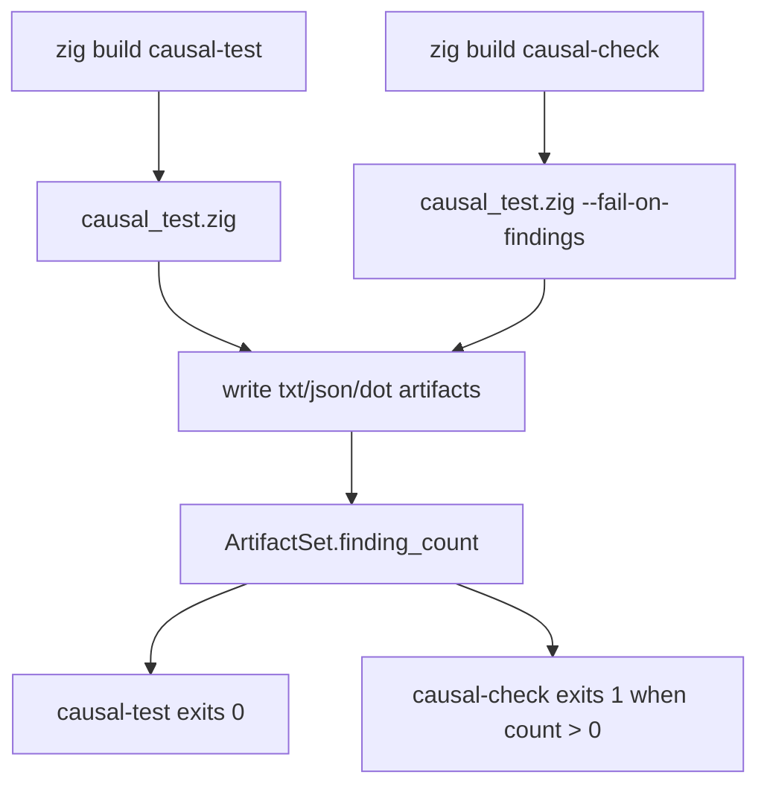

# zigeffect Causal Failure Capture Design

## Summary

Add a first failure-capture lane for `zigeffect` by teaching the existing
dogfood harness to fail when causal findings exist, while preserving
`zig build causal-test` as a non-failing artifact generation command.

The new user-facing command is:

```sh
cd packages/zigeffect
zig build causal-check
```

`causal-check` writes the same text, JSON, and DOT artifacts as
`causal-test`, then exits nonzero when the deterministic dogfood fixture
contains findings. This makes the causal runtime usable as a development check
without prematurely wrapping real package tests.

## Problem

The current dogfood harness is useful for inspection but not yet useful as a
development gate:

- `zig build causal-test` always exits zero.
- Agents can read findings, but the build cannot signal that findings should be
  treated as actionable.
- Future real test wrapping needs an already-tested policy for "artifacts were
  written, then the command failed because findings exist."

## Goals

- Keep `zig build causal-test` as a stable, zero-exit artifact probe.
- Add `zig build causal-check` as an intentionally failing development check.
- Reuse the existing dogfood artifact paths.
- Carry finding count as structured data from the artifact builder instead of
  parsing the report text.
- Make the exit decision testable without spawning a process.
- Keep the aggregate `zig build examples` green.

## Non-Goals

- Do not wrap real `zig build test` scenarios in this slice.
- Do not add new artifact formats.
- Do not add CI upload or retention behavior.
- Do not change finding extraction semantics.
- Do not change event ids in the dogfood fixture.

## Architecture

`packages/zigeffect/tools/causal_test.zig` remains the single executable for the
dogfood harness. It gains an optional `--fail-on-findings` flag.

The build graph exposes two steps:

- `causal-test`: runs the executable with no extra args, writes artifacts, exits
  zero.
- `causal-check`: runs the same executable with `--fail-on-findings`, writes
  artifacts, exits one when findings exist.



## Components

### ArtifactSet

`ArtifactSet` gains:

```zig
finding_count: usize
```

`buildDogfoodArtifacts` computes this value from `store.findings(allocator)`
after recording the scenario and before deinitializing the store.

### Exit Policy

Add a pure helper:

```zig
pub fn exitCodeForFindings(finding_count: usize, fail_on_findings: bool) u8
```

Rules:

- returns `0` when `fail_on_findings` is false;
- returns `0` when `finding_count` is zero;
- returns `1` when `fail_on_findings` is true and `finding_count` is greater
  than zero.

This keeps process behavior covered by ordinary Zig tests.

### CLI Args

`main` changes to:

```zig
pub fn main(init: std.process.Init) !void
```

It accepts:

- no args;
- `--fail-on-findings`.

Unknown args produce a short usage message and exit `2`.

### Build Step

`packages/zigeffect/build.zig` adds:

```zig
const run_causal_check_tool = b.addRunArtifact(causal_test_tool);
run_causal_check_tool.addArg("--fail-on-findings");
const causal_check_step = b.step("causal-check", "Run dogfood causal check and fail when findings exist");
causal_check_step.dependOn(&run_causal_check_tool.step);
```

`causal-check` is not added to the `examples` aggregate because the fixture is
expected to fail the check.

## Data Flow

1. The dogfood fixture records its existing eight deterministic events.
2. The harness asks `CausalStore.findings` for structured findings.
3. The harness formats text, JSON, and DOT artifacts.
4. The harness writes all artifacts.
5. The harness prints artifact paths and finding count.
6. If `--fail-on-findings` is present and finding count is greater than zero,
   the process exits `1`.

## Error Handling

- Artifact write failures still return the underlying error and do not pretend
  the check completed.
- Unknown CLI args print usage and exit `2`.
- `causal-check` failure due to findings exits `1` only after artifacts are
  written.

## Testing

Tests cover:

- `ArtifactSet.finding_count` is `4` for the deterministic dogfood fixture.
- `exitCodeForFindings(0, false) == 0`.
- `exitCodeForFindings(4, false) == 0`.
- `exitCodeForFindings(0, true) == 0`.
- `exitCodeForFindings(4, true) == 1`.
- `zig build causal-test` still succeeds and writes artifacts.
- `zig build causal-check` fails intentionally after writing artifacts.
- `zig build examples`, `zig build test`, and `bun run zig:test` remain green.

## Documentation Updates

Update:

- `packages/zigeffect/README.md`
- `packages/zigeffect/docs/agent-guide.md`
- `packages/zigeffect/docs/agent-observable-runtime.md`

The docs should explain:

- `causal-test` is the non-failing artifact probe;
- `causal-check` is the failure-gated development check;
- failure still leaves artifacts for agents to query with `causal-query`.

## Acceptance Criteria

- `cd packages/zigeffect && zig build causal-test` exits zero.
- `cd packages/zigeffect && zig build causal-check` exits nonzero because the
  dogfood fixture has four findings.
- After `causal-check` fails, all three dogfood artifact files exist.
- `cd packages/zigeffect && zig build causal-query -- cause 3` can inspect the
  artifact written by either command.
- `cd packages/zigeffect && zig build test` passes.
- `cd packages/zigeffect && zig build examples` passes.
- `bun run zig:test` passes from the repository root.

## Roadmap Position

This slice implements Milestone 3 from the causal self-improvement roadmap. The
next milestone should wrap selected real tests and emit scenario-specific
artifacts when they fail. That later work should reuse the exit policy proven
here, but add separate artifact naming so deterministic fixture findings and
real failing-test findings cannot be confused.
