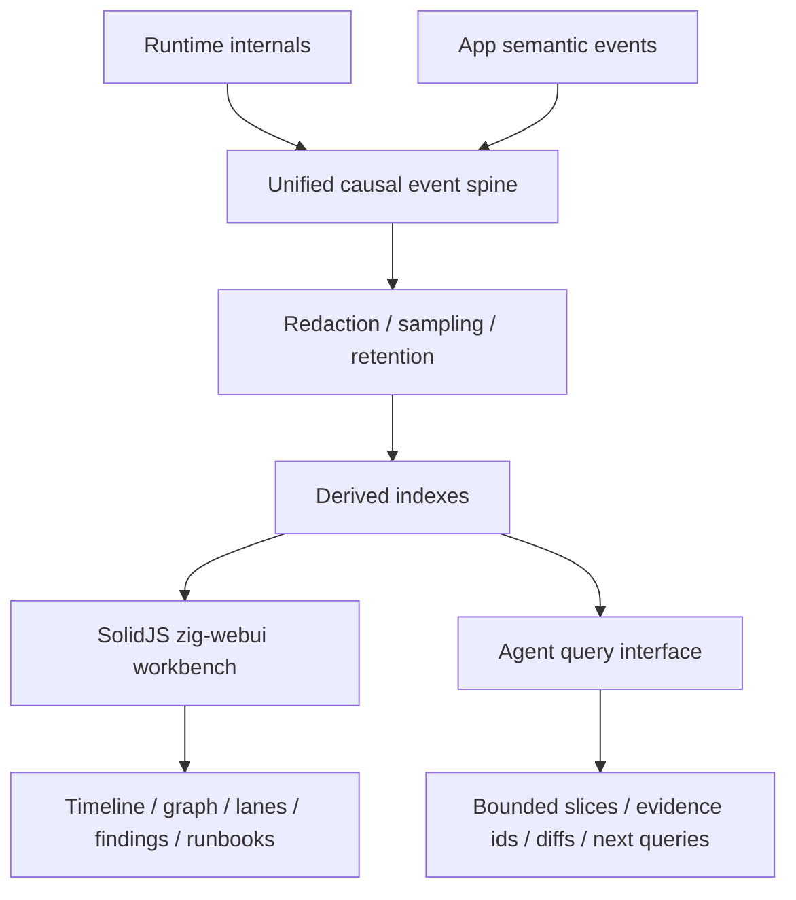

# zigeffect Causal Agent Runtime Master Roadmap

Date: 2026-06-08

## Purpose

This is the governing roadmap for turning `zigeffect`'s causal runtime into a
self-improving development system for `zigeffect` itself, then into an
agent-observable runtime substrate for applications built with `zigeffect`.

The project has already crossed the first important threshold: agents can run
local and CI causal harnesses, inspect event ids, compare before/after traces,
produce remediation artifacts, draft scenario registry changes, and check
registry-application readiness without editing source. The remaining work is to
move from review-only evidence toward controlled mutation, policy-backed
decisions, production hardening, durable history, replay, visual workbenching,
and app-facing reuse.

This roadmap is intentionally large. It is the long-running execution contract
for the active goal:

> Create and sequentially execute the full zigeffect causal self-improvement
> roadmap: guarded registry application, policy engine, pervasive causal tests,
> hardening, durable backends, replay/snapshots, workbench, and app-facing
> agent runtime.

## Operating Doctrine

Every milestone follows the same delivery discipline:

1. Write or update a focused design doc in `docs/superpowers/specs/`.
2. Write an implementation plan in `docs/superpowers/plans/`.
3. Create a feature branch with the `codex/` prefix.
4. Implement the smallest milestone slice that moves the final system forward.
5. Prefer read-only or artifact-first boundaries before source mutation.
6. Preserve deterministic local behavior unless a milestone explicitly adds
   durable or timestamped metadata.
7. Verify with package and repo commands that match the blast radius.
8. Commit only the intended files.
9. Merge only after the verification evidence is current.
10. Update this roadmap's progress ledger after each branch lands.

The invariant is:

> Causal tools may observe, explain, recommend, and prepare guarded changes.
> A change is only marked `applied=true` after the source or external state was
> actually changed and the required verification evidence was recorded.

## Current Delivered Baseline

The following capabilities are already merged into `master`:

- `CausalStore`, run ids, event ids, scope ids, finding extraction, and the
  causal event taxonomy.
- Text, JSON, and DOT causal artifact formatters.
- `zig build causal-test`, which writes deterministic dogfood artifacts.
- `zig build causal-check`, which intentionally fails on dogfood findings while
  preserving artifacts.
- `zig build causal-query -- <query> [argument]`, with optional `--file`, for
  inspecting saved artifacts.
- `zig build causal-catalog`, exposing scenario and invariant metadata.
- `zig build causal-compare -- <before.json> <after.json>`.
- `zig build causal-advice`, including before-aware `observed`, `persisting`,
  and `new` statuses.
- `zig build causal-artifacts`, listing retention globs and known artifacts.
- CI causal workflow, uploaded failure artifacts, generated advice, CI
  handoff, CI verdict, and base/head comparison.
- `CausalStore.initBounded`, causal schema metadata, event taxonomy metadata,
  sampling rules, defensive secret-shaped redaction, and causal artifact
  truncation metadata.
- `zig build causal-dev-loop -- baseline|after [scenario]`.
- `zig build causal-dev-session -- start|assess|status [scenario]`.
- `zig build causal-dev-agent -- local [scenario]`.
- `zig build causal-diagnosis -- local [scenario]`.
- `zig build causal-remediation-plan -- local [scenario]`.
- `zig build causal-remediation-audit -- local [scenario]`.
- `zig build causal-remediation-decision -- local approve|reject [scenario]`.
- `zig build causal-patch-proposal -- local draft|approved [scenario] ...`.
- `zig build causal-audit-chain -- local [scenario]`.
- `zig build causal-scenario-proposal -- local [scenario]`.
- `zig build causal-scenario-registry-patch -- --from-proposal
  <scenario-proposal.json>`.
- `zig build causal-registry-application-readiness -- --from-registry-patch
  <registry-patch.json> approve|reject --reason <reason>`.
- `zig build causal-registry-apply`, which records `plan` or
  `record-applied` registry application artifacts from readiness reports.
- `zig build causal-policy-decision -- local [scenario]`, which records
  advisory policy decisions with `mutation_authority=none`.
- `zig build causal-test-matrix`, which prints service, layer, scope, fiber,
  schedule, config, resource, retry, cause, and observability coverage.
- Scenario coverage-domain metadata in `tools/causal_run.zig`, including
  `causal-readiness` for app-shaped observability coverage.
- Shared structural causal assertion helpers in package tests.
- `CausalJsonLinesBackendState`, `CausalDotBackendState`,
  `CausalOtelBackendState`, `CausalGraphHistoryBackendState`,
  `CausalNendbStorageBackendState`, and `CausalAsyncStreamBackendState`
  concrete causal backend adapters.

These commands establish the review-only chain:

```text
dev session
  -> diagnosis
  -> remediation plan
  -> audit
  -> decision
  -> patch proposal
  -> audit chain
  -> scenario proposal
  -> registry patch draft
  -> registry application readiness
  -> registry application record
  -> policy decision
```

The next milestone after backend adapter verification is snapshot manifests, so
agents can compare named causal states before moving into replay and forking.

## Execution Ladder

### M0: Guarded Registry Application Boundary

Goal: consume `zigeffect.causal.registry-application-readiness.v1` artifacts
and produce an auditable application result for scenario registry changes.

This milestone is narrow by design. It only applies or records application of
reviewed registry patches for `packages/zigeffect/tools/causal_run.zig` and
related scenario docs. It does not add broad source mutation, general patch
application, durable backends, or app-facing adapters.

Deliverables:

- `zig build causal-registry-apply` or similarly named command.
- Input validation for `zigeffect.causal.registry-application-readiness.v1`.
- Hard requirement that `readiness_status=applicable` before any applied result
  can be emitted.
- Hard requirement that the readiness report, registry patch, reviewer
  decision, reason, policy, verified commands, and check statuses are preserved
  in the application artifact.
- A manual-application mode that writes an artifact describing exactly what the
  reviewer must apply and what verification must be run.
- A guarded registry-only backend, if implemented, that can update only the
  approved scenario registry snippet and related docs region.
- `applied=false` for review/manual artifacts.
- `applied=true` only after a source change actually occurs and post-apply
  verification is recorded.
- JSON/text artifacts:
  - `*-registry-application.json`
  - `*-registry-application.txt`
- Schema:
  - `zigeffect.causal.registry-application.v1`
- Artifact manifest entries and docs.

Exit criteria:

- Non-applicable and blocked readiness reports cannot be applied.
- No-op registry patches produce a no-op application report.
- Manual mode gives enough evidence for a reviewer to apply safely without
  pretending the tool changed source.
- Guarded mode, if enabled, refuses edits outside the registry/docs allowlist.
- The command fails closed on missing readiness source, mismatched registry
  patch path, failed readiness checks, missing verification command evidence,
  or stale source registry state.
- `zig build examples`, `zig build test --summary none`, `bun run check`, and
  `bun run zig:test` pass after merge.

Recommended first branch:

```text
codex/zigeffect-guarded-registry-application
```

### M1: Policy And Approval Engine

Goal: add deterministic, evidence-backed policy decision records that share the
manual review vocabulary but cannot silently authorize source mutation.

Deliverables:

- Policy schema:
  - `zigeffect.causal.policy-decision.v1`
- Local policy evaluator command:
  - `zig build causal-policy-decision -- local [scenario]`
- Policy inputs:
  - remediation audit;
  - remediation decision, if present;
  - patch proposal;
  - audit chain;
  - scenario proposal;
  - registry readiness/application reports where relevant.
- Policy outputs:
  - `decision=approve|reject|needs-human-review`;
  - deterministic reason codes;
  - evidence event ids;
  - required verification commands;
  - safety constraints;
  - mutation authority field that defaults to `none`.
- Policy catalog in code or docs for named local policies.
- Tests proving policy decisions are deterministic and evidence-bound.

Exit criteria:

- Policy records use the same reviewer/policy/reason vocabulary as manual
  decisions.
- A policy can recommend approval or rejection, but cannot by itself apply
  source changes.
- Every policy reason cites a source artifact and deterministic rule.
- Rejected or human-review decisions block guarded application.

Recommended branch:

```text
codex/zigeffect-causal-policy-engine
```

### M2: Pervasive Causal Tests Inside zigeffect

Goal: make causal evidence a normal part of core `zigeffect` regression tests,
not only a side harness.

Deliverables:

- Scenario coverage matrix for service, layer, scope, fiber, schedule, config,
  resource, retry, cause, and observability subsystems.
- New or expanded causal scenarios for the most important runtime invariants.
- Test helpers that assert causal event patterns without brittle formatting
  checks.
- Package test integration that emits causal context on selected assertion
  failures.
- Regression templates for bugs that should become scenario/invariant entries.
- Docs for "when a failing test should become a causal scenario."

Exit criteria:

- Core runtime regressions can be diagnosed from event ids and causal findings.
- Scenario tests remain deterministic and fast enough for local development.
- Passing quiet scenarios do not create noisy remediation advice.
- The causal graph is used inside real tests for meaningful assertions, not
  just emitted after failures.

Recommended branches:

```text
codex/zigeffect-causal-test-matrix
codex/zigeffect-causal-runtime-regression-scenarios
codex/zigeffect-causal-test-assertion-helpers
```

### M3: Production Hardening

Goal: make causal artifacts safe and stable enough for routine CI and app use.

Deliverables:

- Physical ring-buffer optimization if current ordered drop-oldest retention
  becomes too costly.
- Broader PII and payload redaction policy beyond deterministic secret-shaped
  strings.
- Redaction fixtures for headers, URLs, JSON-ish payloads, SQL-ish payloads,
  config maps, and nested key/value details.
- Stronger schema version compatibility fixtures.
- Deeper taxonomy compatibility tests for future event changes.
- Artifact size limits and explicit truncation metadata.
- Sampling policy tests for logs, metrics, spans, structural events, and
  finding evidence.
- CI checks that prevent schema or taxonomy drift without explicit updates.

Exit criteria:

- Long-running traces have bounded memory and bounded artifact size.
- Redaction tests cover common app and infrastructure payload shapes.
- Schema and taxonomy changes are explicit, tested, and documented.
- Agents can rely on compatibility warnings instead of guessing artifact
  semantics.

Recommended branches:

```text
codex/zigeffect-causal-ring-buffer-hardening
codex/zigeffect-causal-pii-redaction-policy
codex/zigeffect-causal-schema-taxonomy-fixtures
codex/zigeffect-causal-artifact-size-limits
```

### M4: Causal Backend Adapters

Goal: implement production-grade causal sinks behind the existing backend
boundary while keeping the deterministic in-memory store as the source of
truth for tests.

Deliverables:

- JSON Lines backend implementation and rotation policy.
- DOT backend polish for graph tooling.
- OpenTelemetry export adapter.
- NenDB graph-history adapter and NenDB storage writer contract.
- Async stream adapter for long-running runtimes.
- Backend conformance tests using a common event-sink contract.
- Failure policy for backend write errors.
- Docs that separate deterministic core semantics from best-effort sinks.

Exit criteria:

- Adapters cannot perturb causal event ordering in the core store.
- Backend failures are observable and bounded.
- Tests can run against memory only.
- Backend history can reconstruct enough event context for agent queries and
  replay planning.

Recommended branches:

```text
codex/zigeffect-causal-backend-conformance
codex/zigeffect-causal-jsonl-backend
codex/zigeffect-causal-dot-backend-polish
codex/zigeffect-causal-otel-backend
codex/zigeffect-causal-graph-history-backend
codex/zigeffect-causal-nendb-storage-adapter
codex/zigeffect-causal-async-stream-backend
```

Next branch:

```text
codex/zigeffect-causal-snapshot-manifest
```

### M5: Replay, Forking, And Named Snapshot Comparison

Goal: let agents compare known system states and, where deterministic inputs
exist, replay or fork causal histories for diagnosis.

Deliverables:

- Named snapshot manifest format.
- `zig build causal-snapshot -- capture <name> [scenario]`.
- `zig build causal-snapshot -- compare <left> <right>`.
- Audit-chain comparison across arbitrary named snapshots.
- Replay feasibility report that explains which events are replayable and which
  are observational only.
- Deterministic registered-scenario replay for supported pure or simulated
  scenarios.
- Fork proposals for supported scenario reruns without runtime memory mutation.
- Clear refusal for arbitrary runtime memory mutation.

Exit criteria:

- Agents can ask "what changed between these two named states?"
- Snapshot comparisons preserve schema and taxonomy warnings.
- Replay reports do not overclaim when external effects, timestamps, or
  nondeterministic inputs are present.
- Replay/forking is useful for deterministic scenarios without becoming a
  magical debugger.

Recommended branches:

```text
codex/zigeffect-causal-snapshot-manifest
codex/zigeffect-causal-snapshot-compare
codex/zigeffect-causal-replay-feasibility
codex/zigeffect-causal-deterministic-replay
codex/zigeffect-causal-scenario-fork-proposals
```

### M6: Causal Workbench UI

Goal: provide a human and agent workbench for inspecting causal runs without
manually opening many text artifacts.

Deliverables:

- SolidJS workbench renderer built with Bun/Vite.
- Preferred frontend path: SolidJS plus `webui-dev/zig-webui`; alternate
  frontend renderers remain future adapter options only for a specific
  integration need.
- Zig WebUI launcher:
  - `zig build causal-workbench -- <artifact.json>`.
- UI build step:
  - `zig build causal-workbench-ui`.
- Bounded read-only Zig bridge for one selected artifact.
- Artifact loader for `zigeffect.causal.v1`.
- Views for:
  - effect run timeline;
  - lightweight parent/scope/fiber relationships;
  - retry timeline;
  - resource ownership;
  - findings;
  - metadata and compatibility posture;
  - selected event inspector.
- Cross-linking from event ids to related cause, children, resources, fibers,
  requirements, retries, and remediation evidence.
- Copyable agent query commands.
- Redaction and "safe to share" indicators.
- Later slices for remediation/audit chains, scenario registry proposal state,
  richer graph layout, and multi-artifact loading.

Exit criteria:

- A developer can inspect a failed causal run in the workbench faster than by
  reading raw JSON.
- The workbench never requires secrets or external services for local artifact
  viewing.
- It renders degraded but useful views for older artifacts.
- It is a viewer first; mutation remains behind policy and CLI artifacts unless
  a later milestone explicitly adds UI-controlled actions.

Recommended branches:

```text
codex/zigeffect-causal-workbench-readonly
codex/zigeffect-causal-workbench-graphs
codex/zigeffect-causal-workbench-remediation-chain
```

### M7: App-Facing Agent Runtime

Goal: reuse the same causal vocabulary for applications built with `zigeffect`.

Deliverables:

- App request trace adapter.
- App background job trace adapter.
- App incident mapping for:
  - service resolution;
  - layer construction;
  - scope lifecycle;
  - resource acquisition/release;
  - fiber status;
  - retry attempts and exhaustion;
  - configuration and requirement failures.
- App artifact schemas that remain compatible with core causal queries.
- App-facing `causal-query`, `causal-advice`, diagnosis, and remediation
  reports.
- Integration examples in a small sample app or Yachdee platform path that
  stays Worker-compatible.
- Redaction and bounded-memory defaults suitable for request paths.

Current foundation branch:

- `codex/zigeffect-app-facing-causal-runtime` adds the first
  `CausalAppTrace` request/job adapter. It records app lifecycle facts into the
  existing `CausalStore`, preserves `zigeffect.causal.v1` artifact
  compatibility, and keeps SolidJS plus `zig-webui` as the inspection surface.
- `codex/zigeffect-app-causal-example` adds `examples/causal_app_request.zig`,
  a Worker-shaped request example that returns a response plus owned causal JSON
  for caller-managed persistence.
- `codex/zigeffect-app-incident-mapping` adds typed app incident classification
  plus app-specific advice and diagnosis mappings over existing causal events.
- `codex/zigeffect-app-remediation-audit` adds pending, non-mutating app
  remediation audit artifacts with app incident event ids, query commands, and
  advisory app policy gates.
- `codex/zigeffect-app-policy-gates` adds advisory app policy decision
  artifacts that evaluate source, config, migration, operational-human, and
  rollback gates without granting mutation authority.

Exit criteria:

- Agents can reason about app incidents using the same event ids, query
  vocabulary, and finding categories used to build `zigeffect`.
- App request-path instrumentation is bounded and safe by default.
- App artifacts can be fed into existing advice and diagnosis tooling.
- The app-facing layer does not leak Bun-only APIs into Cloudflare Worker
  request paths.

Recommended branches:

```text
codex/zigeffect-app-request-causal-adapter
codex/zigeffect-app-job-causal-adapter
codex/zigeffect-app-incident-mapping
codex/zigeffect-app-causal-example
```

### M8: App Remediation Proposals And Policy Gates

Goal: extend the remediation-control chain from core `zigeffect` development to
applications built with `zigeffect`.

Deliverables:

- App remediation audit schema.
- App remediation decision schema or reuse of the core decision schema with
  app target fields.
- App human-review artifact for migration, operational-human, and rollback
  gates.
- App patch proposal artifact that can cite app files, config, migrations, or
  operational runbooks.
- App application readiness artifact that can mark a reviewed proposal ready to
  attempt while still preserving `applied=false`.
- Policy gates for app remediation:
  - source-only;
  - config-only;
  - migration-required;
  - operational-human-required;
  - rollback-required.
- Integration with the causal workbench for app incidents.
- Examples for common app issues.

Exit criteria:

- App agents can propose fixes without applying them blindly.
- Policy gates distinguish source edits, config changes, data migrations, and
  operational actions.
- The same `applied=false` to `applied=true` discipline is preserved.
- App remediation artifacts remain redacted, bounded, and queryable.

Recommended branches:

```text
codex/zigeffect-app-remediation-audit
codex/zigeffect-app-policy-gates
codex/zigeffect-app-patch-proposal
codex/zigeffect-app-remediation-workbench
codex/zigeffect-app-human-review-boundary
codex/zigeffect-app-application-readiness
codex/zigeffect-app-application-boundary
```

### M9: Production Operating Model

Goal: make the causal agent runtime maintainable as a long-lived subsystem.

Deliverables:

- Versioning policy for all causal artifact schemas.
- Migration policy for old artifacts.
- Compatibility matrix for CLI tools and artifact versions.
- CI workflow ownership docs.
- Backend operation docs.
- Workbench operation docs.
- Redaction review checklist.
- Scenario/invariant governance checklist.
- Release notes template for causal runtime changes.
- Performance budget for causal instrumentation.

Exit criteria:

- A contributor can change the causal runtime without breaking existing
  artifacts by accident.
- Operators know what artifacts are safe to upload, retain, or inspect.
- Agents have stable instructions for local, CI, durable, workbench, and
  app-facing workflows.
- The roadmap can be considered delivered because every named subsystem has a
  documented owner, verification path, and operational contract.

Recommended branches:

```text
codex/zigeffect-causal-operations-docs
codex/zigeffect-causal-performance-budget
codex/zigeffect-causal-m9-completion-audit
codex/zigeffect-causal-production-hardening-backlog
```

## Dependency Graph

```text
M0 guarded registry application
  -> M1 policy engine
  -> M2 pervasive causal tests
  -> M3 production hardening
  -> M4 NenDB/local backend adapters
  -> M5 replay and snapshots
  -> M6 workbench UI
  -> M7 app-facing runtime
  -> M8 app remediation gates
  -> M9 production operating model
```

Some M2 and M3 slices can run in parallel if needed, but the default execution
mode is sequential. The sequential path keeps the artifact vocabulary stable
before durable storage, replay, UI, and app-facing semantics depend on it.

## Verification Matrix

Use the smallest sufficient verification for each branch, then run broader
checks before merge.

Default documentation branch:

```sh
git diff --check
```

Default zigeffect tool branch:

```sh
cd packages/zigeffect
zig build examples
zig build test --summary none
```

Repo integration branch:

```sh
bun run check
bun run zig:test
```

Frontend/workbench branch:

```sh
bun run check
bun run zig:test
```

Then run the relevant local dev server or static preview and verify the UI with
browser screenshots when the branch adds user-facing screens.

Backend branch:

```sh
cd packages/zigeffect
zig build test --summary none
bun run check
```

Add adapter-specific integration tests only when external services are locally
available and the tests can skip cleanly otherwise.

## Progress Ledger

Status values:

- `delivered`: merged to `master` and verified.
- `active`: current branch or current planning target.
- `planned`: accepted sequence but not started.
- `deferred`: intentionally delayed until dependencies land.

| Milestone | Status | Current Evidence | Next Action |
| --- | --- | --- | --- |
| M0 Guarded registry application | delivered | `causal-registry-apply` writes `registry-application` artifacts on branch `codex/zigeffect-guarded-registry-application` | merge after final verification |
| M1 Policy engine | delivered | `causal-policy-decision` writes advisory policy artifacts on branch `codex/zigeffect-causal-policy-engine` | merge after final verification |
| M2 Pervasive causal tests | delivered | `causal-test-matrix`, coverage domains, `causal-readiness`, and shared causal assertions exist on branch `codex/zigeffect-causal-test-matrix` | move to M3 hardening |
| M3 Production hardening | delivered | bounded store, broader redaction, sampling, taxonomy, schema/taxonomy compatibility fixtures, and artifact string-size limits delivered | move to M4 backend conformance |
| M4 Backend adapters | delivered | backend boundary, conformance suite, JSONL sink, polished DOT backend, OTel bridge, graph-history adapter, NenDB storage writer contract, and async stream adapter exist | move to M5 snapshot manifests |
| M5 Replay/snapshots | delivered | snapshot manifest schema/tool, named snapshot compare, replay-feasibility reports, deterministic registered-scenario replay, and safe scenario fork proposals exist | move to M6 read-only workbench |
| M6 Workbench UI | delivered | SolidJS renderer, `causal-workbench-ui`, `zig-webui` launcher, graph cause-path/runtime-lane branch, and remediation-chain branch `codex/zigeffect-causal-workbench-remediation-chain` exist | move to M7 app-facing runtime |
| M7 App-facing runtime | delivered | `CausalAppTrace`, Worker-shaped app request example, app incident classifier, and app-specific advice/diagnosis mappings exist | move to M8 app remediation audit |
| M8 App remediation gates | delivered | app remediation audit artifacts, app policy gate decisions, app human-review boundary artifacts, draft app patch proposal artifacts, app application readiness artifacts, guarded app application records, and detailed SolidJS/zig-webui workbench rendering exist | move to M9 production operating model |
| M9 Operating model | delivered | completion audit, schema governance, operations docs, performance budget report, release guidance, production-hardening backlog report, production artifact aggregation contract, durable production retention contract, production deployment runbooks, artifact access-control contract, and unified causal spine contract exist | start deep runtime internals |

## Immediate Branch Queue

1. `codex/zigeffect-causal-deep-runtime-internals`
   - Emit deeper runtime facts for layers, services, scopes, fibers, resource
     lifetimes, retries, finalizers, defects, interruptions, and cause chains
     through the unified causal spine.
2. `codex/zigeffect-causal-app-semantic-trace-api`
   - Add the app-facing semantic trace layer for `data_read`,
     `function_boundary`, `data_transformed`, `service_call`, `data_written`,
     `domain_action`, `policy_decision`, `artifact_emitted`, and
     `response_sent` without recording raw payloads.
3. `codex/zigeffect-causal-agent-query-interface`
   - Expose compact machine-native queries over the same spine:
     `summarize_run`, `find_failures`, `explain_event`, `trace_cause`,
     `trace_data`, `compare_runs`, `list_findings`, and `next_queries`.
4. `codex/zigeffect-causal-encryption-at-rest-policy`
5. `codex/zigeffect-causal-alerting-integrations`
6. `codex/zigeffect-causal-live-dashboard-streaming-workbench`
   - Delivered: add the read-only live workbench stream and the first visual
     graph adapter.
     Start with `@dschz/solid-g6` as the SolidJS integration layer, keep the
     zigeffect causal graph model as source of truth, and add direct
     `@antv/g6` usage only where the adapter needs engine APIs.
7. `codex/zigeffect-causal-workbench-graph-visual-debugging`
   - Delivered: Visual Graph now supports cause, topology, ownership, and
     lineage perspectives for causal traces, runtime topology, scopes, fibers,
     causes, retries, resource ownership, and semantic app data lineage.
     `?sample=visual-graph` loads the local debugging fixture, Solid G6 carries
     group/tone/priority metadata, and browser verification covers
     desktop/mobile plus nonblank canvas evidence. Keep `solid-flow` as
     optional later research for editable remediation planning surfaces, not as
     a default dashboard dependency.
8. `codex/zigeffect-causal-human-agent-feedback-loop`
   - Delivered: `causal-human-agent-feedback-loop` emits
     `zigeffect.causal.human-agent-feedback-loop.v1` as the record-only loop
     contract connecting human workbench selections, bounded agent queries,
     before/after trace comparison, local regression clustering records,
     guarded remediation handoffs, and future NenDB durable-history handoff.
     It keeps `applied=false`, `mutation_authority=none`,
     `workbench_mutation=false`, and `agent_mutation=false`.
9. `codex/zigeffect-causal-rollout-automation-guardrails`
   - Delivered: `causal-rollout-automation-guardrails` emits
     `zigeffect.causal.rollout-automation-guardrails.v1` with canary evidence
     records, rollout progression gates, circuit-breaker decisions, rollback
     readiness gates, and negative automation fixtures. Deployment, rollback,
     traffic, feature-flag, alert, ticket, page, source, config, app, registry,
     and durable mutation authority remain `none`.
10. `codex/zigeffect-causal-wall-clock-benchmark-baselines`
   - Delivered: `causal-wall-clock-benchmark-baselines` emits
     `zigeffect.causal.wall-clock-benchmark-baselines.v1` with local and CI
     benchmark scenario families, baseline record fields, environment metadata,
     calibration policy, advisory review gates, and capacity-planning handoff.
     Timing evidence remains record-only and cannot fail CI or claim capacity
     without human review.
11. `codex/zigeffect-causal-production-capacity-planning`
   - Delivered: `causal-production-capacity-planning` emits
     `zigeffect.causal.production-capacity-planning.v1` with source evidence,
     capacity domains, storage assumptions, load-test fixture plans, workbench
     and graph concurrency assumptions, readiness gates, negative capacity
     fixtures, and completion-audit handoff. It remains record-only,
     planning-only, NenDB-only, and does not ingest telemetry, run load tests,
     size production capacity, provision infrastructure, or grant mutation
     authority.
12. `codex/zigeffect-causal-production-hardening-completion-audit`
   - Delivered: `causal-production-hardening-completion-audit` emits
     `zigeffect.causal.production-hardening-completion-audit.v1` with delivered
     milestone checks, record-only/NenDB/SolidJS boundary checks, remaining
     evidence gaps, negative audit fixtures, and the handoff to
     `codex/zigeffect-causal-load-test-observation-harness`. It keeps
     `mutation_authority=none` and does not ingest telemetry, run load tests,
     size production capacity, add non-NenDB adapter work, add alternate
     frontend renderer support, or mutate production state.
13. `codex/zigeffect-causal-load-test-observation-harness`
   - Delivered: `causal-load-test-observation-harness` emits
     `zigeffect.causal.load-test-observation-harness.v1` with approved local
     scenario families, curated argv arrays, bounded opt-in observations,
     median/p95 records, capped output snippets, advisory review gates, and
     negative over-claim fixtures. It keeps observations local, record-only,
     `mutation_authority=none`, NenDB-only, and SolidJS `zig-webui` aligned,
     without production telemetry, production load execution, CI timing gates,
     or capacity sizing claims.
14. `codex/zigeffect-causal-production-telemetry-capture-design`
   - Delivered: `causal-production-telemetry-capture-design` emits
     `zigeffect.causal.production-telemetry-capture-design.v1` with runtime,
     app-semantic, backend OTel, redaction/access, and local-observation
     correlation capture surfaces, future telemetry field contracts, readiness
     gates, negative fixtures, and fixture handoff. It keeps
     `production_telemetry_ingestion=false`, `live_exporter_enabled=false`,
     `mutation_authority=none`, NenDB-only, and SolidJS `zig-webui` aligned
     without live exporters, durable production writes, CI gates, or capacity
     claims.
15. `codex/zigeffect-causal-production-telemetry-capture-fixtures`
   - Delivered: `causal-production-telemetry-capture-fixtures` emits
     `zigeffect.causal.production-telemetry-capture-fixtures.v1` with safe
     example records, selected fixture output, negative fixtures, and
     validation checks. It keeps `production_telemetry_ingestion=false`,
     `live_exporter_enabled=false`, `durable_write_enabled=false`,
     `ci_gate_enabled=false`, `mutation_authority=none`, NenDB-only, and
     SolidJS `zig-webui` aligned without touching production systems or
     claiming production capacity.
16. `codex/zigeffect-causal-production-telemetry-readiness-review`
   - Delivered: `causal-production-telemetry-readiness-review` emits
     `zigeffect.causal.production-telemetry-readiness-review.v1` with fixture
     JSON review, reviewer decision and reason, required verification command
     evidence, ready and blocked readiness artifacts, and implementation
     proposal handoff. It keeps `applied=false`,
     `production_telemetry_ingestion=false`, `live_exporter_enabled=false`,
     `durable_write_enabled=false`, `ci_gate_enabled=false`,
     `mutation_authority=none`, NenDB-only, and SolidJS `zig-webui` aligned
     without touching production systems or claiming production capacity.
17. `codex/zigeffect-causal-production-telemetry-implementation-proposal`
   - Delivered: `causal-production-telemetry-implementation-proposal` emits
     `zigeffect.causal.production-telemetry-implementation-proposal.v1` with
     ready readiness-review JSON consumption, proposer decision and reason,
     readiness and proposal verification checks, approved and blocked proposal
     artifacts, proposal phases, and exporter-boundary handoff. It keeps
     `applied=false`, `production_telemetry_ingestion=false`,
     `live_exporter_enabled=false`, `durable_write_enabled=false`,
     `ci_gate_enabled=false`, `mutation_authority=none`, NenDB-only, and
     SolidJS `zig-webui` aligned without touching production systems or
     claiming production capacity.
18. `codex/zigeffect-causal-production-telemetry-exporter-boundary`
   - Delivered: `causal-production-telemetry-exporter-boundary` emits
     `zigeffect.causal.production-telemetry-exporter-boundary.v1` with approved
     proposal consumption, proposal evidence checks, no-network exporter
     boundary fields, local envelope fixture names, approved and blocked
     boundary artifacts, and local-pipeline-fixtures handoff. It keeps
     `applied=false`, `production_telemetry_ingestion=false`,
     `live_exporter_enabled=false`, `network_send_enabled=false`,
     `collector_endpoint_configured=false`, `otlp_serialization_enabled=false`,
     `durable_write_enabled=false`, `ci_gate_enabled=false`,
     `mutation_authority=none`, NenDB-only, and SolidJS `zig-webui` aligned
     without touching production systems, sending over networks, configuring
     collectors, serializing OTLP, or claiming production capacity.
19. `codex/zigeffect-causal-production-telemetry-local-pipeline-fixtures`
   - Delivered: `causal-production-telemetry-local-pipeline-fixtures` emits
     `zigeffect.causal.production-telemetry-local-pipeline-fixtures.v1` with
     approved exporter-boundary consumption, fixture-only local envelope
     shaping, redaction and access checks, sampling kept/dropped fixtures,
     correlation-link fixtures, ready and blocked fixture artifacts, and NenDB
     retention fixture handoff. It keeps `applied=false`,
     `production_telemetry_ingestion=false`, `live_exporter_enabled=false`,
     `network_send_enabled=false`, `collector_endpoint_configured=false`,
     `otlp_serialization_enabled=false`, `runtime_pipeline_enabled=false`,
     `durable_write_enabled=false`, `ci_gate_enabled=false`,
     `mutation_authority=none`, NenDB-only, and SolidJS `zig-webui` aligned
     without touching production systems, running a telemetry pipeline, writing
     NenDB, or claiming production capacity.
20. `codex/zigeffect-causal-production-telemetry-nendb-retention-fixtures`
   - Delivered: `causal-production-telemetry-nendb-retention-fixtures` emits
     `zigeffect.causal.production-telemetry-nendb-retention-fixtures.v1` with
     ready local-pipeline-fixtures consumption, NenDB node and edge mapping
     fixtures, retention policy constants, compaction markers, backup and
     recovery markers, ready and blocked retention artifacts, and the handoff
     to `codex/zigeffect-causal-production-telemetry-workbench-readonly-preview`.
     It keeps `applied=false`, `production_telemetry_ingestion=false`,
     `live_exporter_enabled=false`, `network_send_enabled=false`,
     `collector_endpoint_configured=false`, `otlp_serialization_enabled=false`,
     `runtime_pipeline_enabled=false`, `durable_write_enabled=false`,
     `nendb_write_enabled=false`, `ci_gate_enabled=false`,
     `mutation_authority=none`, NenDB-only, and SolidJS `zig-webui` aligned
     without touching production systems, running a telemetry pipeline, writing
     NenDB, compacting records, running backup or recovery, or claiming
     production capacity.
21. `codex/zigeffect-causal-production-telemetry-workbench-readonly-preview`
   - Delivered: `causal-production-telemetry-workbench-readonly-preview` emits
     `zigeffect.causal.production-telemetry-workbench-readonly-preview.v1`,
     adds a read-only SolidJS `webui-dev/zig-webui` Telemetry tab, loads the
     `?sample=production-telemetry` fixture, carries NenDB mapping fixtures and
     disabled authority checks into the workbench, emits ready and blocked
     preview artifacts, and hands off to
     `codex/zigeffect-causal-production-telemetry-ci-artifact-preview`. It keeps
     `applied=false`, `production_telemetry_ingestion=false`,
     `live_exporter_enabled=false`, `network_send_enabled=false`,
     `collector_endpoint_configured=false`, `otlp_serialization_enabled=false`,
     `runtime_pipeline_enabled=false`, `durable_write_enabled=false`,
     `nendb_write_enabled=false`, `ci_gate_enabled=false`,
     `mutation_authority=none`, and avoids live telemetry, durable writes, CI
     gates, hosted dashboard claims, alternate renderers, or production
     mutation.
22. `codex/zigeffect-causal-production-telemetry-ci-artifact-preview`
   - Delivered: `causal-production-telemetry-ci-artifact-preview` emits
     `zigeffect.causal.production-telemetry-ci-artifact-preview.v1`, consumes
     ready workbench-preview artifacts, records a failure-only archive
     candidate catalog and preview-only upload policy, emits ready and blocked
     CI artifact preview artifacts, and hands off to
     `codex/zigeffect-causal-production-telemetry-ci-harness-boundary`. It
     keeps `applied=false`, `production_telemetry_ingestion=false`,
     `live_exporter_enabled=false`, `network_send_enabled=false`,
     `collector_endpoint_configured=false`, `otlp_serialization_enabled=false`,
     `runtime_pipeline_enabled=false`, `durable_write_enabled=false`,
     `nendb_write_enabled=false`, `ci_upload_enabled=false`,
     `ci_workflow_mutation_enabled=false`, `ci_gate_enabled=false`,
     `mutation_authority=none`, and avoids artifact upload execution, workflow
     mutation, live telemetry, durable writes, CI gates, hosted dashboard
     claims, alternate renderers, or production mutation.
23. `codex/zigeffect-causal-production-telemetry-ci-harness-boundary`
   - Delivered: `causal-production-telemetry-ci-harness-boundary` emits
     `zigeffect.causal.production-telemetry-ci-harness-boundary.v1`, consumes
     ready CI artifact preview artifacts, inspects the existing causal GitHub
     Actions workflow, records workflow required-feature checks, workflow
     prohibited-feature checks, clustering release-gate assumptions, and ready
     or blocked CI harness boundary artifacts, and hands off to
     `codex/zigeffect-causal-production-telemetry-ci-archive-application`. It
     keeps `applied=false`, `production_telemetry_ingestion=false`,
     `live_exporter_enabled=false`, `network_send_enabled=false`,
     `collector_endpoint_configured=false`, `otlp_serialization_enabled=false`,
     `runtime_pipeline_enabled=false`, `durable_write_enabled=false`,
     `nendb_write_enabled=false`, `ci_upload_enabled=false`,
     `ci_upload_execution_enabled=false`,
     `ci_workflow_mutation_enabled=false`, `ci_gate_enabled=false`,
     `mutation_authority=none`, and avoids workflow mutation, artifact upload
     execution, live telemetry, durable writes, CI gates, hosted dashboard
     claims, production cluster claims, alternate renderers, or production
     mutation.
24. `codex/zigeffect-causal-production-telemetry-ci-archive-application`
   - Delivered: `causal-production-telemetry-ci-archive-application` emits
     `zigeffect.causal.production-telemetry-ci-archive-application.v1`,
     consumes ready CI harness boundary evidence, records planned, applied, or
     blocked archive application artifacts, and only records `applied=true`
     when workflow-change evidence, before evidence, after evidence, safe
     after-workflow checks, and post-application verification commands exist.
     It hands off to
     `codex/zigeffect-causal-production-telemetry-ci-archive-evidence-policy`
     while keeping local workflow mutation, artifact upload execution, CI
     gates, live telemetry, durable writes, NenDB writes, hosted dashboard
     claims, production cluster claims, alternate renderers, and mutation
     authority disabled.
25. `codex/zigeffect-causal-production-telemetry-ci-archive-evidence-policy`
   - Delivered: `causal-production-telemetry-ci-archive-evidence-policy`
     emits
     `zigeffect.causal.production-telemetry-ci-archive-evidence-policy.v1`,
     consumes planned or applied CI archive application artifacts, defines
     allowed archive evidence classes, required provenance metadata,
     interpretation rules, denied claims, negative fixtures, ready and blocked
     policy artifacts, and hands off to
     `codex/zigeffect-causal-production-telemetry-ci-gate-readiness` while
     keeping workflow mutation, artifact upload execution, CI gates, live
     telemetry, durable writes, NenDB writes, hosted dashboard claims,
     production cluster claims, alternate renderers, and mutation authority
     disabled.
26. `codex/zigeffect-causal-production-telemetry-ci-gate-readiness`
   - Delivered: `causal-production-telemetry-ci-gate-readiness` emits
     `zigeffect.causal.production-telemetry-ci-gate-readiness.v1`, consumes
     ready archive evidence policy artifacts, records advisory readiness
     dimensions, candidate gate signals, limited gate semantics, release-gate
     verification evidence, ready and blocked gate readiness artifacts, and
     hands off to
     `codex/zigeffect-causal-production-telemetry-ci-gate-application-boundary`
     while keeping CI gate enforcement, required status checks, workflow
     mutation, artifact upload execution, live telemetry, durable writes,
     NenDB writes, hosted dashboard claims, production cluster claims,
     alternate renderers, and mutation authority disabled.
27. `codex/zigeffect-causal-production-telemetry-ci-gate-application-boundary`
   - Delivered: `causal-production-telemetry-ci-gate-application-boundary`
     emits
     `zigeffect.causal.production-telemetry-ci-gate-application-boundary.v1`,
     consumes ready CI gate readiness artifacts, records planned, applied, or
     blocked application boundary evidence, only records `applied=true` when
     reviewed workflow-change evidence, before evidence, after evidence,
     after-workflow content, safe after-workflow checks, and post-application
     verification commands exist, and hands off to
     `codex/zigeffect-causal-production-telemetry-ci-gate-dry-run-policy`
     while keeping CI gate enforcement, required status checks, workflow
     mutation by the tool, artifact upload execution, live telemetry, durable
     writes, NenDB writes, hosted dashboard claims, production cluster claims,
     alternate renderers, and mutation authority disabled.
28. `codex/zigeffect-causal-production-telemetry-ci-gate-dry-run-policy`
   - Delivered: `causal-production-telemetry-ci-gate-dry-run-policy` emits
     `zigeffect.causal.production-telemetry-ci-gate-dry-run-policy.v1`,
     consumes planned or applied CI gate application boundary artifacts,
     records advisory candidate signal policies, bounded evidence
     requirements, negative fixtures, ready or blocked policy status, and hands
     off to
     `codex/zigeffect-causal-production-telemetry-ci-gate-dry-run-evaluator`
     while keeping CI gate enforcement, required status checks, workflow
     mutation by the tool, artifact upload execution, live telemetry, durable
     writes, NenDB writes, hosted dashboard claims, production cluster claims,
     alternate renderers, and mutation authority disabled.
29. `codex/zigeffect-causal-production-telemetry-ci-gate-dry-run-evaluator`
   - Delivered: `causal-production-telemetry-ci-gate-dry-run-evaluator` emits
     `zigeffect.causal.production-telemetry-ci-gate-dry-run-evaluator.v1`,
     consumes ready dry-run policy artifacts and explicit bounded local or CI
     evidence, records observed signals, advisory findings, blocked findings,
     and next queries, and hands off to
     `codex/zigeffect-causal-production-telemetry-ci-gate-advisory-ci-report`
     while keeping CI gate enforcement, required status checks, workflow
     mutation by the tool, artifact upload execution, live telemetry, durable
     writes, NenDB writes, hosted dashboard claims, production cluster claims,
     alternate renderers, and mutation authority disabled.
30. `codex/zigeffect-causal-production-telemetry-ci-gate-advisory-ci-report`
   - Delivered: `causal-production-telemetry-ci-gate-advisory-ci-report`
     emits
     `zigeffect.causal.production-telemetry-ci-gate-advisory-ci-report.v1`,
     consumes ready or advisory dry-run evaluator artifacts, renders local
     JSON/text reviewer guidance, records publication channels, and hands off
     to
     `codex/zigeffect-causal-production-telemetry-ci-gate-advisory-ci-report-application-boundary`
     while keeping CI gate enforcement, required status checks, workflow
     mutation by the tool, artifact upload execution, GitHub step summary
     writes, pull request comments, live telemetry, durable writes, NenDB
     writes, hosted dashboard claims, production cluster claims, alternate
     renderers, and mutation authority disabled.
31. `codex/zigeffect-causal-production-telemetry-ci-gate-advisory-ci-report-application-boundary`
   - Delivered:
     `causal-production-telemetry-ci-gate-advisory-ci-report-application-boundary`
     emits
     `zigeffect.causal.production-telemetry-ci-gate-advisory-ci-report-application-boundary.v1`,
     consumes ready or advisory CI report artifacts, records planned, applied,
     or blocked publication boundary evidence, and hands off to
     `codex/zigeffect-causal-production-telemetry-ci-gate-advisory-ci-report-publication-policy`
     while keeping CI gate enforcement, required status checks, workflow
     mutation by the tool, artifact upload execution by the tool, GitHub step
     summary writes by the tool, pull request comments by the tool, live
     telemetry, durable writes, NenDB writes, hosted dashboard claims,
     production cluster claims, alternate renderers, and mutation authority
     disabled.
32. `codex/zigeffect-causal-production-telemetry-ci-gate-advisory-ci-report-publication-policy`
   - Delivered:
     `causal-production-telemetry-ci-gate-advisory-ci-report-publication-policy`
     emits
     `zigeffect.causal.production-telemetry-ci-gate-advisory-ci-report-publication-policy.v1`,
     consumes applied advisory CI report application-boundary artifacts,
     records allowed and denied interpretations for externally published
     advisory reports, and hands off to
     `codex/zigeffect-causal-production-telemetry-ci-gate-required-status-check-readiness`
     while keeping advisory reports non-blocking and keeping CI gate
     enforcement, required status checks, workflow mutation by the tool,
     artifact upload execution by the tool, GitHub step summary writes by the
     tool, pull request comments by the tool, live telemetry, durable writes,
     NenDB writes, hosted dashboard claims, production cluster claims,
     alternate renderers, and mutation authority disabled.
33. `codex/zigeffect-causal-production-telemetry-ci-gate-required-status-check-readiness`
   - Delivered:
     `causal-production-telemetry-ci-gate-required-status-check-readiness`
     emits
     `zigeffect.causal.production-telemetry-ci-gate-required-status-check-readiness.v1`,
     consumes ready advisory CI report publication-policy artifacts, records
     candidate required-check profiles with activation disabled, records
     activation guardrails and denied required-check or branch-protection
     inferences, and hands off to
     `codex/zigeffect-causal-production-telemetry-ci-gate-required-status-check-policy`
     after the application-boundary milestone
     while keeping required checks, merge blocking, branch protection
     mutation, GitHub API mutation, workflow mutation by the tool, artifact
     upload execution by the tool, GitHub step summary writes by the tool,
     pull request comments by the tool, live telemetry, durable writes, NenDB
     writes, hosted dashboard claims, production cluster claims, alternate
     renderers, and mutation authority disabled.
34. `codex/zigeffect-causal-production-telemetry-ci-gate-required-status-check-application-boundary`
   - Delivered:
     `causal-production-telemetry-ci-gate-required-status-check-application-boundary`
     emits
     `zigeffect.causal.production-telemetry-ci-gate-required-status-check-application-boundary.v1`,
     consumes ready required-status-check readiness artifacts, records planned,
     applied, or blocked required-status-check boundary evidence, and hands off
     to
     `codex/zigeffect-causal-production-telemetry-ci-gate-required-status-check-policy`
     while keeping GitHub API mutation by the tool, branch-protection mutation
     by the tool, workflow mutation by the tool, check-run creation by the
     tool, artifact upload execution by the tool, GitHub step summary writes
     by the tool, pull request comments by the tool, live telemetry, durable
     writes, NenDB writes, hosted dashboard claims, production cluster claims,
     alternate renderers, and mutation authority disabled.
35. `codex/zigeffect-causal-production-telemetry-ci-gate-required-status-check-policy`
   - Delivered:
     `causal-production-telemetry-ci-gate-required-status-check-policy`
     emits
     `zigeffect.causal.production-telemetry-ci-gate-required-status-check-policy.v1`,
     consumes planned or externally applied required-status-check
     application-boundary artifacts, records planned versus applied source
     interpretation, keeps `merge_blocker_claim_allowed=false`, and hands off
     to
     `codex/zigeffect-causal-production-telemetry-ci-gate-required-status-check-enforcement-readiness`
     while keeping GitHub API mutation by the tool, branch-protection mutation
     by the tool, workflow mutation by the tool, check-run creation by the
     tool, artifact upload execution by the tool, GitHub step summary writes
     by the tool, pull request comments by the tool, live telemetry, durable
     writes, NenDB writes, hosted dashboard claims, production cluster claims,
     alternate renderers, and mutation authority disabled.
36. `codex/zigeffect-causal-production-telemetry-ci-gate-required-status-check-enforcement-readiness`
   - Delivered:
     `causal-production-telemetry-ci-gate-required-status-check-enforcement-readiness`
     emits
     `zigeffect.causal.production-telemetry-ci-gate-required-status-check-enforcement-readiness.v1`,
     consumes required-status-check policy artifacts, requires applied source
     policy plus required check name, branch-protection, workflow or check-run,
     failure-mode, owner approval, rollback, and verification evidence before
     readiness can hand off, keeps active enforcement and merge-blocker claims
     denied, and hands off to
     `codex/zigeffect-causal-production-telemetry-ci-gate-required-status-check-enforcement-application-boundary`
     while keeping GitHub API mutation by the tool, branch-protection mutation
     by the tool, workflow mutation by the tool, check-run creation by the
     tool, artifact upload execution by the tool, GitHub step summary writes
     by the tool, pull request comments by the tool, live telemetry, durable
     writes, NenDB writes, hosted dashboard claims, production cluster claims,
     alternate renderers, and mutation authority disabled.
37. `codex/zigeffect-causal-production-telemetry-ci-gate-required-status-check-enforcement-application-boundary`
   - Delivered:
     `causal-production-telemetry-ci-gate-required-status-check-enforcement-application-boundary`
     emits
     `zigeffect.causal.production-telemetry-ci-gate-required-status-check-enforcement-application-boundary.v1`,
     consumes ready enforcement-readiness artifacts, records planned or
     externally applied active required-check enforcement evidence, allows
     merge-blocking claims only with explicit merge-blocking evidence, and
     hands off to
     `codex/zigeffect-causal-production-telemetry-ci-gate-required-status-check-enforcement-policy`
     while keeping GitHub API mutation by the tool, branch-protection mutation
     by the tool, workflow mutation by the tool, check-run creation by the
     tool, artifact upload execution by the tool, GitHub step summary writes
     by the tool, pull request comments by the tool, live telemetry, durable
     writes, NenDB writes, hosted dashboard claims, production cluster claims,
     alternate renderers, and mutation authority disabled.
38. `codex/zigeffect-causal-production-telemetry-ci-gate-required-status-check-enforcement-policy`
   - Delivered:
     `causal-production-telemetry-ci-gate-required-status-check-enforcement-policy`
     publishes
     `zigeffect.causal.production-telemetry-ci-gate-required-status-check-enforcement-policy.v1`,
     consumes planned or externally applied enforcement application-boundary
     artifacts, defines interpretation policy for planned, active-enforcement,
     and merge-blocking evidence, and hands off to
     `codex/zigeffect-causal-production-telemetry-ci-gate-required-status-check-enforcement-evaluator`
     while keeping GitHub API mutation by the tool, branch-protection mutation
     by the tool, workflow mutation by the tool, check-run creation by the
     tool, artifact upload execution by the tool, GitHub step summary writes
     by the tool, pull request comments by the tool, live telemetry, durable
     writes, NenDB writes, non-NenDB durable adapter work, alternate renderers,
     production health claims, production cluster claims, and mutation authority
     disabled.
39. `codex/zigeffect-causal-production-telemetry-ci-gate-required-status-check-enforcement-evaluator`
   - Delivered:
     `causal-production-telemetry-ci-gate-required-status-check-enforcement-evaluator`
     publishes
     `zigeffect.causal.production-telemetry-ci-gate-required-status-check-enforcement-evaluator.v1`,
     consumes ready enforcement-policy artifacts plus explicit bounded
     evidence files, emits ready, advisory, or blocked findings for active
     enforcement and merge-blocking observations, and hands off to
     `codex/zigeffect-causal-production-telemetry-ci-gate-required-status-check-enforcement-report`
     while keeping GitHub API mutation by the tool, branch-protection mutation
     by the tool, workflow mutation by the tool, check-run creation by the
     tool, artifact upload execution by the tool, GitHub step summary writes
     by the tool, pull request comments by the tool, live telemetry, durable
     writes, NenDB writes, non-NenDB durable adapter work, alternate renderers,
     production health claims, production cluster claims, and mutation authority
     disabled.
40. `codex/zigeffect-causal-production-telemetry-ci-gate-required-status-check-enforcement-report`
   - Delivered:
     `causal-production-telemetry-ci-gate-required-status-check-enforcement-report`
     publishes
     `zigeffect.causal.production-telemetry-ci-gate-required-status-check-enforcement-report.v1`,
     consumes enforcement evaluator artifacts, renders local JSON/text reviewer
     reports, preserves ready, advisory, and blocked findings, records
     local-only publication channels, and hands off to
     `codex/zigeffect-causal-production-telemetry-ci-gate-required-status-check-enforcement-report-application-boundary`
     while keeping GitHub API mutation by the tool, branch-protection mutation
     by the tool, workflow mutation by the tool, check-run creation by the
     tool, required status check creation by the tool, artifact upload
     execution by the tool, GitHub step summary writes by the tool, pull
     request comments by the tool, live telemetry, durable writes, NenDB
     writes, non-NenDB durable adapter work, alternate renderers, production
     health claims, production cluster claims, and mutation authority disabled.
41. `codex/zigeffect-causal-production-telemetry-ci-gate-required-status-check-enforcement-report-application-boundary`
   - Delivered:
     `causal-production-telemetry-ci-gate-required-status-check-enforcement-report-application-boundary`
     publishes
     `zigeffect.causal.production-telemetry-ci-gate-required-status-check-enforcement-report-application-boundary.v1`,
     consumes enforcement report artifacts, records planned or externally
     applied application-boundary evidence, only sets `applied=true` with
     application-change, before, after, after-report, and verification evidence,
     and hands off to
     `codex/zigeffect-causal-production-telemetry-ci-gate-required-status-check-enforcement-report-policy`
     while keeping GitHub API mutation by the tool, branch-protection mutation
     by the tool, workflow mutation by the tool, check-run creation by the
     tool, required status check creation by the tool, artifact upload
     execution by the tool, GitHub step summary writes by the tool, pull
     request comments by the tool, live telemetry, durable writes, NenDB
     writes, non-NenDB durable adapter work, alternate renderers, production
     health claims, production cluster claims, and mutation authority disabled.
42. `codex/zigeffect-causal-production-telemetry-ci-gate-required-status-check-enforcement-report-policy`
   - Delivered:
     `causal-production-telemetry-ci-gate-required-status-check-enforcement-report-policy`
     publishes
     `zigeffect.causal.production-telemetry-ci-gate-required-status-check-enforcement-report-policy.v1`,
     consumes enforcement report application-boundary artifacts, records
     planned or externally applied interpretation policy, separates
     `ready_for_next_branch` from `published_report_policy_ready`, and hands
     off to `codex/zigeffect-causal-production-hardening-backlog-refresh`
     while keeping GitHub API mutation by the tool, branch-protection mutation
     by the tool, workflow mutation by the tool, check-run creation by the
     tool, required status check creation by the tool, artifact upload
     execution by the tool, GitHub step summary writes by the tool, pull
     request comments by the tool, live telemetry, durable writes, NenDB
     writes, non-NenDB durable adapter work, alternate renderers, production
     health claims, production cluster claims, and mutation authority disabled.
43. `codex/zigeffect-causal-production-hardening-backlog-refresh`
   - Delivered: `causal-production-hardening-backlog-refresh` publishes
     `zigeffect.causal.production-hardening-backlog-refresh.v1`, consumes
     production-hardening backlog JSON, records unresolved candidate branches,
     and selects
     `codex/zigeffect-causal-nendb-durable-history-hardening` as the next
     branch without treating CI report policy readiness as production health,
     deployment success, customer impact, production capacity, cluster
     readiness, live telemetry, durable writes, NenDB writes, Cockroach or
     non-NenDB adapter scope, alternate renderer scope, or mutation authority.
44. `codex/zigeffect-causal-nendb-durable-history-hardening`
   - Delivered: `causal-nendb-durable-history-hardening` publishes
     `zigeffect.causal.nendb-durable-history.v1`, adds
     `CausalNendbDurableHistoryReport` to the NenDB causal storage adapter,
     emits deterministic local fixture evidence through a fake writer, verifies
     node, parent-edge, flush, redaction, cause-query, lineage-query, and
     bounded-retention evidence, and preserves disabled Cockroach, non-NenDB
     adapters, live telemetry, network sends, durable production writes, NenDB
     production write authority, production health claims, and mutation
     authority.
45. `codex/zigeffect-causal-agent-query-compare-runs`
   - Delivered: `causal-query --agent compare_runs <left_run_id>:<right_run_id>`
     compares bounded run slices from one artifact or from
     `--compare-file`, preserves `zigeffect.causal.agent-query.v1`, reports
     per-side event and finding deltas, labels left/right warnings and
     limitations, and keeps live telemetry, durable writes, app mutation,
     source mutation, registry mutation, and production authority disabled.
46. `codex/zigeffect-causal-audit-chain-snapshot-compare`
   - Delivered: `causal-snapshot audit-chain-compare <left> <right>` compares
     retained `zigeffect.causal.audit-chain.v1` governance snapshots by name or
     manifest path, emits
     `zigeffect.causal.audit-chain-snapshot-compare.v1`, reports
     approval/applied posture and evidence-classification deltas, blocks
     `applied=true` chains without separate reviewed application evidence, and
     avoids treating audit-chain governance JSON as core event-run artifacts.
47. `codex/zigeffect-causal-app-facing-production-integration-fixtures`
   - Delivered: `causal-app-facing-production-integration-fixtures` emits
     `zigeffect.causal.app-facing-production-integration-fixtures.v1`,
     catalogs source contracts and positive/negative fixtures across app
     runtime traces, agent queries, retained audit-chain comparison, app
     remediation governance, production telemetry fixture boundaries, and
     NenDB durable-history handoff, and preserves no live telemetry, no
     durable production writes, no app mutation, no CI gates, no Cockroach
     scope, and no alternate renderer scope.
48. `codex/zigeffect-causal-app-facing-production-integration-readiness-review`
   - Delivered:
     `causal-app-facing-production-integration-readiness-review` consumes the
     fixture catalog, emits
     `zigeffect.causal.app-facing-production-integration-readiness-review.v1`,
     records reviewer decision and required verification command evidence,
     checks fixture/source-contract coverage, preserves NenDB-only durable
     direction, blocks Cockroach and alternate renderer scope, and sets
     `ready_for_implementation_proposal=true` only for a reviewed ready
     handoff.
49. `codex/zigeffect-causal-app-facing-production-integration-implementation-proposal`
   - Delivered:
     `causal-app-facing-production-integration-implementation-proposal`
     consumes a ready app-facing production integration readiness-review
     artifact, emits
     `zigeffect.causal.app-facing-production-integration-implementation-proposal.v1`,
     records proposer decision and verification evidence, proposes the
     app-runtime, agent-query, NenDB handoff, audit/remediation, SolidJS
     read-only preview, and advisory CI artifact sequence, and preserves no raw
     payload capture, no live telemetry, no durable writes, no app mutation, no
     CI gates, no Cockroach scope, no alternate renderer scope, and no
     `applied=true`.
50. `codex/zigeffect-causal-app-facing-production-integration-boundary`
   - Delivered:
     `causal-app-facing-production-integration-boundary` consumes an approved
     app-facing production integration implementation-proposal artifact and
     emits
     `zigeffect.causal.app-facing-production-integration-boundary.v1`, defining
     the guarded contract for app runtime refs, bounded agent-query projection,
     NenDB handoff refs, audit/remediation evidence-only links, SolidJS
     read-only preview scope, advisory CI artifact scope, and no app mutation,
     raw payload capture, app config writes, app data writes, deployment
     mutation, NenDB production writes, Cockroach scope, alternate renderer
     scope, CI enforcement, or `applied=true`.
51. `codex/zigeffect-causal-app-facing-production-integration-local-fixtures`
   - Delivered:
     `causal-app-facing-production-integration-local-fixtures` consumes an
     approved guarded app-facing boundary artifact and emits
     `zigeffect.causal.app-facing-production-integration-local-fixtures.v1`,
     cataloging worker request runtime refs, background job refs, bounded
     agent-query projections, NenDB handoff refs, audit/remediation review
     links, SolidJS read-only preview handoff, and advisory CI artifact preview
     without app runtime integration, raw payload capture, app mutation, NenDB
     production writes, CI enforcement, deployment mutation, Cockroach scope,
     alternate renderer scope, live workbench preview, or `applied=true`.
52. `codex/zigeffect-causal-app-facing-production-integration-nendb-handoff-fixtures`
   - Delivered:
     `causal-app-facing-production-integration-nendb-handoff-fixtures` consumes
     a ready app-facing local-fixtures artifact and emits
     `zigeffect.causal.app-facing-production-integration-nendb-handoff-fixtures.v1`,
     cataloging fixture-only NenDB node and edge handoff records for app
     runtime refs, bounded agent-query refs, audit/remediation review refs,
     SolidJS read-only preview refs, and advisory CI artifact refs without
     NenDB adapter execution, NenDB production writes, durable writes, app
     runtime integration, raw payload capture, app mutation, CI enforcement,
     deployment mutation, Cockroach scope, alternate renderer scope, or
     `applied=true`.
53. `codex/zigeffect-causal-app-facing-production-integration-audit-remediation-bridge`
   - Delivered:
     `causal-app-facing-production-integration-audit-remediation-bridge`
     consumes ready app-facing NenDB handoff fixture artifacts and emits
     `zigeffect.causal.app-facing-production-integration-audit-remediation-bridge.v1`,
     connecting audit-chain comparison refs, remediation review refs, runtime
     evidence refs, bounded agent-query next-query refs, SolidJS read-only
     preview refs, and advisory CI refs without mutation proof, auto-apply,
     deployment, app writes, production health claims, NenDB writes, NenDB
     adapter execution, Cockroach scope, or `applied=true`.
54. `codex/zigeffect-causal-app-facing-production-integration-solid-webui-readonly-preview`
   - Delivered:
     `causal-app-facing-production-integration-solid-webui-readonly-preview`
     consumes ready audit/remediation bridge artifacts and emits
     `zigeffect.causal.app-facing-production-integration-solid-webui-readonly-preview.v1`,
     adding a read-only SolidJS app-preview model and local
     `webui-dev/zig-webui` sample without a hosted live dashboard,
     React/alternate renderer work, app mutation controls, CI enforcement,
     NenDB production writes, NenDB adapter execution, deployment mutation,
     production health claims, or `applied=true`.
55. `codex/zigeffect-causal-app-facing-production-integration-ci-advisory-remediation-report`
   - Delivered:
     `causal-app-facing-production-integration-ci-advisory-remediation-report`
     consumes ready app-facing SolidJS read-only preview artifacts and emits
     `zigeffect.causal.app-facing-production-integration-ci-advisory-remediation-report.v1`,
     producing an advisory-only CI remediation report, SolidJS workbench sample,
     bridge-record view, validation checks, blocked CI claims, verification
     commands, and next-branch handoff without required status check
     enforcement, workflow mutation, GitHub API mutation, deployment mutation,
     app mutation, NenDB writes, NenDB adapter execution, Cockroach scope,
     production health claims, or `applied=true`.
56. `codex/zigeffect-causal-app-facing-production-integration-ci-advisory-remediation-report-application-boundary`
   - Delivered:
     `causal-app-facing-production-integration-ci-advisory-remediation-report-application-boundary`
     consumes ready app-facing CI advisory remediation report artifacts and
     emits
     `zigeffect.causal.app-facing-production-integration-ci-advisory-remediation-report-application-boundary.v1`,
     defining plan, record-applied, and blocked evidence for reviewed local
     advisory report application. It records `applied=true` only in
     `record-applied` mode after publication-change, before, after,
     report-after, safe report-after content, source bridge, and verification
     checks pass, and even then only grants `mutation_authority="record-only"`.
     It does not create required status checks, enforce CI gates, mutate
     workflows, call the GitHub API, publish CI reports, mutate apps, run a
     NenDB adapter, write NenDB, deploy, prove production health, auto-apply, or
     grant app runtime integration.
57. `codex/zigeffect-causal-app-facing-production-integration-ci-advisory-remediation-report-publication-policy`
   - Delivered:
     `causal-app-facing-production-integration-ci-advisory-remediation-report-publication-policy`
     consumes applied record-only advisory report application-boundary artifacts
     and emits
     `zigeffect.causal.app-facing-production-integration-ci-advisory-remediation-report-publication-policy.v1`.
     It defines interpretation rules for reviewer triage, read-only agents,
     non-blocking CI advisory context, SolidJS `webui-dev/zig-webui` read-only
     views, before/after review, and future consumption-readiness input. It
     denies required status checks, merge blocking, workflow mutation, GitHub API
     mutation, app mutation, app runtime integration, live projections, raw
     payload capture, NenDB writes, NenDB adapter execution, Cockroach scope,
     non-NenDB durable scope, deployment mutation, production health claims,
     auto-apply, alternate renderers, and mutation authority.
58. `codex/zigeffect-causal-app-facing-production-integration-ci-advisory-remediation-report-consumption-readiness`
   - Delivered:
     `causal-app-facing-production-integration-ci-advisory-remediation-report-consumption-readiness`
     consumes ready app-facing advisory remediation report publication-policy
     artifacts and emits
     `zigeffect.causal.app-facing-production-integration-ci-advisory-remediation-report-consumption-readiness.v1`.
     It defines read-only consumer profiles for reviewers, agents,
     non-blocking CI advisory readers, the SolidJS `webui-dev/zig-webui`
     workbench, and the future consumption-boundary tool. It records bounded
     query expectations, source id citation, redaction and retention
     assumptions, denied-claim carryover, guardrails, negative fixtures, and
     verification evidence without enabling app mutation, runtime integration,
     live projections, raw payload capture, required CI enforcement, GitHub API
     mutation, NenDB writes, NenDB adapter execution, Cockroach scope,
     production health proof, deployment authority, alternate renderers, or
     mutation authority.
59. `codex/zigeffect-causal-app-facing-production-integration-ci-advisory-remediation-report-consumption-boundary`
   - Delivered:
     `causal-app-facing-production-integration-ci-advisory-remediation-report-consumption-boundary`
     consumes ready app-facing advisory remediation report
     consumption-readiness artifacts and emits
     `zigeffect.causal.app-facing-production-integration-ci-advisory-remediation-report-consumption-boundary.v1`.
     It records planned, applied, and blocked boundary evidence for actual
     reviewed read-only consumption by reviewers, agents, non-blocking CI
     advisory readers, and the SolidJS `webui-dev/zig-webui` workbench. Applied
     records require consumer-change evidence, before evidence, after evidence,
     safe consumer-after content, and verification commands before setting
     `applied=true`, and even then only with `mutation_authority="record-only"`.
     It denies app mutation, workbench mutation, runtime integration, live
     projections, raw payload capture, required CI enforcement, GitHub API
     mutation, workflow mutation, NenDB writes, NenDB adapter execution,
     Cockroach scope, non-NenDB durable scope, production health proof,
     deployment authority, alternate renderers, auto-apply, and mutation
     authority beyond the record-only artifact marker.
60. `codex/zigeffect-causal-app-facing-production-integration-ci-advisory-remediation-report-consumption-policy`
   - Delivered:
     `causal-app-facing-production-integration-ci-advisory-remediation-report-consumption-policy`
     consumes applied app-facing advisory remediation report
     consumption-boundary artifacts and emits
     `zigeffect.causal.app-facing-production-integration-ci-advisory-remediation-report-consumption-policy.v1`.
     It defines an approve/reject interpretation policy for reviewers, agents,
     non-blocking CI advisory readers, the SolidJS `webui-dev/zig-webui`
     workbench, and the future evaluator. Ready records preserve source
     boundary ids, consumption-readiness refs, publication-policy refs, digest
     refs, consumer-change evidence, before/after evidence, boundary checks,
     source profiles, readiness dimensions, guardrails, denied claims, negative
     fixtures, and verification evidence with `mutation_authority="none"`. It
     denies required checks, merge blocking, CI enforcement, workflow mutation,
     GitHub mutation, app mutation, app runtime integration, live projection,
     raw payload capture, durable writes, NenDB writes, NenDB adapter execution,
     Cockroach scope, deployment authority, production health, alternate
     renderers, auto-apply, and mutation authority.
61. `codex/zigeffect-causal-app-facing-production-integration-ci-advisory-remediation-report-consumption-evaluator`
   - Delivered:
     `causal-app-facing-production-integration-ci-advisory-remediation-report-consumption-evaluator`
     consumes ready app-facing advisory remediation report consumption-policy
     artifacts plus explicit request and evidence files, classifies concrete
     read-only consumption requests, and emits
     `zigeffect.causal.app-facing-production-integration-ci-advisory-remediation-report-consumption-evaluator.v1`.
     It returns ready/advisory/blocked decisions with source refs, file classes,
     policy rule ids, scope ids, denied claims, redaction posture, findings,
     next-query guidance, and a consumption-report handoff. It still avoids
     mutation authority, required status checks, CI enforcement, GitHub
     mutation, app mutation, app runtime integration, live projection, raw
     payload capture, durable writes, NenDB writes, NenDB adapter execution,
     Cockroach scope, deployment authority, production health claims, alternate
     renderer scope, public artifact upload, and auto-apply.
62. `codex/zigeffect-causal-app-facing-production-integration-ci-advisory-remediation-report-consumption-report`
   - Delivered:
     `causal-app-facing-production-integration-ci-advisory-remediation-report-consumption-report`
     consumes ready or advisory app-facing advisory remediation report
     consumption-evaluator artifacts and emits
     `zigeffect.causal.app-facing-production-integration-ci-advisory-remediation-report-consumption-report.v1`.
     It renders local human/agent JSON and text reports with source evaluator
     status, request summaries, support evidence, signals, blocked/advisory
     findings, checks, policy rule ids, consumption scope ids, denied claims,
     next queries, local-only publication channels, and application-boundary
     handoff. It remains read-only with no mutation authority, runtime wiring,
     required CI, GitHub mutation, app mutation, NenDB writes, NenDB adapter
     execution, Cockroach scope, deployment authority, production health claims,
     alternate renderer scope, public artifact upload, or auto-apply.
63. `codex/zigeffect-causal-app-facing-production-integration-ci-advisory-remediation-report-consumption-report-application-boundary`
   - Delivered:
     `causal-app-facing-production-integration-ci-advisory-remediation-report-consumption-report-application-boundary`
     consumes ready or advisory app-facing advisory remediation report
     consumption-report artifacts and emits
     `zigeffect.causal.app-facing-production-integration-ci-advisory-remediation-report-consumption-report-application-boundary.v1`.
     It records planned, applied, and blocked local application-boundary
     evidence for reviewed consumption-report use by agents, reviewers,
     non-blocking CI advisory readers, and the SolidJS `webui-dev/zig-webui`
     workbench. Applied records require report application change evidence,
     before evidence, after evidence, safe after-report content, source report
     status, source evaluator/policy/boundary/readiness/publication refs,
     local-only source publication channels, and verification commands before
     setting `applied=true`, and even then only with
     `mutation_authority="record-only"`. It still avoids runtime wiring,
     required CI, GitHub mutation, workflow mutation, app mutation, app runtime
     integration, live projection, raw prompt/response/payload capture, NenDB
     writes, NenDB adapter execution, Cockroach scope, deployment authority,
     production health claims, alternate renderer scope, public artifact upload,
     auto-apply, and mutation authority beyond the record-only artifact marker.
64. `codex/zigeffect-causal-app-facing-production-integration-ci-advisory-remediation-report-consumption-report-policy`
   - Delivered:
     `causal-app-facing-production-integration-ci-advisory-remediation-report-consumption-report-policy`
     consumes applied app-facing advisory remediation report consumption-report
     application-boundary artifacts and emits
     `zigeffect.causal.app-facing-production-integration-ci-advisory-remediation-report-consumption-report-policy.v1`.
     It records approve/reject policy evidence for how agents, reviewers,
     non-blocking CI advisory readers, and the SolidJS `webui-dev/zig-webui`
     workbench can use applied report evidence. Ready policy output preserves
     source report ids, evaluator/policy/boundary/readiness/publication refs,
     application checks, report checks, report application change evidence,
     before/after evidence, safe after-report digest, denied claims, local
     publication channel limits, source verification evidence, and policy
     verification evidence while keeping `mutation_authority="none"`. It denies
     required CI, GitHub mutation, workflow mutation, app mutation, app runtime
     integration, live projection, raw prompt/response/payload capture, NenDB
     writes, NenDB adapter execution, Cockroach scope, deployment authority,
     production health claims, alternate renderer scope, public artifact upload,
     auto-apply, and mutation authority.
65. `codex/zigeffect-causal-app-facing-production-integration-ci-advisory-remediation-report-consumption-report-evaluator`
   - Delivered:
     `causal-app-facing-production-integration-ci-advisory-remediation-report-consumption-report-evaluator`
     consumes ready app-facing advisory remediation report
     consumption-report policy artifacts plus explicit local request and support
     evidence, then emits ready, advisory, or blocked report-consumption evaluator
     evidence for agents, reviewers, non-blocking CI advisory readers, and the
     SolidJS `webui-dev/zig-webui` workbench. It should classify bounded
     report-consumption requests, preserve source policy checks and denied
     inference rules, point agents at next useful causal queries, and continue
     denying CI enforcement, GitHub mutation, app mutation, runtime wiring,
     live projection, raw payload capture, storage writes, NenDB adapter
     execution, Cockroach scope, deployment authority, production health claims,
     public upload, alternate renderer scope, auto-apply, and mutation
     authority.
     It emits
     `zigeffect.causal.app-facing-production-integration-ci-advisory-remediation-report-consumption-report-evaluator.v1`
     with source report application evidence, source policy rule ids,
     consumption scope ids, denied claims, next queries, request/evidence file
     digests, redaction posture, and a handoff to the evaluation-report branch.
66. `codex/zigeffect-causal-app-facing-production-integration-ci-advisory-remediation-report-consumption-report-evaluation-report`
   - Delivered:
     `causal-app-facing-production-integration-ci-advisory-remediation-report-consumption-report-evaluation-report`
     consumes ready, advisory, or blocked app-facing advisory remediation report
     consumption-report evaluator artifacts and emits a compact local
     evaluation-report artifact for agents, reviewers, non-blocking CI advisory
     readers, and the SolidJS `webui-dev/zig-webui` workbench. It should
     preserve source report-policy refs, request/evidence summaries, blocked
     and advisory findings, denied claims, next queries, and verification
     commands while remaining advisory-only and local. It must continue denying
     CI enforcement, required status checks, GitHub mutation, workflow mutation,
     app mutation, app runtime integration, live projection, raw payload
     capture, storage writes, NenDB adapter execution, Cockroach scope,
     deployment authority, production health claims, public upload, alternate
     renderer scope, auto-apply, and mutation authority.
     It emits
     `zigeffect.causal.app-facing-production-integration-ci-advisory-remediation-report-consumption-report-evaluation-report.v1`
     with source consumption-report evaluator evidence, local publication
     channel limits, report checks, findings, verification commands, and a
     handoff to the application-boundary branch.
67. `codex/zigeffect-causal-app-facing-production-integration-ci-advisory-remediation-report-consumption-report-evaluation-report-application-boundary`
   - Delivered:
     `causal-app-facing-production-integration-ci-advisory-remediation-report-consumption-report-evaluation-report-application-boundary`
     consumes ready or advisory app-facing advisory remediation report
     consumption-report evaluation-report artifacts and emits guarded plan or
     record-applied application-boundary evidence. It should only mark
     applied=true after a reviewed local evaluation-report application update,
     before/after evidence, verification commands, safe after-report content,
     and explicit source authority checks. It must continue denying CI
     enforcement, required status checks, GitHub mutation, workflow mutation,
     app mutation, app runtime integration, live projection, raw payload
     capture, storage writes, NenDB adapter execution, Cockroach scope,
     deployment authority, production health claims, hosted live dashboards,
     public upload, alternate renderer scope, auto-apply, and mutation
     authority.
     It emits
     `zigeffect.causal.app-facing-production-integration-ci-advisory-remediation-report-consumption-report-evaluation-report-application-boundary.v1`
     with source evaluation-report refs, inherited report-application evidence,
     application checks, denied application claims, negative fixtures, after
     report digest, verification evidence, and a handoff to the policy branch.
68. `codex/zigeffect-causal-app-facing-production-integration-ci-advisory-remediation-report-consumption-report-evaluation-report-policy`
   - Delivered:
     `causal-app-facing-production-integration-ci-advisory-remediation-report-consumption-report-evaluation-report-policy`
     consumes applied app-facing advisory remediation report
     consumption-report evaluation-report application-boundary artifacts and
     emits an interpretation policy for agents, reviewers, non-blocking CI
     advisory readers, and the SolidJS `webui-dev/zig-webui` workbench. It
     defines what a local applied evaluation-report boundary proves, what it
     explicitly does not prove, which source evidence agents may cite, and how
     future evaluator/presenter branches should treat advisory versus blocked
     findings. It continues denying CI enforcement, required status checks,
     GitHub mutation, workflow mutation, app mutation, app runtime integration,
     live projection, raw payload capture, storage writes, NenDB adapter
     execution, Cockroach scope, deployment authority, production health
     claims, hosted live dashboards, public upload, alternate renderer scope,
     auto-apply, and mutation authority.
     It emits
     `zigeffect.causal.app-facing-production-integration-ci-advisory-remediation-report-consumption-report-evaluation-report-policy.v1`
     with approve/reject decisions, policy checks, interpretation rules,
     consumption scopes, denied inference rules, negative fixtures, inherited
     evaluation-report application evidence, verification evidence, and a
     handoff to the evaluator branch.
69. `codex/zigeffect-causal-app-facing-production-integration-ci-advisory-remediation-report-consumption-report-evaluation-report-evaluator`
   - Delivered:
     `causal-app-facing-production-integration-ci-advisory-remediation-report-consumption-report-evaluation-report-evaluator`
     consumes ready app-facing advisory remediation report
     consumption-report evaluation-report policy artifacts plus explicit local
     request and evidence files, then classify evaluation-report consumption
     evidence as ready, advisory, or blocked for agents, reviewers,
     non-blocking CI advisory readers, and the SolidJS `webui-dev/zig-webui`
     workbench. It should preserve policy denied claims, source application
     evidence, advisory findings, blocked findings, local publication channels,
     and next-query guidance while continuing to deny CI enforcement, required
     status checks, GitHub mutation, workflow mutation, app mutation, app
     runtime integration, live projection, raw payload capture, storage writes,
     NenDB adapter execution, Cockroach scope, deployment authority,
     production health claims, hosted live dashboards, public upload,
     alternate renderer scope, auto-apply, and mutation authority.
     It emits
     `zigeffect.causal.app-facing-production-integration-ci-advisory-remediation-report-consumption-report-evaluation-report-evaluator.v1`
     with source evaluation-report policy refs, applied evaluation-report
     application evidence, request/evidence summaries, checks, signal
     evaluations, findings, denied claims, next-query guidance, and a handoff
     to the evaluation-report evaluation-report branch.
70. `codex/zigeffect-causal-app-facing-production-integration-ci-advisory-remediation-report-consumption-report-evaluation-report-evaluation-report`
   - Delivered:
     `causal-app-facing-production-integration-ci-advisory-remediation-report-consumption-report-evaluation-report-evaluation-report`
     consumes ready or advisory consumption-report evaluation-report evaluator
     artifacts and emits a local report that helps agents, reviewers,
     non-blocking CI advisory readers, and the SolidJS `webui-dev/zig-webui`
     workbench understand whether the evaluation-report policy consumption
     path is sufficiently evidenced for the next boundary. It preserves
     denied claims, local-only publication posture, source evaluation-report
     application evidence, inherited report application evidence,
     request/evidence classifications, advisory and blocked findings, and
     next-query guidance while continuing to deny mutation authority,
     CI enforcement, required status checks, app runtime integration, storage
     writes, adapter execution, public upload, production health, alternate
     renderer scope, and auto-apply.
     It emits
     `zigeffect.causal.app-facing-production-integration-ci-advisory-remediation-report-consumption-report-evaluation-report-evaluation-report.v1`
     with source evaluation-report evaluator evidence, source checks,
     local publication channel limits, findings, verification commands, and
     a handoff to the application-boundary branch.
71. `codex/zigeffect-causal-app-facing-production-integration-ci-advisory-remediation-report-consumption-report-evaluation-report-evaluation-report-application-boundary`
   - Delivered:
     `causal-app-facing-production-integration-ci-advisory-remediation-report-consumption-report-evaluation-report-evaluation-report-application-boundary`
     consumes ready or advisory app-facing advisory remediation report
     consumption-report evaluation-report evaluation-report artifacts and emits
     guarded plan or record-applied application-boundary evidence. It only
     marks `applied=true` after reviewed local evaluation-report
     evaluation-report application changes, before/after evidence, verification
     commands, safe after-report content, local-only publication posture, and
     explicit source authority checks. It continues denying CI enforcement,
     required status checks, GitHub mutation, workflow mutation, app mutation,
     app runtime integration, live projection, raw payload capture, storage
     writes, NenDB adapter execution, Cockroach scope, deployment authority,
     production health claims, hosted live dashboards, public upload,
     alternate renderer scope, auto-apply, and mutation authority.
     It emits
     `zigeffect.causal.app-facing-production-integration-ci-advisory-remediation-report-consumption-report-evaluation-report-evaluation-report-application-boundary.v1`
     with application checks, reviewed evidence, source report lineage,
     denied claims, verification commands, and a handoff to the policy branch.
72. `codex/zigeffect-causal-app-facing-production-integration-ci-advisory-remediation-report-consumption-report-evaluation-report-evaluation-report-policy`
   - Delivered:
     `causal-app-facing-production-integration-ci-advisory-remediation-report-consumption-report-evaluation-report-evaluation-report-policy`
     consumes applied evaluation-report evaluation-report application-boundary
     evidence and defines the record-only interpretation policy for agents,
     reviewers, non-blocking CI advisory readers, and the SolidJS
     `webui-dev/zig-webui` workbench. It distinguishes approved, rejected, and
     blocked boundary sources; cites reviewed change, before, after,
     after-report, source-check, denied-claim, and verification evidence; and
     continues denying CI enforcement, required status checks, GitHub mutation,
     workflow mutation, app mutation, app runtime integration, live projection,
     raw payload capture, storage writes, NenDB adapter execution, Cockroach
     scope, deployment authority, production health claims, hosted live
     dashboards, public upload, alternate renderer scope, auto-apply, and
     mutation authority. It emits
     `zigeffect.causal.app-facing-production-integration-ci-advisory-remediation-report-consumption-report-evaluation-report-evaluation-report-policy.v1`
     with interpretation rules, consumption scopes, denied claims, negative
     fixtures, verification gates, and a handoff to the evaluator branch.
73. `codex/zigeffect-causal-app-facing-production-integration-ci-advisory-remediation-report-consumption-report-evaluation-report-evaluation-report-evaluator`
   - Delivered:
     `causal-app-facing-production-integration-ci-advisory-remediation-report-consumption-report-evaluation-report-evaluation-report-evaluator`
     consumes ready evaluation-report evaluation-report policy evidence plus
     explicit local request and support-evidence files, then classifies
     evaluation-report evaluation-report consumption evidence as ready,
     advisory, or blocked for agents, reviewers, non-blocking CI advisory
     readers, and the SolidJS `webui-dev/zig-webui` workbench. It carries
     forward source application-boundary evidence, interpretation rules,
     denied claims, verification posture, and local-only publication limits
     while denying CI enforcement, GitHub mutation, app mutation, runtime
     integration, live projection, raw payload capture, storage writes, NenDB
     adapter execution, Cockroach scope, deployment authority, production
     health claims, public upload, hosted dashboards, alternate renderer scope,
     auto-apply, and mutation authority.
     It emits
     `zigeffect.causal.app-facing-production-integration-ci-advisory-remediation-report-consumption-report-evaluation-report-evaluation-report-evaluator.v1`
     with request/evidence classification, inherited evidence, denied claims,
     verification gates, and a handoff to the evaluation-report branch.
74. `codex/zigeffect-causal-app-facing-production-integration-ci-advisory-remediation-report-consumption-report-evaluation-report-evaluation-report-evaluation-report`
   - Delivered:
     `causal-app-facing-production-integration-ci-advisory-remediation-report-consumption-report-evaluation-report-evaluation-report-evaluation-report`
     consumes ready or advisory evaluation-report evaluation-report evaluator
     evidence and emits local evaluation-report evaluation-report
     evaluation-report evidence for agents, reviewers, non-blocking CI
     advisory readers, and the SolidJS `webui-dev/zig-webui` workbench. It
     preserves source policy and application-boundary lineage, evaluator
     findings, request/evidence classification, redaction posture, local-only
     publication limits, and denied authority while continuing to reject CI
     enforcement, GitHub mutation, app mutation, runtime integration, live
     projection, raw payload capture, storage writes, NenDB adapter execution,
     Cockroach scope, deployment authority, production health claims, public
     upload, hosted dashboards, alternate renderer scope, auto-apply, and
     mutation authority. It emits
     `zigeffect.causal.app-facing-production-integration-ci-advisory-remediation-report-consumption-report-evaluation-report-evaluation-report-evaluation-report.v1`
     with source evaluator evidence, inherited evidence, denied claims,
     verification gates, and a handoff to the application-boundary branch.
75. `codex/zigeffect-causal-app-facing-production-integration-ci-advisory-remediation-report-consumption-report-evaluation-report-evaluation-report-evaluation-report-application-boundary`
   - Delivered:
     `causal-app-facing-production-integration-ci-advisory-remediation-report-consumption-report-evaluation-report-evaluation-report-evaluation-report-application-boundary`
     consumes ready or advisory evaluation-report evaluation-report
     evaluation-report evidence and records planned or reviewed local
     application-boundary evidence for agents, reviewers, non-blocking CI
     advisory readers, and the SolidJS `webui-dev/zig-webui` workbench. It
     only marks `applied=true` after explicit reviewed local change evidence,
     before/after evidence, safe after-report content, source report checks,
     local-only publication posture, and full verification command evidence,
     while continuing to deny CI enforcement, GitHub mutation, app mutation,
     runtime integration, live projection, raw payload capture, storage writes,
     NenDB adapter execution, Cockroach scope, deployment authority, production
     health claims, public upload, hosted dashboards, alternate renderer scope,
     auto-apply, and mutation authority. It emits
     `zigeffect.causal.app-facing-production-integration-ci-advisory-remediation-report-consumption-report-evaluation-report-evaluation-report-evaluation-report-application-boundary.v1`
     with application checks, inherited source evidence, denied claims,
     after-report digest evidence, and a handoff to the policy branch.
76. `codex/zigeffect-causal-app-facing-production-integration-ci-advisory-remediation-report-consumption-report-evaluation-report-evaluation-report-evaluation-report-policy`
   - Delivered:
     `causal-app-facing-production-integration-ci-advisory-remediation-report-consumption-report-evaluation-report-evaluation-report-evaluation-report-policy`
     consumes applied evaluation-report evaluation-report evaluation-report
     application-boundary evidence and defines deterministic record-only
     interpretation policy for agents, reviewers, non-blocking CI advisory
     readers, and the SolidJS `webui-dev/zig-webui` workbench. It preserves the
     no-mutation posture, keeps all publication local, denies required status
     checks, workflow mutation, GitHub API mutation, app runtime integration,
     raw payload capture, NenDB writes, NenDB adapter execution, Cockroach
     scope, public upload, hosted dashboard claims, production-health claims,
     auto-apply, and mutation authority. It emits
     `zigeffect.causal.app-facing-production-integration-ci-advisory-remediation-report-consumption-report-evaluation-report-evaluation-report-evaluation-report-policy.v1`
     with interpretation rules, consumption scopes, denied inference rules,
     negative fixtures, verification gates, and a handoff to the evaluator
     branch.
77. `codex/zigeffect-causal-app-facing-production-integration-ci-advisory-remediation-report-consumption-report-evaluation-report-evaluation-report-evaluation-report-evaluator`
   - Delivered:
     `causal-app-facing-production-integration-ci-advisory-remediation-report-consumption-report-evaluation-report-evaluation-report-evaluation-report-evaluator`
     consumes ready evaluation-report evaluation-report evaluation-report policy
     evidence plus explicit local request and support evidence files,
     classifies the next bounded evaluation-report consumption surface as
     ready, advisory, or blocked, and continues preserving local-only SolidJS
     `webui-dev/zig-webui` consumption with no mutation authority. It emits
     `zigeffect.causal.app-facing-production-integration-ci-advisory-remediation-report-consumption-report-evaluation-report-evaluation-report-evaluation-report-evaluator.v1`
     with request/evidence summaries, checks, signal evaluations, findings,
     denied claims, next-query guidance, and a handoff to the next report
     branch.
78. `codex/zigeffect-causal-app-facing-production-integration-ci-advisory-remediation-report-consumption-report-evaluation-report-evaluation-report-evaluation-report-evaluation-report`
   - Delivered:
     `causal-app-facing-production-integration-ci-advisory-remediation-report-consumption-report-evaluation-report-evaluation-report-evaluation-report-evaluation-report`
     consumes ready or advisory evaluation-report evaluation-report
     evaluation-report evaluator evidence, summarizes bounded request, policy,
     application, inherited evidence, checks, findings, denied claims, and
     next-query context for agents/reviewers/non-blocking CI readers, and
     preserves the same local-only SolidJS `webui-dev/zig-webui` read-only
     no-mutation posture. It emits
     `zigeffect.causal.app-facing-production-integration-ci-advisory-remediation-report-consumption-report-evaluation-report-evaluation-report-evaluation-report-evaluation-report.v1`
     and hands off to the application-boundary branch.
79. `codex/zigeffect-causal-app-facing-production-integration-ci-advisory-remediation-report-consumption-report-evaluation-report-evaluation-report-evaluation-report-evaluation-report-application-boundary`
   - Delivered:
     `causal-app-facing-production-integration-ci-advisory-remediation-report-consumption-report-evaluation-report-evaluation-report-evaluation-report-evaluation-report-application-boundary`
     consumes ready or advisory evaluation-report evaluation-report
     evaluation-report evaluation-report report evidence, records planned or
     reviewed local application evidence, preserves current and inherited
     source lineage, and only marks applied after reviewed application changes,
     before/after evidence, safe after-report content, and verification
     commands are present. It emits
     `zigeffect.causal.app-facing-production-integration-ci-advisory-remediation-report-consumption-report-evaluation-report-evaluation-report-evaluation-report-evaluation-report-application-boundary.v1`
     and hands off to the policy branch.
80. `codex/zigeffect-causal-app-facing-production-integration-ci-advisory-remediation-report-consumption-report-evaluation-report-evaluation-report-evaluation-report-evaluation-report-policy`
   - Delivered:
     `causal-app-facing-production-integration-ci-advisory-remediation-report-consumption-report-evaluation-report-evaluation-report-evaluation-report-evaluation-report-policy`
     consumes applied evaluation-report evaluation-report evaluation-report
     evaluation-report application-boundary evidence, defines record-only
     approve/reject interpretation rules, preserves no-mutation authority,
     denied inference rules, SolidJS WebUI and NenDB-only guardrails, and emits
     `zigeffect.causal.app-facing-production-integration-ci-advisory-remediation-report-consumption-report-evaluation-report-evaluation-report-evaluation-report-evaluation-report-policy.v1`
     for the evaluator branch.
81. `codex/zigeffect-causal-app-facing-production-integration-ci-advisory-remediation-report-consumption-report-evaluation-report-evaluation-report-evaluation-report-evaluation-report-evaluator`
   - Delivered:
     `causal-app-facing-production-integration-ci-advisory-remediation-report-consumption-report-evaluation-report-evaluation-report-evaluation-report-evaluation-report-evaluator`
     consumes ready evaluation-report evaluation-report evaluation-report
     evaluation-report policy evidence, classifies bounded request and support
     evidence, preserves no-mutation authority, and emits
     `zigeffect.causal.app-facing-production-integration-ci-advisory-remediation-report-consumption-report-evaluation-report-evaluation-report-evaluation-report-evaluation-report-evaluator.v1`
     for the next report producer branch.
82. `codex/zigeffect-causal-app-facing-production-integration-ci-advisory-remediation-report-consumption-report-evaluation-report-evaluation-report-evaluation-report-evaluation-report-evaluation-report`
   - Delivered:
     `causal-app-facing-production-integration-ci-advisory-remediation-report-consumption-report-evaluation-report-evaluation-report-evaluation-report-evaluation-report-evaluation-report`
     consumes ready or advisory evaluation-report evaluation-report evaluation-report
     evaluation-report evaluator evidence, emits the five-level local
     evaluation-report artifact, preserves no-mutation authority, and emits
     `zigeffect.causal.app-facing-production-integration-ci-advisory-remediation-report-consumption-report-evaluation-report-evaluation-report-evaluation-report-evaluation-report-evaluation-report.v1`
     for the next application-boundary branch.
83. `codex/zigeffect-causal-app-facing-production-integration-ci-advisory-remediation-report-consumption-report-evaluation-report-evaluation-report-evaluation-report-evaluation-report-evaluation-report-application-boundary`
   - Delivered:
     `causal-app-facing-production-integration-ci-advisory-remediation-report-consumption-report-evaluation-report-evaluation-report-evaluation-report-evaluation-report-evaluation-report-application-boundary`
     consumes ready or advisory five-level evaluation-report evidence, records
     planned or reviewed local application-boundary evidence, requires reviewed
     before/after/after-report and verification evidence before applied state,
     preserves no-mutation authority, and emits
     `zigeffect.causal.app-facing-production-integration-ci-advisory-remediation-report-consumption-report-evaluation-report-evaluation-report-evaluation-report-evaluation-report-evaluation-report-application-boundary.v1`
     for the matching policy branch.
84. `codex/zigeffect-causal-app-facing-production-integration-ci-advisory-remediation-report-consumption-report-evaluation-report-evaluation-report-evaluation-report-evaluation-report-evaluation-report-policy`
   - Delivered:
     `causal-app-facing-production-integration-ci-advisory-remediation-report-consumption-report-evaluation-report-evaluation-report-evaluation-report-evaluation-report-evaluation-report-policy`
     consumes applied five-level application-boundary evidence, records
     approve/reject interpretation policy for agents, reviewers, non-blocking
     CI advisory readers, and the SolidJS `webui-dev/zig-webui` workbench,
     preserves no-mutation authority, and emits
     `zigeffect.causal.app-facing-production-integration-ci-advisory-remediation-report-consumption-report-evaluation-report-evaluation-report-evaluation-report-evaluation-report-evaluation-report-policy.v1`
     for the matching evaluator branch.
85. `codex/zigeffect-causal-app-facing-production-integration-ci-advisory-remediation-report-consumption-report-evaluation-report-evaluation-report-evaluation-report-evaluation-report-evaluation-report-evaluator`
   - Next: consume approved five-level policy evidence plus bounded request and
     support evidence, emit ready/advisory/blocked evaluator artifacts,
     preserve no-mutation authority, and hand off to the matching report branch.

## Dual-Interface Causal Spine Expansion

The dual-interface causal spine now has a concrete contract:
`zigeffect.causal.unified-spine-contract.v1`, emitted by
`zig build causal-unified-spine-contract`. Humans and agents consume the same
evidence model, but they should not consume the same surface. The SolidJS
`zig-webui` workbench is the human control room for reading, viewing, managing,
and understanding what happened. The agent query interface is the compact
machine surface for bounded graph slices, evidence ids, confidence, redaction
state, truncation state, and recommended next queries.

The shared spine owns these stable identity fields:

- runtime ids: `run_id`, `event_id`, `parent_event_id`, `cause_id`,
  `fiber_id`, `scope_id`, `layer_id`, `service_key`, and `resource_id`;
- app ids: `artifact_id`, `domain_entity_ref`, `data_subject_ref`, and
  `schema_ref`;
- relationship types: `caused_by`, `parent_of`, `requires`, `provides`,
  `reads`, `writes`, `transforms`, `emits`, `owns`, and `finalizes`.

The store boundary remains append-only and policy-first:



The human workbench should eventually expose timeline, cause graph,
layer/service graph, fiber lanes, scope/resource ownership, data lineage,
findings, redaction/retention status, replay comparison, and runbook state. The
agent interface should expose deterministic queries with bounded responses and
stable schemas. The workbench may be rich and interactive; the agent interface
must be concise, loss-aware, and easy to cite.

## Risks And Controls

### Risk: Source Mutation Creep

Control: M0 permits only registry-scoped guarded application. General patch
application remains out of scope until policy and operation gates exist.

### Risk: Artifact Vocabulary Drift

Control: every new artifact schema gets a schema name, schema version, docs,
manifest entries, and compatibility tests where relevant.

### Risk: Agent Overclaiming

Control: all remediation reports must preserve before/after evidence posture,
persisting event ids, required verification commands, and `applied` state.

### Risk: PII Leakage In App Traces

Control: complete broader redaction policy before enabling app-facing request
or job traces by default.

### Risk: Durable Backend Semantics Pollute Core Tests

Control: deterministic in-memory `CausalStore` remains the source of truth for
tests. Backends are sinks with conformance tests and explicit failure policy.

### Risk: Workbench Becomes A Mutation Surface Too Early

Control: M6 is read-only. UI-triggered actions require later policy and
application artifacts.

## Definition Of Goal Completion

The long-running goal is complete only when all of the following are true:

- M0 through M9 are delivered, merged, and verified.
- Every named schema has docs, tests, and compatibility expectations.
- Guarded application and policy gates preserve the `applied=false` to
  `applied=true` evidence transition.
- Core `zigeffect` tests use causal evidence pervasively enough to diagnose
  meaningful engine regressions.
- Production hardening covers bounded memory, bounded artifacts, broader
  redaction, schema compatibility, and taxonomy compatibility.
- At least one durable backend path is production-grade behind the backend
  boundary.
- Named snapshots and replay/forking support deterministic scenarios without
  overclaiming nondeterministic replay.
- The workbench can inspect causal artifacts and remediation chains.
- App request/job traces can enter the causal runtime safely.
- App remediation proposals and policy gates reuse the same vocabulary.
- Operating docs explain versioning, migration, CI, retention, redaction,
  backends, workbench usage, scenario governance, and performance budgets.

Until those requirements are proven from current files, tests, and runtime
behavior, the goal remains active.
