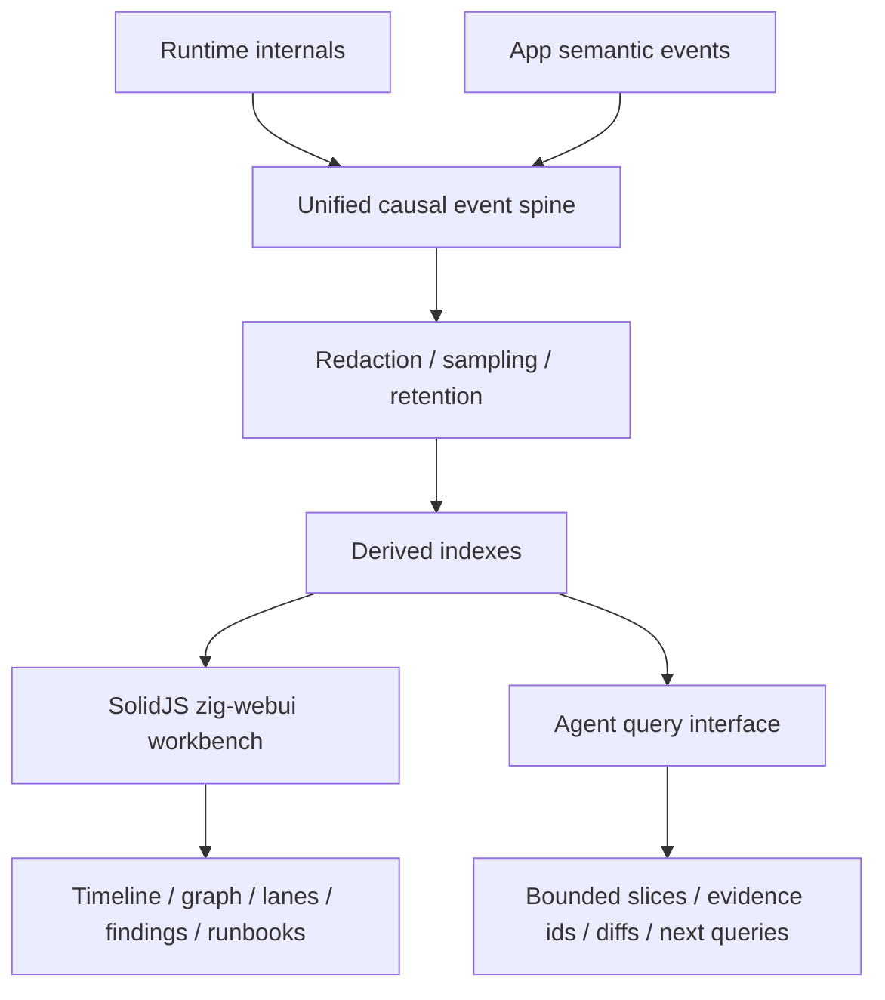

# zigeffect Causal Agent Runtime Master Roadmap

Date: 2026-06-08

## Purpose

This is the governing roadmap for turning `zigeffect`'s causal runtime into a
self-improving development system for `zigeffect` itself, then into an
agent-observable runtime substrate for applications built with `zigeffect`.

The project has already crossed the first important threshold: agents can run
local and CI causal harnesses, inspect event ids, compare before/after traces,
produce remediation artifacts, draft scenario registry changes, and check
registry-application readiness without editing source. The remaining work is to
move from review-only evidence toward controlled mutation, policy-backed
decisions, production hardening, durable history, replay, visual workbenching,
and app-facing reuse.

This roadmap is intentionally large. It is the long-running execution contract
for the active goal:

> Create and sequentially execute the full zigeffect causal self-improvement
> roadmap: guarded registry application, policy engine, pervasive causal tests,
> hardening, durable backends, replay/snapshots, workbench, and app-facing
> agent runtime.

## Operating Doctrine

Every milestone follows the same delivery discipline:

1. Write or update a focused design doc in `docs/superpowers/specs/`.
2. Write an implementation plan in `docs/superpowers/plans/`.
3. Create a feature branch with the `codex/` prefix.
4. Implement the smallest milestone slice that moves the final system forward.
5. Prefer read-only or artifact-first boundaries before source mutation.
6. Preserve deterministic local behavior unless a milestone explicitly adds
   durable or timestamped metadata.
7. Verify with package and repo commands that match the blast radius.
8. Commit only the intended files.
9. Merge only after the verification evidence is current.
10. Update this roadmap's progress ledger after each branch lands.

The invariant is:

> Causal tools may observe, explain, recommend, and prepare guarded changes.
> A change is only marked `applied=true` after the source or external state was
> actually changed and the required verification evidence was recorded.

## Current Delivered Baseline

The following capabilities are already merged into `master`:

- `CausalStore`, run ids, event ids, scope ids, finding extraction, and the
  causal event taxonomy.
- Text, JSON, and DOT causal artifact formatters.
- `zig build causal-test`, which writes deterministic dogfood artifacts.
- `zig build causal-check`, which intentionally fails on dogfood findings while
  preserving artifacts.
- `zig build causal-query -- <query> [argument]`, with optional `--file`, for
  inspecting saved artifacts.
- `zig build causal-catalog`, exposing scenario and invariant metadata.
- `zig build causal-compare -- <before.json> <after.json>`.
- `zig build causal-advice`, including before-aware `observed`, `persisting`,
  and `new` statuses.
- `zig build causal-artifacts`, listing retention globs and known artifacts.
- CI causal workflow, uploaded failure artifacts, generated advice, CI
  handoff, CI verdict, and base/head comparison.
- `CausalStore.initBounded`, causal schema metadata, event taxonomy metadata,
  sampling rules, defensive secret-shaped redaction, and causal artifact
  truncation metadata.
- `zig build causal-dev-loop -- baseline|after [scenario]`.
- `zig build causal-dev-session -- start|assess|status [scenario]`.
- `zig build causal-dev-agent -- local [scenario]`.
- `zig build causal-diagnosis -- local [scenario]`.
- `zig build causal-remediation-plan -- local [scenario]`.
- `zig build causal-remediation-audit -- local [scenario]`.
- `zig build causal-remediation-decision -- local approve|reject [scenario]`.
- `zig build causal-patch-proposal -- local draft|approved [scenario] ...`.
- `zig build causal-audit-chain -- local [scenario]`.
- `zig build causal-scenario-proposal -- local [scenario]`.
- `zig build causal-scenario-registry-patch -- --from-proposal
  <scenario-proposal.json>`.
- `zig build causal-registry-application-readiness -- --from-registry-patch
  <registry-patch.json> approve|reject --reason <reason>`.
- `zig build causal-registry-apply`, which records `plan` or
  `record-applied` registry application artifacts from readiness reports.
- `zig build causal-policy-decision -- local [scenario]`, which records
  advisory policy decisions with `mutation_authority=none`.
- `zig build causal-test-matrix`, which prints service, layer, scope, fiber,
  schedule, config, resource, retry, cause, and observability coverage.
- Scenario coverage-domain metadata in `tools/causal_run.zig`, including
  `causal-readiness` for app-shaped observability coverage.
- Shared structural causal assertion helpers in package tests.
- `CausalJsonLinesBackendState`, `CausalDotBackendState`,
  `CausalOtelBackendState`, `CausalGraphHistoryBackendState`,
  `CausalNendbStorageBackendState`, and `CausalAsyncStreamBackendState`
  concrete causal backend adapters.

These commands establish the review-only chain:

```text
dev session
  -> diagnosis
  -> remediation plan
  -> audit
  -> decision
  -> patch proposal
  -> audit chain
  -> scenario proposal
  -> registry patch draft
  -> registry application readiness
  -> registry application record
  -> policy decision
```

The next milestone after backend adapter verification is snapshot manifests, so
agents can compare named causal states before moving into replay and forking.

## Execution Ladder

### M0: Guarded Registry Application Boundary

Goal: consume `zigeffect.causal.registry-application-readiness.v1` artifacts
and produce an auditable application result for scenario registry changes.

This milestone is narrow by design. It only applies or records application of
reviewed registry patches for `packages/zigeffect/tools/causal_run.zig` and
related scenario docs. It does not add broad source mutation, general patch
application, durable backends, or app-facing adapters.

Deliverables:

- `zig build causal-registry-apply` or similarly named command.
- Input validation for `zigeffect.causal.registry-application-readiness.v1`.
- Hard requirement that `readiness_status=applicable` before any applied result
  can be emitted.
- Hard requirement that the readiness report, registry patch, reviewer
  decision, reason, policy, verified commands, and check statuses are preserved
  in the application artifact.
- A manual-application mode that writes an artifact describing exactly what the
  reviewer must apply and what verification must be run.
- A guarded registry-only backend, if implemented, that can update only the
  approved scenario registry snippet and related docs region.
- `applied=false` for review/manual artifacts.
- `applied=true` only after a source change actually occurs and post-apply
  verification is recorded.
- JSON/text artifacts:
  - `*-registry-application.json`
  - `*-registry-application.txt`
- Schema:
  - `zigeffect.causal.registry-application.v1`
- Artifact manifest entries and docs.

Exit criteria:

- Non-applicable and blocked readiness reports cannot be applied.
- No-op registry patches produce a no-op application report.
- Manual mode gives enough evidence for a reviewer to apply safely without
  pretending the tool changed source.
- Guarded mode, if enabled, refuses edits outside the registry/docs allowlist.
- The command fails closed on missing readiness source, mismatched registry
  patch path, failed readiness checks, missing verification command evidence,
  or stale source registry state.
- `zig build examples`, `zig build test --summary none`, `bun run check`, and
  `bun run zig:test` pass after merge.

Recommended first branch:

```text
codex/zigeffect-guarded-registry-application
```

### M1: Policy And Approval Engine

Goal: add deterministic, evidence-backed policy decision records that share the
manual review vocabulary but cannot silently authorize source mutation.

Deliverables:

- Policy schema:
  - `zigeffect.causal.policy-decision.v1`
- Local policy evaluator command:
  - `zig build causal-policy-decision -- local [scenario]`
- Policy inputs:
  - remediation audit;
  - remediation decision, if present;
  - patch proposal;
  - audit chain;
  - scenario proposal;
  - registry readiness/application reports where relevant.
- Policy outputs:
  - `decision=approve|reject|needs-human-review`;
  - deterministic reason codes;
  - evidence event ids;
  - required verification commands;
  - safety constraints;
  - mutation authority field that defaults to `none`.
- Policy catalog in code or docs for named local policies.
- Tests proving policy decisions are deterministic and evidence-bound.

Exit criteria:

- Policy records use the same reviewer/policy/reason vocabulary as manual
  decisions.
- A policy can recommend approval or rejection, but cannot by itself apply
  source changes.
- Every policy reason cites a source artifact and deterministic rule.
- Rejected or human-review decisions block guarded application.

Recommended branch:

```text
codex/zigeffect-causal-policy-engine
```

### M2: Pervasive Causal Tests Inside zigeffect

Goal: make causal evidence a normal part of core `zigeffect` regression tests,
not only a side harness.

Deliverables:

- Scenario coverage matrix for service, layer, scope, fiber, schedule, config,
  resource, retry, cause, and observability subsystems.
- New or expanded causal scenarios for the most important runtime invariants.
- Test helpers that assert causal event patterns without brittle formatting
  checks.
- Package test integration that emits causal context on selected assertion
  failures.
- Regression templates for bugs that should become scenario/invariant entries.
- Docs for "when a failing test should become a causal scenario."

Exit criteria:

- Core runtime regressions can be diagnosed from event ids and causal findings.
- Scenario tests remain deterministic and fast enough for local development.
- Passing quiet scenarios do not create noisy remediation advice.
- The causal graph is used inside real tests for meaningful assertions, not
  just emitted after failures.

Recommended branches:

```text
codex/zigeffect-causal-test-matrix
codex/zigeffect-causal-runtime-regression-scenarios
codex/zigeffect-causal-test-assertion-helpers
```

### M3: Production Hardening

Goal: make causal artifacts safe and stable enough for routine CI and app use.

Deliverables:

- Physical ring-buffer optimization if current ordered drop-oldest retention
  becomes too costly.
- Broader PII and payload redaction policy beyond deterministic secret-shaped
  strings.
- Redaction fixtures for headers, URLs, JSON-ish payloads, SQL-ish payloads,
  config maps, and nested key/value details.
- Stronger schema version compatibility fixtures.
- Deeper taxonomy compatibility tests for future event changes.
- Artifact size limits and explicit truncation metadata.
- Sampling policy tests for logs, metrics, spans, structural events, and
  finding evidence.
- CI checks that prevent schema or taxonomy drift without explicit updates.

Exit criteria:

- Long-running traces have bounded memory and bounded artifact size.
- Redaction tests cover common app and infrastructure payload shapes.
- Schema and taxonomy changes are explicit, tested, and documented.
- Agents can rely on compatibility warnings instead of guessing artifact
  semantics.

Recommended branches:

```text
codex/zigeffect-causal-ring-buffer-hardening
codex/zigeffect-causal-pii-redaction-policy
codex/zigeffect-causal-schema-taxonomy-fixtures
codex/zigeffect-causal-artifact-size-limits
```

### M4: Causal Backend Adapters

Goal: implement production-grade causal sinks behind the existing backend
boundary while keeping the deterministic in-memory store as the source of
truth for tests.

Deliverables:

- JSON Lines backend implementation and rotation policy.
- DOT backend polish for graph tooling.
- OpenTelemetry export adapter.
- NenDB graph-history adapter and NenDB storage writer contract.
- Async stream adapter for long-running runtimes.
- Backend conformance tests using a common event-sink contract.
- Failure policy for backend write errors.
- Docs that separate deterministic core semantics from best-effort sinks.

Exit criteria:

- Adapters cannot perturb causal event ordering in the core store.
- Backend failures are observable and bounded.
- Tests can run against memory only.
- Backend history can reconstruct enough event context for agent queries and
  replay planning.

Recommended branches:

```text
codex/zigeffect-causal-backend-conformance
codex/zigeffect-causal-jsonl-backend
codex/zigeffect-causal-dot-backend-polish
codex/zigeffect-causal-otel-backend
codex/zigeffect-causal-graph-history-backend
codex/zigeffect-causal-nendb-storage-adapter
codex/zigeffect-causal-async-stream-backend
```

Next branch:

```text
codex/zigeffect-causal-snapshot-manifest
```

### M5: Replay, Forking, And Named Snapshot Comparison

Goal: let agents compare known system states and, where deterministic inputs
exist, replay or fork causal histories for diagnosis.

Deliverables:

- Named snapshot manifest format.
- `zig build causal-snapshot -- capture <name> [scenario]`.
- `zig build causal-snapshot -- compare <left> <right>`.
- Audit-chain comparison across arbitrary named snapshots.
- Replay feasibility report that explains which events are replayable and which
  are observational only.
- Deterministic registered-scenario replay for supported pure or simulated
  scenarios.
- Fork proposals for supported scenario reruns without runtime memory mutation.
- Clear refusal for arbitrary runtime memory mutation.

Exit criteria:

- Agents can ask "what changed between these two named states?"
- Snapshot comparisons preserve schema and taxonomy warnings.
- Replay reports do not overclaim when external effects, timestamps, or
  nondeterministic inputs are present.
- Replay/forking is useful for deterministic scenarios without becoming a
  magical debugger.

Recommended branches:

```text
codex/zigeffect-causal-snapshot-manifest
codex/zigeffect-causal-snapshot-compare
codex/zigeffect-causal-replay-feasibility
codex/zigeffect-causal-deterministic-replay
codex/zigeffect-causal-scenario-fork-proposals
```

### M6: Causal Workbench UI

Goal: provide a human and agent workbench for inspecting causal runs without
manually opening many text artifacts.

Deliverables:

- SolidJS workbench renderer built with Bun/Vite.
- Preferred frontend path: SolidJS plus `webui-dev/zig-webui`; React remains a
  future adapter option only for a specific integration need.
- Zig WebUI launcher:
  - `zig build causal-workbench -- <artifact.json>`.
- UI build step:
  - `zig build causal-workbench-ui`.
- Bounded read-only Zig bridge for one selected artifact.
- Artifact loader for `zigeffect.causal.v1`.
- Views for:
  - effect run timeline;
  - lightweight parent/scope/fiber relationships;
  - retry timeline;
  - resource ownership;
  - findings;
  - metadata and compatibility posture;
  - selected event inspector.
- Cross-linking from event ids to related cause, children, resources, fibers,
  requirements, retries, and remediation evidence.
- Copyable agent query commands.
- Redaction and "safe to share" indicators.
- Later slices for remediation/audit chains, scenario registry proposal state,
  richer graph layout, and multi-artifact loading.

Exit criteria:

- A developer can inspect a failed causal run in the workbench faster than by
  reading raw JSON.
- The workbench never requires secrets or external services for local artifact
  viewing.
- It renders degraded but useful views for older artifacts.
- It is a viewer first; mutation remains behind policy and CLI artifacts unless
  a later milestone explicitly adds UI-controlled actions.

Recommended branches:

```text
codex/zigeffect-causal-workbench-readonly
codex/zigeffect-causal-workbench-graphs
codex/zigeffect-causal-workbench-remediation-chain
```

### M7: App-Facing Agent Runtime

Goal: reuse the same causal vocabulary for applications built with `zigeffect`.

Deliverables:

- App request trace adapter.
- App background job trace adapter.
- App incident mapping for:
  - service resolution;
  - layer construction;
  - scope lifecycle;
  - resource acquisition/release;
  - fiber status;
  - retry attempts and exhaustion;
  - configuration and requirement failures.
- App artifact schemas that remain compatible with core causal queries.
- App-facing `causal-query`, `causal-advice`, diagnosis, and remediation
  reports.
- Integration examples in a small sample app or Yachdee platform path that
  stays Worker-compatible.
- Redaction and bounded-memory defaults suitable for request paths.

Current foundation branch:

- `codex/zigeffect-app-facing-causal-runtime` adds the first
  `CausalAppTrace` request/job adapter. It records app lifecycle facts into the
  existing `CausalStore`, preserves `zigeffect.causal.v1` artifact
  compatibility, and keeps SolidJS plus `zig-webui` as the inspection surface.
- `codex/zigeffect-app-causal-example` adds `examples/causal_app_request.zig`,
  a Worker-shaped request example that returns a response plus owned causal JSON
  for caller-managed persistence.
- `codex/zigeffect-app-incident-mapping` adds typed app incident classification
  plus app-specific advice and diagnosis mappings over existing causal events.
- `codex/zigeffect-app-remediation-audit` adds pending, non-mutating app
  remediation audit artifacts with app incident event ids, query commands, and
  advisory app policy gates.
- `codex/zigeffect-app-policy-gates` adds advisory app policy decision
  artifacts that evaluate source, config, migration, operational-human, and
  rollback gates without granting mutation authority.

Exit criteria:

- Agents can reason about app incidents using the same event ids, query
  vocabulary, and finding categories used to build `zigeffect`.
- App request-path instrumentation is bounded and safe by default.
- App artifacts can be fed into existing advice and diagnosis tooling.
- The app-facing layer does not leak Bun-only APIs into Cloudflare Worker
  request paths.

Recommended branches:

```text
codex/zigeffect-app-request-causal-adapter
codex/zigeffect-app-job-causal-adapter
codex/zigeffect-app-incident-mapping
codex/zigeffect-app-causal-example
```

### M8: App Remediation Proposals And Policy Gates

Goal: extend the remediation-control chain from core `zigeffect` development to
applications built with `zigeffect`.

Deliverables:

- App remediation audit schema.
- App remediation decision schema or reuse of the core decision schema with
  app target fields.
- App human-review artifact for migration, operational-human, and rollback
  gates.
- App patch proposal artifact that can cite app files, config, migrations, or
  operational runbooks.
- App application readiness artifact that can mark a reviewed proposal ready to
  attempt while still preserving `applied=false`.
- Policy gates for app remediation:
  - source-only;
  - config-only;
  - migration-required;
  - operational-human-required;
  - rollback-required.
- Integration with the causal workbench for app incidents.
- Examples for common app issues.

Exit criteria:

- App agents can propose fixes without applying them blindly.
- Policy gates distinguish source edits, config changes, data migrations, and
  operational actions.
- The same `applied=false` to `applied=true` discipline is preserved.
- App remediation artifacts remain redacted, bounded, and queryable.

Recommended branches:

```text
codex/zigeffect-app-remediation-audit
codex/zigeffect-app-policy-gates
codex/zigeffect-app-patch-proposal
codex/zigeffect-app-remediation-workbench
codex/zigeffect-app-human-review-boundary
codex/zigeffect-app-application-readiness
codex/zigeffect-app-application-boundary
```

### M9: Production Operating Model

Goal: make the causal agent runtime maintainable as a long-lived subsystem.

Deliverables:

- Versioning policy for all causal artifact schemas.
- Migration policy for old artifacts.
- Compatibility matrix for CLI tools and artifact versions.
- CI workflow ownership docs.
- Backend operation docs.
- Workbench operation docs.
- Redaction review checklist.
- Scenario/invariant governance checklist.
- Release notes template for causal runtime changes.
- Performance budget for causal instrumentation.

Exit criteria:

- A contributor can change the causal runtime without breaking existing
  artifacts by accident.
- Operators know what artifacts are safe to upload, retain, or inspect.
- Agents have stable instructions for local, CI, durable, workbench, and
  app-facing workflows.
- The roadmap can be considered delivered because every named subsystem has a
  documented owner, verification path, and operational contract.

Recommended branches:

```text
codex/zigeffect-causal-operations-docs
codex/zigeffect-causal-performance-budget
codex/zigeffect-causal-m9-completion-audit
codex/zigeffect-causal-production-hardening-backlog
```

## Dependency Graph

```text
M0 guarded registry application
  -> M1 policy engine
  -> M2 pervasive causal tests
  -> M3 production hardening
  -> M4 NenDB/local backend adapters
  -> M5 replay and snapshots
  -> M6 workbench UI
  -> M7 app-facing runtime
  -> M8 app remediation gates
  -> M9 production operating model
```

Some M2 and M3 slices can run in parallel if needed, but the default execution
mode is sequential. The sequential path keeps the artifact vocabulary stable
before durable storage, replay, UI, and app-facing semantics depend on it.

## Verification Matrix

Use the smallest sufficient verification for each branch, then run broader
checks before merge.

Default documentation branch:

```sh
git diff --check
```

Default zigeffect tool branch:

```sh
cd packages/zigeffect
zig build examples
zig build test --summary none
```

Repo integration branch:

```sh
bun run check
bun run zig:test
```

Frontend/workbench branch:

```sh
bun run check
bun run zig:test
```

Then run the relevant local dev server or static preview and verify the UI with
browser screenshots when the branch adds user-facing screens.

Backend branch:

```sh
cd packages/zigeffect
zig build test --summary none
bun run check
```

Add adapter-specific integration tests only when external services are locally
available and the tests can skip cleanly otherwise.

## Progress Ledger

Status values:

- `delivered`: merged to `master` and verified.
- `active`: current branch or current planning target.
- `planned`: accepted sequence but not started.
- `deferred`: intentionally delayed until dependencies land.

| Milestone | Status | Current Evidence | Next Action |
| --- | --- | --- | --- |
| M0 Guarded registry application | delivered | `causal-registry-apply` writes `registry-application` artifacts on branch `codex/zigeffect-guarded-registry-application` | merge after final verification |
| M1 Policy engine | delivered | `causal-policy-decision` writes advisory policy artifacts on branch `codex/zigeffect-causal-policy-engine` | merge after final verification |
| M2 Pervasive causal tests | delivered | `causal-test-matrix`, coverage domains, `causal-readiness`, and shared causal assertions exist on branch `codex/zigeffect-causal-test-matrix` | move to M3 hardening |
| M3 Production hardening | delivered | bounded store, broader redaction, sampling, taxonomy, schema/taxonomy compatibility fixtures, and artifact string-size limits delivered | move to M4 backend conformance |
| M4 Backend adapters | delivered | backend boundary, conformance suite, JSONL sink, polished DOT backend, OTel bridge, graph-history adapter, NenDB storage writer contract, and async stream adapter exist | move to M5 snapshot manifests |
| M5 Replay/snapshots | delivered | snapshot manifest schema/tool, named snapshot compare, replay-feasibility reports, deterministic registered-scenario replay, and safe scenario fork proposals exist | move to M6 read-only workbench |
| M6 Workbench UI | delivered | SolidJS renderer, `causal-workbench-ui`, `zig-webui` launcher, graph cause-path/runtime-lane branch, and remediation-chain branch `codex/zigeffect-causal-workbench-remediation-chain` exist | move to M7 app-facing runtime |
| M7 App-facing runtime | delivered | `CausalAppTrace`, Worker-shaped app request example, app incident classifier, and app-specific advice/diagnosis mappings exist | move to M8 app remediation audit |
| M8 App remediation gates | delivered | app remediation audit artifacts, app policy gate decisions, app human-review boundary artifacts, draft app patch proposal artifacts, app application readiness artifacts, guarded app application records, and detailed SolidJS/zig-webui workbench rendering exist | move to M9 production operating model |
| M9 Operating model | delivered | completion audit, schema governance, operations docs, performance budget report, release guidance, production-hardening backlog report, production artifact aggregation contract, durable production retention contract, production deployment runbooks, artifact access-control contract, and unified causal spine contract exist | start deep runtime internals |

## Immediate Branch Queue

1. `codex/zigeffect-causal-deep-runtime-internals`
   - Emit deeper runtime facts for layers, services, scopes, fibers, resource
     lifetimes, retries, finalizers, defects, interruptions, and cause chains
     through the unified causal spine.
2. `codex/zigeffect-causal-app-semantic-trace-api`
   - Add the app-facing semantic trace layer for `data_read`,
     `function_boundary`, `data_transformed`, `service_call`, `data_written`,
     `domain_action`, `policy_decision`, `artifact_emitted`, and
     `response_sent` without recording raw payloads.
3. `codex/zigeffect-causal-agent-query-interface`
   - Expose compact machine-native queries over the same spine:
     `summarize_run`, `find_failures`, `explain_event`, `trace_cause`,
     `trace_data`, `compare_runs`, `list_findings`, and `next_queries`.
4. `codex/zigeffect-causal-encryption-at-rest-policy`
5. `codex/zigeffect-causal-alerting-integrations`
6. `codex/zigeffect-causal-live-dashboard-streaming-workbench`
   - Delivered: add the read-only live workbench stream and the first visual
     graph adapter.
     Start with `@dschz/solid-g6` as the SolidJS integration layer, keep the
     zigeffect causal graph model as source of truth, and add direct
     `@antv/g6` usage only where the adapter needs engine APIs.
7. `codex/zigeffect-causal-workbench-graph-visual-debugging`
   - Delivered: Visual Graph now supports cause, topology, ownership, and
     lineage perspectives for causal traces, runtime topology, scopes, fibers,
     causes, retries, resource ownership, and semantic app data lineage.
     `?sample=visual-graph` loads the local debugging fixture, Solid G6 carries
     group/tone/priority metadata, and browser verification covers
     desktop/mobile plus nonblank canvas evidence. Keep `solid-flow` as
     optional later research for editable remediation planning surfaces, not as
     a default dashboard dependency.
8. `codex/zigeffect-causal-human-agent-feedback-loop`
   - Delivered: `causal-human-agent-feedback-loop` emits
     `zigeffect.causal.human-agent-feedback-loop.v1` as the record-only loop
     contract connecting human workbench selections, bounded agent queries,
     before/after trace comparison, local regression clustering records,
     guarded remediation handoffs, and future NenDB durable-history handoff.
     It keeps `applied=false`, `mutation_authority=none`,
     `workbench_mutation=false`, and `agent_mutation=false`.
9. `codex/zigeffect-causal-rollout-automation-guardrails`
   - Current next branch: define canary, gradual rollout, circuit-breaker, and
     rollback evidence records without granting automated mutation authority.
10. `codex/zigeffect-causal-wall-clock-benchmark-baselines`
11. `codex/zigeffect-causal-production-capacity-planning`

## Dual-Interface Causal Spine Expansion

The dual-interface causal spine now has a concrete contract:
`zigeffect.causal.unified-spine-contract.v1`, emitted by
`zig build causal-unified-spine-contract`. Humans and agents consume the same
evidence model, but they should not consume the same surface. The SolidJS
`zig-webui` workbench is the human control room for reading, viewing, managing,
and understanding what happened. The agent query interface is the compact
machine surface for bounded graph slices, evidence ids, confidence, redaction
state, truncation state, and recommended next queries.

The shared spine owns these stable identity fields:

- runtime ids: `run_id`, `event_id`, `parent_event_id`, `cause_id`,
  `fiber_id`, `scope_id`, `layer_id`, `service_key`, and `resource_id`;
- app ids: `artifact_id`, `domain_entity_ref`, `data_subject_ref`, and
  `schema_ref`;
- relationship types: `caused_by`, `parent_of`, `requires`, `provides`,
  `reads`, `writes`, `transforms`, `emits`, `owns`, and `finalizes`.

The store boundary remains append-only and policy-first:



The human workbench should eventually expose timeline, cause graph,
layer/service graph, fiber lanes, scope/resource ownership, data lineage,
findings, redaction/retention status, replay comparison, and runbook state. The
agent interface should expose deterministic queries with bounded responses and
stable schemas. The workbench may be rich and interactive; the agent interface
must be concise, loss-aware, and easy to cite.

## Risks And Controls

### Risk: Source Mutation Creep

Control: M0 permits only registry-scoped guarded application. General patch
application remains out of scope until policy and operation gates exist.

### Risk: Artifact Vocabulary Drift

Control: every new artifact schema gets a schema name, schema version, docs,
manifest entries, and compatibility tests where relevant.

### Risk: Agent Overclaiming

Control: all remediation reports must preserve before/after evidence posture,
persisting event ids, required verification commands, and `applied` state.

### Risk: PII Leakage In App Traces

Control: complete broader redaction policy before enabling app-facing request
or job traces by default.

### Risk: Durable Backend Semantics Pollute Core Tests

Control: deterministic in-memory `CausalStore` remains the source of truth for
tests. Backends are sinks with conformance tests and explicit failure policy.

### Risk: Workbench Becomes A Mutation Surface Too Early

Control: M6 is read-only. UI-triggered actions require later policy and
application artifacts.

## Definition Of Goal Completion

The long-running goal is complete only when all of the following are true:

- M0 through M9 are delivered, merged, and verified.
- Every named schema has docs, tests, and compatibility expectations.
- Guarded application and policy gates preserve the `applied=false` to
  `applied=true` evidence transition.
- Core `zigeffect` tests use causal evidence pervasively enough to diagnose
  meaningful engine regressions.
- Production hardening covers bounded memory, bounded artifacts, broader
  redaction, schema compatibility, and taxonomy compatibility.
- At least one durable backend path is production-grade behind the backend
  boundary.
- Named snapshots and replay/forking support deterministic scenarios without
  overclaiming nondeterministic replay.
- The workbench can inspect causal artifacts and remediation chains.
- App request/job traces can enter the causal runtime safely.
- App remediation proposals and policy gates reuse the same vocabulary.
- Operating docs explain versioning, migration, CI, retention, redaction,
  backends, workbench usage, scenario governance, and performance budgets.

Until those requirements are proven from current files, tests, and runtime
behavior, the goal remains active.
