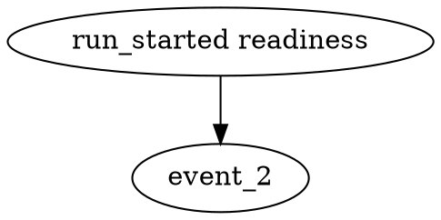
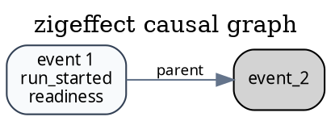
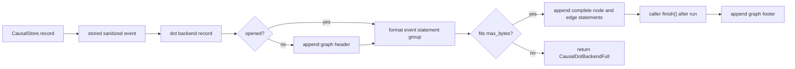

# zigeffect Causal DOT Backend Polish Design

Date: 2026-06-08
Branch: codex/zigeffect-causal-dot-backend-polish
Milestone: M4 Durable Causal Backend Adapters

## Purpose

Turn causal DOT export from a minimal full-store formatter into a more useful
graph artifact surface and add a `.dot` backend adapter that follows the same
sink contract proven by the JSONL backend.

DOT is not durable history and it is not an agent query format. Its job is to
make causal runs quickly inspectable in graph tooling. The polished version
should preserve deterministic store semantics, improve graph readability, and
let local or CI harnesses build graph output as events are recorded.

## Current Context

`formatCausalDot` currently lives in `packages/zigeffect/src/services/causal.zig`
and emits a simple graph:



That is enough for smoke tests, but it has limits:

- no graph, node, or edge attributes for graph tools;
- labels omit event ids and most causal dimensions;
- parent edges have no explicit role label;
- there is no `.dot` backend state behind `CausalBackendKind.dot`;
- existing tools can write `.dot` artifacts only after a full store snapshot.

The JSONL backend branch established the adapter pattern:

- caller-owned `std.ArrayList(u8)` output;
- store remains authoritative;
- backend sees assigned, redacted, bounded, non-sampled stored events;
- optional byte ceiling prevents partial writes;
- direct build gate for adapter tests.

DOT should reuse that pattern while respecting DOT-specific needs.

## Goals

- Keep `formatCausalDot(allocator, store)` as the public full-snapshot graph
  formatter.
- Improve DOT output with deterministic graph, node, and edge attributes.
- Include event id, kind, label, status, run, scope, fiber, trace, and span
  context in graph-safe labels or tooltips where present.
- Preserve safe DOT escaping for quotes, backslashes, and control characters.
- Factor graph formatting into reusable append helpers so the full formatter
  and backend adapter use the same graph statements.
- Add `CausalDotBackendState` as a caller-owned-buffer backend with
  `CausalBackendKind.dot`.
- Add explicit `finish()` for closing the DOT graph after a run.
- Add a no-partial-statement byte ceiling for backend output.
- Add focused tests and `zig build causal-dot-backend`.

## Non-Goals

- No Graphviz rendering or image generation.
- No file-owned backend state.
- No browser or workbench UI.
- No graph query engine.
- No import of DOT back into causal query tools.
- No replacement for JSON artifacts as the agent-readable source of truth.

## Output Format

The polished full graph should keep the stable graph name:



Label rules:

- first label line: `event <id>`;
- second label line: event kind tag;
- third label line: `label`, if present;
- fourth label line: `status=<status>`, if present.

Tooltip rules:

- include `run`, `scope`, `fiber`, `trace`, and `span` values when present;
- include `type` when present;
- include no raw detail payloads.

Styling rules:

- structural events use a neutral fill and border;
- finding-evidence events use a warm warning fill and border;
- sampleable observability events use a cool observability fill and border.

DOT string escaping:

- quote becomes `\"`;
- backslash becomes `\\`;
- label line breaks are emitted as `\n` escape sequences;
- raw newline, carriage return, and tab bytes inside event strings become a
  single space;
- other bytes are copied as-is.

## Public API

Add a new service module:

```text
packages/zigeffect/src/services/causal_dot_backend.zig
```

Expose through `packages/zigeffect/src/zigeffect.zig`:

```zig
pub const CausalDotBackendOptions = causal_dot_backend.CausalDotBackendOptions;
pub const CausalDotBackendState = causal_dot_backend.CausalDotBackendState;
pub const formatCausalDotEvent = causal_dot_backend.formatCausalDotEvent;
```

`causal.zig` keeps the full graph API and exposes append helpers used by both
the full formatter and the backend module:

```zig
pub fn appendCausalDotGraphHeader(output: *std.ArrayList(u8), allocator: Allocator) Allocator.Error!void;
pub fn appendCausalDotEvent(output: *std.ArrayList(u8), allocator: Allocator, event: CausalEvent) Allocator.Error!void;
pub fn appendCausalDotGraphFooter(output: *std.ArrayList(u8), allocator: Allocator) Allocator.Error!void;
pub fn formatCausalDot(allocator: Allocator, store: *const CausalStore) Allocator.Error![]const u8;
```

Backend options:

```zig
pub const CausalDotBackendOptions = struct {
    max_bytes: ?usize = null,
    include_graph_header: bool = true,
};
```

Backend state:

```zig
pub const CausalDotBackendState = struct {
    allocator: std.mem.Allocator,
    output: *std.ArrayList(u8),
    max_bytes: ?usize = null,
    include_graph_header: bool = true,
    opened: bool = false,
    finished: bool = false,
    written_event_count: u64 = 0,
    failed_write_count: u64 = 0,

    pub fn init(
        allocator: std.mem.Allocator,
        output: *std.ArrayList(u8),
        options: CausalDotBackendOptions,
    ) CausalDotBackendState;

    pub fn backend(self: *CausalDotBackendState) causal_backend.CausalBackend;
    pub fn finish(self: *CausalDotBackendState) anyerror!void;
    pub fn writtenEventCount(self: *const CausalDotBackendState) u64;
    pub fn failedWriteCount(self: *const CausalDotBackendState) u64;
    pub fn isFinished(self: *const CausalDotBackendState) bool;
};
```

Single-event formatter:

```zig
pub fn formatCausalDotEvent(
    allocator: std.mem.Allocator,
    event: causal.CausalEvent,
) std.mem.Allocator.Error![]const u8;
```

## Backend Lifecycle

The backend is an artifact builder, not an always-valid standalone file while a
run is active.

1. `init` records options and does not allocate.
2. The first `record` lazily appends the graph header when
   `include_graph_header=true`.
3. Each `record` formats one complete event statement group into temporary
   memory, then appends it if it fits the byte ceiling.
4. `finish` appends the closing brace. If no events were recorded, it still
   creates a valid empty graph when headers are enabled.
5. Additional `finish` calls are no-ops.
6. Recording after `finish` returns `error.CausalDotBackendFinished`; the store
   counts that as a backend write failure without losing its retained event.

When `include_graph_header=false`, the backend emits only event statement
groups. This lets tools compose fragments, but the default must be a complete
graph after `finish()`.

## Bounded Output Policy

`max_bytes` applies to complete header, event, and footer fragments.

Policy:

1. Format the next fragment into temporary memory.
2. If `output.items.len + fragment.len` would exceed `max_bytes`, append
   nothing.
3. Increment `failed_write_count`.
4. Return `error.CausalDotBackendFull`.
5. If the error occurs during `record`, `CausalStore.backendFailureCount()`
   also increments.

No partial DOT statements should be written. A graph may be unfinished if
`finish()` itself fails, but it should never contain a truncated node or edge
statement.

## Data Flow



## Test Strategy

Add `packages/zigeffect/test/causal_dot_backend_test.zig` and import it from
`test/all_test.zig`.

Tests:

1. `formatCausalDot` emits deterministic graph attributes, richer labels,
   parent edge labels, and escaped event strings.
2. `formatCausalDotEvent` emits a complete node plus parent edge statement for
   one event and contains no raw literal newlines inside quoted event strings.
3. `CausalDotBackendState` records the standard backend conformance trace as
   DOT statements for started, retained log, and completed events, even though
   retention leaves only the final event in memory.
4. Backend output contains redaction and truncation markers and omits the raw
   secret from the conformance fixture.
5. `finish()` closes a valid graph and is idempotent.
6. `max_bytes` overflow fails closed with no partial statement and increments
   both `failedWriteCount` and store `backendFailureCount` for record-time
   failures.
7. Recording after `finish()` fails as a backend write without perturbing the
   store.

Add a direct build step:

```text
zig build causal-dot-backend
```

The package `test` step should depend on it.

## Documentation Updates

Update:

- `packages/zigeffect/README.md`
- `packages/zigeffect/docs/agent-guide.md`
- `packages/zigeffect/docs/agent-observable-runtime.md`
- `docs/superpowers/specs/2026-06-08-zigeffect-causal-agent-runtime-master-roadmap.md`

Docs should say:

- DOT is for human graph inspection, not structured agent query.
- Use JSON artifacts for authoritative metadata and query tooling.
- Use `CausalDotBackendState` when a harness wants graph output while recording
  events.
- Call `finish()` before writing the DOT buffer as an artifact.
- `zig build causal-dot-backend` is the focused adapter gate.

## Acceptance Criteria

- Existing `formatCausalDot` callers still work.
- DOT output is deterministic and graph-tool friendly.
- DOT labels include enough context for visual triage without exposing raw
  detail payloads.
- `CausalDotBackendState` attaches with `store.attachBackend`.
- Backend output receives assigned, redacted, bounded, non-sampled stored
  events and observes events before retention drops them.
- Byte ceilings fail closed with no partial DOT statement.
- Backend failures stay observable and do not perturb `CausalStore`.
- The branch lands with design, plan, tests, docs, and post-merge verification.
