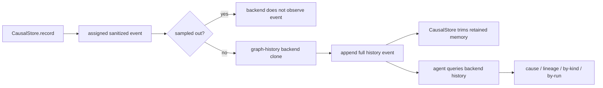

# zigeffect Causal Graph History Backend Design

Date: 2026-06-08
Branch: codex/zigeffect-causal-graph-history-backend
Milestone: M4 Durable Causal Backend Adapters

## Purpose

Add the first embedded graph-history causal backend behind the existing
`CausalBackend` boundary.

This branch should make a local agent session more useful before adding NenDB,
CockroachDB, RoachGraph, replay, or cross-run durability. The backend will keep
an owned history of sanitized stored causal events and expose graph-style
queries over that history. It will prove the query contract that a future
embedded graph database or durable backend can replace.

The main win is retention independence: `CausalStore` may keep only a small
bounded window, while the graph-history backend can still answer cause and
lineage questions over the full event stream it observed.

## Current Context

`CausalBackendKind` already includes:

- `nendb_graph`: embedded Zig graph-query backend candidate for local agents.
- `cockroach_history`: durable app, CI, or fleet audit history.

The current concrete adapters are sink-oriented:

- `CausalJsonLinesBackendState` writes portable event rows.
- `CausalDotBackendState` writes graph visualization artifacts.
- `CausalOtelBackendState` maps causal events into OTel-shaped records.

`CausalStore` already provides the reference query vocabulary:

- `snapshot`
- `cause`
- `lineage`
- `resources`
- `fibers`
- `requirements`
- `retries`
- `findings`

Those queries only see events retained in the store. That is correct for the
deterministic core, but it means aggressive retention can make ancestor or
child queries incomplete. The graph-history adapter should preserve an owned
sink history so agents can query events that have already been dropped from the
store's in-memory retention window.

## Goals

- Add `CausalGraphHistoryBackendState` behind `CausalBackendKind.nendb_graph`.
- Keep the first implementation dependency-free and scan-based.
- Retain cloned, sanitized, bounded, non-sampled events observed by the backend.
- Expose graph-style queries over the backend history:
  - `snapshot`
  - `cause`
  - `lineage`
  - `eventsByKind`
  - `eventsByRun`
  - `eventsByScope`
  - `eventsByFiber`
- Add a max-event ceiling that fails closed before adding partial history.
- Keep backend failures observable through both backend counters and
  `CausalStore.backendFailureCount()`.
- Prove the backend can answer cause and lineage queries after the core store
  has dropped ancestors through retention.
- Add `zig build causal-graph-history-backend`.

## Non-Goals

- No NenDB dependency in this branch.
- No CockroachDB, RoachGraph, D1, R2, or filesystem persistence.
- No cross-run durable history.
- No replay, forking, named snapshots, or checkpoint compaction.
- No query CLI rewrite.
- No indexing or performance optimization beyond a bounded local history.
- No change to `CausalStore` retention semantics.

## Considered Approaches

### Option A: Add NenDB Now

This would make the adapter name literal, but it would introduce a new storage
dependency before the query protocol is proven. It would also mix event model
work with database lifecycle, indexing, memory limits, and dependency
maintenance.

### Option B: Jump To Cockroach/RoachGraph History

This fits later app and CI audit use cases, but it is too heavy for the first
graph-history branch. Durable history needs schema, migrations, connection
configuration, retry behavior, and request-path safety rules.

### Option C: Dependency-Free Embedded Graph History

Store cloned events in adapter-owned memory and expose a small query API that
matches the causal vocabulary. Use `CausalBackendKind.nendb_graph` because this
is the embedded graph adapter lane, while documenting that actual NenDB storage
is still future work.

This is the recommended first slice. It proves the query contract and keeps the
adapter replaceable.

## Public API

Create:

```text
packages/zigeffect/src/services/causal_graph_history_backend.zig
```

Expose through `packages/zigeffect/src/zigeffect.zig`:

```zig
pub const CausalGraphHistoryBackendOptions = causal_graph_history_backend.CausalGraphHistoryBackendOptions;
pub const CausalGraphHistoryBackendState = causal_graph_history_backend.CausalGraphHistoryBackendState;
```

Backend options:

```zig
pub const CausalGraphHistoryBackendOptions = struct {
    max_events: ?usize = null,
};
```

Backend state:

```zig
pub const CausalGraphHistoryBackendState = struct {
    allocator: std.mem.Allocator,
    events: std.ArrayList(causal.CausalEvent) = .empty,
    max_events: ?usize = null,
    written_event_count: u64 = 0,
    failed_event_count: u64 = 0,

    pub fn init(
        allocator: std.mem.Allocator,
        options: CausalGraphHistoryBackendOptions,
    ) CausalGraphHistoryBackendState;

    pub fn deinit(self: *CausalGraphHistoryBackendState) void;
    pub fn backend(self: *CausalGraphHistoryBackendState) causal_backend.CausalBackend;
    pub fn eventCount(self: *const CausalGraphHistoryBackendState) usize;
    pub fn writtenEventCount(self: *const CausalGraphHistoryBackendState) u64;
    pub fn failedEventCount(self: *const CausalGraphHistoryBackendState) u64;
    pub fn snapshot(self: *const CausalGraphHistoryBackendState, allocator: std.mem.Allocator) std.mem.Allocator.Error!causal.CausalSnapshot;
    pub fn cause(self: *const CausalGraphHistoryBackendState, allocator: std.mem.Allocator, event_id: u64) std.mem.Allocator.Error!causal.CausalLineage;
    pub fn lineage(self: *const CausalGraphHistoryBackendState, allocator: std.mem.Allocator, event_id: u64) std.mem.Allocator.Error!causal.CausalLineage;
    pub fn eventsByKind(self: *const CausalGraphHistoryBackendState, allocator: std.mem.Allocator, kind: causal.CausalEventKind) std.mem.Allocator.Error!causal.CausalSnapshot;
    pub fn eventsByRun(self: *const CausalGraphHistoryBackendState, allocator: std.mem.Allocator, run_id: u64) std.mem.Allocator.Error!causal.CausalSnapshot;
    pub fn eventsByScope(self: *const CausalGraphHistoryBackendState, allocator: std.mem.Allocator, scope_id: u64) std.mem.Allocator.Error!causal.CausalSnapshot;
    pub fn eventsByFiber(self: *const CausalGraphHistoryBackendState, allocator: std.mem.Allocator, fiber_id: u64) std.mem.Allocator.Error!causal.CausalSnapshot;
};
```

Errors:

```zig
pub const CausalGraphHistoryBackendError = error{
    CausalGraphHistoryBackendFull,
};
```

## Query Semantics

The backend's graph query methods intentionally mirror the current store/tool
vocabulary:

- `snapshot`: all events observed by this backend, in event-id order.
- `cause(event_id)`: ancestor chain ending at `event_id`, following
  `parent_id`.
- `lineage(event_id)`: `event_id` plus direct child events whose `parent_id`
  equals `event_id`.
- `eventsByKind(kind)`: all events with the requested taxonomy kind.
- `eventsByRun(run_id)`: all events with that run id.
- `eventsByScope(scope_id)`: all events with that scope id.
- `eventsByFiber(fiber_id)`: all events with that fiber id.

The first implementation may scan the owned event list. It should not build a
premature index. The important contract is stable query behavior and ownership,
not query speed.

## Backend Lifecycle

1. `init` creates an empty owned event history.
2. `backend()` returns a `CausalBackend` with kind `.nendb_graph`.
3. On each stored event, the backend checks `max_events`.
4. If the history is full, it appends nothing, increments
   `failed_event_count`, and returns `error.CausalGraphHistoryBackendFull`.
5. Otherwise it clones the stored event strings, appends the owned event, and
   increments `written_event_count`.
6. `CausalStore` catches backend errors and increments its
   `backendFailureCount()` without losing its retained event.
7. `deinit` frees all cloned event strings and the event list.

The backend receives events after store redaction and string bounding. It must
not re-read raw caller payloads and must preserve redaction/truncation markers.

## Data Flow



## Test Strategy

Add `packages/zigeffect/test/causal_graph_history_backend_test.zig` and import
it from `test/all_test.zig`.

Tests:

1. The backend records the standard conformance trace as three events while the
   bounded store retains only the final event.
2. `cause(ids.retained_log)` returns the started and retained-log events even
   after the store has dropped the started event.
3. `lineage(ids.started)` returns started, retained-log, and completed events,
   and omits the sampled-out log.
4. `eventsByKind(.log_recorded)` returns only the retained log from the
   conformance fixture.
5. `eventsByRun`, `eventsByScope`, and `eventsByFiber` filter events in a small
   graph-shaped fixture.
6. Backend history contains redaction and truncation markers and omits the raw
   secret from the conformance fixture.
7. `max_events` fails closed with no partial appended event and increments both
   backend and store failure counters.

Add a direct build step:

```text
zig build causal-graph-history-backend
```

The package `test` step should depend on it.

## Documentation Updates

Update:

- `packages/zigeffect/README.md`
- `packages/zigeffect/docs/agent-guide.md`
- `packages/zigeffect/docs/agent-observable-runtime.md`
- `docs/superpowers/specs/2026-06-08-zigeffect-causal-agent-runtime-master-roadmap.md`

Docs should say:

- `CausalGraphHistoryBackendState` is an embedded graph-history adapter for
  local and agent-session queries.
- It is dependency-free and scan-based in this branch.
- It returns `CausalBackendKind.nendb_graph` but does not yet depend on NenDB.
- It can preserve queryable history beyond the deterministic store's retention
  window.
- It remains a sink; failed writes mean the backend history may be incomplete.
- `zig build causal-graph-history-backend` is the focused adapter gate.

## Acceptance Criteria

- The branch adds design, plan, tests, implementation, docs, and roadmap
  updates.
- `CausalBackendKind.nendb_graph` has a concrete adapter state.
- The backend retains cloned sanitized events and frees them correctly.
- Cause and lineage queries work after `CausalStore` retention drops ancestors.
- Filter queries by kind, run, scope, and fiber are deterministic.
- Event ceilings fail closed with no partial sink state.
- Backend failures stay observable and do not perturb `CausalStore`.
- The branch lands with focused verification and post-merge verification.
