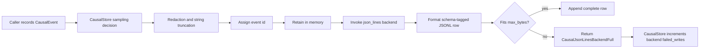

# zigeffect Causal JSON Lines Backend Design

Date: 2026-06-08
Branch: codex/zigeffect-causal-jsonl-backend
Milestone: M4 Durable Causal Backend Adapters

## Purpose

Add the first concrete causal backend adapter behind `CausalBackend`: a JSON
Lines event sink for local tools, CI artifacts, and agent workflows that need to
consume events incrementally instead of waiting for a full `formatCausalJson`
snapshot.

This branch is also a proving ground for the backend conformance contract added
in the previous milestone. The adapter must receive only stored events, preserve
causal ordering, surface write failures without perturbing `CausalStore`, and
respect the store's redaction, sampling, retention, and string truncation
semantics.

## Current Context

`packages/zigeffect/src/services/causal_backend.zig` already defines the
backend boundary:

```zig
pub const CausalBackend = struct {
    kind: CausalBackendKind,
    state: ?*anyopaque = null,
    record: *const fn (?*anyopaque, causal.CausalEvent) anyerror!void,
};
```

`CausalStore.record` stores the event, assigns the final event id, and then
invokes the attached backend. Backend errors are caught and counted through
`backendFailureCount`; they do not make the deterministic in-memory store fail.

The existing dogfood and command harnesses currently emit full text, JSON, and
DOT artifacts after a completed run. They use `std.ArrayList(u8)` for formatted
artifacts and `std.Io.Dir.cwd().writeFile` for final file writes. The JSONL
backend should follow these Zig 0.16 patterns rather than introducing a custom
writer interface.

## Goals

- Provide a public JSON Lines event formatter for a single `CausalEvent`.
- Provide a public backend state that appends formatted JSONL rows to a caller
  supplied `std.ArrayList(u8)`.
- Keep each row independently parseable and schema tagged.
- Preserve backend conformance behavior for redaction, truncation, sampling,
  retention, event ids, and write-failure isolation.
- Add a bounded-output policy that prevents partial row writes when a caller
  supplied byte ceiling is reached.
- Document how tools should rotate or persist JSONL output without putting file
  ownership in the deterministic runtime service.

## Non-Goals

- No filesystem-owned backend state in this branch.
- No async queue, thread, or Worker request-path file access.
- No OpenTelemetry, graph history, CockroachDB, or durable database adapter.
- No replay support or JSONL import/query command yet.
- No replacement for the full `formatCausalJson` artifact. JSONL is an
  incremental event stream; the full JSON artifact remains the best compact
  metadata-rich snapshot for existing query tools.

## Approaches Considered

### Approach A: File-Owned Backend

The backend state owns a file handle and writes each row directly to disk.

Tradeoffs:

- It is closest to a "durable" sink.
- It couples the service module to local filesystem APIs.
- It is awkward for tests and incompatible with Worker request-path code.
- It makes rotation policy depend on file ownership details before the adapter
  contract has been proven.

### Approach B: Generic Writer Callback

The backend state owns a custom callback or writer-like object and streams rows
through that boundary.

Tradeoffs:

- It is flexible.
- It adds another indirection layer on top of `CausalBackend`.
- It risks fighting Zig 0.16 writer API churn.
- It is harder to make conformance and no-partial-row guarantees obvious.

### Approach C: Bounded ArrayList Sink

The backend formats a full row into temporary memory, checks an optional byte
ceiling, then appends the complete row to a caller supplied
`std.ArrayList(u8)`.

Tradeoffs:

- It is deterministic and easy to test.
- It cleanly supports CI artifact generation and future file persistence.
- It provides a concrete bounded-output policy now.
- It leaves direct file ownership and rotation orchestration to tools.
- It uses one temporary allocation per event row.

Selected approach: C.

The first JSONL backend should be a service-level event sink, not a file owner.
Tooling can persist the buffer through the same `writeArtifact` pattern already
used by `causal_test.zig` and `causal_run.zig`. Future branches can add a
file-owned or async adapter after this one proves the row schema and conformance
behavior.

## Public API

Add a new service module:

```text
packages/zigeffect/src/services/causal_jsonl_backend.zig
```

Public constants:

```zig
pub const causal_jsonl_event_schema = "zigeffect.causal.event.v1";
pub const causal_jsonl_event_schema_version: u32 = 1;
```

Public options:

```zig
pub const CausalJsonLinesBackendOptions = struct {
    max_bytes: ?usize = null,
};
```

Public state:

```zig
pub const CausalJsonLinesBackendState = struct {
    allocator: std.mem.Allocator,
    output: *std.ArrayList(u8),
    max_bytes: ?usize = null,
    written_event_count: u64 = 0,
    failed_event_count: u64 = 0,

    pub fn init(
        allocator: std.mem.Allocator,
        output: *std.ArrayList(u8),
        options: CausalJsonLinesBackendOptions,
    ) CausalJsonLinesBackendState;

    pub fn backend(self: *CausalJsonLinesBackendState) causal_backend.CausalBackend;
    pub fn writtenEventCount(self: *const CausalJsonLinesBackendState) u64;
    pub fn failedEventCount(self: *const CausalJsonLinesBackendState) u64;
};
```

Public formatter:

```zig
pub fn formatCausalJsonLine(
    allocator: std.mem.Allocator,
    event: causal.CausalEvent,
) std.mem.Allocator.Error![]const u8;
```

Root exports in `packages/zigeffect/src/zigeffect.zig`:

- `services.causal_jsonl_backend`
- `CausalJsonLinesBackendOptions`
- `CausalJsonLinesBackendState`
- `formatCausalJsonLine`
- `causal_jsonl_event_schema`
- `causal_jsonl_event_schema_version`

## Row Schema

Each row is one compact JSON object followed by `\n`.

```json
{"schema":"zigeffect.causal.event.v1","schema_version":1,"event_taxonomy_version":1,"id":1,"kind":"run_started","run_id":1,"parent_id":null,"fiber_id":null,"scope_id":null,"trace_id":null,"span_id":null,"label":"example","type_name":"ExampleRun","status":"","redacted_detail":""}
```

Fields:

- `schema`: stable row schema name.
- `schema_version`: row schema version.
- `event_taxonomy_version`: copied from the causal event taxonomy.
- `id`: assigned event id from `CausalStore`.
- `kind`: string enum tag from `CausalEventKind`.
- `run_id`, `parent_id`, `fiber_id`, `scope_id`, `trace_id`, `span_id`:
  nullable numeric relationships.
- `label`, `type_name`, `status`, `redacted_detail`: already redacted and
  bounded event strings.

Rows intentionally do not include retention, sampling, truncation, or backend
summary objects. Those are store-level metadata in `formatCausalJson` and
`formatCausalCiReport`. JSONL rows are event facts. Tool-level manifests can
pair a JSONL file with the full JSON artifact when metadata is needed.

## Bounded Output And Rotation Policy

`CausalJsonLinesBackendOptions.max_bytes` is an optional row-stream ceiling.

Policy:

1. Format the complete row into temporary memory first.
2. If `output.items.len + row.len` would exceed `max_bytes`, do not append any
   bytes.
3. Increment the backend state's `failed_event_count`.
4. Return `error.CausalJsonLinesBackendFull`.
5. `CausalStore` catches that error and increments `backendFailureCount`.

This gives tools a deterministic rotation boundary:

- no partial JSON rows;
- no ambiguous final line;
- caller can flush or persist the current buffer;
- caller can create a fresh backend state or reset the output after rotation;
- the store remains usable even while the sink reports failed writes.

Direct file rotation is deliberately left outside the service module. The
existing artifact tools already own directory creation and file writes. A later
tool branch can add:

```text
.zig-cache/causal-artifacts/<scenario>.jsonl
.zig-cache/causal-artifacts/<scenario>.jsonl.1
.zig-cache/causal-artifacts/<scenario>.jsonl.manifest.json
```

without changing the core adapter semantics.

## Data Flow



## Error Handling

- Formatter allocation errors propagate to the backend callback.
- Byte-ceiling overflow returns `error.CausalJsonLinesBackendFull`.
- Backend callback errors are counted by `CausalStore` and do not fail
  `record`.
- The backend state separately counts successful row writes and failed row
  attempts so tools can report sink-local status.
- The adapter never mutates event ids or event payloads.

## Test Strategy

Add `packages/zigeffect/test/causal_jsonl_backend_test.zig` and import it from
`test/all_test.zig`.

Tests:

1. `formatCausalJsonLine` emits one newline-terminated valid compact JSON row
   with schema metadata and escaped strings.
2. The JSONL backend writes the standard backend conformance trace as three
   rows: started, retained log, completed. The sampled-out log is absent, the
   retained store has only the final event due to retention, and the backend
   output still has the earlier rows.
3. The JSONL backend output contains the redaction and truncation markers and
   does not contain the raw secret from the conformance fixture.
4. `max_bytes` overflow writes no partial row, increments
   `failedEventCount`, and is visible through `CausalStore.backendFailureCount`.

Add a direct build step:

```text
zig build causal-jsonl-backend
```

The package `test` step should depend on it, just as it depends on
`causal-backend-conformance`.

## Documentation Updates

Update:

- `packages/zigeffect/README.md`
- `packages/zigeffect/docs/agent-guide.md`
- `packages/zigeffect/docs/agent-observable-runtime.md`
- `docs/superpowers/specs/2026-06-08-zigeffect-causal-agent-runtime-master-roadmap.md`

Docs should make these points clear:

- JSONL is for incremental agent and CI event consumption.
- The backend sees already sanitized stored events.
- A nonzero `failed_writes` value means the store trace is still authoritative,
  but the sink output may be incomplete.
- Use the full JSON artifact for store-level retention, sampling, truncation,
  and backend metadata.
- Filesystem persistence and rotation belong in tools or app adapters, not in
  the deterministic core store.

## Acceptance Criteria

- `fx.CausalJsonLinesBackendState` can be attached through
  `store.attachBackend`.
- `fx.formatCausalJsonLine` produces valid newline-terminated JSON for a single
  event.
- JSONL output rows are ordered by causal event id and include schema metadata.
- The adapter passes the same semantic expectations as the conformance fixture:
  assigned ids, redacted strings, bounded strings, sampling exclusion, and
  retention independence.
- Byte ceilings fail closed with no partial row.
- Backend write failures remain observable and bounded.
- Documentation distinguishes deterministic core semantics from best-effort
  sinks.
