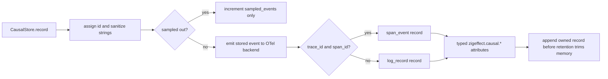

# zigeffect Causal OpenTelemetry Backend Design

Date: 2026-06-08
Branch: codex/zigeffect-causal-otel-backend
Milestone: M4 Durable Causal Backend Adapters

## Purpose

Add the first OpenTelemetry bridge for causal runtime events while keeping the
deterministic `CausalStore` as the source of truth.

This branch should not add an OpenTelemetry SDK, network exporter, OTLP encoder,
or production collector integration. It should add a dependency-free
OpenTelemetry-shaped backend that classifies stored causal events into span
events or log records, preserves effect-specific causal attributes, and gives
future exporters a tested semantic mapping to consume.

The useful wedge is not "send telemetry somewhere." It is "make zigeffect's
effect-native causal facts compatible with the span and event ecosystems without
flattening away runtime semantics."

## Official OpenTelemetry Context

This design uses current primary OpenTelemetry documentation:

- [Tracing API](https://opentelemetry.io/docs/specs/otel/trace/api/) says spans
  represent operations, carry trace/span context, own attributes, and may record
  timestamped span events.
- [Logs Data Model](https://opentelemetry.io/docs/specs/otel/logs/data-model/)
  defines log/event records with optional `TraceId`, optional `SpanId`,
  attributes, body, and `EventName`.
- [Semantic Conventions](https://opentelemetry.io/docs/specs/semconv/) define
  common names and attributes for interoperable telemetry, but are versioned
  separately from the core signal specifications.
- [Semantic conventions for events](https://opentelemetry.io/docs/specs/semconv/general/events/)
  require named event structures and recommend attributes for event details.

The branch should respect those boundaries:

- A causal event with both `trace_id` and `span_id` can be represented as a span
  event attached to that span context.
- A causal event without complete span context should be represented as an OTel
  log/event record, optionally carrying any trace/span ids that are available.
- zigeffect-specific attributes should use the `zigeffect.causal.*` namespace
  until a later semantic-convention branch decides which names should become
  stable public conventions.

## Current Context

The backend boundary already includes `CausalBackendKind.opentelemetry` in
`packages/zigeffect/src/services/causal_backend.zig`.

Concrete adapter patterns now exist:

- `CausalJsonLinesBackendState` formats stored events into artifact rows.
- `CausalDotBackendState` formats stored events into graph fragments and fails
  closed under a byte ceiling.
- The backend conformance fixture proves adapters see assigned, redacted,
  bounded, non-sampled stored events, including events observed before
  retention drops them from the in-memory store.

Local observability code also exists, but it is intentionally lightweight:

- `services/tracing.zig` uses numeric `TraceId` and `SpanId` values.
- `services/observability.zig` formats local reports.
- There is no OpenTelemetry SDK dependency or OTLP encoder in the package.

The OTel backend should follow the existing causal backend posture: adapter
state is best-effort sink state, not the runtime source of truth.

## Goals

- Add `CausalOtelBackendState` behind `CausalBackendKind.opentelemetry`.
- Add an explicit causal-to-OTel mapper that future exporters can reuse.
- Classify complete trace/span context as `span_event`; classify incomplete or
  missing span context as `log_record`.
- Preserve causal identity, taxonomy, run, parent, fiber, scope, trace, span,
  label, type, status, and redacted detail as typed attributes.
- Expose lowercase OTel-style trace id and span id strings for records that
  have numeric causal trace/span ids.
- Keep the first bridge allocator-aware, deterministic, local, and
  dependency-free.
- Add a max-record ceiling that fails closed before recording partial sink
  state.
- Prove redaction, truncation, sampling, retention, and sink-failure posture
  with focused tests.
- Add `zig build causal-otel-backend`.

## Non-Goals

- No OpenTelemetry SDK dependency.
- No OTLP protobuf, JSON, gRPC, or HTTP exporter.
- No collector configuration.
- No filesystem-owned backend state.
- No semantic convention stabilization for public `zigeffect.*` attributes.
- No conversion of the core `CausalStore` into an OTel store.
- No timestamps, resources, instrumentation scopes, links, metrics, or
  exception semantic conventions beyond preserving existing causal fields.

## Considered Approaches

### Option A: Direct OTLP Exporter

Add OTLP serialization and send spans/logs directly from the backend.

This is too much for the current milestone. It introduces protocol versioning,
network error handling, collector configuration, batching, resource metadata,
and production retry behavior before the causal-to-OTel semantic mapping is
tested.

### Option B: JSONL With OTel-Like Field Names

Reuse the JSON Lines backend and emit records that look like OTel log records.

This is simple, but it blurs two concerns. JSONL is already the portable causal
artifact adapter. The OTel bridge should expose a typed mapping that a future
SDK or OTLP backend can use without reparsing JSON strings.

### Option C: Dependency-Free Typed OTel Record Backend

Map each stored causal event into a typed in-memory `CausalOtelRecord`:

- `span_event` when both `trace_id` and `span_id` are present;
- `log_record` otherwise;
- typed `zigeffect.causal.*` attributes for causal metadata;
- OTel-style lowercase hex strings for trace and span ids.

This is the recommended first slice. It proves the semantic boundary, keeps the
runtime small, and gives later exporters a stable shape to consume.

## Public API

Create:

```text
packages/zigeffect/src/services/causal_otel_backend.zig
```

Expose through `packages/zigeffect/src/zigeffect.zig`:

```zig
pub const causal_otel_record_schema = causal_otel_backend.causal_otel_record_schema;
pub const causal_otel_record_schema_version = causal_otel_backend.causal_otel_record_schema_version;
pub const CausalOtelSignal = causal_otel_backend.CausalOtelSignal;
pub const CausalOtelAttributeValue = causal_otel_backend.CausalOtelAttributeValue;
pub const CausalOtelAttribute = causal_otel_backend.CausalOtelAttribute;
pub const CausalOtelRecord = causal_otel_backend.CausalOtelRecord;
pub const CausalOtelBackendOptions = causal_otel_backend.CausalOtelBackendOptions;
pub const CausalOtelBackendState = causal_otel_backend.CausalOtelBackendState;
pub const classifyCausalOtelSignal = causal_otel_backend.classifyCausalOtelSignal;
pub const formatCausalOtelTraceId = causal_otel_backend.formatCausalOtelTraceId;
pub const formatCausalOtelSpanId = causal_otel_backend.formatCausalOtelSpanId;
pub const mapCausalEventToOtelRecord = causal_otel_backend.mapCausalEventToOtelRecord;
```

Schema constants:

```zig
pub const causal_otel_record_schema = "zigeffect.causal.otel_record.v1";
pub const causal_otel_record_schema_version: u32 = 1;
```

Record signal:

```zig
pub const CausalOtelSignal = enum {
    span_event,
    log_record,
};
```

Typed attributes:

```zig
pub const CausalOtelAttributeValue = union(enum) {
    string: []const u8,
    u64: u64,
    bool: bool,
};

pub const CausalOtelAttribute = struct {
    key: []const u8,
    value: CausalOtelAttributeValue,
};
```

Mapped record:

```zig
pub const CausalOtelRecord = struct {
    signal: CausalOtelSignal,
    name: []const u8,
    trace_id: ?u64 = null,
    span_id: ?u64 = null,
    trace_id_hex: ?[32]u8 = null,
    span_id_hex: ?[16]u8 = null,
    attributes: []CausalOtelAttribute = &.{},

    pub fn deinit(self: *CausalOtelRecord, allocator: std.mem.Allocator) void;
    pub fn attribute(self: *const CausalOtelRecord, key: []const u8) ?CausalOtelAttributeValue;
};
```

Backend options and state:

```zig
pub const CausalOtelBackendOptions = struct {
    max_records: ?usize = null,
};

pub const CausalOtelBackendState = struct {
    allocator: std.mem.Allocator,
    records: std.ArrayList(CausalOtelRecord) = .empty,
    max_records: ?usize = null,
    written_record_count: u64 = 0,
    failed_record_count: u64 = 0,

    pub fn init(
        allocator: std.mem.Allocator,
        options: CausalOtelBackendOptions,
    ) CausalOtelBackendState;

    pub fn deinit(self: *CausalOtelBackendState) void;
    pub fn backend(self: *CausalOtelBackendState) causal_backend.CausalBackend;
    pub fn recordedRecords(self: *const CausalOtelBackendState) []const CausalOtelRecord;
    pub fn writtenRecordCount(self: *const CausalOtelBackendState) u64;
    pub fn failedRecordCount(self: *const CausalOtelBackendState) u64;
};
```

Errors:

```zig
pub const CausalOtelBackendError = error{
    CausalOtelBackendFull,
};
```

## Mapping Rules

Record name:

```text
zigeffect.causal.<event_kind>
```

Signal classification:

```text
trace_id != null and span_id != null -> span_event
otherwise                              -> log_record
```

Trace/span hex formatting:

- `formatCausalOtelTraceId(1)` returns
  `00000000000000000000000000000001`.
- `formatCausalOtelSpanId(2)` returns `0000000000000002`.
- These helpers are a local bridge from zigeffect's current numeric ids into
  OTel-style lowercase id strings. They do not claim to preserve a propagated
  external 128-bit trace id until the tracing service grows that representation.

Attributes:

Required attributes on every record:

- `zigeffect.causal.schema` = `zigeffect.causal.otel_record.v1`
- `zigeffect.causal.schema_version` = `1`
- `zigeffect.causal.event_taxonomy_version` =
  `causal_event_taxonomy_version`
- `zigeffect.causal.event_id`
- `zigeffect.causal.kind`
- `zigeffect.causal.signal`

Optional attributes when present:

- `zigeffect.causal.run_id`
- `zigeffect.causal.parent_event_id`
- `zigeffect.causal.fiber_id`
- `zigeffect.causal.scope_id`
- `zigeffect.causal.trace_id`
- `zigeffect.causal.span_id`
- `zigeffect.causal.label`
- `zigeffect.causal.type_name`
- `zigeffect.causal.status`
- `zigeffect.causal.redacted_detail`

The backend receives stored causal events after redaction and truncation, so the
mapped attributes must preserve markers such as `<redacted>` and `<truncated>`
without re-reading raw caller payloads.

## Backend Lifecycle

1. `init` creates empty backend state and records the max-record option.
2. `backend()` returns a `CausalBackend` with kind `.opentelemetry`.
3. On each stored event, the backend checks `max_records`.
4. If the ceiling is reached, it appends nothing, increments
   `failed_record_count`, and returns `error.CausalOtelBackendFull`.
5. Otherwise it maps the event into a fully owned `CausalOtelRecord`, appends
   it, and increments `written_record_count`.
6. If mapping or append allocation fails, the backend deinitializes partial
   record state, increments `failed_record_count`, and returns the error.
7. `CausalStore` catches backend errors and increments its
   `backendFailureCount()` without losing its deterministic retained event.
8. `deinit` frees all owned record strings, attributes, and the record list.

## Data Flow



## Test Strategy

Add `packages/zigeffect/test/causal_otel_backend_test.zig` and import it from
`test/all_test.zig`.

Tests:

1. Trace/span hex helpers emit OTel-length lowercase strings.
2. `mapCausalEventToOtelRecord` maps complete trace/span context to a
   `span_event`, sets the record name, hex ids, and typed causal attributes.
3. The mapper classifies contextless events as `log_record` and still preserves
   event identity attributes.
4. `CausalOtelBackendState` records the standard backend conformance trace as
   three OTel records, while the store retains only the final event.
5. Backend records contain redaction and truncation markers and omit the raw
   secret from the conformance fixture.
6. `max_records` fails closed with no partial record and increments both
   backend and store failure counters.

Add a direct build step:

```text
zig build causal-otel-backend
```

The package `test` step should depend on it.

## Documentation Updates

Update:

- `packages/zigeffect/README.md`
- `packages/zigeffect/docs/agent-guide.md`
- `packages/zigeffect/docs/agent-observable-runtime.md`
- `docs/superpowers/specs/2026-06-08-zigeffect-causal-agent-runtime-master-roadmap.md`

Docs should say:

- OTel records are adapter sink records, not the source of truth.
- The first bridge is dependency-free and exporter-neutral.
- Span events require complete local trace/span context.
- Contextless or incomplete events become OTel log/event records.
- The `zigeffect.causal.*` attributes preserve runtime semantics for future
  exporters and agents.
- `zig build causal-otel-backend` is the focused adapter gate.

## Acceptance Criteria

- The branch adds design, plan, tests, implementation, docs, and roadmap
  updates.
- `CausalBackendKind.opentelemetry` has a concrete adapter state.
- Complete trace/span context maps to `span_event`; missing context maps to
  `log_record`.
- Records preserve typed causal attributes and lowercase OTel-style ids.
- Backend output receives assigned, redacted, bounded, non-sampled stored
  events and observes events before retention drops them.
- Record ceilings fail closed with no partial sink state.
- Backend failures stay observable and do not perturb `CausalStore`.
- The branch lands with focused verification and post-merge verification.
