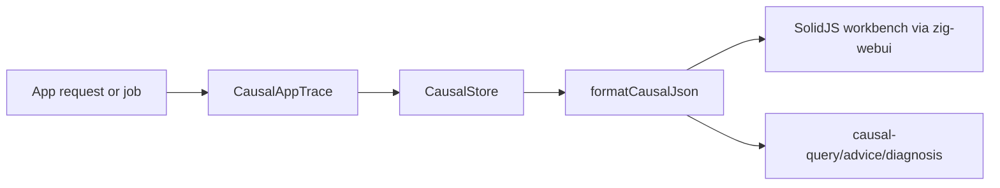

# zigeffect App-Facing Causal Runtime Design

Date: 2026-06-09

## Purpose

This M7 slice starts the app-facing causal runtime. It lets applications built
with `zigeffect` describe request and background-job incidents using the same
event ids, event taxonomy, bounded store posture, redaction policy, and
workbench artifacts used while building core `zigeffect`.

The first implementation is intentionally a runtime adapter foundation, not a
new UI. The existing SolidJS workbench hosted by `zig-webui` remains the local
inspection surface. App traces must continue to emit standard
`zigeffect.causal.v1` artifacts so `causal-query`, `causal-advice`, diagnosis
tools, and the workbench can consume them without a parallel schema.

## Product Context

- Product: `zigeffect` app-facing causal runtime.
- UI direction: SolidJS workbench plus `webui-dev/zig-webui` shell.
- App target: Worker-compatible request paths first; background jobs second.
- Persistence target: caller-owned exports today, with the existing NenDB
  adapter remaining the first durable indexing target later.
- Explicitly out of scope: React workbench rewrite, Cockroach adapter, request
  filesystem writes, network upload code, and app remediation mutation.

## Approach

Use a small Zig service module that wraps a caller-provided `CausalStore`.
Applications create a bounded store with request or job defaults, start an app
trace, record semantic app lifecycle facts, complete the trace, then export the
same causal JSON they already use for core runtime traces.

This keeps the important boundary clean:



## API Shape

Create `packages/zigeffect/src/services/causal_app_runtime.zig`.

Public constants:

- `causal_app_runtime_schema = "zigeffect.causal.app-runtime.v1"`
- `causal_app_runtime_schema_version = 1`
- `default_request_max_events = 256`
- `default_job_max_events = 1024`
- `default_app_max_event_string_bytes = 256`

Public types:

- `CausalAppTraceKind = enum { request, background_job }`
- `CausalAppStatus = enum { started, success, failure, cancelled }`
- `CausalAppTraceOptions`
- `CausalAppTrace`

Public functions:

- `defaultRequestCausalStoreOptions() CausalStoreOptions`
- `defaultJobCausalStoreOptions() CausalStoreOptions`
- `CausalAppTrace.startRequest(store, options) !CausalAppTrace`
- `CausalAppTrace.startJob(store, options) !CausalAppTrace`

The trace object records app lifecycle events through methods:

- `complete(status)`
- `recordServiceResolution(service_name, status)`
- `recordLayerConstruction(layer_name, status)`
- `openScope(label)` and `closeScope(scope_id, status)`
- `recordResourceAcquired(label, scope_id)` and
  `recordResourceFinalized(label, scope_id, status)`
- `recordFiberStatus(label, fiber_id, status)`
- `recordRetryAttempt(label, attempt, max_attempts, status)`
- `recordConfigFailure(key, error_name)`
- `recordRequirementFailure(name, error_name)`

The methods deliberately map to existing event kinds:

- request/job start and completion: `run_started`, `run_completed`
- service resolution: `service_required`
- layer construction: `layer_started`, `layer_completed`
- scope lifecycle: `scope_opened`, `scope_closed`
- resources: `resource_acquired`, `resource_finalized`
- fiber status: `fiber_started`, `fiber_joined`, `fiber_interrupted`
- retries: `schedule_decision`
- config and requirement failures: `assertion_recorded`

## Data And Redaction

The adapter should not store request bodies, raw URLs, headers, cookies,
database rows, SQL text, or user identifiers. The caller supplies route
templates such as `/api/projects/:id`, job names, service names, and compact
semantic details. The existing `CausalStore` redaction and string-size bounds
still apply to every event field.

Request defaults:

- `max_events = 256`
- `max_event_string_bytes = 256`
- no log/metric/span sampling by default in this first slice

Job defaults:

- `max_events = 1024`
- `max_event_string_bytes = 256`
- no durable sink by default

The adapter records app metadata in compact strings such as:

```text
method=GET route=/api/projects/:id runtime=worker
attempt=2 max_attempts=3
key=readiness.region
```

If a caller accidentally includes sensitive keys, the existing redactor still
rewrites the value before retention or export.

## Workbench Integration

No new renderer is required in this slice. Because the adapter writes standard
`CausalEvent` rows into `CausalStore`, app artifacts remain compatible with:

```bash
zig build causal-workbench -- .zig-cache/causal-artifacts/<app-incident>.json
```

The SolidJS workbench should show app incidents in its existing Timeline,
Findings, Graph, Queries, and Metadata views. Future M8 app remediation work
can add an app-incident chain view only after app remediation schemas exist.

## Worker Boundary

The module must use only Zig standard-library allocation and string formatting.
It must not use filesystem APIs, Bun APIs, process APIs, sockets, or platform
specific request handling. Export/storage remains the application's
responsibility so Cloudflare Workers can choose logs, R2, Durable Objects, D1,
or another Worker-compatible sink outside this module.

## Testing

Tests must prove:

- request defaults are bounded and compatible with the existing store;
- request traces record started/completed run events with app labels;
- app lifecycle helpers map to existing event kinds;
- config and requirement failures become `assertion_recorded` findings;
- accidental sensitive values are redacted in exported causal JSON;
- job traces use the larger bounded default and distinct labels;
- no workbench UI changes are required for the standard JSON artifact.

Verification commands:

```bash
cd packages/zigeffect && zig build causal-app-runtime
cd packages/zigeffect && zig build test
bun run zigeffect:workbench:test
bun run zigeffect:workbench:typecheck
```

## Future Slices

- App request adapter examples in a small Worker-compatible sample.
- Background job adapter examples with larger buffers and optional durable
  backends.
- App incident mapping polish for service resolution, scopes, resources,
  fibers, retries, config, and dependency failures.
- App remediation audit, policy gates, and patch proposal artifacts.
- Workbench app-incident affordances once M8 schemas exist.

## Self-Review

- Scope check: this is one implementable M7 foundation branch.
- UI consistency: SolidJS plus `zig-webui` remains the chosen inspection path.
- Compatibility check: app artifacts keep the core `zigeffect.causal.v1`
  artifact surface.
- Safety check: bounded request-path stores and redacted event fields are
  required before app traces are enabled.
