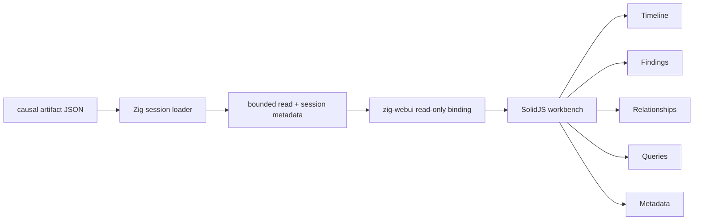

# zigeffect Causal Workbench Read-Only Design

## Context

M0-M5 now produce a rich local artifact trail: causal JSON, text reports, DOT
graphs, snapshot manifests, replay reports, fork proposals, remediation
artifacts, policy decisions, registry readiness, and registry application
records. Developers and agents can inspect these artifacts from the CLI, but
they still need to jump between many files and commands.

M6 starts with a read-only local workbench. The first slice should be useful
immediately for a single causal JSON artifact while leaving room for later graph,
remediation-chain, replay-comparison, and NenDB-backed artifact-index expansion.

This design supersedes the earlier static-only renderer idea. The requested
direction is SolidJS for the application UI and `webui-dev/zig-webui` for the
local Zig host.

## Product Design Brief

- Product: internal zigeffect causal artifact workbench.
- Audience: zigeffect maintainers and development agents diagnosing local
  runtime behavior.
- Visual direction: quiet operational UI, dense but readable, optimized for
  scanning event timelines and evidence. No marketing hero, decorative cards,
  nested cards, or ornamental visual treatment.
- Interactivity: SolidJS application with tabs, search/filter, event selection,
  copyable query commands, and safe-to-share/redaction indicators.
- Host: local Zig WebUI shell using the built Solid app and a read-only Zig
  artifact bridge.
- Boundary: read-only. No source edits, registry edits, policy decisions,
  secret access, external network calls, or runtime mutation.

## Goals

- Add a local UI build command:

  ```sh
  bun run zigeffect:workbench:build
  ```

- Add a local WebUI launcher:

  ```sh
  cd packages/zigeffect
  zig build causal-workbench -- .zig-cache/causal-artifacts/zigeffect-causal-dogfood.json
  ```

- Build a SolidJS app under `packages/zigeffect/workbench`.
- Launch the built app through `zig-webui`.
- Load one selected causal artifact through a Zig-owned read-only bridge.
- Render a real first-screen application, not a landing page.
- Provide views for:
  - event timeline;
  - finding/evidence summary;
  - event detail inspector;
  - lightweight relationship view from `parent_id`, `scope_id`, and `fiber_id`;
  - copyable `causal-query` commands;
  - artifact metadata and compatibility posture.
- Keep all actions read-only and local.
- Render degraded-but-useful output for older or partially missing metadata.
- Keep the GUI dependency out of normal runtime code and keep core tests from
  opening windows.

## Non-Goals

- No mutation controls.
- No policy approval UI.
- No registry application UI.
- No source, scenario registry, or artifact write-back.
- No directory/multi-artifact loader in the first slice.
- No graph layout library in the first slice.
- No DOT rendering dependency in the first slice.
- No external service calls.
- No Cockroach causal backend or Cockroach-backed artifact index.
- No NenDB persistence in this slice; a NenDB adapter for artifact indexing is a
  future slice.
- No dev server in the normal `zig build causal-workbench` path. A Vite dev
  server is allowed only for local UI development.

## Selected Architecture

Use two explicit layers:

1. Solid renderer layer:
   - location: `packages/zigeffect/workbench`;
   - build tool: Vite + SolidJS;
   - app entry: `src/main.tsx`;
   - model code: `src/causalArtifact.ts`;
   - styles: `src/styles.css`;
   - output: `packages/zigeffect/workbench/dist`.
2. Zig host layer:
   - pure session module: `packages/zigeffect/tools/causal_workbench_session.zig`;
   - WebUI launcher: `packages/zigeffect/tools/causal_workbench.zig`;
   - dependency: pinned `zig_webui` package in
     `packages/zigeffect/build.zig.zon`;
   - build step: `zig build causal-workbench -- <artifact.json>`.

The Solid renderer owns presentation, filtering, derived findings, relationship
summaries, and copyable query strings. The Zig host owns filesystem reads,
artifact size limits, session construction, and the WebUI bridge.



## Zig Host

`causal_workbench_session.zig` should be free of WebUI imports and covered by
normal Zig tests. It will provide:

- `workbench_schema = "zigeffect.causal.workbench-session.v1"`;
- `default_workbench_root = "workbench/dist"`;
- `default_index_path = "workbench/dist/index.html"`;
- `max_artifact_bytes = 4 * 1024 * 1024`;
- `usage()` with the user-facing command;
- session JSON formatting with:
  - selected artifact path;
  - artifact byte length;
  - schema names;
  - read-only posture;
  - supported schema/taxonomy versions;
  - warnings for oversized or missing artifacts where relevant.

`causal_workbench.zig` will import WebUI and the pure session module. It will:

1. accept exactly one artifact path;
2. read the artifact with the session module's bounded limit;
3. allocate null-terminated payload strings for WebUI responses;
4. create a WebUI window;
5. bind read-only functions such as `zigeffect_load_artifact` and
   `zigeffect_load_session`;
6. set the root folder to `workbench/dist`;
7. show `index.html`;
8. wait for the window to close;
9. never write artifacts, source files, registry entries, or policy decisions.

The WebUI host should use the browser/WebView runtime only as a GUI. It must not
turn the workbench into a networked service or an action executor.

## Solid Renderer

The renderer should start from the workbench itself. It will not include a
landing page or marketing explanation.

Expected files:

- `packages/zigeffect/workbench/index.html`
- `packages/zigeffect/workbench/vite.config.ts`
- `packages/zigeffect/workbench/tsconfig.json`
- `packages/zigeffect/workbench/src/main.tsx`
- `packages/zigeffect/workbench/src/App.tsx`
- `packages/zigeffect/workbench/src/causalArtifact.ts`
- `packages/zigeffect/workbench/src/causalArtifact.test.ts`
- `packages/zigeffect/workbench/src/styles.css`

The app should:

- call the WebUI bridge when available;
- fall back to a bundled sample artifact only for Vite/browser development;
- parse unknown or partial artifacts defensively;
- compute a workbench model from raw JSON without mutating it;
- preserve raw event ids for query commands;
- keep text stable inside compact controls;
- avoid oversized headings inside panels;
- avoid visible instructions about how the UI works.

## UI Structure

The first viewport should be the workbench itself:

- top toolbar:
  - artifact path;
  - schema/version/taxonomy chips;
  - event count;
  - finding count;
  - safe-to-share posture;
  - read-only indicator;
- left rail:
  - tabs: Timeline, Findings, Graph, Queries, Metadata;
  - search input;
  - kind/status filters;
- main pane:
  - selected tab content;
- right inspector:
  - selected event id, kind, label, status, type;
  - run/scope/fiber/parent links;
  - redacted detail;
  - copyable `causal-query` commands.

The layout should be dense and stable. Fixed-format controls such as tabs,
counters, filters, and event rows should have stable dimensions so filtering
does not resize the workbench.

## View Behavior

Timeline:

- sort event rows by numeric `id` where possible;
- filter by text, kind, and status;
- click an event to populate the inspector;
- show compact badges for run/scope/fiber ids.

Findings:

- compute local finding heuristics that mirror existing causal tools where
  practical:
  - missing service requirement;
  - unfinalized resource;
  - failed finalizer;
  - retry exhaustion;
  - assertion failure;
  - pending fiber after scope close;
- link findings back to event rows.

Graph:

- render a simple relationship list/tree from `parent_id`;
- group by scope and fiber where ids exist;
- avoid force-directed layout in this slice.

Queries:

- show copyable commands:
  - `zig build causal-query -- --file <artifact> snapshot`;
  - `zig build causal-query -- --file <artifact> cause <event_id>`;
  - `zig build causal-query -- --file <artifact> lineage <event_id>`;
  - `zig build causal-query -- --file <artifact> resources <scope_id>`;
  - `zig build causal-query -- --file <artifact> fibers pending`;
  - `zig build causal-query -- --file <artifact> requirements <run_id>`;
  - `zig build causal-query -- --file <artifact> retries <run_id>`.

Metadata:

- schema and taxonomy values;
- unknown/missing metadata warnings;
- redaction/truncation/safe-share indicators;
- host/session metadata from Zig.

## Safety

The workbench must include visible read-only posture:

- "read-only local artifact viewer";
- "no source edits";
- "no registry edits";
- "no policy decisions";
- "artifact content is bounded and displayed as already-redacted evidence".

The workbench must never add buttons that imply mutation, approval, apply,
automatic fixes, or registry updates.

The first slice may use the clipboard for copying query commands. Clipboard
usage is still read-only from the zigeffect perspective and should degrade to
manual selection when unavailable.

## Testing

Frontend tests should cover:

- deriving a model from a causal JSON artifact;
- counting events and findings;
- preserving unknown fields without crashing;
- generating query commands from selected events;
- filtering by text/kind/status;
- development fallback sample parsing.

Zig tests should cover:

- usage text;
- stable workbench root/index constants;
- session JSON read-only posture;
- bounded artifact read failures;
- host-independent session formatting.

Verification commands:

```sh
bun run zigeffect:workbench:test
bun run zigeffect:workbench:typecheck
bun run zigeffect:workbench:build
cd packages/zigeffect && zig build test-raw --summary none
cd packages/zigeffect && zig build causal-workbench -- .zig-cache/causal-artifacts/zigeffect-causal-dogfood.json
```

Manual/browser verification should cover:

- generate a dogfood artifact with `zig build causal-test`;
- launch the WebUI workbench;
- verify the page is nonblank;
- verify tabs render;
- verify events appear;
- verify filtering works;
- verify selecting an event updates the inspector;
- verify the window stays read-only and exposes no mutation controls.

## Future Slices

- richer graph view with DOT/SVG import.
- multi-artifact loader and artifact index.
- NenDB adapter for artifact indexing and historical workbench sessions.
- remediation and audit-chain visualization.
- snapshot/replay/fork proposal comparison inside the workbench.
- policy-gated action launchers that produce reviewable CLI artifacts instead
  of mutating directly.
- agent-facing workbench export that summarizes current evidence, active
  hypotheses, and next CLI queries.

## Self-Review

- Placeholder scan: no unresolved placeholders remain.
- Internal consistency: the first slice is SolidJS + WebUI, local, bounded, and
  read-only throughout.
- Scope check: this branch can deliver a useful single-artifact viewer without
  registry mutation or durable storage.
- Dependency check: `zig-webui` requires a `build.zig.zon` dependency; SolidJS
  requires isolated TypeScript settings so it does not disturb the Preact
  marketing app.
- Boundary check: no Cockroach backend work is included; later durable
  workbench indexing should target a NenDB adapter first.
