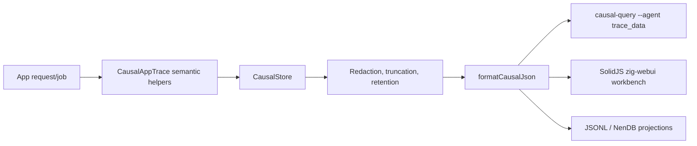

# zigeffect Causal App Semantic Trace API Design

Date: 2026-06-10
Branch: `codex/zigeffect-causal-app-semantic-trace-api`
Status: Approved for implementation by long-running roadmap goal

## Goal

Add the app semantic trace layer promised by the unified causal spine: apps built
with `zigeffect` can record data lineage, function boundaries, service calls,
domain actions, policy decisions, emitted artifacts, and sent responses without
recording raw app payloads.

This branch extends the delivered `CausalAppTrace` foundation. It keeps the
source artifact format as `zigeffect.causal.v1`, adds typed app semantic
reference fields to `CausalEvent`, and makes the agent query surface able to ask
`trace_data <data_subject_ref>` over those references.

## Context

The previous app-facing runtime branch delivered:

- `CausalAppTrace.startRequest` and `startJob`;
- bounded request/job store defaults;
- lifecycle helpers for services, layers, scopes, resources, fibers, retries,
  config failures, and requirement failures;
- app incident derivation;
- a Worker-shaped request example.

The unified spine contract already reserves app semantic ids:

- `artifact_id`
- `domain_entity_ref`
- `data_subject_ref`
- `schema_ref`

Those ids need to become first-class event fields. Storing them only inside
`redacted_detail` would make future agent queries and workbench graph indexes
fragile.

## Design

### Core Event Additions

Extend `CausalEvent` with four redacted, bounded string fields:

```zig
artifact_id: []const u8 = "",
domain_entity_ref: []const u8 = "",
data_subject_ref: []const u8 = "",
schema_ref: []const u8 = "",
```

These fields are copied, redacted, truncated, freed, and exported the same way
as `label`, `type_name`, `service_key`, `status`, and `redacted_detail`.

The fields remain additive under `zigeffect.causal.v1`: older readers already
ignore unknown JSON fields, while newer tools can query them explicitly.

### App Trace API

Add semantic helpers to `CausalAppTrace`:

- `recordFunctionBoundary(label, status)`
- `recordDataRead(label, refs, status)`
- `recordDataTransformed(label, refs, status)`
- `recordDataWritten(label, refs, status)`
- `recordServiceCall(label, service_key, refs, status)`
- `recordDomainAction(label, refs, status)`
- `recordPolicyDecision(label, refs, status)`
- `recordArtifactEmitted(label, refs, status)`
- `recordResponseSent(label, refs, status)`

All helpers delegate to a generic `recordSemanticEvent` method. The methods emit
`span_recorded` events with stable `type_name` values:

```text
zigeffect.app.function_boundary
zigeffect.app.data_read
zigeffect.app.data_transformed
zigeffect.app.data_written
zigeffect.app.service_call
zigeffect.app.domain_action
zigeffect.app.policy_decision
zigeffect.app.artifact_emitted
zigeffect.app.response_sent
```

This avoids expanding the event taxonomy enum for every app concept while still
making the semantic role machine-readable through a stable type name and typed
refs. The existing event taxonomy version remains valid.

### Reference Policy

Callers must pass semantic references, not raw data:

- Use route templates, table/model names, artifact ids, schema names, tenant
  refs, and domain entity refs.
- Do not pass request bodies, headers, cookies, prompts, SQL text, credentials,
  or direct PII.
- If a caller accidentally includes secret-looking material, `CausalStore`
  redaction and string bounds still apply before export or backend writes.

### Agent Query Integration

Extend `causal-query --agent` with:

```sh
zig build causal-query -- --agent --file <artifact.json> trace_data <data_subject_ref>
```

The query returns a bounded `zigeffect.causal.agent-query.v1` envelope containing
events where `data_subject_ref` matches the argument. It includes app semantic
refs in each event and derives relationships:

- `reads` for `zigeffect.app.data_read`
- `writes` for `zigeffect.app.data_written`
- `transforms` for `zigeffect.app.data_transformed`
- `emits` for `zigeffect.app.artifact_emitted` and `zigeffect.app.response_sent`

`compare_runs` remains future work because it compares two artifacts or runs and
should be designed with snapshot/compare semantics, not hidden inside this app
emission branch.

## Data Flow



## Files

- `packages/zigeffect/src/services/causal.zig`: event fields, cloning, JSON
  export, and memory ownership.
- `packages/zigeffect/src/services/causal_jsonl_backend.zig`: JSONL export of
  app semantic refs.
- `packages/zigeffect/src/services/causal_nendb_storage_backend.zig`: durable
  projection preservation for app semantic refs.
- `packages/zigeffect/src/services/causal_app_runtime.zig`: semantic ref types
  and helper methods.
- `packages/zigeffect/src/zigeffect.zig`: public exports.
- `packages/zigeffect/test/causal_app_runtime_test.zig`: TDD coverage.
- `packages/zigeffect/examples/causal_app_request.zig`: Worker-shaped example.
- `packages/zigeffect/tools/causal_query.zig`: `trace_data` query and agent
  event/ref relationship output.
- `packages/zigeffect/workbench/src/causalArtifact.ts`: TypeScript event shape.
- Docs and backlog files that describe app semantic tracing and the agent query
  dependency.

## Testing

Focused tests must prove:

- semantic app helpers write typed refs into snapshot events;
- JSON export includes semantic refs and excludes accidental raw secrets;
- JSONL and NenDB projections preserve semantic refs;
- `trace_data <data_subject_ref>` returns bounded agent JSON with `reads`,
  `writes`, `transforms`, and `emits` relationships;
- the existing app request example uses semantic helpers for data read,
  response, and artifact emission;
- workbench TypeScript still parses causal artifacts with the new fields.

Verification commands:

```sh
cd packages/zigeffect
zig build causal-app-runtime
zig build causal-query -- --agent trace_data subject:health
zig build examples
zig build test
cd ../..
bun run zigeffect:workbench:typecheck
bun run zigeffect:workbench:test
bun run zig:test
bun run check
git diff --check
```

## Non-Goals

- No raw payload capture.
- No Cockroach adapter work.
- No new durable store beyond preserving fields in the existing NenDB adapter
  projection.
- No app mutation authority.
- No `compare_runs` implementation in this branch.
- No React workbench support.

## Self-Review

- Scope is one branch: semantic emission plus the matching `trace_data` query.
- The design uses existing `CausalStore` policy instead of bypassing redaction or
  retention.
- The app API uses stable refs, not raw payloads.
- The agent query work is limited to a single data-lineage query unlocked by the
  new fields.
