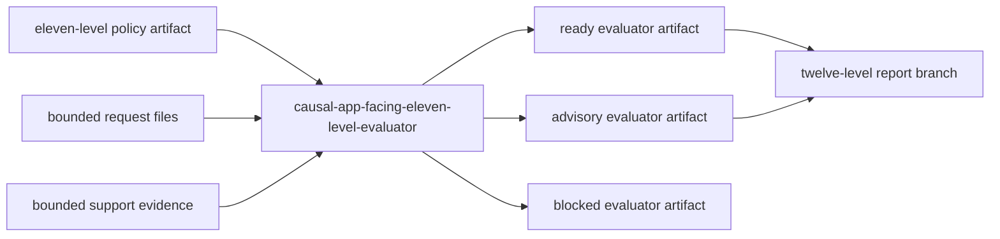

# Zigeffect App-Facing Eleven-Level Evaluator Design

## Context

The app-facing ladder has delivered the eleven-level report, eleven-level
application boundary, and eleven-level policy milestones. The current branch,
`codex/zigeffect-causal-app-facing-eleven-level-evaluator`, is the next approved
roadmap slice. It should keep master visible for other agents while continuing
the sequential causal self-improvement work on a short feature branch.

The existing ten-level evaluator is the stable implementation pattern. It
consumes an approved policy artifact, classifies bounded request and support
files, emits ready, advisory, or blocked findings, carries source lineage, and
hands ready/advisory artifacts to the next report branch. The eleven-level
evaluator should do the same for the eleven-level policy.

## Goal

Build `causal-app-facing-eleven-level-evaluator`, a local read-only evaluator
that consumes approved eleven-level policy evidence and emits an eleven-level
evaluator artifact for the twelve-level report branch.

## Non-Goals

- No mutation authority.
- No CI enforcement, required status checks, workflow edits, GitHub API writes,
  public uploads, or app runtime integration.
- No live telemetry ingestion, network calls, NenDB writes, CockroachDB work, or
  durable backend expansion.
- No redesign of the broader evaluator architecture.

## Architecture

The tool will be an alias-named Zig producer under
`packages/zigeffect/tools/causal_app_facing_eleven_level_evaluator.zig`. It will
be promoted from `causal_app_facing_ten_level_evaluator.zig` and then retargeted
to the eleven-level policy schema, branch names, generated aliases, status
fields, and source lineage fields.

The output schema remains fully expanded:

```text
zigeffect.causal.app-facing-production-integration-ci-advisory-remediation-report-consumption-report-evaluation-report-evaluation-report-evaluation-report-evaluation-report-evaluation-report-evaluation-report-evaluation-report-evaluation-report-evaluation-report-evaluation-report-evaluation-report-evaluator.v1
```

The input policy schema is the matching eleven-level policy schema:

```text
zigeffect.causal.app-facing-production-integration-ci-advisory-remediation-report-consumption-report-evaluation-report-evaluation-report-evaluation-report-evaluation-report-evaluation-report-evaluation-report-evaluation-report-evaluation-report-evaluation-report-evaluation-report-evaluation-report-policy.v1
```

## Behavior

The evaluator must:

- Accept `--from-policy <path>` plus `evaluate`.
- Require the source artifact to match the eleven-level policy schema.
- Treat approved, ready, no-mutation source policy evidence as eligible.
- Classify bounded local request/support files by existing evaluator rules.
- Emit `ready` when source evidence is approved and required request/support
  evidence is usable.
- Emit `advisory_findings` when the source policy is eligible but support
  evidence is missing or incomplete.
- Emit `blocked` when policy schema, policy decision, mutation authority,
  source readiness, denied files, or source lineage checks fail.
- Preserve `source_eleven_level_*`, `source_ten_level_*`, and
  `source_nine_level_*` lineage fields for downstream agents.
- Hand ready or advisory artifacts to
  `codex/zigeffect-causal-app-facing-twelve-level-report`.

## Data Flow



## Files

- Create `packages/zigeffect/tools/causal_app_facing_eleven_level_evaluator.zig`.
- Create `packages/zigeffect/docs/app-facing-eleven-level-evaluator.md`.
- Modify `packages/zigeffect/build.zig`.
- Modify `packages/zigeffect/tools/causal_schema_governance.zig`.
- Modify `packages/zigeffect/tools/causal_production_hardening_backlog.zig`.
- Modify `docs/superpowers/specs/2026-06-08-zigeffect-causal-agent-runtime-master-roadmap.md`.

## Testing

The work uses a RED/GREEN cycle:

1. Add a minimal failing evaluator test that references the missing eleven-level
   evaluator file.
2. Promote the implementation from the ten-level evaluator and retarget it.
3. Run focused evaluator tests, build-step help output, schema governance tests,
   production backlog tests, artifact generation probes, and project-wide Zig
   and Bun checks.

## Success Criteria

- The eleven-level evaluator tool exists and passes its focused Zig tests.
- `zig build causal-app-facing-eleven-level-evaluator -- --help` succeeds.
- Ready, advisory, and blocked evaluator artifacts can be generated from current
  local causal artifacts.
- Schema governance registers the new evaluator schema.
- The production hardening backlog recommends the twelve-level report branch.
- The master roadmap marks eleven-level evaluator delivered and lists
  twelve-level report as next.
