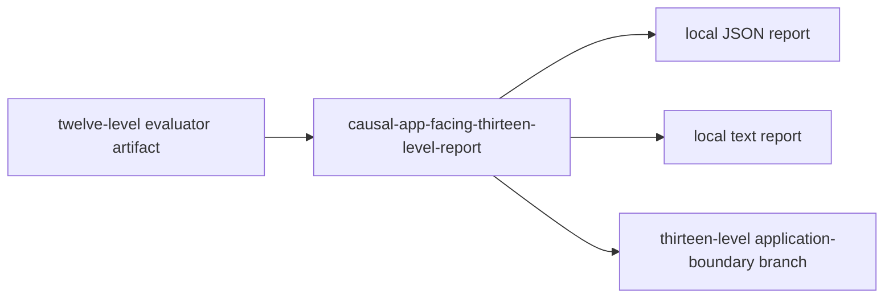

# Zigeffect Causal App-Facing Thirteen-Level Report Design

## Goal

Build `causal-app-facing-thirteen-level-report`, a local read-only report
producer that consumes ready or advisory twelve-level evaluator artifacts and
emits bounded thirteen-level report artifacts for agents, reviewers,
non-blocking CI advisory readers, and the local SolidJS WebUI workbench.

This rung advances the app-facing causal chain without adding CI enforcement,
GitHub mutation, app mutation, runtime integration, deployment authority,
production claims, Nendb writes, Nendb adapter execution, public uploads,
hosted dashboards, auto-apply behavior, or mutation authority.

## Source Contract

The source artifact is a twelve-level evaluator emitted by
`causal-app-facing-twelve-level-evaluator`:

```text
zigeffect.causal.app-facing-production-integration-ci-advisory-remediation-report-consumption-report-evaluation-report-evaluation-report-evaluation-report-evaluation-report-evaluation-report-evaluation-report-evaluation-report-evaluation-report-evaluation-report-evaluation-report-evaluation-report-evaluation-report-evaluator.v1
```

The report accepts only source artifacts with schema version `1`, status
`ready` or `advisory-findings`, no blocked findings, `ready_for_next_branch =
true`, and mutation authority disabled. Blocked evaluator artifacts remain
useful as negative fixtures but must produce a blocked thirteen-level report.

The source parser must preserve:

- Direct twelve-level evidence:
  `source_twelve_level_policy`, `source_twelve_level_application_boundary`,
  `source_twelve_level_report`, their schemas, statuses, after digest/presence,
  and `source_twelve_level_application_changes`.
- Eleven-level, ten-level, and nine-level lineage.
- Older inherited lower-rung fields required by existing app-facing report
  consumers.
- Request files, support evidence, source request/support summaries, source
  checks, source signals, findings, denied claims, next queries, agent guidance,
  and publication channel ids.

## Output Contract

The tool emits:

```text
zigeffect.causal.app-facing-production-integration-ci-advisory-remediation-report-consumption-report-evaluation-report-evaluation-report-evaluation-report-evaluation-report-evaluation-report-evaluation-report-evaluation-report-evaluation-report-evaluation-report-evaluation-report-evaluation-report-evaluation-report-evaluation-report.v1
```

The short command is:

```bash
zig build causal-app-facing-thirteen-level-report -- --from-evaluator <twelve-level-evaluator.json> summarize --reason <reason> [--by <actor>] [--policy <policy>] [--out-prefix <path-prefix>]
```

Default output path rewriting replaces
`-ci-twelve-level-evaluator.json` with `-ci-thirteen-level-report`.
Long file names compact to `app-facing-ci-thirteen-level-report-<digest>`.

The output includes:

- `generated_by = causal-app-facing-thirteen-level-report`
- `source_branch = codex/zigeffect-causal-app-facing-thirteen-level-report`
- `recommendation = start-app-facing-thirteen-level-application-boundary`
- `next_branch_if_ready =
  codex/zigeffect-causal-app-facing-thirteen-level-application-boundary`
- `source_twelve_level_evaluator`, `source_twelve_level_evaluator_schema`,
  and `source_twelve_level_evaluator_status`
- Direct twelve-level source evidence and eleven/ten/nine lineage
- Ready/advisory/blocked checks and findings
- Local-only publication channels
- The required verification command list

## Status Rules

The report status is:

- `blocked` when any source check fails.
- `advisory` when all checks pass and the evaluator status is
  `advisory-findings`, the advisory count is non-zero, or advisory findings are
  present.
- `ready` when all checks pass and no advisory evidence is present.

Only ready or advisory reports may hand off to the thirteen-level
application-boundary branch. Blocked reports are stop signs.

## Architecture

The implementation follows the existing report producer pattern in
`packages/zigeffect/tools/causal_app_facing_twelve_level_report.zig` with one
important correction: direct source evidence shifts from eleven-level fields to
twelve-level fields. The thirteen-level report must not invent
`source_thirteen_level_*` inputs because the consumed source is a twelve-level
evaluator.



## Files

- Create `packages/zigeffect/tools/causal_app_facing_thirteen_level_report.zig`.
- Modify `packages/zigeffect/build.zig` to add the executable, short build
  step, and tests.
- Add `packages/zigeffect/docs/app-facing-thirteen-level-report.md`.
- Modify `packages/zigeffect/tools/causal_schema_governance.zig` to register
  the thirteen-level report schema.
- Modify `packages/zigeffect/tools/causal_production_hardening_backlog.zig` to
  mark the report delivered and recommend the thirteen-level application
  boundary.
- Modify
  `docs/superpowers/specs/2026-06-08-zigeffect-causal-agent-runtime-master-roadmap.md`
  to mark item 114 delivered and add item 115.

## Verification

The milestone is complete only when these commands pass from current state:

```bash
cd packages/zigeffect
zig test tools/causal_app_facing_thirteen_level_report.zig
zig build causal-app-facing-thirteen-level-report -- --help
zig test --dep causal_artifact -Mroot=tools/causal_schema_governance.zig -Mcausal_artifact=tools/causal_artifact.zig
zig test tools/causal_production_hardening_backlog.zig
zig build causal-schema-governance -- --format json
zig build causal-production-hardening-backlog -- --format json
zig build examples
zig build test
cd ../..
bun run check
bun run zig:test
git diff --check
```

The generated ready, advisory, and blocked artifacts must be written under
`.zig-cache/causal-artifacts/` and parse as JSON.
