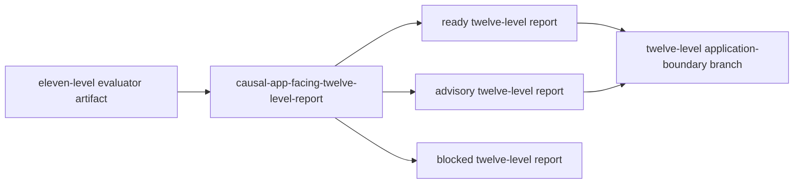

# Zigeffect App-Facing Twelve-Level Report Design

## Context

The eleven-level evaluator now emits ready, advisory, and blocked local
evaluator artifacts from approved eleven-level policy evidence plus bounded
request and support evidence. Those artifacts are interpretation evidence only:
they do not grant CI, GitHub, app runtime, storage, deployment, public upload,
production-health, auto-apply, registry, or mutation authority.

This milestone adds the matching twelve-level report producer. It consumes a
ready or advisory eleven-level evaluator artifact, summarizes the next
`evaluation-report` layer for agents, reviewers, non-blocking CI advisory
readers, and the local SolidJS `webui-dev/zig-webui` workbench, then hands off
to the twelve-level application-boundary branch.

## Goal

Build `causal-app-facing-twelve-level-report`, a local read-only report producer
that consumes eleven-level evaluator evidence and emits twelve-level report
artifacts with complete eleven, ten, and nine-level lineage.

## Non-Goals

- No mutation authority.
- No CI enforcement, required status checks, workflow edits, GitHub API writes,
  public uploads, app runtime integration, or app data/config mutation.
- No live telemetry ingestion, network calls, NenDB writes, NenDB adapter
  execution, Cockroach scope, or durable backend expansion.
- No redesign of the report ladder.

## Architecture

The tool will be an alias-named Zig producer under
`packages/zigeffect/tools/causal_app_facing_twelve_level_report.zig`. It will be
promoted from `causal_app_facing_eleven_level_report.zig` and retargeted to:

- consume the eleven-level evaluator schema;
- emit the twelve-level report schema;
- preserve direct eleven-level evaluator lineage before inherited ten and
  nine-level lineage;
- hand ready/advisory artifacts to
  `codex/zigeffect-causal-app-facing-twelve-level-application-boundary`.

The emitted schema is:

```text
zigeffect.causal.app-facing-production-integration-ci-advisory-remediation-report-consumption-report-evaluation-report-evaluation-report-evaluation-report-evaluation-report-evaluation-report-evaluation-report-evaluation-report-evaluation-report-evaluation-report-evaluation-report-evaluation-report-evaluation-report.v1
```

The consumed evaluator schema is:

```text
zigeffect.causal.app-facing-production-integration-ci-advisory-remediation-report-consumption-report-evaluation-report-evaluation-report-evaluation-report-evaluation-report-evaluation-report-evaluation-report-evaluation-report-evaluation-report-evaluation-report-evaluation-report-evaluation-report-evaluator.v1
```

## Behavior

The report must:

- Accept `--from-evaluator <path>` plus `summarize`.
- Require source schema version 1 and the eleven-level evaluator schema.
- Treat source `evaluation_status=ready` as ready report evidence.
- Treat source `evaluation_status=advisory-findings` as advisory report evidence
  that remains eligible for local review handoff.
- Treat blocked evaluator evidence, schema drift, authority drift, or missing
  required lineage as blocked report evidence.
- Preserve `source_eleven_level_*`, `source_ten_level_*`, and
  `source_nine_level_*` fields in the report artifact.
- Keep all authority flags disabled and `mutation_authority=none`.

## Data Flow



## Files

- Create `packages/zigeffect/tools/causal_app_facing_twelve_level_report.zig`.
- Create `packages/zigeffect/docs/app-facing-twelve-level-report.md`.
- Modify `packages/zigeffect/build.zig`.
- Modify `packages/zigeffect/tools/causal_schema_governance.zig`.
- Modify `packages/zigeffect/tools/causal_production_hardening_backlog.zig`.
- Modify `docs/superpowers/specs/2026-06-08-zigeffect-causal-agent-runtime-master-roadmap.md`.

## Testing

The milestone uses a RED/GREEN cycle:

1. Add a minimal failing twelve-level report constants test.
2. Promote the eleven-level report implementation and retarget it.
3. Run focused report tests, build-step help, schema governance tests,
   production backlog tests, artifact generation probes, and project-wide Zig
   and Bun checks.

## Success Criteria

- The twelve-level report tool exists and passes focused Zig tests.
- `zig build causal-app-facing-twelve-level-report -- --help` succeeds.
- Ready, advisory, and blocked twelve-level report artifacts can be generated
  from the current eleven-level evaluator artifacts.
- Schema governance registers the twelve-level report schema.
- The production hardening backlog recommends the twelve-level
  application-boundary branch.
- The master roadmap marks twelve-level report delivered and lists
  twelve-level application-boundary as next.
