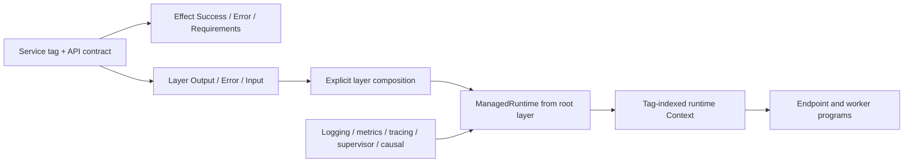

# ZigEffect Canonical Application Architecture

Date: 2026-07-15
Status: accepted breaking direction; kernel migration in progress

## Decision

ZigEffect will use the same architectural separation that makes Effect
applications composable:

- a service is a stable tag plus an abstract API shape;
- an effect describes a program and carries only its required service tags;
- a context stores implementations by tag at runtime;
- a layer constructs services and exposes `Output`, `Error`, and `Input` in its
  type;
- a managed runtime builds one complete layer graph, owns its resources, and
  executes many programs against the resulting context; and
- logging, metrics, tracing, supervision, and causal evidence are runtime
  aspects, so structural visibility is automatic.

Compatibility with the current environment-coupled API is not a constraint.
The migration may be staged internally, but no compatibility adapter may
become part of the final application model.

This replaces the earlier additive `Program -> ServiceEnv -> Effect` facade.
That facade demonstrated the desired entry-point ergonomics but retained the
wrong dependency model underneath it.

## Why the Current Kernel Must Change

The current primary types are:

```zig
Effect(Success, Failure, Env)
Context(Env)
Layer(Env)
Runtime(Env)
```

They force one concrete environment type into effects, combinators, fibers,
layers, streams, workflows, tests, and application roots. Services are found
through an environment-specific `service` method, and layer graphs construct a
tuple of environment pointers. This causes five architectural failures:

1. An effect is coupled to a concrete implementation container rather than a
   set of abstract requirements.
2. Service identity is structural and position-dependent rather than a stable
   tag in a runtime context.
3. Layer construction dependencies leak into application environments.
4. Reusing a layer value does not provide reference-identity memoization.
5. Observability services and causal recording are manually threaded instead
   of installed by the runtime.

Automatic projection and narrower environment tuples reduce boilerplate but
cannot fix those failures. The kernel boundary itself must move.

## Canonical Type Model



### Service tags and contracts

`Service(key, API)` creates a tag type. The key is an explicit stable string,
not an inferred tuple position or an application environment field.

```zig
pub const PokeApi = fx.Service("pokemon/PokeApi", struct {
    context: *anyopaque,
    get_pokemon: *const fn (*anyopaque, u16) GetPokemon,

    pub fn getPokemon(self: *@This(), id: u16) GetPokemon {
        return self.get_pokemon(self.context, id);
    }
});
```

Every tag exposes its key and service type. Context insertion validates that a
key is not reused for a different service type. Duplicate service providers
are rejected unless an explicit override combinator is used.

Contracts do not import live implementations. A live, fake, or test layer can
provide the same tag without changing programs.

### Runtime context and requirements-limited views

The runtime owns one non-generic, tag-indexed `Context`. It is an immutable
service registry after startup plus per-run execution state: allocator, scope,
fiber locals, default-service overrides, trace lineage, causal lineage,
executor, and runtime aspects.

Application effect functions do not receive unrestricted access to that
registry. `Effect(A, E, R).Context` is a typed view whose `service(Tag)` method
compiles only when `Tag` is in `R`. This prevents a function from accessing an
undeclared dependency while allowing any runtime whose context contains `R` to
execute it.

```zig
const GetPokemon = fx.Effect(Pokemon, GetError, .{PokeApi});

const get_pokemon = GetPokemon.fromFn(struct {
    fn run(ctx: *GetPokemon.Context) GetError!Pokemon {
        return try ctx.service(PokeApi).getPokemon(25).run(ctx.with(.{}));
    }
}.run);
```

Requirements are declared once. Combinators union and subtract requirement
sets at compile time. The concrete runtime context is never part of an effect
type.

### Layers are constructors, not service containers

A layer has the conceptual type:

```text
Layer<Output, Error, Input>
```

- `Output` is the set of service tags the layer constructs.
- `Error` is its typed acquisition failure.
- `Input` is the set of services needed to construct it.

Construction dependencies do not leak into the operations of the output
service. For example, a database layer may require configuration and logging
to acquire a pool, while programs using the database require only the database
tag.

Canonical constructors are:

- `Layer.succeed(Tag, value)` for an existing implementation;
- `Layer.sync(Tag, R, make)` for synchronous construction;
- `Layer.effect(Tag, Error, R, acquire)` for effectful construction; and
- `Layer.scoped(Tag, Error, R, acquire, release)` for runtime-owned resources.

### Layer composition is explicit

`Layer.mergeAll` merges outputs and inputs. It does not silently use a sibling
layer's output to satisfy another sibling's input.

`Layer.provide(dependent, dependency)` explicitly wires dependency outputs into
dependent inputs and hides those dependency outputs from the composed layer's
public output. `Layer.provideMerge` keeps both outputs public.

This distinction makes package boundaries and construction topology visible in
types and causal graphs.

```zig
const ConfigLive = Config.live();
const DatabaseLive = Database.live();
const RepositoryLive = TodosRepository.live();

const DatabaseReady = fx.Layer.provide(DatabaseLive, ConfigLive);
const RepositoryReady = fx.Layer.provide(RepositoryLive, DatabaseReady);
const MainLayer = fx.Layer.mergeAll(.{ RepositoryReady, HttpServer.live() });
```

### Layer memoization follows layer identity

Every leaf layer value has a runtime identity. Copying and reusing that value
preserves the identity; calling its constructor again creates a fresh identity.
The managed runtime owns a memo table and acquires each identity at most once.

```zig
const database_live = Database.live();
const app = fx.Layer.mergeAll(.{
    fx.Layer.provide(Repository.live(), database_live),
    fx.Layer.provide(Health.live(), database_live),
});
```

`database_live` is acquired and finalized once. Memoization is scoped to a
managed runtime and ends when that runtime is disposed. It is never keyed only
by output service type or build-function pointer, because differently
configured instances of the same layer must remain distinct.

### Runtime and ManagedRuntime

An effect is inert program data. A runtime interprets it, manages fibers and
scopes, supplies default services, applies aspects, and records causal
structure.

`Runtime` is the low-level interpreter constructed from an existing context.
Most applications use `ManagedRuntime.make(MainLayer)`. It:

1. validates that the root layer has no unsatisfied inputs;
2. builds and memoizes the layer graph once;
3. owns the application scope and acquired resources;
4. exposes `run`, `exit`, and asynchronous/fiber entry points;
5. creates a child run scope for every endpoint, job, or command;
6. executes any effect whose requirements are a subset of its public output;
   and
7. drains fibers and finalizes the graph once during disposal.

The managed runtime owns a heap-stable `RuntimeCore`. A running effect can
derive `RuntimeHandle(R)` from its requirements-limited context. The handle can
execute only effects whose requirements are a subset of `R`, and every call
opens a fresh child run scope. This is the bridge used by long-lived server,
worker, watch, and subscription effects: they retain one stable handle and run
each incoming RPC, job, change, or message without rebuilding the application
layer graph.

Runtime handles inherit lexical default-service overrides and causal lineage.
They do not expose unrestricted registry lookup and do not own application
resources; disposal remains exclusively owned by `ManagedRuntime`.

An HTTP or gRPC server therefore creates one runtime at process startup and
uses it for every handler. Endpoint code never calls `Effect.provide` and never
rebuilds `MainLayer` per request.

### Default services and scoped overrides

Platform-wide capabilities such as Clock, ConfigProvider, Console, Random, and
Tracer use reference semantics rather than ordinary service requirements. A
reference has a stable key, a runtime-owned default value, and an optional
fiber-local override. Accessing a reference does not add an ordinary
application requirement.

Defaults that need Zig platform capabilities are constructed once from the
process boundary (`std.Io`, environment, and allocator) and installed in the
managed runtime. Deterministic tests install a complete test-default bundle.
The kernel must not hide ambient process access inside domain services.

Tests and nested programs can override a default for a lexical or resource
scope. Overrides are fiber-local, inherited on fork, and restored when the
scope ends. They do not mutate the shared managed runtime context.

Domain services and external adapters are not defaults. They remain explicit
layer outputs and effect requirements.

### Runtime aspects and causal observability

Logging, metrics, tracing, supervision, and causal evidence are installed on
the runtime as aspects/interceptors. The interpreter emits lifecycle events at
these boundaries:

- runtime initialization and disposal;
- layer validation, acquisition, memo hit, failure, and finalization;
- service provision, override, and access;
- effect start, success, typed failure, defect, and interruption;
- scope open/close and resource acquisition/finalization;
- fiber fork/start/suspend/resume/join/interruption;
- schedule decisions and external I/O boundaries.

The causal aspect converts those events into the existing bounded causal
store. Logger, metrics, tracer, and supervisor aspects consume the same
interpreter lifecycle without application programs requesting them manually.
Domain programs add only semantic facts such as policy decisions or entity
transitions.

## Service Definition Ergonomics

After the kernel constructors are stable, a Zig-native service helper will
allow a module to declare its tag, implementation constructor, dependencies,
and default layer together. The expanded form remains available for advanced
cases.

```zig
pub const PokeApi = fx.Service.define(.{
    .key = "pokemon/PokeApi",
    .API = Api,
    .Implementation = Live,
    .dependencies = .{ HttpClient.Default, Config.Default },
});

const MainLayer = fx.Layer.mergeAll(.{PokeApi.Default()});
```

`Default()` includes declared construction dependencies.
`DefaultWithoutDependencies()` exposes them in the layer input, making root
wiring explicit when desired.

## Application Shape

```text
domain/       schemas, typed errors, service/API contracts
services/     implementations and live/test layers
transport/    gRPC/HTTP handlers and client layers
app/          root layer, ManagedRuntime, one process entry point
```

Small projects may use directories rather than packages. The dependency
direction is the invariant: contracts never import live implementations;
implementations introduce dependencies through layers; the application root
composes them once.

## Retained and Replaced

Retained and adapted:

- `Exit`, `Cause`, scopes, finalizer ordering, and safe resources;
- scheduler, fiber runtime, executor, coordination, and fiber locals;
- causal store, causal backends, graph queries, and redaction;
- Testing v2, deterministic backends, receipts, and replay;
- workflow, statechart, and cluster domain contracts where they are independent
  of `Context(Env)`.

Replaced:

- `Effect(A, E, Env)` and environment-equality assertions;
- `Context(Env)` and environment-specific `service` methods;
- `ServiceEnv`, environment projection, and tuple-indexed resolution;
- `Layer(Env)`, provider tuples, and `LayerGraphEnv`;
- `Runtime(Env)` and per-program `provides(...)` metadata;
- manual structural causal recording in application-facing APIs.

## Migration Policy

The new kernel is implemented and tested independently first. During the
repository migration, old internals may remain under an explicitly legacy
namespace so unaffected subsystems continue to compile. There is no conversion
bridge between old effects/layers and new effects/layers. First-party packages
move to the new kernel by rewriting their contracts and composition roots.
When the first-party migration completes, legacy dependency machinery is
deleted.

Migration order:

1. canonical kernel and reference application;
2. standard library and project scaffold;
3. native gRPC and gRPC-web application boundaries;
4. Ziac planner/provider/runtime composition;
5. product applications one vertical domain at a time;
6. remove the legacy kernel and compatibility tests.

## Acceptance Criteria

1. `Effect(A, E, R)` contains no concrete environment type.
2. An effect cannot access a service absent from `R`.
3. The same effect runs unchanged against live and fake layers.
4. Layer types expose output, error, and input sets.
5. `mergeAll` and `provide` have distinct, tested semantics.
6. Reusing one layer value in multiple branches acquires and finalizes it once.
7. A managed runtime builds the root graph once and runs multiple programs.
8. A long-lived effect can derive a requirements-limited runtime handle and run
   multiple child programs in independent scopes.
9. Managed runtime disposal drains/finalizes application resources exactly once.
10. Default services require no ordinary layer and support scoped overrides.
11. Structural layer/service/effect/scope/fiber facts are emitted automatically.
12. A reference server uses one root layer and one runtime with multiple
    handlers and no per-handler provision.
13. Testing v2 receipts are complete with no pending tests, leaks, or logged
    errors.

## Non-goals

- Copying TypeScript syntax or generator notation.
- Making untyped runtime lookup the normal application API.
- Hiding allocator ownership, queue bounds, pool bounds, or shutdown policy.
- Treating every low-level driver as a domain service.
- Preserving the current public dependency API.
- Adding report-only tools or new causal tooling instead of runtime behavior.

## Reference Model

The architectural semantics are derived from Effect's official documentation:

- [Managing Services](https://effect.website/docs/requirements-management/services/)
- [Default Services](https://effect.website/docs/requirements-management/default-services/)
- [Managing Layers](https://effect.website/docs/requirements-management/layers/)
- [Layer Memoization](https://effect.website/docs/requirements-management/layer-memoization/)
- [Logging](https://effect.website/docs/observability/logging/)
- [Metrics](https://effect.website/docs/observability/metrics/)
- [Tracing](https://effect.website/docs/observability/tracing/)
- [Supervisor](https://effect.website/docs/observability/supervisor/)

The current Effect implementation is checked in as the read-only git submodule
`packages/references/effect`. The migration uses the implementation as an
executable architectural reference, not as a source dependency. At the pinned
revision inspected on 2026-07-15:

- `Context.Reference` lazily caches a default and lets a fiber context carry an
  override without adding a service requirement;
- Clock, ConfigProvider, Console, Random, and Tracer are references;
- `ManagedRuntime` owns a closeable root scope, a layer scope, and one memo map,
  caches the built context, and runs every program as a child fiber in the root
  scope; and
- `Layer.MemoMap` keys by layer object identity and reference-counts observers
  so a shared layer's finalizer runs only when its last scope releases it.

ZigEffect follows those semantics while keeping Zig ownership explicit:
defaults are runtime-owned rather than process-global mutable singletons, and
platform handles enter through the single application boundary.

The TypeOnce layer course supplied the developer-teaching sequence used to
evaluate ergonomics, especially separate service definitions, dependencies in
implementations, explicit `provide` versus `mergeAll`, layer reuse, and the
combined service/default-layer declaration pattern.
