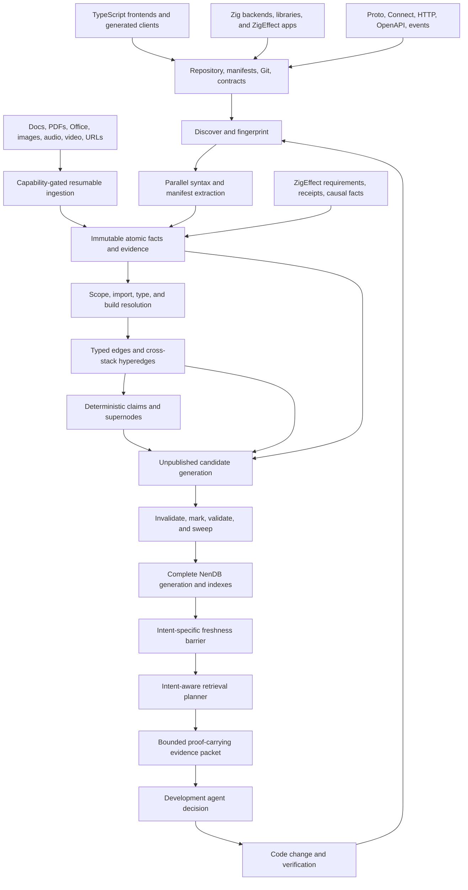
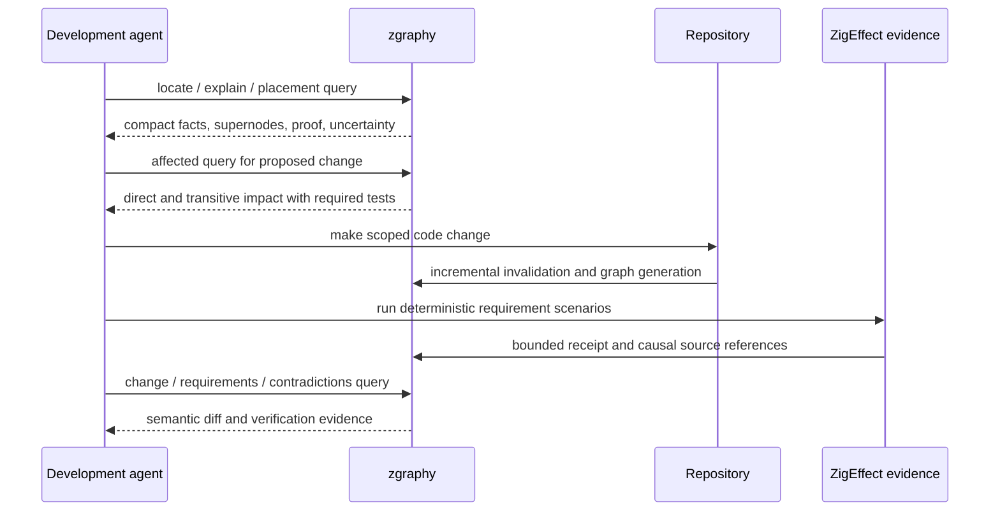

# zgraphy agent-first roadmap

Status: active implementation; M0 and M1 complete, M2 active

Last updated: 2026-07-16

Reference baseline: Graphify commit `cb96bdaa0c367bec8d5c5aee5d7c9ebb727e9780`

Execution status: M0 comparative truth and M1 universal init/workspace graph
are implemented, and M2 has advanced through 20 requirement-backed controlled
scenarios. M1 now has
opaque persistent repository identity, config-v1 migration to config-v2,
bounded no-follow universal discovery, nested ignore precedence, typed terminal
outcomes, safe mixed-language placement, six manifest adapter families, nested
repository boundaries, deepest explicit ownership, deterministic redacted
content/health publication, effective-config authority, and read-only doctor
freshness diagnostics. Deep parser-backed Zig and TypeScript contract semantics
begin in M2.1 with a Zig 0.16 compiler-AST boundary that emits exact structural
spans, rejects malformed partial facts, removes comment/string false positives,
and now feeds the compatibility graph indexer without changing stable IDs.
M2.2 adds compiler-AST import and local-binding facts, normalized exact import
targets, function-level scope resolution, deterministic source-qualified call
candidate sets, explicit resolved/ambiguous/unresolved outcomes, and graph
`dispatches_to` evidence. The Zig ambiguity fixture now retains both function-
value candidates and projects all canonical entities, relations, and the
ambiguity fact; block/type/build-aware resolution remains later M2 work.

`zgraphy parity` validates and exposes the embedded
`src/graphify-parity.v1.json` ledger for all 17 reviewed Graphify capability
families. `zgraphy benchmark corpus` validates the engine-neutral canonical IR
and source-hashed Zig, TypeScript, Proto, ambiguity, supernode, retrieval, and
mutation/pruning gold fixtures. The pinned Graphify 0.9.17 adapter and local-only
runner now project live reference outputs into bounded, redacted differential
receipts. The native zgraphy adapter now projects the same gold identities from
its in-memory graph while preserving internal-only output as projection loss.
The bounded lexical adapter supplies the `rg`-class cross-language orientation
floor without semantic claims. The `zgraphy.quality-matrix.v1` aggregator now
runs all nine engine/fixture comparisons, recomputes weighted totals, binds the
result to exact corpus, source, Graphify environment, and Zig toolchain
identities, and emits no superiority claim. The M0 resource/freshness slice now
has paired process supervision, retained integer samples, full-build versus
clean-build mutation fingerprints, snapshot reload checks, and explicit graph
health accounting. Its current baseline proves clean full-rebuild pruning but
records failed rename identity and semantic invalidation targets plus
unsupported incremental/pre-query automation. The schema-v2 ontology and
operational contracts are now embedded, content-addressed, strictly validated,
and inspectable through the CLI. Snapshot v1 remains readable while the M1
identity-and-bounds subset of config-v2 is active; broader provider authority,
conformance, advanced health dimensions, diagnostics, and rollback-safe
generation migration remain contract-only. A content-addressed threat
catalog now binds the pinned Graphify security references and assigns all 20
initial threats to controls, honest fixture evidence states, residual risk, and
milestone owners. The evaluation contract and exit scenario close the final M0
receipt-schema and evidence audit without promoting schema-only capabilities.

## Executive outcome

zgraphy will be a local-first, Zig-native semantic repository engine built for
development agents before it is built for visual exploration. A user should be
able to install the CLI, run `zgraphy init` in an unfamiliar repository, and
quickly obtain a durable graph that answers:

- what exists, where it lives, and which build or application boundary owns it;
- how files, symbols, types, APIs, data, tests, requirements, and runtime facts
  relate;
- why a relationship is believed, exactly which source evidence supports it,
  and how fresh that evidence is;
- which subsystem, feature, workflow, or service a piece of code participates
  in;
- where new code should be placed and what a proposed change could affect; and
- which compact evidence packet an agent needs next, without flooding its
  context with a repository dump.

Zig is the deepest first-class language and the implementation language of the
engine, but zgraphy is not a Zig-only repository analyser. TypeScript and
JavaScript frontends are an early first-class boundary. The initial full-stack
target is a proof-carrying path from a browser callsite through generated
Connect/Protobuf or HTTP clients and their schema contracts into Zig handlers,
services, effects, persistence, tests, requirements, and runtime evidence.

The product is not primarily a graph viewer, report generator, or embedding
wrapper. Its core product is a fast, inspectable, proof-carrying repository
model that makes coding agents more accurate while using less time, memory, and
context.

This roadmap is a sequence of evidence gates, not a claim that the future
capabilities already exist. The current MVP proves the Zig, NenDB, CLI, hybrid
retrieval, snapshot, and ZigEffect integration shape. Each later milestone must
earn its status through deterministic ZigEffect test receipts and comparative
benchmarks against the pinned Graphify reference.

## North star

The north-star workflow is:

1. Install one native executable.
2. Run `zgraphy init` from any repository or monorepo root.
3. Discover repository, workspace, package, application, build, source, test,
   requirement, and configuration boundaries without requiring a model.
4. Build a source-grounded graph with stable identities, exact locations,
   typed relationships, provenance, confidence, and freshness.
5. Connect frontend callsites and data use to backend contracts,
   implementations, effects, and stores across language boundaries.
6. Materialise higher-order meaning as explainable supernodes and hyperedges.
7. Persist topology, properties, indexes, vectors, and generations locally in
   a NenDB-derived store.
8. Answer agent queries through compact, versioned evidence packets.
9. Detect staleness automatically, incrementally update only affected graph
   regions, prune invalidated/orphaned data, and repair indexes before queries
   consume them.
10. Connect repository structure to ZigEffect requirements, tests, causal
   execution evidence, and agent decisions through stable source references.
11. Add visual exploration only after the headless engine meets its quality,
    speed, scale, and agent-task gates.

## Product priorities

The order is deliberate and governs trade-offs throughout implementation.

1. Agent answer quality. The returned facts must help an agent make a correct
   development decision.
2. Semantic fidelity. A relationship must preserve direction, type, scope,
   evidence, ambiguity, and source location.
3. Explainability. Every derived meaning must expose a proof path back to
   source, manifest, build, Git, or runtime observations.
4. Freshness and self-maintenance. A smaller current graph is more valuable
   than a larger stale graph, and users must not need to remember maintenance
   commands.
5. Determinism. The default build must require no network or model and must be
   reproducible from the same inputs and toolchain.
6. Latency and memory. Native execution must translate into materially faster
   builds, updates, and queries with a smaller resident and persisted footprint.
7. Context efficiency. Results must spend an agent's token budget on evidence,
   not prose or duplicated metadata.
8. Breadth. Language and artefact coverage follows a sound extractor and
   resolver architecture; grammar count alone is not success.
9. Human interfaces. Reports and visualisation come after the agent-facing
   engine is trustworthy.

## What “agent-first” means

A graph is agentically useful only when it changes the quality or cost of a
development action. Node and edge counts are not sufficient.

An agent-first zgraphy build must support these decision classes:

- Orientation: identify applications, entry points, packages, services,
  important boundaries, public APIs, and tests.
- Placement: identify the owning component and neighbouring patterns for a new
  symbol, route, schema, service, or test.
- Explanation: explain a symbol or subsystem in terms of responsibility,
  callers, dependencies, data touched, requirements, and proof.
- Navigation: locate exact source spans and traverse typed, directed paths.
- Change planning: identify callers, consumers, tests, manifests, generated
  contracts, and runtime paths affected by a change.
- Causal debugging: connect a failed requirement or runtime causal fact back to
  source and from source to likely responsible dependencies.
- Review: compare graph generations, expose semantic additions and removals,
  and distinguish intended changes from suspicious graph drift.
- Verification: identify the acceptance checks and evidence required before a
  change can be called complete.

The default answer should be the smallest evidence set that supports the next
decision. The agent can request expansion, but zgraphy should not make a caller
parse a whole graph or long report to discover three relevant facts.

## Current baseline

### What the MVP proves

The current `0.1.0` package already establishes:

- a native Zig CLI with `init`, `build`, `ingest`, `query`, `explain`, `path`,
  and `status`;
- bounded repository walking and ignore handling;
- initial Zig file, declaration, import, and call extraction;
- ZigEffect manifest and bounded causal-record ingestion;
- stable source references between repository and causal graphs;
- deterministic local feature vectors plus keyword and graph scoring;
- a NenDB-derived struct-of-arrays topology and transactional JSONL snapshot;
- versioned machine output; and
- ZigEffect Testing v2 acceptance scenarios and ReleaseSafe evidence.

This is a strong architectural spike, but not yet the semantic engine described
by the north star.

### Material gaps to close

The current implementation still has important limitations:

- Zig extraction uses the compiler AST and a bounded evidence-preserving
  resolver, but is not yet a complete type/build/comptime semantic pipeline.
- Symbol identity is not yet rich enough for overloads, scopes, members,
  aliases, re-exports, generics, generated code, or cross-repository symbols.
- The schema has a small set of node and edge kinds and no first-class facts,
  source spans, evidence records, hyperedges, or materialised supernodes.
- Supported static Zig imports and function-value calls are exact and
  ambiguity-preserving; nested block, member/type, package/build, and generated
  identities still need deeper resolution.
- Builds are full snapshots; deletions, renames, branch changes, and one-file
  updates are not incremental graph transactions.
- Keyword scoring scans every node, vectors are exact fixed-width feature
  hashes, and graph reranking is only one-hop.
- The curated differential corpus exists, but its held-out Zig, TypeScript,
  Proto, supernode, retrieval, and mutation coverage must keep expanding.
- Query output ranks nodes but does not yet return a complete proof-carrying
  evidence packet.
- Non-Zig languages, deep build semantics, protocol identities, and repository
  federation currently have placement/ownership only or remain deferred.
- Visualisation is intentionally absent.

## Graphify leverage strategy

Graphify is the behavioural reference and competitive baseline. zgraphy should
lean heavily on its accumulated product lessons, fixtures, edge cases, and
failure history while implementing a native architecture suited to NenDB and
ZigEffect.

The rule is “parity before invention, evidence before superiority.” We will not
blindly translate Python or NetworkX code line by line. We will identify the
contract each Graphify subsystem has earned through use and tests, reproduce
that contract in a smaller native design, and then measure any improvement.

### Reference areas to study and preserve

- `graphify/detect.py` is the reference for classification, nested ignore
  handling, inclusion rules, sensitive-file filtering, symlink safety, content
  manifests, and incremental detection.
- `graphify/extract.py` and `graphify/extractors/engine.py` demonstrate a staged
  extractor engine, parallel per-file work, raw unresolved facts, and
  cross-language post-processing.
- `graphify/extractors/models.py` and `resolution.py` separate declarations,
  imports, aliases, exports, uses, and resolution from raw AST walking. zgraphy
  should preserve that separation with typed Zig values.
- `graphify/extractors/zig.py` supplies the minimum AST parity fixture for Zig.
  zgraphy must quickly exceed it in Zig-specific scope, type, build, and
  ZigEffect understanding.
- `graphify/ids.py` documents why one canonical identity specification must be
  shared by every producer. zgraphy should keep this invariant while using
  namespaced, collision-checked identities that survive moves where possible.
- `graphify/build.py` is the reference for validation, deduplication,
  hyperedges, merge behaviour, stale-node pruning, and cross-project
  namespacing.
- `graphify/cache.py`, `manifest.py`, and `watch.py` capture years of edge cases
  around content hashes, path normalisation, atomic cache writes, mixed change
  batches, deletion, rebuild locking, graph shrinkage, and worktrees.
- `graphify/cluster.py` and `analyze.py` provide community, hub, surprise,
  cycle, and graph-diff behaviours. zgraphy will treat these as candidate
  signals, not automatically as semantic truth.
- `graphify/affected.py` provides the baseline for typed reverse dependency
  walks and member seeding.
- `graphify/serve.py` provides useful query-token normalisation, trigram
  candidate pruning, bounded traversal, context filters, and compact subgraph
  output.
- `graphify/global_graph.py` supplies the cross-repository namespace and
  unchanged-graph skip baseline.
- `graphify/querylog.py` and `reflect.py` show how agent outcomes can form a
  learning overlay while checking staleness against current code.
- `graphify/validate.py`, `semantic_cleanup.py`, and `security.py` provide
  schema, sanitisation, size, path, and untrusted-content cases that should
  become typed native failures.
- `graphify/benchmark.py`, `BENCHMARKS.md`, and the test corpus provide the
  starting methodology for token, extraction, retrieval, and code-agent
  comparisons.
- Graphify's HTML, SVG, report, tree, and call-flow exporters are explicitly
  deferred until zgraphy's headless quality gate is met.

### Upstream discipline

The reference remains pinned and read-only. Updating it will be an explicit
maintenance task that:

1. records the old and new commits;
2. reviews upstream changelog entries and new regression tests;
3. classifies changes as parity requirement, useful idea, incompatible product
   choice, or visual-only work;
4. runs the differential corpus before and after the update;
5. updates attribution where adapted code or fixtures require it; and
6. never silently changes zgraphy's release benchmark baseline.

## Requirement catalogue and traceability

The roadmap needs stable requirement identities so implementation plans,
ZigEffect scenarios, benchmark rows, and release claims can point to the same
intent. These roadmap requirements are promoted into `zigeffect.project.json`
only when their implementation milestone becomes active; an unimplemented
roadmap item must not be marked satisfied in the executable manifest.

### `ZG-REQ-001` — Native local lifecycle

One native installation must support safe `init`, build, read-only query,
status, upgrade, rollback, and uninstall workflows without a daemon, container,
network, Python runtime, or API key.

Minimum evidence: clean-machine install smoke tests, idempotent init, schema
migration and rollback fixtures, and a complete ReleaseSafe receipt. First gate:
M1; stable gate: M11.

### `ZG-REQ-002` — Complete repository discovery

Every included, ignored, excluded, unsupported, sensitive, oversized,
unreadable, generated, vendored, or external-symlink input must be accounted
for with a bounded typed outcome. Nested ignore/include semantics must match Git
where claimed.

Minimum evidence: differential discovery corpus against Graphify and Git,
mutation tests for nested rules and symlinks, and zero silently vanished files.
First gate: M1.

### `ZG-REQ-003` — Stable portable identity

Repositories, files, scopes, symbols, contracts, facts, edges, hyperedges, and
supernodes require namespaced, collision-checked, Unicode-safe identities that
are deterministic across machines and idempotent across rebuilds and schema
migrations.

Minimum evidence: duplicate-filename, Unicode, long-path, case, worktree,
move/rename, legacy migration, and cross-repository property tests. First gate:
M0; production gate: M11.

### `ZG-REQ-004` — Proof-carrying semantic graph

Every trusted relationship or higher-order claim must retain direction, typed
participant roles, source or external evidence, provenance, freshness,
confidence where meaningful, candidate alternatives, and invalidation keys.

Minimum evidence: schema invariants, dangling-reference rejection, proof-path
validation, and no unsupported statement in an evidence packet. First gate:
M0; agent gate: M6.

### `ZG-REQ-005` — Deep Zig semantics

Zig extraction and resolution must cover repository placement, `build.zig`,
packages, modules, declarations, scopes, types, methods, imports, calls,
comptime, tests, generated bindings, and ZigEffect-specific intent more deeply
than Graphify's Zig support.

Minimum evidence: shared Graphify fixtures plus a larger curated Zig corpus,
compiler-informed gold facts, ambiguity tests, and measured quality/speed
leadership. First gate: M2.

### `ZG-REQ-006` — First-class TypeScript and JavaScript

Frontend extraction must cover workspace/package resolution, ESM, CommonJS,
path aliases, exports and re-exports, scopes, declarations, classes, types,
interfaces, decorators, routes, components, calls, member calls, callbacks,
queries, tests, and generated clients.

Minimum evidence: Graphify's TypeScript/JavaScript regression surface,
frontend-specific gold fixtures, and affected-query correctness. First gate:
M2; production-depth gate: M5.

### `ZG-REQ-007` — Frontend-to-backend contract continuity

TypeScript callsites must connect through canonical Proto/Connect, HTTP,
OpenAPI, event, or schema identities to Zig routes, handlers, services,
effects, stores, tests, requirements, and runtime evidence.

Minimum evidence: end-to-end Yachdee request-path fixtures and contract mutation
tests that return both frontend and backend impact. First gate: M2.

### `ZG-REQ-008` — Extensible language and artefact extraction

All first-party adapters must emit one typed intermediate fact model and pass
the same identity, source-span, containment, reference, ambiguity, mutation,
incremental, and resource-bound conformance suite.

Minimum evidence: Wave B/C/D adapter receipts and a declared unsupported-case
matrix. First gate: M5.

### `ZG-REQ-009` — Repository intent and external index adapters

Build manifests, package manifests, MCP configuration, project/solution files,
database schemas, Cargo metadata, SCIP/compiler indexes, generated contracts,
CI, deployment, and infrastructure descriptors must be ingestible as distinct
evidence providers with provider identity and freshness.

Minimum evidence: provider-specific fixtures, source-versus-provider conflict
tests, and no silent overwrite of canonical source facts. First gate: M1 for
manifests; broad gate: M5.

### `ZG-REQ-010` — Documentation, rationale, and rich corpus

Markdown, MDX, ADR/RFC references, doc links, package documentation, and code
rationale must join the code graph deterministically where possible. Optional
PDF, Office, Google Workspace, image, audio, video, URL, and live-system
ingestion must be bounded, provenance-preserving, cached, and explicitly
capability-gated.

Minimum evidence: deterministic document fixtures, converter provenance,
interrupted-ingestion recovery, uncovered-file reporting, and remote-boundary
receipts. First gate: M5 for text; optional rich-corpus gate: M10.

### `ZG-REQ-011` — Fresh incremental generations

One-file edits, exclusions, renames, deletions, branch switches, worktrees,
partial provider runs, interrupted semantic jobs, and mixed AST/semantic tiers
must produce the same canonical graph as a clean build without losing
out-of-scope facts.

Minimum evidence: clean-versus-incremental equivalence, crash recovery,
tier-aware invalidation, zero stale entities, and one-file latency targets.
First gate: M3.

### `ZG-REQ-012` — Meaning, communities, and supernodes

zgraphy must provide useful hubs, communities, cycles, differences,
cross-boundary signals, deterministic synopses, and typed supernodes while
keeping structural metrics and model labels separate from trusted meaning.

Minimum evidence: stable community remapping, hub-noise controls, supernode
member precision, proof validity, and agent ablations. First gate: M4.

### `ZG-REQ-013` — Bounded hybrid retrieval

Exact, lexical, fuzzy, vector, graph, hyperedge, supernode, temporal, Git, and
causal channels must be intent-planned and return compact proof-carrying results
with explicit budgets, truncation, uncertainty, and completeness.

Minimum evidence: held-out retrieval/path metrics, multilingual fixtures,
adversarial broad queries, packet faithfulness, latency, and allocation gates.
First gate: M6.

### `ZG-REQ-014` — Agent-native access

CLI JSON, MCP or equivalent protocol, in-process ZigEffect services, optional
agent instructions, and multi-project routing must expose the same versioned,
bounded, read-only query semantics.

Minimum evidence: schema equivalence across interfaces, hot-reload and missing-
graph tests, capability enforcement, and fixed-agent task improvements. First
gate: M7.

### `ZG-REQ-015` — Causal development evidence

Requirements, checks, test scenarios, assertions, receipts, runtime causal
facts, and repository source must connect through stable references without
merging repository and runtime ownership or persisting unsafe payloads.

Minimum evidence: requirement-to-failure-to-source fixtures, generation
freshness, redaction, and causal debugging ablations. First gate: M8.

### `ZG-REQ-016` — Change, history, and review intelligence

Local diffs, commits, branches, worktrees, pull requests, semantic graph
generations, and optional historical checkpoints must support affected,
compatibility, review-order, conflict, and evolution queries.

Minimum evidence: mutation recall/precision, empty no-change diffs, PR/worktree
fixtures, symbol-lineage tests, and review-agent improvement. First gate: M9.

### `ZG-REQ-017` — Cross-repository federation

Explicitly registered repository graphs must connect through stable package,
schema, service, event, and deployment identities without ID collisions,
absolute-path leakage, or unnecessary re-ingestion.

Minimum evidence: namespace, unchanged-repository, cross-repo path, removal,
and partial-failure tests. First gate: M11.

### `ZG-REQ-018` — Learning without truth corruption

Agent query outcomes may create a recency-weighted, provenance-bearing,
staleness-aware learning overlay, but feedback may not rewrite canonical source
facts or create an unmeasured self-reinforcing retrieval loop.

Minimum evidence: useful/dead-end/corrected fixtures, code-fingerprint
invalidation, exploration/propensity safeguards before ranking influence, and
overlay-off equivalence. First gate: M7.

### `ZG-REQ-019` — Interoperability and export

The canonical graph must support a versioned interchange form plus bounded
agent-oriented Markdown/wiki export and optional GraphML, Neo4j, FalkorDB, and
other adapters without weakening native semantics.

Minimum evidence: round-trip loss reports, escaping/injection tests, stale-file
pruning, ownership manifests, and adapter compatibility receipts. First gate:
M7 for agent text; broad gate: M11; visual export: M12.

### `ZG-REQ-020` — Security, privacy, and resource safety

All path, URL, parser, converter, model, process, database, HTTP, exporter, and
agent boundaries require explicit authority, size/time/resource caps,
sanitisation, redaction, typed failures, and adversarial tests.

Minimum evidence: threat model, dependency and fuzz gates, SSRF/path/XML/XSS/
injection fixtures, secret scans, allocation failures, and complete safety
receipts. First gate: M1; production gate: M11.

### `ZG-REQ-021` — Health, diagnostics, and observability

Users and agents must be able to distinguish complete, partial, stale,
ambiguous, corrupt, unsupported, and unhealthy graphs without scraping logs.
Stage timing, coverage, omissions, limits, generations, and recovery guidance
must be machine readable.

Minimum evidence: typed diagnostic fixtures, stdout/stderr separation, broken-
pipe handling, partial-build scenarios, and actionable repair hints. First
gate: M1; complete gate: M6.

### `ZG-REQ-022` — Reproducible quality and performance evidence

Every parity or leadership claim must be attached to a canonical corpus,
versioned adapters, gold facts, fixed workloads, complete receipts, and quality,
latency, memory, storage, token, and agent-task measurements.

Minimum evidence: Graphify differential harness, held-out tasks, ablations,
hardware/toolchain identity, and non-cherry-picked result matrices. First gate:
M0.

### `ZG-REQ-023` — Distribution and compatibility

The native executable, grammar assets, store schema, query schema, extractor
ABI, optional providers, and agent integrations require explicit versioning,
upgrade, rollback, backup, ownership, and uninstall policies across supported
platforms.

Minimum evidence: packaging smoke tests, old/new compatibility fixtures,
protected-user-file backups, reversible installers, and reproducible releases.
First gate: M7; stable gate: M11.

### `ZG-REQ-024` — Visualisation remains a consumer

Human visualisation may consume only the public bounded query and export
contracts after the headless engine passes. It cannot become a second truth
model or a prerequisite for agent use.

Minimum evidence: query-schema reuse, accessibility, large-graph bounds, and
core-without-visual-package equivalence. Gate: M12 only.

### `ZG-REQ-025` — Automatic freshness and self-maintenance

After initialisation, users and agents must not need to remember to rebuild the
graph. zgraphy detects source, Git, configuration, provider, schema, contract,
and causal-evidence staleness; updates the smallest safe invalidation closure;
prunes invalidated facts and derived entities; removes true orphans; repairs or
rebuilds damaged indexes; and publishes only complete generations.

Minimum evidence: automatic pre-query freshness barriers, update/prune state-
machine scenarios, legitimate-isolate preservation, zero dangling active
records, crash/concurrency recovery, full/incremental equivalence, bounded
generation/cache garbage collection, and long-running churn tests. First gate:
M3; production gate: M11.

## Graphify parity policy

“Fully port Graphify” means every useful capability is inventoried and given an
explicit disposition. It does not mean cloning every command name or retaining
implementation choices that conflict with zgraphy's stronger truth model.

Each Graphify capability receives one of four dispositions:

- Core parity: required before zgraphy 1.0 because it materially affects graph
  correctness, freshness, retrieval, agent value, or safety.
- Improved equivalent: the Graphify user outcome is required, but zgraphy uses
  a different native contract that is more deterministic, typed, bounded, or
  explainable.
- Optional parity: a first-party adapter or capability pack may provide it, but
  the local code graph remains complete without installing it.
- Deferred visual parity: specified now but implemented only at M12.

The parity ledger itself will become a versioned machine-readable artefact in
M0. Every row will name the Graphify module/tests, zgraphy requirement,
disposition, milestone, supported cases, unsupported cases, quality delta, and
latest evidence receipt. A new upstream feature cannot disappear into a prose
changelog review; it must add or update a ledger row.

## Complete Graphify capability ledger

### Discovery and corpus health — core parity, improved diagnostics

Graphify goodness to preserve:

- code, document, paper, image, video, Office, Google Workspace, manifest, MCP
  config, shebang, and extensionless-file classification;
- root, nested, and VCS-level ignore rules, negation, explicit includes,
  runtime excludes, noise directories, worktrees, and generated artefacts;
- symlink auto-detection, explicit following, root-containment, and cycle
  protection;
- sensitive filename and sensitive parent-directory exclusion;
- per-file, archive, conversion, corpus-size, and word-count limits;
- Unicode, mixed encoding, case-variant extension, and long-path handling;
- explicit ignored, skipped-sensitive, unclassified, unsupported, unreadable,
  oversized, converted, and uncovered diagnostics; and
- scan-root and corpus summaries suitable for an agent before build work.

zgraphy improvement:

- create a universal file identity and placement fact for every safe included
  input, even when no deep extractor exists;
- return typed reason codes instead of relying on warning text;
- compare ignore semantics against Git directly;
- store the effective rule and source file responsible for an exclusion;
- keep diagnostics bounded by category with counts and sampled paths; and
- include discovery coverage and omissions in every build and query snapshot.

Required evidence: Graphify/Git differential fixtures, nested broad-rule
regressions, case/Unicode matrices, and zero silent inputs. Requirements:
`ZG-REQ-002`, `ZG-REQ-020`, `ZG-REQ-021`. Milestone: M1.

### Corpus ingress and conversion — optional parity with strict provenance

Graphify goodness to preserve:

- local directory/file ingestion, public-repository clone, URL and arXiv fetch;
- PDF text, DOCX, XLSX structural/table, Google Docs/Sheets/Slides sidecars;
- image vision input and local faster-whisper transcription for audio/video;
- YouTube/media download, content-hash caches, domain-aware transcript prompts,
  and annotated source metadata; and
- converter output isolation under an owned directory.

zgraphy improvement:

- keep local repository ingestion as the zero-capability default;
- model fetch, clone, database, converter, media, and remote-AI access as
  separate ZigEffect capabilities;
- persist original identity, content hash, converter/tool version, command
  digest, derived artefact hash, licence/source URL, and conversion diagnostics;
- prevent converted sidecars from being double-indexed as independent truth;
- use resumable content-addressed jobs with explicit partial completion; and
- allow rich corpus adapters to be absent without changing code-graph
  semantics.

Required evidence: SSRF/redirect/size/timeout fixtures, converter determinism,
cache reuse, partial-job recovery, and source-to-derived proof. Requirements:
`ZG-REQ-010`, `ZG-REQ-020`. Milestone: deterministic text in M5; optional rich
corpus in M10.

### Deterministic code extraction — core parity and Zig leadership

Graphify goodness to preserve:

- its tree-sitter language surface and per-language fallbacks;
- file, class/type, function/method, field/property, constant, import, export,
  inheritance, implementation, mixin, call, instantiation, reference, and
  source-location facts;
- safe preprocessing where a language requires it and opaque recovery when a
  parser produces error nodes;
- exact language case rules and builtin/global filtering; and
- parallel extraction whose canonical output is independent of completion
  order.

zgraphy improvement:

- one typed fact IR and conformance suite for every adapter;
- Zig and TypeScript semantic depth before raw grammar count;
- parser diagnostics and unsupported syntax as first-class records;
- byte-accurate spans and syntax fingerprints;
- bounded process isolation for unsafe/native grammar or preprocessor work; and
- parallel worker budgets derived from memory as well as CPU.

Required evidence: Graphify fixture projection, compiler-informed gold facts,
sequential/parallel equivalence, malformed-input fuzzing, and per-language
quality/resource receipts. Requirements: `ZG-REQ-005`, `ZG-REQ-006`,
`ZG-REQ-008`. Milestones: M2 and M5.

### Symbol, member, and dispatch resolution — core parity, higher precision

Graphify goodness to preserve:

- declarations, imports, aliases, named/star/namespace exports, re-exports,
  package exports maps, extension/index resolution, and workspace aliases;
- namespace-, package-, case-, scope-, and language-aware binding;
- receiver-type member calls for TypeScript, Python, Ruby, C#, Java, Swift,
  C++, and Objective-C where supported;
- header/implementation and declaration/definition reconciliation;
- direct calls separated from callback, dispatch-table, assignment, return,
  and reflective `getattr`-style indirect dispatch;
- dynamic imports, constructors, decorators/annotations, generic/type
  references, and module-qualified calls; and
- precision guards for common names, shadowing, builtin types, cross-language
  phantoms, cross-package phantoms, and ambiguous targets.

zgraphy improvement:

- retain unresolved facts and all viable candidates instead of dropping them;
- assign typed rejection reasons and evidence weights to candidates;
- use build/package/contract/provider evidence before global-name uniqueness;
- keep direct, virtual, reflective, callback, generated, and runtime-observed
  dispatch distinct;
- expose resolution completeness by language and relation; and
- use runtime evidence only as corroboration tied to a source generation.

Required evidence: same-name, shadowing, namespace, receiver, barrel,
cross-package, dynamic-dispatch, generated-client, and ambiguity mutation
fixtures. Requirements: `ZG-REQ-004`, `ZG-REQ-006`, `ZG-REQ-007`,
`ZG-REQ-008`. Milestones: M2 and M5.

### Specialised repository and live-system adapters — improved equivalent

Graphify goodness to preserve:

- canonical package/dependency nodes from `pyproject.toml`, `go.mod`, Maven and
  related manifests;
- Cargo workspace and renamed/path dependency introspection;
- PostgreSQL tables, views, routines, columns, and composite foreign keys under
  read-only credentials;
- SQL tables, views, functions, procedures, triggers, foreign keys, reads, and
  joins;
- .NET solutions/projects, NuGet, target frameworks, Razor, XAML bindings and
  view-model relationships;
- MCP server configuration, packages, commands, environment requirements, and
  server/tool topology;
- Terraform, JSON `$ref`/extends/dependency structure, shell sourcing, and
  project-specific configuration relationships; and
- SCIP or compiler/LSP index ingestion as higher-fidelity reference evidence.

zgraphy improvement:

- a provider envelope with provider kind, version, authority, observed-at,
  source generation, capabilities, redaction, and expiration;
- source, generated, compiler, live database, and runtime observations remain
  separate evidence tiers;
- live introspection is read-only, scoped, cancellable, and never enabled by
  repository config alone;
- secret-bearing connection details never enter graph data or receipts; and
- conflicts between providers become explicit contradictions.

Required evidence: provider contract tests, stale-provider invalidation,
read-only database qualification, malformed config, and source/provider
conflict fixtures. Requirement: `ZG-REQ-009`. Milestones: M1, M5, and M11.

### Semantic documents and model providers — optional parity, stricter truth

Graphify goodness to preserve:

- deterministic Markdown headings, fenced code, links, wikilinks, rationale,
  and ADR/RFC citations;
- shallow/deep semantic modes with separate caches;
- pluggable Gemini, Claude, OpenAI-compatible, Kimi, DeepSeek, Azure, Bedrock,
  local Ollama, and CLI-backed provider shapes;
- token-aware file slicing and batching, bounded concurrency, timeout, retry,
  split-on-truncation, malformed-JSON recovery, and per-chunk checkpointing;
- output token limits, spend estimates, actual usage accounting, and provider
  diagnostics;
- reconciliation between dispatched and returned files, including zero-node,
  hyperedge-only, omitted, failed, and content-filtered inputs;
- semantic fragment validation, sanitisation, dangling-reference pruning, and
  deterministic merge order; and
- optional community labels and dedup suggestions.

zgraphy improvement:

- deterministic document structure is canonical; model output is a hypothesis
  sidecar until validated;
- use versioned structured schemas, bounded evidence excerpts, and explicit
  claim recipes rather than allowing free-form graph mutation;
- require provider capability, path scope, redaction, maximum spend, timeout,
  and data-egress consent before remote work;
- checkpoint each content-addressed unit transactionally into a candidate
  generation;
- record omissions and partial coverage in graph health and every dependent
  query; and
- keep provider selection explicit instead of silently preferring ambient
  credentials.

Required evidence: deterministic provider fakes, adaptive retry trees, partial
responses, duplicate/out-of-scope attribution, deep-cache isolation, spend
caps, and no-canonical-mutation tests. Requirements: `ZG-REQ-010`,
`ZG-REQ-020`, `ZG-REQ-021`. Milestone: M10.

### Graph assembly, identity, hyperedges, and dedup — core parity, native model

Graphify goodness to preserve:

- schema validation before assembly;
- canonical Unicode-normalised IDs and directory-qualified file identity;
- directed and parallel relationship preservation;
- hyperedge participant normalisation and dangling-member rejection;
- deterministic duplicate survivor selection and endpoint rewiring;
- cross-project prefixing and merge/prune behaviour; and
- migration detection for legacy IDs and graph formats.

zgraphy improvement:

- nodes, observations, facts, edges, hyperedges, claims, and supernodes are
  distinct stored entities;
- source identities are never fuzzy-merged because labels look similar;
- exact duplicate facts may coalesce while retaining all evidence IDs;
- fuzzy MinHash/Jaro/model dedup is limited to semantic concept candidates and
  produces a reversible merge claim with audit history;
- migrations are idempotent and verified against clean rebuild semantics; and
- native `MultiDiGraph` behaviour is a schema invariant, not a compatibility
  shim.

Required evidence: duplicate-filename, Unicode, same-label symbol, idempotent
migration, dangling hyperedge, multi-edge, merge/split, and cross-repo collision
fixtures. Requirements: `ZG-REQ-003`, `ZG-REQ-004`. Milestones: M0, M3, M4.

### Incremental cache, update, watch, and team lifecycle — core parity

Graphify goodness to preserve:

- content hashes with a stat fast path and portable normalised cache keys;
- separate structural and semantic cache namespaces;
- partial-run manifest preservation and mode/provider-aware invalidation;
- changed, new, deleted, renamed, excluded, and out-of-scope distinction;
- stale node, edge, hyperedge, vector, label, and export pruning;
- preservation of semantic tiers during structural-only updates;
- zero-node and hyperedge-only stamping;
- missing-manifest recovery from an existing graph;
- mixed change-batch handling, delete-only updates, graph-shrink protection,
  rebuild locks, debouncing, timeout, resource limits, and crash recovery;
- worktree and configurable output-root support; and
- deterministic community and label preservation across updates.

zgraphy improvement:

- immutable complete generations eliminate in-place partial graph mutation;
- per-fact invalidation replaces file-wide replacement where safe;
- out-of-scope means preserve, excluded/deleted means invalidate, and failed
  provider work means retain the previous valid tier plus mark it stale;
- full-versus-incremental canonical equivalence is continuously checked;
- every default query crosses an automatic freshness barrier and either
  observes a freshly validated generation or returns a typed stale/partial
  result;
- transactional mark/validate/sweep removes invalidated derived records and
  true orphans while preserving legitimate isolated and external nodes;
- secondary indexes, caches, retained generations, and tombstones are repaired,
  compacted, and garbage-collected under explicit retention;
- query readers pin a generation while updates publish atomically; and
- watch is an optional event source over the same update transaction, not a
  separate code path.

Required evidence: a regression corpus derived from Graphify's manifest/cache/
watch changelog, concurrency schedules, kill-at-every-commit-stage recovery,
clean/incremental equivalence, orphan-sweep safety, and long-running churn.
Requirements: `ZG-REQ-011`, `ZG-REQ-025`. Milestone: M3.

### Analysis, communities, summaries, and graph health — improved equivalent

Graphify goodness to preserve:

- degree hubs or god nodes with builtin/mock/generic-key noise suppression;
- Leiden with deterministic seed, Louvain fallback, configurable resolution,
  oversized-community splitting, cohesion scores, and hub exclusion/
  reattachment;
- community identity remapping and label preservation between generations;
- deterministic hub labels plus optional model labels and missing-only refresh;
- surprising cross-file/cross-community connections with language/context noise
  suppression;
- import cycles, graph differences, suggested questions, confidence audit, and
  bounded deterministic node/file summaries; and
- diagnostics for multigraph loss, dangling edges, stale community members,
  corrupt graphs, incomplete extraction, and unsupported cases.

zgraphy improvement:

- hubs, communities, surprises, and questions are scored analysis signals, not
  canonical meaning;
- typed supernodes require corroborating evidence and proof paths;
- community continuity uses member signatures and generation lineage rather
  than numeric IDs alone;
- graph health reports extraction coverage, unresolved/ambiguous rates,
  provider freshness, invalidated claims, dropped evidence, and bound
  exhaustion; and
- summaries are generated lazily under an evidence/token budget and name their
  source signals.

Required evidence: deterministic partition fixtures, hub-noise ablations,
stable remap, cohesion/split tests, summary faithfulness, and health-state
fixtures. Requirements: `ZG-REQ-012`, `ZG-REQ-021`. Milestone: M4.

### Query, navigation, and retrieval — core parity, stronger evidence

Graphify goodness to preserve:

- exact ID/label/source lookup, normalised and diacritic-insensitive search;
- non-Latin terms, multilingual stopword handling, and Chinese segmentation or
  a dependency-free fallback;
- IDF weighting, trigram candidate indexes, one-pass multi-term scoring,
  per-term seed guarantees, dominant-match seed reduction, and deterministic
  tie-breaking;
- BFS and DFS, directed shortest path, neighbours, community, graph stats,
  confidence audit, and graph-scoped context filters;
- token budgets, deterministic ordering, explicit truncation, and actionable
  expansion hints; and
- hot reload and graceful missing/corrupt graph behaviour.

zgraphy improvement:

- intent-specific plans choose exact, lexical, vector, graph, hyperedge,
  supernode, temporal, causal, or change channels deliberately;
- every result carries source references, proof edges, freshness, ambiguity,
  completeness, omissions, and plan diagnostics;
- relation direction and traversal policy are part of the query contract;
- bounded pagination replaces unstructured text truncation; and
- retrieval quality, context cost, allocations, and latency are measured per
  intent.

Required evidence: Graphify query fixture parity, multilingual corpus,
direction/path regressions, broad-query adversaries, packet faithfulness, and
performance gates. Requirement: `ZG-REQ-013`. Milestone: M6.

### Agent protocols, resources, and installation — core agent parity

Graphify goodness to preserve:

- CLI query/path/explain/affected and machine-readable output;
- MCP query, node, neighbour, community, hub, stats, path, and PR tools;
- MCP resources for report, stats, hubs, surprises, confidence, and questions;
- stdio and authenticated HTTP transport, graceful tool errors, graph hot
  reload, and one process serving multiple project graphs;
- project- and user-scoped installation for Codex, Claude Code, OpenCode,
  Gemini, Cursor, VS Code/Copilot, Kiro, Aider, and other agent hosts;
- always-on query-first instructions, version-staleness checks, reversible
  install/uninstall, backup, and preservation of user-owned files; and
- Git hooks that remind or update without blocking normal developer work.

zgraphy improvement:

- one versioned query schema drives CLI, MCP, HTTP, and ZigEffect service
  surfaces;
- interfaces are read-only by default and capability-gated for build/update;
- agent integrations are thin generated adapters with ownership manifests;
- installation never silently edits instructions or hooks;
- multi-project routing uses registered repository identities rather than
  caller-supplied arbitrary paths; and
- protocol outputs return facts directly, not report text about facts.

Required evidence: cross-interface golden packets, protocol conformance,
missing/corrupt/hot-reload cases, installer round trips, and host matrix smoke
tests. Requirements: `ZG-REQ-014`, `ZG-REQ-023`. Milestone: M7.

### Agent work memory and reflection — improved sidecar

Graphify goodness to preserve:

- saved question, answer, cited nodes, outcome, date, and optional answer file;
- useful, dead-end, and corrected outcomes;
- recency-weighted preferred, tentative, and contested lessons;
- community grouping, provenance back to source questions, and code-content
  fingerprints;
- visible stale “code changed — re-verify” state; and
- strict separation of the learning overlay from structural graph truth.

zgraphy improvement:

- log query plan, selected evidence IDs, graph generation, task outcome, and
  causal test evidence without raw private source or long answers;
- treat learning as a versioned, user-owned overlay with retention controls;
- require exploration and propensity correction before learning can change
  ranking;
- expose overlay-on/off query ablations; and
- allow deletion and export of all learned data independently.

Required evidence: staleness, correction, deletion, privacy, and feedback-loop
tests. Requirement: `ZG-REQ-018`. Milestone: M7.

### Change, Git, PRs, temporal history, and federation — improved equivalent

Graphify goodness to preserve:

- reverse affected traversal with member seeding and typed relation filters;
- graph diff, import cycles, commit freshness, worktree mapping, PR files,
  community impact, blast radius, conflict/merge-order risk, and optional
  triage;
- post-commit and post-checkout update hooks, non-blocking locks, and delete-
  only handling;
- graph merge, merge-driver, clone, global add/remove/list/path, repository
  namespacing, and unchanged-graph skip; and
- deterministic historical AST checkpoint benchmarking.

zgraphy improvement:

- semantic generations are content-addressed; checked-in mutable database blobs
  are not the default team workflow;
- affected results separate proven direct impact, dispatch candidates,
  generated-contract impact, and bounded transitive risk;
- PR conflict uses changed contracts and supernodes as well as community
  overlap;
- historical indexing stores generation deltas plus symbol lineage for move,
  rename, split, and merge queries;
- federated graphs join on package/schema/service/event identities and retain
  repository authority; and
- remote GitHub/forge access is an optional capability, while local diff and
  worktree analysis remain offline.

Required evidence: affected mutation matrix, PR/worktree fakes, history replay,
lineage, federation collisions, and unchanged-repository tests. Requirements:
`ZG-REQ-016`, `ZG-REQ-017`. Milestones: M9 and M11.

### Export and interoperability — agent text early, visual output last

Graphify goodness to preserve:

- portable JSON/node-link data, GraphML, Obsidian, Markdown wiki, Neo4j,
  FalkorDB, HTML, SVG, tree, and call-flow outputs;
- source locations, confidence, communities, relation direction, and parallel
  edge properties where the target supports them;
- owned-file manifests, stale generated-file pruning, custom output paths, safe
  filenames, and preservation of user-authored notes/config; and
- injection-safe HTML, JavaScript, YAML/frontmatter, Cypher, and filenames.

zgraphy improvement:

- define one lossless versioned zgraphy interchange schema before lossy
  adapters;
- every export reports dropped or projected facts, evidence, hyperedges,
  supernodes, vectors, and generations;
- an agent-crawlable bounded Markdown knowledge pack may ship at M7 because it
  is a retrieval consumer, not a visualisation;
- database pushes are explicit, read graph snapshots only, and use scoped
  credentials; and
- HTML/SVG/tree/call-flow work remains M12.

Required evidence: round-trip and loss manifests, stale export pruning,
ownership safety, escaping fuzz, and adapter smoke tests. Requirement:
`ZG-REQ-019`. Milestones: M7, M11, M12.

### Security, failure handling, and packaging — core parity and hardening

Graphify goodness to preserve:

- URL scheme, redirect, DNS/IP/SSRF, timeout, and response-size controls;
- path containment, graph-size, archive, Office, XML entity, C preprocessor,
  symlink, merge-driver, and subprocess limits;
- sensitive-file filtering and prevention of absolute path, username,
  credential, environment value, and raw payload leakage;
- HTML/XSS, JavaScript, control character, YAML, Cypher, label, and metadata
  sanitisation;
- corrupt graph, malformed provider output, filtered/empty response, failed
  chunk, missing dependency, broken pipe, and partial install handling;
- dependency vulnerability scanning and supported Python/platform matrices; and
- package/wheel completeness, upgrade, version warning, and uninstall tests.

zgraphy improvement:

- typed ZigEffect capabilities and scoped resources at every side-effect
  boundary;
- allocator, parser, query, process, model, network, storage, and output budgets
  recorded in receipts;
- compiler safety modes plus property, mutation, schedule, allocation-failure,
  and fuzz campaigns;
- a single native binary with signed/checksummed releases and explicit grammar
  asset provenance; and
- no dependency or provider is loaded merely because repository content asks
  for it.

Required evidence: maintained threat model, Graphify-derived adversarial corpus,
dependency audit, secret scan, capability denial, package matrix, and complete
Testing v2 receipts. Requirements: `ZG-REQ-020`, `ZG-REQ-023`. Milestones: all,
with M11 promotion.

### Benchmarking and claims — core parity, broader scorecard

Graphify goodness to preserve:

- extraction throughput comparison, token-reduction estimates, code-agent
  key-fact coverage, retrieval recall, QA accuracy, spend ledgers, temporal
  checkpoints, and worked reproducible corpora;
- ablations between graph expansion, dense retrieval, hybrid retrieval, BM25,
  and external systems; and
- optimisation changes accompanied by differential result equality.

zgraphy improvement:

- treat manually reviewed facts and tasks, not Graphify output, as gold;
- measure semantic precision/recall, ambiguity honesty, proof faithfulness,
  agent task success, token/tool/file-read cost, wall time, tail latency, RSS,
  allocations, store size, write amplification, and energy where practical;
- benchmark cold, warm, incremental, failure/recovery, and cross-stack paths;
- preserve complete matrices and unsupported cases, not only headlines; and
- attach every public comparative claim to immutable source and receipt IDs.

Required evidence: M0 harness and per-milestone receipts. Requirement:
`ZG-REQ-022`. Milestone: M0 onward.

## Deliberate divergences from Graphify

The following outcomes are retained while their implementation model changes:

- NetworkX graphs become typed NenDB generations with native directed parallel
  edges, facts, evidence, hyperedges, and supernodes.
- Fuzzy source-node dedup becomes reversible concept-resolution claims; source
  symbols never merge solely by label similarity.
- A committed mutable `graph.json` plus union merge driver is replaced by
  reproducible generation manifests and optional interchange snapshots. A
  semantic merge tool is provided only for exported facts that carry stable
  identities and provenance.
- LLM semantic extraction writes candidate claims, never canonical facts.
- Community labels and suggested questions remain optional analysis metadata,
  not semantic identities.
- Host-specific skills and hooks become generated thin adapters over one public
  query contract.
- Reports are consumers of direct graph APIs. zgraphy does not add tools whose
  only runtime capability is evaluating or restating another report.
- Remote graph databases are interoperability targets, not required storage or
  execution dependencies.

## Semantic contract

zgraphy needs a more precise model than “nodes plus edges.” The product will
distinguish identity, observation, relationship, derived meaning, and
aggregation.

### Node

A node is a stable identity for one thing: repository, workspace, package,
target, file, scope, symbol, type, field, route, schema, requirement, test,
runtime event, or another typed entity. A node is not itself proof that every
stored property is true.

Every persisted node should eventually carry:

- a versioned kind and stable namespaced ID;
- display and canonical names;
- repository and workspace identity;
- language and producer identity where relevant;
- exact path and start/end byte and line/column span where relevant;
- content and semantic fingerprints;
- generation, validity, and freshness metadata;
- searchable fields and bounded synopsis fields; and
- links to the observations and claims that describe it.

### Fact

A fact is an atomic, immutable assertion produced from evidence. Examples are
“this declaration names `LocalDatabase`,” “this manifest component owns this
source root,” or “this call expression names `run`.” Facts preserve unresolved
syntax instead of forcing premature graph edges.

A fact records:

- subject, predicate, and value or target candidate;
- source span or non-source evidence reference;
- producer and producer version;
- input content hash and graph generation;
- origin and epistemic status;
- confidence only where confidence has a meaningful calibrated interpretation;
- resolution candidates and rejection reasons; and
- invalidation keys.

Facts make it possible to repair a resolver without reparsing unchanged files
and to explain why an edge exists.

### Edge

An edge is a typed, directed binary relationship backed by one or more facts.
It records relation semantics, direction, source and target roles, provenance,
evidence IDs, confidence, validity, and freshness. Parallel edges are allowed
when different source observations independently support the same endpoints or
when relations differ.

An edge without evidence is invalid, except for explicitly marked synthetic
containment required by the storage model. Synthetic edges must name their
deterministic recipe.

### Hyperedge

A hyperedge represents a relationship whose meaning would be lost by reducing
it to unrelated pairs. Examples include:

- route + handler + request schema + response schema;
- caller + dynamic dispatch site + candidate implementations;
- query + table + selected columns + filters;
- requirement + acceptance check + scenario + source roots;
- event producer + topic + consumer + message schema; and
- state transition + source state + event + guard + target state + action.

Hyperedges have typed participant roles, direct evidence, and deterministic
projection edges for traversal. Agents can request either the semantic
hyperedge or its binary projection.

### Supernode

A supernode is a typed, materialised semantic aggregate whose members jointly
represent a higher-order development concept. It is not merely a high-degree
node, a community label, a folder, or an LLM summary.

Initial supernode kinds should include:

- workspace, application, library, package, build target, and deployment unit;
- service, subsystem, component, and feature or capability;
- public API surface, protocol boundary, persistence boundary, and security
  boundary;
- workflow, statechart, request path, data flow, and event flow;
- requirement proof, test surface, and runtime behaviour slice; and
- change set, affected region, and review surface.

Each supernode must have:

- a versioned recipe and stable identity;
- typed member roles rather than an unlabelled member list;
- minimum evidence requirements;
- one or more proof paths back to atomic facts;
- a confidence and completeness assessment;
- generation and invalidation dependencies;
- contradictions and unresolved candidates;
- a bounded deterministic synopsis; and
- explicit reasons why each member belongs.

Community detection may nominate a subsystem candidate, but the candidate does
not become a trusted supernode until corroborated by package boundaries, build
targets, imports, public symbols, manifests, naming, tests, requirements, or
runtime evidence. Model-generated interpretations begin as hypotheses and are
never promoted silently.

Supernodes may be nested, but their containment graph must be acyclic and each
parent-child relation must name a semantic reason. The same atomic node may
participate in multiple supernodes with different roles.

### Evidence and claims

Evidence is the durable pointer to what was observed. It can reference source
spans, build manifests, generated metadata, Git objects, deterministic parser
output, ZigEffect receipts, or bounded runtime causal facts.

A claim is a derived statement over one or more facts. Claims are useful for
meaning such as “this file implements the storage boundary” or “this scenario
is the strongest proof for this requirement.” A claim must expose its recipe or
model, evidence set, confidence, alternatives, and expiration conditions.

The default engine will create deterministic claims. Optional local semantic
models may propose claims later, but model output never overwrites atomic facts.

### Provenance model

Graphify's `EXTRACTED`, `INFERRED`, and `AMBIGUOUS` labels remain available in
compatibility output, but zgraphy will model provenance on separate axes.

Origin identifies where evidence came from:

- source syntax;
- source comment or documentation;
- repository or package manifest;
- build system or generated contract;
- version control;
- ZigEffect requirement or test metadata;
- runtime causal observation;
- deterministic resolver or semantic recipe;
- optional model suggestion; or
- human confirmation.

Epistemic status identifies what zgraphy knows:

- observed: directly represented by evidence;
- resolved: deterministically bound to a unique identity;
- derived: produced by a deterministic documented recipe;
- hypothesis: plausible but not yet proven;
- ambiguous: multiple viable interpretations remain;
- contradicted: current evidence disagrees; or
- rejected: a candidate was considered and ruled out.

Compatibility mapping is straightforward: observed and resolved source facts
map to `EXTRACTED`, deterministic derived facts map to `INFERRED` with their
recipe, and unresolved candidate sets map to `AMBIGUOUS`. The richer native
schema prevents an `INFERRED 0.95` edge from looking equivalent to a parser-
observed call.

## Relationship ontology and conformance

Graphify's open relation strings enabled broad experimentation but also made it
easy for spelling variants, reversed direction, incompatible meanings, or
language-specific names to fragment the graph. zgraphy will use a versioned
native ontology with extension namespaces and a compatibility mapping for
Graphify imports/exports.

Every relation definition must declare:

- canonical name and schema version;
- source and target kinds plus role names;
- direction and whether reverse traversal is meaningful;
- whether parallel instances are allowed;
- permitted origins and epistemic statuses;
- evidence and source-span requirements;
- confidence and ambiguity rules;
- affected-query traversal policy and default cost;
- hyperedge projection, if any;
- invalidation dependencies; and
- Graphify, SCIP, compiler, LSP, Proto, OpenAPI, or provider mappings.

### Placement and ownership relations

Initial relations include `contains`, `declares`, `defines`, `member_of`,
`source_root_of`, `generated_from`, `owned_by`, `part_of_package`,
`part_of_target`, and `deployed_as`.

Conformance requires nested scopes, exact spans, generated/source distinction,
package/build ownership, and no containment cycles. Graphify's `contains`,
`defines`, `method`, and project-file relationships map here.

### Dependency and visibility relations

Initial relations include `imports`, `imports_from`, `dynamic_imports`,
`re_exports`, `aliases`, `depends_on`, `includes`, `sources`, `extends_config`,
and `references_package`.

Conformance requires language-specific path resolution, workspace exports,
visibility, aliases, case, extension/index rules, external-module identities,
and explicit unresolved candidates. Graphify's `imports`, `imports_from`,
`dynamic_import`, `re_exports`, `includes`, `depends_on`, and
`crate_depends_on` map here.

### Type and composition relations

Initial relations include `inherits`, `implements`, `mixes_in`, `embeds`,
`specialises`, `conforms_to`, `has_field`, `has_parameter`, `returns`,
`references_type`, and `uses_generic_argument`.

Conformance requires namespace and type-parameter scope, builtin filtering,
generic context, receiver typing, language case rules, and no cross-language
same-name binding without a contract. Graphify context tags such as
`parameter_type`, `return_type`, `generic_arg`, `attribute`, and `field` become
typed relations or evidence roles rather than free-form strings.

### Execution and dispatch relations

Initial relations include `calls_direct`, `calls_virtual`, `calls_callback`,
`calls_reflective`, `registers_handler`, `returns_callable`, `aliases_callable`,
`instantiates`, `dispatches_to`, and `observed_call`.

Conformance requires source syntax and caller scope, direct versus indirect
separation, shadowing guards, dispatch-table participant roles, receiver type,
generated route lineage, ambiguity sets, and runtime generation correlation.
Graphify's `calls`, `indirect_call`, and `instantiates` map here without losing
their confidence or context.

### API, UI, and contract relations

Initial relations include `invokes_operation`, `handles_operation`,
`uses_request`, `uses_response`, `uses_field`, `binds_route`, `renders`,
`uses_component`, `binds_property`, `binds_command`, `generated_client_for`,
`generated_server_for`, and `compatible_with`.

Conformance requires canonical Proto/OpenAPI/route/operation identities,
generator lineage, field numbers or schema references, frontend import
evidence, backend registration evidence, and compatibility status. Graphify's
Razor, Blade, Vue/Svelte/Astro, XAML, MCP, and project-system relationships are
projected into these typed forms.

### Data, persistence, and configuration relations

Initial relations include `reads_from`, `writes_to`, `queries`, `references`,
`foreign_key_to`, `produces_event`, `consumes_event`, `uses_config`,
`uses_secret_requirement`, `binds_service`, `listened_by`, and
`uses_static_property`.

Conformance requires table/schema/column or topic/message identities, read
versus write direction, SQL/query evidence, config-key scope, secret-name-only
redaction, container-binding participant roles, and live-provider freshness.
Graphify's SQL, PostgreSQL, PHP config/container/listener, JSON `$ref`, and MCP
environment relationships map here.

### Rationale, documentation, and semantic relations

Initial relations include `documents`, `explains`, `rationale_for`, `cites`,
`mentions`, `references_document`, `semantically_similar_to`,
`conceptually_related_to`, `supports_claim`, and `contradicts_claim`.

Deterministic links, headings, comments, docstrings, and ADR/RFC citations can
be observed facts. Similarity and conceptual relations are derived or model
hypotheses and must record generator, evidence, score calibration, and
expiration. Sentence-like rationale must not become fake entity nodes.

### Requirement, test, and causal relations

Initial relations include `satisfies`, `verified_by`, `covers`, `executes`,
`asserts`, `failed_at`, `causal_parent`, `observed_at`, `replays`, and
`repairs_surface`.

Conformance requires ZigEffect manifest identity, receipt and source generation
identity, exact assertion/causal references, redaction, and separation between
declared proof and observed passing evidence.

### Graph and change relations

Initial relations include `renamed_from`, `moved_from`, `replaces`, `split_from`,
`merged_from`, `changed_by`, `affected_by`, `candidate_impact`,
`same_identity_as`, and `conflicts_with`.

These relations are generation-scoped claims, not source syntax. They require
content/semantic fingerprint evidence, Git identity, confidence, alternatives,
and reversible lineage. Fuzzy identity never mutates historical facts.

## Extractor and provider conformance contract

Every parser, manifest adapter, compiler index, live introspector, converter,
runtime bridge, and model provider implements the same high-level lifecycle:

1. Declare provider identity, schema version, supported artefacts, relations,
   capabilities, limits, and deterministic or nondeterministic posture.
2. Probe availability without mutating repository state.
3. Receive canonical repository-relative units and bounded content handles.
4. Emit immutable observations, unresolved facts, diagnostics, omissions, and
   resource usage; never write directly to the canonical graph.
5. Validate its output against kind, relation, span, endpoint, path, and budget
   schemas.
6. Canonicalise output order independently of parallel completion order.
7. Resolve or derive through shared engines where possible.
8. Commit candidate facts only through the generation transaction.
9. Support invalidation by content, provider, configuration, and schema
   fingerprint.
10. Report explicit unsupported constructs and partial completion.

First-party conformance tests require:

- empty, one-unit, malformed, oversized, binary, mixed-encoding, and Unicode
  inputs;
- exact start/end span and stable identity checks;
- duplicate filenames, duplicate labels, nested scopes, and ambiguous targets;
- deterministic sequential/parallel equivalence;
- rename, move, delete, exclusion, provider-version, and config mutations;
- cancellation, timeout, allocation failure, process crash, and interrupted
  generation handling;
- source/provider conflicts and stale external observations;
- no dangling edges, hyperedge members, supernode memberships, or evidence;
- no secret, absolute-path, username, or unbounded source leakage; and
- benchmark receipts for quality, latency, memory, and output size.

Grammar count is published only alongside this conformance status. “Detected”
means discovery works; “structural” means safe AST facts pass; “resolved” means
binding gates pass; “agent candidate” means held-out tasks improve; and
“production candidate” means incremental, safety, and scale gates pass.

## Repository-agnostic discovery

`zgraphy init` must be useful before deep language extraction is available. The
first graph of any repository should establish universal placement and
ownership facts.

Discovery must recognise:

- repository and version-control roots, submodules, worktrees, and nested
  repositories;
- monorepo workspaces, packages, applications, libraries, generated areas,
  fixtures, vendored code, and archives;
- build files, package manifests, lockfiles, protocol definitions, deployment
  descriptors, CI workflows, and test configuration;
- source, test, documentation, migration, schema, asset, and generated-file
  roles;
- language and artefact types by extension, content, and shebang;
- ignore and include rules from Git plus `.zgraphyignore` and explicit config;
- symlink boundaries and safe canonical paths; and
- unsupported, oversized, binary, sensitive, unreadable, and excluded inputs
  with typed reasons.

Unsupported source still receives file placement, package ownership, content
fingerprint, and manifest relationships. zgraphy must degrade to a useful
workspace graph instead of treating an unsupported language as an empty
repository.

Initial build-system adapters should prioritise the repositories zgraphy will
dogfood on:

- `build.zig`, `build.zig.zon`, and Zig package imports;
- `zigeffect.project.json` requirements, checks, commands, scenarios, and
  source roots;
- `package.json`, workspace manifests, lockfiles, and `tsconfig` project
  references;
- TypeScript frontend entry points, route trees, generated clients, query
  definitions, and framework build configuration;
- Protocol Buffers, Protobuf-ES/Connect generation metadata, OpenAPI, and Buf
  configuration;
- Python `pyproject.toml` and package layouts;
- Rust Cargo workspaces and Go modules;
- Docker, Cloud Run, GitHub Actions, and common environment/config boundaries;
  and
- SQL schema and migration roots.

## Configuration and operating modes

`.zgraphy/config.json` evolves into a versioned, validated, migratable contract.
Repository content cannot grant itself extra process, model, network, database,
or filesystem authority.

The configuration schema should cover:

- repository identity, logical workspace roots, and optional registered linked
  repositories;
- include, ignore, generated, vendored, archive, test, fixture, and sensitive
  path policy;
- enabled language, manifest, compiler-index, document, and live-system
  providers;
- parser, file, corpus, node, fact, edge, hyperedge, vector, traversal, memory,
  process, and wall-time limits;
- incremental, watch, Git, worktree, and generation retention policy;
- automatic freshness mode (`on_query` by default), freshness deadlines,
  stale-provider policy, repair escalation, orphan protection, and garbage-
  collection grace periods;
- deterministic synopsis, community, supernode, and analysis recipes;
- lexical, vector, graph, supernode, temporal, and causal retrieval settings;
- local model identity or remote provider capability, scope, timeout, token,
  spend, concurrency, retry, and redaction policy;
- database path, schema, migration, compaction, backup, and durability policy;
- output and diagnostic format defaults; and
- feature maturity acknowledgements for experimental providers.

Configuration precedence is explicit: compiled safe defaults, user config,
repository config, environment overrides, and command flags. A higher layer may
tighten a security/resource bound freely; widening authority requires an
explicit capability decision. `zgraphy config explain <field>` should return
the effective value, source layer, validation, and security implications.

Named modes are reproducible configuration profiles, not hidden prompt changes:

- `structural`: deterministic repository, build, code, contract, and text
  structure only;
- `semantic-local`: structural plus local vectors and optional local model
  candidate claims;
- `semantic-remote`: explicitly scoped remote candidate extraction;
- `ci`: deterministic, no watch, no implicit network, strict omissions and
  machine receipts;
- `agent`: bounded evidence defaults and query/update coordination; and
- `benchmark`: fixed settings recorded entirely in the receipt.

Cache and graph fingerprints include every setting that can alter semantics.
Switching shallow/deep, provider, grammar, path policy, ontology, embedder, or
supernode recipe cannot silently reuse incompatible data.

## Target CLI and service surface

The public CLI should stay smaller than Graphify's internal pipeline command
surface. Internal cache/chunk/merge mechanics are library operations unless a
user or CI system genuinely needs them.

Lifecycle commands:

- `zgraphy init [root]` — discover and write non-destructive local config;
- `zgraphy build [root]` — create a complete generation;
- `zgraphy update [root]` — publish an incremental generation;
- `zgraphy watch [root]` — feed events into the same update engine;
- `zgraphy status` — report active generation, freshness, counts, providers,
  coverage, and limits;
- `zgraphy doctor` — diagnose configuration, grammar, database, provider,
  integrity, and stale-state issues with repair hints;
- `zgraphy migrate` — inspect and apply explicit store/config migrations;
- `zgraphy gc` — inspect and compact retained generations and caches; and
- `zgraphy uninstall` — remove owned integrations and optionally owned data
  without touching user files.

Query commands:

- `query`, `locate`, `explain`, `path`, `neighbors`, `affected`, `placement`,
  `requirements`, `runtime`, `change`, `history`, and `contradictions`;
- every command accepts `--json`, graph generation, relation, context, evidence,
  byte/item/token, traversal, and timeout budgets where applicable;
- every paginated result reports cursor, completeness, omitted counts, and
  bound exhaustion; and
- ambiguous lookup returns candidates rather than arbitrarily selecting one.

Analysis and evidence commands:

- `zgraphy health` — direct graph completeness, freshness, ambiguity,
  unsupported, provider, and invariant facts;
- `zgraphy diff` — generation or Git semantic differences;
- `zgraphy benchmark` — differential quality/resource workloads;
- `zgraphy test-fixture` — developer-only extractor conformance harness, not a
  user report generator;
- `zgraphy export` — lossless interchange and bounded optional adapters;
- `zgraphy global add|remove|list|path` — explicit federation; and
- `zgraphy provider list|show|check` — available provider contracts without
  revealing credentials.

Agent integration commands:

- `zgraphy serve --stdio` and optional authenticated local HTTP;
- `zgraphy agent install|uninstall|status <host>` with user/project scope,
  dry-run, ownership manifest, and backup;
- `zgraphy hook install|uninstall|status` with an explicit update/reminder
  policy; and
- `zgraphy memory save|reflect|clear|export` for the optional learning overlay.

All human output goes to stdout only when it is the requested result. Warnings,
progress, timing, and diagnostics use stderr; JSON stdout remains clean. Broken
pipes, unavailable optional providers, absent graphs, unsupported schemas, and
partial builds have stable non-zero or partial-status exit semantics.

## Graph health contract

`status` tells what exists; `health` tells whether it is trustworthy for the
requested use. Health is direct engine state, not a prose report about another
report.

The machine schema includes:

- active and previous complete generation, source Git revision, build time,
  and freshness;
- discovered, included, indexed, ignored, excluded, unsupported, unreadable,
  oversized, sensitive, unclassified, converted, and uncovered unit counts;
- facts and relationships by kind, origin, epistemic status, confidence band,
  provider, and language;
- parse errors, unresolved references, ambiguity sets, dangling candidates,
  contradictions, invalidated claims, stale provider observations, and dropped
  evidence;
- supernode completeness, community continuity, vector/index compatibility,
  and export freshness;
- database integrity, schema migration, WAL/generation, cache, compaction, and
  recovery state;
- freshness fingerprint comparison, self-manager state/lease, current update
  plan, last successful automatic refresh, and refresh latency;
- invalidated, retained, pruned, orphan-swept, repaired, rebuilt, compacted, and
  garbage-collected counts with reason codes;
- configured and observed resource bounds, truncations, retries, timeouts,
  allocation failures, and process exits;
- optional provider availability without credential values; and
- actionable repair commands or source references.

Health status is `healthy`, `degraded`, `stale`, `partial`, `incompatible`, or
`corrupt`, with independent dimensions rather than one opaque boolean. Query
plans declare which health dimensions they depend on; for example, a lexical
file lookup may remain complete while remote semantic candidates are stale.

## Self-managing freshness, pruning, and repair

Freshness is a query precondition. Once `zgraphy init` has created a repository
identity and first complete generation, ordinary use must not depend on a human
remembering to run `build` or `update`.

### Freshness fingerprint

Each complete generation records a freshness fingerprint over:

- repository root and Git tree/HEAD/worktree state;
- included source-unit stat and content manifest;
- ignore/include/generated/sensitive policy;
- zgraphy config and active operating mode;
- schema, ontology, extractor, grammar, resolver, supernode recipe, and query
  index versions;
- build/package/protocol/generated-contract inputs;
- enabled provider identity, mode, config, content coverage, and expiration;
- vector/embedder identity;
- linked repository generations; and
- imported ZigEffect manifest, receipt, and bounded causal cursors.

A cheap stat/Git fast path decides whether content hashing is necessary. The
fast path may avoid work but cannot declare freshness when an observed size,
mtime, Git, config, tool, provider, or schema identity differs.

### Automatic triggers

Self-management uses several interchangeable triggers over one update engine:

- Pre-query barrier: `query`, `locate`, `explain`, `path`, `affected`,
  `placement`, `requirements`, `runtime`, and `change` compare the requested
  health dependencies with the active generation before planning retrieval.
- Process-start check: agent protocol and long-lived service startup validate
  the generation before advertising readiness.
- Watch events: an optional watcher coalesces filesystem events and publishes
  updates continuously.
- Git events: explicitly installed post-commit/post-checkout hooks request an
  update but are not a separate implementation path.
- Idle maintenance: a configured local service may compact generations,
  caches, and indexes during bounded idle windows.
- Linked evidence: registered repository, contract, provider, or ZigEffect
  generation changes invalidate only dependent slices.

`on_query` automatic refresh is the default agent posture and needs no daemon
or Git hook. Watch and hooks reduce the work encountered at query time but are
optional accelerators.

### Freshness barrier behaviour

The barrier follows this policy:

1. If the active generation satisfies the query's dependencies, answer
   immediately.
2. If deterministic local inputs are stale, acquire the single-writer lease,
   build and validate an incremental candidate, prune it, publish it atomically,
   and then answer from that generation.
3. If another updater holds the lease, wait within the configured freshness
   deadline or attach to its completion; duplicate writers do not race.
4. If a remote or live provider is stale but not required by the query, update
   deterministic tiers, mark that provider dimension stale, and exclude its
   claims from a complete answer.
5. If required evidence cannot be refreshed, the default agent mode returns a
   typed `StaleGraph` or `PartialGraph` result with repair guidance instead of a
   confident stale answer.
6. `--allow-stale` is an explicit emergency override. Its response names the
   stale dimensions, source generation, age, and omitted claims.

No failed update replaces the last complete generation. A query either observes
one complete pinned generation or receives an explicit freshness failure.

### Invalidation closure

Every stored object names its invalidation dependencies. A changed, deleted,
moved, newly ignored, newly generated, provider-expired, or schema-incompatible
unit invalidates:

1. its direct observations and extraction facts;
2. resolutions whose candidate set or visibility used those facts;
3. edges and hyperedges whose evidence set is no longer sufficient;
4. claims and supernodes whose recipe inputs changed;
5. community membership, synopsis, centrality, affected, and temporal indexes
   in the touched region;
6. lexical postings, vectors, ANN entries, and query caches owned by removed or
   changed entities;
7. learning-overlay entries whose cited content fingerprint changed; and
8. owned exports derived from the invalidated generation.

Evidence is reference-counted semantically: removing one supporting fact does
not delete a relationship still proven by another live fact, but provenance and
confidence are recomputed. Out-of-scope provider work is preserved and marked
with its existing freshness; explicitly excluded or deleted source is removed.

### Orphan definition

Degree zero does not mean orphan. A private helper, isolated test, new file,
external module, unresolved candidate, historical lineage node, or explicit
repository concept may legitimately have few or no graph neighbours.

An active node is a true orphan only when all are true:

- it has no live source, manifest, contract, provider, runtime, historical, or
  user-pinned evidence;
- it is not a protected repository/workspace root or registered external
  identity;
- no live fact, edge, hyperedge role, supernode membership, ambiguity set,
  lineage claim, or learning citation references it; and
- no retention policy requires its tombstone for generation/history semantics.

Edges with missing active endpoints and hyperedges with missing required
participants are invalid and block publication. Optional hyperedge roles may be
removed only if the relation schema permits it and completeness is recomputed.
A supernode with no qualifying evidence or members is invalidated; one with
partial evidence is retained only when its recipe permits a visibly incomplete
state.

### Transactional mark, validate, and sweep

Pruning occurs inside the unpublished candidate generation:

1. Mark protected roots, live evidence owners, registered external identities,
   retained history/tombstones, and every object reachable through valid typed
   references.
2. Re-evaluate evidence sets, resolution candidates, claims, hyperedges,
   supernode recipes, and index ownership.
3. Validate endpoint, participant, membership, proof, source-span, and index
   invariants.
4. Sweep unmarked facts, nodes, edges, hyperedges, claims, memberships,
   postings, vectors, query-cache entries, and generated synopsis records.
5. Record counts and reasons by object type and invalidating input.
6. Re-run graph and secondary-index invariants.
7. Publish the candidate atomically only when complete.

Historical tombstones and old complete generations are not part of the active
query graph. They follow separate bounded retention and garbage-collection
policy after the new generation is durable.

### Automatic repair and rebuild escalation

The self-manager attempts the smallest safe repair:

- rebuild a missing or mismatched secondary index from canonical facts;
- discard a corrupt unpublished candidate and keep the active generation;
- quarantine an incompatible or corrupt active generation and fall back to the
  newest verified compatible generation;
- replay the content-addressed extraction cache into a new generation;
- widen from local invalidation to package/application rebuild when dependency
  closure is uncertain; and
- perform a clean repository rebuild when schema, ontology, identity,
  configuration, manifest, or invariant evidence makes incremental equivalence
  untrustworthy.

Repair never edits a complete generation in place and never makes an unhealthy
graph look healthy by deleting diagnostics. Repeated failure stops at a typed
health state with an exact repair command and retained last-good generation.

### Retention and garbage collection

Automatic garbage collection is bounded and conservative:

- retain the active generation, last known-good fallback, configured recent
  generations, pinned benchmark/history generations, and migrations still
  needed for rollback;
- retain content-addressed blobs referenced by any retained generation or
  resumable job;
- prune abandoned candidate generations, expired query caches, superseded
  vectors, unused semantic-provider cache namespaces, stale converter outputs,
  and unreferenced source blobs after a grace period;
- compact tombstones only after lineage, rollback, and federation retention no
  longer require them;
- produce a dry-run plan for manual `gc`; and
- never delete user-authored files or provider data outside zgraphy's owned
  roots.

### Self-management state machine

The updater is modelled as an inspectable ZigEffect statechart:

`idle -> checking -> planning -> extracting -> resolving -> deriving ->
indexing -> pruning -> validating -> publishing -> maintaining -> idle`

Cancellation or failure transitions to `retaining_last_good`, records the
failed stage and causal evidence, cleans unpublished resources, and returns to
`idle` or `repair_required`. Lease and fencing tokens prevent an old updater
from publishing after a newer one has acquired ownership.

Required deterministic scenarios include:

- edit, create, delete, rename, move, exclude, unexclude, generated-file, and
  branch/worktree changes;
- one supporting fact removed while another still proves the edge;
- structural refresh with semantic/provider tiers preserved but marked stale;
- legitimate degree-zero nodes, referenced external stubs, ambiguity
  candidates, and historical tombstones surviving orphan sweep;
- dangling edge/hyperedge, empty supernode, orphan vector/posting, and stale
  learning entry removal;
- query racing update, two update triggers, expired lease, cancellation, and
  kill/failure at every statechart transition;
- corrupt index repair, corrupt candidate rejection, compatible fallback, and
  clean-rebuild escalation;
- full rebuild versus accumulated automatic updates producing equal canonical
  semantics; and
- bounded long-running churn with stable memory, database size, update latency,
  and zero stale active objects.

The core acceptance invariant is: a default agent query never silently uses an
outdated generation, and every published active generation has zero dangling
records and zero true orphans.

## Extraction and resolution architecture

The extraction kernel will be language-neutral and use typed intermediate
facts. A language adapter should describe syntax and emit facts; it should not
own global symbol resolution, persistence, retrieval, or reporting.

The pipeline is:

1. Discover and classify inputs.
2. Fingerprint content and select invalidated extraction units.
3. Parse each unit into syntax facts in parallel.
4. Validate and normalise facts without losing source-specific detail.
5. Build local scope, declaration, import, export, alias, and type indexes.
6. Resolve references and calls with explicit candidate sets.
7. Materialise binary edges and hyperedges from resolved facts.
8. Derive deterministic semantic claims and supernodes.
9. Update lexical, vector, adjacency, and supernode indexes.
10. Commit a complete graph generation atomically.

Resolution must be evidence-weighted and language-aware. A unique same-name
symbol elsewhere in a repository is not enough. Candidate ranking should use,
in order where applicable:

- lexical scope and declaration order;
- explicit imports, aliases, re-exports, and namespace qualification;
- package, module, and build-target visibility;
- receiver and inferred type information;
- method, interface, protocol, and dispatch rules;
- generated bindings and schema mappings;
- language case-sensitivity and canonicalisation rules;
- test or runtime observations that corroborate but do not rewrite source; and
- name/context similarity only as a hypothesis signal.

If two candidates remain viable, zgraphy stores the candidate set and the
evidence for each. It does not create a confident edge to whichever symbol was
encountered last.

## Zig-to-TypeScript full-stack graph

Cross-language continuity is an early product requirement. A frontend and
backend living in one monorepo must not appear as two unrelated language
graphs, and separately checked-out repositories should be linkable later
through stable contract identities.

The first supported full-stack paths are:

- TypeScript or TSX callsite to imported generated Connect/Protobuf client;
- generated client method to canonical Proto package, service, method, and
  request/response messages;
- canonical Proto method to generated Zig route and handler registration;
- Zig route to service tag, effect, implementation, layer, typed errors, and
  persistence boundaries;
- frontend query or mutation to cache key, request type, response type, UI
  route, component, and test;
- HTTP method and normalised route template to frontend caller, backend router,
  handler, validation schema, and response contract; and
- shared configuration, authentication, feature-flag, event, and deployment
  boundaries used by both sides.

These paths should use canonical contract identities rather than name
similarity. Preferred evidence includes:

- Proto fully qualified names and stable field numbers;
- generated-code headers, generator manifests, and source annotations;
- package exports, TypeScript path aliases, workspace dependencies, and import
  bindings;
- Zig generated route tables, service tags, build modules, and handler
  registration;
- HTTP method plus normalised route template;
- OpenAPI operation IDs and JSON Schema references;
- event topic plus message-schema identity; and
- deterministic runtime correlation that confirms but does not replace source
  relationships.

The core semantic object is a request-path or interaction hyperedge with typed
participant roles. Its binary projection allows normal graph traversal, while
the hyperedge preserves that the callsite, client, operation, messages,
handler, implementation, and consumer all participate in one interaction.

Initial cross-stack supernodes should include:

- frontend application and backend application;
- public API surface and generated client surface;
- RPC or HTTP request path;
- shared data contract and compatibility surface;
- frontend feature slice containing route, components, query, API interaction,
  and tests;
- backend capability slice containing handler, effects, services, stores, and
  tests; and
- end-to-end feature or requirement proof joining both slices.

An agent should be able to ask “what backend implements this frontend call?”,
“which UI paths consume this response field?”, or “what frontend code and tests
are affected by this Proto change?” and receive a directed proof path with
source locations and ambiguity, not a semantic-similarity guess.

## Language strategy

Language breadth will arrive in waves behind one extractor conformance suite.

### Wave A: deep Zig and the TypeScript contract spine

- Establish `zigeffect-parser` as the shared bounded document parser package
  and expose its fakeable causal service contract through `zigeffect-std`.
- Replace the source scanner with tree-sitter Zig or an equivalently robust
  native parser boundary.
- Cover declarations, nested scopes, methods, fields, error sets, unions,
  enums, comptime, tests, `@import`, package imports, calls, member calls,
  function values, and source spans.
- Understand `build.zig` targets, modules, imports, options, generated files,
  tests, and installed artefacts.
- Link ZigEffect service tags, layers, effects, schemas, typed errors,
  requirements, scenarios, causal source references, and Testing v2 receipts.
- Add TypeScript/JavaScript AST extraction for files, scopes, declarations,
  imports, exports, aliases, callsites, generated clients, routes, queries, and
  exact source spans.
- Resolve workspace packages, `tsconfig` references and aliases, ESM/CommonJS
  imports, and generated-client imports without relying on same-name matches.
- Index Proto and Connect contracts as canonical cross-language identities and
  link generated TypeScript clients to generated Zig routes and handlers.
- Prove at least one complete TypeScript frontend to ZigEffect backend request
  path in the Yachdee corpus.
- Exceed Graphify's Zig extractor fixture before claiming Zig semantic depth.

### Wave B: TypeScript depth and primary agent-development languages

- TypeScript and JavaScript, including ESM, CommonJS, aliases, barrels,
  re-exports, JSX/TSX, framework routes, component/data dependencies, generated
  clients, TanStack query usage, and workspace resolution.
- Python, including packages, relative imports, methods, decorators, protocols,
  and common framework entry points.
- Go, including modules, packages, interfaces, methods, and generated code.
- Rust, including crates, modules, traits, implementations, macros-as-opaque-
  evidence, and Cargo targets.
- Protocol Buffers, SQL, JSON/YAML/TOML configuration, Markdown rationale, and
  shell scripts as cross-language connective tissue.

### Wave C: enterprise and systems breadth

- C, C++, Objective-C, CUDA, and build metadata;
- Java, Kotlin, Scala, Gradle, and Maven;
- C#, solution/project files, Razor, and XAML;
- Swift, PHP, Ruby, Dart, Elixir, and Terraform; and
- language-specific schema, framework, and dependency resolvers selected from
  actual benchmark corpora.

### Wave D: long-tail Graphify parity

Remaining Graphify grammars and artefact adapters will be prioritised by user
demand and conformance value. A new grammar is not accepted merely because it
emits nodes. It must pass stable identity, exact span, containment, import,
reference, ambiguity, deletion, rename, and incremental-update scenarios.

SCIP, language-server indexes, compiler outputs, and generated metadata may be
ingested as additional evidence providers. They complement source parsing and
must preserve provider identity and freshness rather than silently replacing
the canonical source graph.

## AI ingestion and vectorisation policy

No API key is required for the default product or the immediate roadmap.

The following remain deterministic and local:

- repository discovery and classification;
- Zig, TypeScript, Proto, manifest, schema, and build extraction;
- symbol and contract resolution;
- fact, edge, hyperedge, and deterministic supernode materialisation;
- keyword and graph indexes;
- the current `feature_hash_v1` vectors; and
- Graphify differential tests and performance benchmarks.

There are two optional enrichment levels:

1. A local neural embedding model may improve code/text retrieval. It needs no
   API key, but it does require an explicit model download, versioned model and
   tokenizer metadata, local compute, and a measured quality/cost win.
2. A remote semantic provider may propose summaries, claims, or supernode
   candidates. It requires explicit opt-in, a named provider and credential,
   a declared file/path scope, redaction policy, token and spend budget, and a
   record of exactly which bounded content may leave the machine.

Remote model output is always stored as a labelled hypothesis sidecar. It does
not become a canonical source fact and cannot silently create a trusted edge or
supernode. Credentials must come from an environment or operating-system secret
store and must never be written to `.zgraphy`, NenDB snapshots, fixtures,
receipts, query logs, or causal facts.

Before implementing or enabling either optional level, the user must be told:

- why the deterministic baseline is insufficient;
- which model or provider is proposed;
- whether any repository content leaves the machine;
- what data scope, storage, latency, and cost are expected; and
- which benchmark must improve for the integration to remain.

### Deterministic document tier

Documentation should not require an LLM merely to join the repository graph.
The local tier extracts:

- file identity, headings, sections, fenced-code language and placement;
- Markdown links, relative links, anchors, images, and wikilinks;
- frontmatter keys selected by policy without treating routine metadata changes
  as semantic content invalidation;
- ADR, RFC, issue, requirement, package, symbol, and source citations;
- `NOTE`, `WHY`, `HACK`, `SAFETY`, deprecation, and migration rationale from
  comments or docs;
- ownership, status, date, supersedes/superseded-by, and decision relations when
  explicitly structured; and
- bounded deterministic file/section synopses derived from headings, lead text,
  exports, links, and graph role.

HTML, RST, Quarto, YAML, and similar textual formats may be normalised through
safe deterministic adapters. Every conversion records source and converter
provenance. Generated boilerplate and migration headers are down-weighted or
suppressed by explicit rules, never by hidden model judgement.

### Rich corpus jobs

PDF, Office, Google Workspace, image, audio, video, URL, repository clone, and
live-system ingestion run as resumable jobs. Each job has:

- immutable job ID and requested capability set;
- source identity, licence/ownership metadata where available, and content
  fingerprint;
- converter/transcriber/fetcher identity and version;
- input, output, wall-time, memory, byte, token, spend, and retry limits;
- one or more content-addressed units or slices;
- per-unit complete, skipped, failed, uncovered, filtered, or cancelled state;
- checkpointed candidate facts and derived artefacts;
- final coverage reconciliation between requested and returned units; and
- explicit promotion or rejection into a graph generation.

An input that yields only a hyperedge, only diagnostics, or zero semantic nodes
is still stamped with its true outcome. A failed or omitted unit remains
eligible for retry and cannot make the overall job look complete.

### Provider resilience contract

Optional local or remote semantic providers must support:

- explicit provider registry entries with endpoint class, model, context,
  pricing inputs, credential source names, and data-egress posture;
- schema-constrained output with bounded labels, IDs, evidence excerpts, and
  participant counts;
- provider- and mode-namespaced caches;
- token-aware slicing that keeps related files together where possible and
  preserves parent-file identity;
- deterministic merge order independent of request completion;
- concurrency limits tuned separately for local GPU, CLI subscription, and
  remote HTTP providers;
- timeout, cancellation, rate limit, empty/content-filtered response, malformed
  JSON, truncation, and adaptive split/retry handling;
- maximum retry depth and maximum total spend;
- usage and cost accounting for both successful and failed requests;
- per-unit checkpointing so interruption does not rebill completed work;
- rejection of out-of-scope or fabricated `source_file` attribution;
- endpoint and hyperedge-member validation before cache or generation write;
  and
- provider comparison and deterministic-baseline ablations.

Provider auto-detection may suggest an available option, but it may not select
an ambient credential or send content without explicit configuration. Local
loopback endpoints still require explicit enablement because “local” does not
guarantee trustworthy retention or isolation.

## NenDB storage direction

NenDB should make the hot graph compact and traversable, not become a JSON
document bucket. The current inspectable JSONL snapshot is appropriate for the
MVP and debugging. Scale milestones require a versioned native layout with
explicit migration.

The target local store should provide:

- struct-of-arrays node, fact, edge, hyperedge, supernode, membership, evidence,
  and vector columns;
- interned strings and compact enums;
- ID-to-row, path-to-file, symbol, scope, and source-span indexes;
- relation-specific incoming and outgoing adjacency indexes;
- term dictionaries, field-aware postings, document lengths, and statistics;
- pluggable vector columns and an optional ANN index built only after exact
  retrieval correctness is established;
- generation manifests, content fingerprints, extractor versions, and
  invalidation keys;
- append or copy-on-write transactions with complete commit markers;
- tombstones and generation-aware garbage collection;
- crash-safe recovery from interrupted updates;
- schema and embedder migrations with compatibility checks; and
- bounded reads and allocations for every public query.

The store should support multiple immutable read snapshots while one update is
being prepared. A failed parse or index build must leave the previous complete
generation queryable. Updates should publish a new generation only after graph
and secondary-index invariants pass.

## Temporal generations and graph evolution

Graphify demonstrates that deterministic AST graphs can be rebuilt over years
of repository history. zgraphy should turn that benchmark idea into a bounded
optional product capability without making normal `init` expensive.

The default store retains the active generation, a configurable number of
recent generations, and generation metadata. Historical indexing is explicit:

- `zgraphy history build --from <rev> --to <rev> --strategy <commits|weekly>`
  selects a bounded revision series;
- extraction caches are content-addressed across revisions so identical blobs
  are parsed once;
- each checkpoint records Git tree, parent revisions, timestamp, toolchain,
  provider policy, schema, and completeness;
- topology/property deltas reference immutable facts rather than copying every
  unchanged record;
- source identities remain revision-scoped while lineage claims connect likely
  moves, renames, splits, merges, and replacements;
- lineage confidence uses Git rename evidence, content fingerprints, symbol
  signatures, package ownership, and neighbourhood similarity; and
- historical model or live-system evidence is excluded unless its original
  content and provider identity are reproducible.

Temporal queries include:

- when and where an entity, relation, contract, or supernode appeared,
  disappeared, or changed;
- how callers, dependencies, tests, requirements, communities, and blast radius
  evolved;
- which change introduced a cycle, orphan, ambiguity, public API break, or
  failing proof;
- how a frontend/backend contract and all consumers changed across revisions;
- whether a current architectural assertion has historical support; and
- which lineage alternatives remain uncertain.

Historical results always name the checkpoint and source revision. They never
project a current node ID backward as if identity were proven. Retention,
compaction, cancellation, shallow clones, missing submodules, unsupported old
grammars, and rewritten Git history remain visible in health and receipts.

## Retrieval and evidence packets

Retrieval quality is not one similarity score. zgraphy should plan each query
from an intent and combine only the retrieval channels that can answer it.

### Retrieval channels

- Exact identity and source-location lookup.
- Field-aware lexical retrieval over names, paths, comments, synopses,
  requirements, and relation terms.
- Identifier-aware fuzzy lookup with trigram or finite-state candidate pruning.
- Local deterministic feature vectors.
- Optional local neural code/text embeddings with explicit model and dimension
  metadata.
- Typed graph traversal in the correct direction.
- Supernode and hyperedge membership retrieval.
- Generation diff, affected-region, and Git retrieval.
- ZigEffect requirement, test, and runtime causal retrieval.

Candidate sets should be produced cheaply, fused deterministically, then
reranked using relation relevance, source quality, freshness, confidence,
supernode role, and query intent. Reciprocal-rank fusion is a reasonable early
baseline; a more complex ranker must beat it on held-out questions before it is
adopted.

### Agent query intents

The query planner should recognise or accept an explicit intent:

- `locate`: find exact definitions, files, routes, schemas, tests, or owners;
- `explain`: return responsibility, interface, dependencies, consumers, and
  proof for one entity or supernode;
- `path`: return a typed directed path and explain every hop;
- `affected`: return reverse impact with relation and depth budgets;
- `placement`: rank candidate components and neighbouring implementation
  patterns for new code;
- `requirements`: connect behaviour to requirements, checks, scenarios, and
  receipts;
- `runtime`: connect source to causal observations and failures;
- `change`: compare generations or a Git diff semantically;
- `contradictions`: expose stale, conflicting, ambiguous, or unproven claims;
  and
- `search`: perform general hybrid retrieval when no narrower intent applies.

### Evidence packet schema

The versioned machine response should contain:

- interpreted intent, query terms, context filters, budgets, and snapshot ID;
- a bounded direct answer or an explicit “insufficient evidence” status;
- ranked entities or supernodes with exact source references;
- supporting facts and typed proof paths;
- relation direction and participant roles;
- provenance, freshness, confidence, and completeness;
- alternatives, ambiguity sets, contradictions, and omitted-result counts;
- graph reasons and component retrieval scores;
- suggested follow-up queries only where they reduce uncertainty;
- timing, allocation, visited-node, and token-estimate diagnostics when
  requested; and
- schema, engine, extractor, and embedder versions.

Default responses should target a 2,000-token maximum and allow callers to set
smaller evidence, node, edge, path, and traversal budgets. Token estimates are
budgets, not substitutes for hard byte and item limits.

## Benchmark and evaluation programme

The benchmark programme starts before further semantic expansion. It is the
mechanism by which zgraphy earns “better, faster, and leaner.”

### Benchmark principles

- Graphify output is a baseline, not ground truth.
- Curated source fixtures and manually reviewed expected facts are ground
  truth for deterministic extraction.
- The same corpus, Git revision, ignore rules, machine, optimisation mode, and
  cache state must be used for comparative performance runs.
- Correctness gates run before performance comparisons. A fast graph that omits
  or invents relationships loses.
- Cold build, warm unchanged build, one-file edit, rename, deletion, branch
  switch, and query workloads are measured separately.
- Every result records zgraphy, Graphify, corpus, Zig, Python, dependency,
  operating-system, CPU, and configuration identities.
- Benchmarks produce machine-readable receipts plus a concise human summary.
- Median and tail latency, peak memory, persisted size, and result quality are
  reported together.
- No cherry-picked headline replaces the complete result matrix.

### Comparative adapters

The harness will provide:

- a pinned Graphify adapter that runs the local reference without modifying it;
- a zgraphy adapter using ReleaseSafe native builds;
- an `rg` plus direct-file baseline for lexical orientation tasks;
- zgraphy ablations for lexical-only, vector-only, graph-only, no-supernode,
  and no-causal retrieval; and
- optional external indexes only when their setup and semantics can be made
  reproducible.

Graphify and zgraphy outputs will be projected into a small canonical benchmark
IR without pretending their schemas are identical. Projection rules and any
unmappable facts are part of the receipt.

### Corpora

The corpus ladder should include:

- tiny hand-authored fixtures for each syntax and ambiguity rule;
- Graphify's licensed extraction and regression fixtures where reusable;
- mutation fixtures covering rename, move, delete, re-export, overload,
  generated file, ignore, symlink, and corrupted-cache cases;
- the zgraphy and ZigEffect packages for deep Zig dogfooding;
- the Yachdee monorepo for Zig, TypeScript, Protobuf, SQL, build, application,
  requirement, and infrastructure boundaries;
- paired frontend/backend fixtures where a TypeScript call is traced through a
  generated Connect/Protobuf or HTTP contract to Zig implementation, storage,
  tests, and requirements;
- representative open-source repositories for each language wave;
- synthetic scale graphs for isolated storage and query profiling; and
- a stable million-line, multi-language repository for release comparisons.

Training or tuning questions must be separated from held-out release questions.
No query-specific rule may be accepted solely because it improves one public
fixture.

### Extraction metrics

- Node precision, recall, and F1 by kind.
- Edge precision, recall, and F1 by relation and provenance status.
- Exact source-span accuracy.
- Stable-ID preservation across unchanged builds, moves, and supported renames.
- Import, export, alias, type, member, and call resolution precision.
- Ambiguity recall: viable candidates retained rather than silently discarded.
- Direction correctness and parallel-edge preservation.
- Hyperedge participant and role correctness.
- Supernode membership precision, coverage, proof-path validity, and synopsis
  faithfulness.
- Stale entity count after deletion, rename, and branch changes.
- Full-build versus incremental-build graph equivalence.

### Retrieval and agent metrics

- Recall@k, precision@k, mean reciprocal rank, and nDCG for known facts.
- Exact and partial typed-path correctness.
- Evidence faithfulness: every returned statement supported by included proof.
- Answer completeness at the requested budget.
- Ambiguity honesty: uncertain questions do not receive confident false answers.
- Agent task success on orientation, placement, change, debugging, and review
  tasks.
- Files read, tool calls, wall time, and input/output tokens used by the agent.
- Improvement over `rg`, raw file reads, Graphify, and zgraphy ablations.

### Performance metrics

- Cold and warm init/build wall time and CPU time.
- One-file, one-package, rename, deletion, and branch-switch update latency.
- Query p50, p95, and p99 by intent and graph size.
- Peak RSS, allocations, bytes read/written, database size, and write
  amplification.
- Nodes, facts, edges, and vectors processed per second.
- Parallel scaling and deterministic equivalence across worker counts.
- Crash-recovery and interrupted-write behaviour.

### Discovery and lifecycle metrics

- Disposition coverage: included plus every typed exclusion/skip outcome equals
  the bounded discovered corpus.
- Git ignore/include agreement and false include/exclude rates.
- Unsupported and uncovered visibility rather than silent omission.
- Clean versus incremental canonical equality by fact and relation kind.
- Stale structural, semantic, provider, vector, community, supernode, and export
  counts after each mutation class.
- Cache hit accuracy, invalidation precision, reused bytes, and avoided provider
  cost.
- Recovery point and recovery time for interruption at every generation stage.
- Config/mode/provider migration correctness and no-change churn.
- Pre-query freshness-check and automatic-refresh latency by mutation size.
- True-orphan precision/recall and legitimate-isolate preservation.
- Active dangling-record count and unowned secondary-index record count.
- Generation, cache, vector, tombstone, and database growth during bounded churn
  and after garbage collection.

### Semantic provider and rich-corpus metrics

- Requested-versus-returned unit coverage, including omitted, filtered, failed,
  zero-node, and hyperedge-only units.
- Claim precision, evidence faithfulness, contradiction rate, and unsupported
  statement rate.
- Deterministic baseline lift for retrieval, supernode quality, or agent tasks.
- Input/output tokens, actual and estimated spend, retries, slices, latency, and
  cache reuse per content unit.
- Converter/transcription fidelity on curated documents and media.
- Remote egress bytes and path scope versus declared capability.
- Candidate acceptance/rejection rate and stale-candidate invalidation.

### Federation, export, and security metrics

- Cross-repository link precision and namespace collision count.
- Unchanged-repository skip rate and federation update amplification.
- Interchange round-trip fact retention and per-adapter projection loss.
- Export ownership/stale-file pruning correctness.
- Sensitive-path false positive/negative rate on an adversarial corpus.
- Secret, absolute-path, username, raw payload, and credential leakage count.
- Parser/converter/process/query fuzz cases executed and unique failures.
- Capability-denial correctness and bounded failure latency.

### Lead targets

These are release targets, not current benchmark claims:

- 100% of pinned Graphify modules and focused test families have a reviewed
  parity-ledger disposition;
- 100% of safely discovered inputs receive a terminal typed disposition, with
  no silently vanished file or content unit;
- deterministic extraction precision of at least 99% on curated syntax facts;
- no automatic unique edge when the gold fixture remains ambiguous;
- exact source spans on at least 99% of supported deterministic entities;
- no quality regression versus the pinned Graphify baseline on shared supported
  relations;
- higher frontend-to-backend contract-path precision and affected recall than
  Graphify's cross-language name-resolution baseline;
- higher key-fact coverage than Graphify on held-out agent questions before an
  “agent-quality leader” claim;
- at least 2x faster median cold extraction and at least 5x faster one-file
  incremental updates than Graphify on the release corpus;
- no more than 50% of Graphify's peak RSS on the same supported corpus;
- p95 read-only queries below 100 ms at 100,000 nodes and below 500 ms at one
  million edges for bounded local queries on the reference machine;
- byte-for-byte deterministic canonical facts across repeated clean builds;
- zero stale nodes and edges after tested deletions or renames;
- zero default agent queries silently served from a stale required dimension;
- zero dangling active endpoints/participants, true orphan records, or unowned
  postings/vectors after publication;
- bounded database/cache size after the retained-generation policy and garbage
  collection run over a long churn fixture;
- zero canonical graph mutation from unvalidated model output and zero secret,
  credential, absolute-user-path, or raw runtime payload leakage in the
  adversarial suite;
- a default evidence packet no larger than 2,000 estimated tokens while meeting
  held-out answer completeness targets.

If zgraphy is faster but loses quality, the milestone fails. If it is more
accurate but unbounded or too costly for an agent loop, the milestone remains
incomplete.

## ZigEffect development and evidence model

ZigEffect is not merely an implementation dependency; it is how zgraphy makes
its own development claims reproducible.

Before a roadmap slice enters implementation:

1. Add or update a requirement in `zigeffect.project.json`.
2. Define an acceptance check owned by a manifest command.
3. Add one or more deterministic `test_scenarios` with stable IDs and source
   roots.
4. Write a failing Testing v2 scenario before changing behaviour.
5. Use deterministic repositories, parsers, clocks, file events, embeddings,
   and model fakes where the boundary permits.
6. Record semantic assertions with source references and repair hints.
7. Diagnose from Testing v2 receipts and causal IDs.
8. Run affected scenarios during iteration and the full package gate before
   promotion.

The scenario portfolio must eventually cover:

- every extractor and relation kind;
- Unicode, path, case-sensitivity, same-name, overload, and collision cases;
- symlink escape, nested ignore, binary, oversized, secret-like, and malformed
  inputs;
- incomplete snapshots, incompatible schemas, interrupted commits, and storage
  corruption;
- deletion, rename, branch change, worktree, and concurrent update races;
- automatic pre-query freshness, invalidation closure, orphan sweep, repair,
  fallback, retention, compaction, and garbage-collection statecharts;
- ambiguous references, dynamic dispatch, generated bindings, and cycles;
- bounded traversal and adversarial broad queries;
- allocation failure, leak, cancellation, timeout, and process interruption;
- deterministic equivalence between sequential and parallel extraction;
- Graphify differential fixtures and canonical projections; and
- agent evidence packets with no unsupported claims.

Required Testing v2 receipts must have equal discovered and executed counts,
zero pending scenarios, zero leaks, and zero logged errors. Performance
benchmarks remain separate from flaky wall-clock CI assertions, but their
correctness projections and deterministic outputs belong in CI.

## Milestone sequence

Milestones are ordered by dependency, not calendar date. A later team may work
ahead on research, but release promotion follows these gates.

### M0 — Comparative truth and schema foundations

Outcome: zgraphy can measure its current behaviour honestly and evolve the
semantic schema without losing compatibility.

Deliverables:

- canonical benchmark IR and corpus manifest;
- pinned Graphify, zgraphy, and lexical baseline adapters;
- extraction, retrieval, agent-task, performance, and resource receipt schemas;
- first curated Zig and workspace gold fixtures;
- a machine-readable Graphify parity ledger covering modules, CLI/MCP
  capabilities, focused test families, regression classes, disposition, and
  evidence state;
- the versioned relationship ontology and extractor/provider conformance
  contract;
- initial configuration, graph-health, and diagnostic schemas;
- schema-v2 RFC for nodes, facts, edges, hyperedges, evidence, claims,
  supernodes, generations, and provenance axes;
- compatibility mapping from MVP and Graphify records; and
- a checked-in baseline report with no superiority language.

Delivered quality slice: `zgraphy benchmark matrix` consumes all three pinned
Graphify outputs and independently rebuilds the zgraphy and lexical projections
for every canonical fixture. The schema rejects missing/duplicate runs,
inconsistent expected counts, malformed identities, non-weighted aggregates,
and non-empty claim sets. Its baseline intentionally excludes resource and
freshness dimensions until the next gate.

Delivered schema slice: `zgraphy.semantic-contract.v2` is embedded,
content-addressed, and strictly validated. It declares all eight semantic
record concepts, both provenance axes, nine immutable relation-family policies,
all 96 initial relations in this roadmap, complete MVP and canonical benchmark
compatibility registries, Graphify provenance projections, and a
rebuild-generation migration policy that retains snapshot v1 for rollback.
`zgraphy schema [relation] --json` exposes bounded summaries and fully resolved
relation policy while explicitly reporting that schema-v2 persistence is not
implemented.

Delivered operational slice: `zgraphy.operational-contracts.v1` defines nine
provider kinds, authority separation, lifecycle and terminal-unit
reconciliation, 13 shared extractor conformance dimensions, future config-v2
precedence/modes, independent graph-health dimensions, redacted diagnostics,
and rollback-safe candidate-generation migration. `zgraphy contracts [section]
--json` exposes the policy while granting no external authority and preserving
every active v1 runtime schema.

Delivered security slice: `zgraphy.security-baseline.v1` binds five exact
Graphify security references, 9 trust boundaries, 9 protected asset classes,
24 controls, 20 threats, and 20 adversarial fixture identities. Its validator
checks local reference digests and exercised evidence paths, rejects broken
cross-references and false promotion, and leaves 7 planned plus 3 deferred
runtime fixtures visibly unearned. `zgraphy security [ZG-THR-NNN] --json`
exposes compact catalog and residual-risk evidence.

Delivered evaluation slice: `zgraphy.evaluation-contracts.v1` makes
extraction, retrieval, agent-task, performance, and resource evidence five
explicit claim-gated receipt contracts. Existing extraction/resource evidence
remains an active baseline; retrieval, fixed-agent task, and correctness-bound
performance remain `schema_only` and therefore ineligible for measured claims.
The M0 exit scenario validates every embedded baseline and contract while
preserving the documented M1/M3 deficits.

Exit evidence:

- repeated runs on one machine produce identical canonical facts;
- Graphify and zgraphy adapters run from one command and record exact versions;
- benchmark failures identify semantic differences, not only count
  differences;
- every pinned Graphify module and focused test family has a parity-ledger
  disposition rather than an untracked “later” state;
- relation direction, participant roles, evidence, affected policy, and
  compatibility mappings validate; and
- the schema RFC explains migration and invalidation before storage changes.

The required `m0-evaluation-contracts-exit` Testing v2 scenario binds these
checks to current source. M0 completion does not promote rename continuity,
fact-level invalidation, incremental refresh, or planned/deferred adversarial
runtime fixtures; those remain explicit M1/M3 and later gates.

### M1 — Universal init and workspace graph

Outcome: `zgraphy init` and `zgraphy build` produce a useful placement and
ownership graph for any safe local repository, including unsupported languages.

Graphify leverage: detection, ignore/include, classification, manifest,
sensitive-file, symlink, and path-normalisation behaviours.

Deliverables:

- repository identity and root selection;
- nested Git, submodule, worktree, and monorepo discovery;
- universal file-role and manifest nodes;
- build-system adapter interface and first Zig/JS/Python/Rust/Go/Proto adapters;
- Git-compatible nested ignore/include handling, sensitive/unclassified/
  unsupported accounting, and typed skip and diagnostic records;
- idempotent config migration and `doctor` output;
- effective-config explanation plus a machine-readable graph-health baseline;
- deterministic content manifest for incremental work.

Exit evidence:

- init is idempotent and never overwrites user configuration;
- ignored, external-symlinked, binary, oversized, and sensitive inputs are
  handled exactly as configured;
- every included file has repository, package or unowned-placement context;
- unsupported-language fixtures still answer “where does this file belong?”;
- every discovered input has a terminal typed disposition and the rule/provider
  responsible for it;
- machine JSON remains clean when progress or warnings are emitted; and
- clean repeated builds have stable identities and diagnostics.

### M2 — Deep Zig kernel and TypeScript contract spine

Outcome: Zig repositories receive compiler-shaped semantic facts rather than
line-scanned approximations, and TypeScript frontends can be connected to Zig
backends through checked-in contracts and generated bindings.

Graphify leverage: Zig tree-sitter extractor, generic extractor separation,
TypeScript import/export and call resolution, raw call candidates, confidence
semantics, and cross-file regression fixtures.

Deliverables:

- a reusable `zigeffect-std.Parser` service contract and optional
  `zigeffect-parser` native provider package, with zgraphy as its first graph
  consumer rather than owner of parser runtimes;
- robust parser boundary with exact byte and line/column spans;
- typed declaration, scope, import, alias, member, call, test, comptime, and
  documentation facts;
- `build.zig` and package-module resolution;
- import-aware and scope-aware reference resolution with ambiguity sets;
- an early TypeScript/JavaScript extractor for imports, exports, callsites,
  generated clients, frontend routes, queries, and exact spans;
- direct versus callback/dispatch/reflective call facts, receiver-type member
  calls, dynamic imports, path aliases, package exports, barrel and namespace
  re-exports, decorators, and generated-code identity;
- Proto/Connect identities and generated-binding lineage across TypeScript and
  Zig;
- RPC and HTTP request-path hyperedges from frontend callsite to Zig handler;
- Zig API-surface, test-surface, build-target, and application supernode recipes;
- frontend application, generated-client surface, shared contract, and
  end-to-end feature supernode recipes;
- source-aware graph queries for Zig placement and impact; and
- differential benchmarks against Graphify's Zig and TypeScript support.

Delivered M2 kernel slices:

- compiler-AST Zig declarations, bindings, imports, calls, exact spans and
  deterministic scope/import candidate resolution;
- the grammar-free `zigeffect-std.Parser` contract plus reusable
  `zigeffect-parser` native TypeScript/TSX/JavaScript provider;
- immutable-inventory TypeScript module resolution for extension precedence,
  ESM source substitution, dynamic imports, CommonJS, JSONC tsconfig aliases
  and inheritance, pnpm/npm workspaces, conditional/wildcard package exports,
  entry fallbacks, package containment and duplicate-name ambiguity;
- source-qualified module-reference nodes, deferred dynamic edges, explicit
  candidate edges and namespaced externals in repository builds; and
- a pinned Graphify 0.9.17 overlap ledger that preserves valid shared edges
  while recording zgraphy's expanded duplicate candidates and rejection of
  Graphify's package-escape and phantom-relative edges;
- canonical Proto packages, nested messages/enums, stable-number fields,
  services and RPC operations with lexical/import-aware type candidates; and
- strict Protobuf-ES and protoc-gen-zig binding lineage to canonical source,
  plus a content-addressed Graphify 0.9.17 receipt proving its missing Proto
  contract spine on the shared fullstack fixture.
- structural-facts v2 exports and lexical receiver-type bindings in the shared
  parser contract, including bounded static CommonJS export identities;
- deterministic named/default/namespace/local-alias/star export closure,
  eighteen-hop barrels and cycle-side-branch continuation through exact module
  candidates, with no repository-wide symbol-name fallback;
- direct, namespace, static-class, local-new, constructor-property, field and
  bare-typed receiver call resolution to exact class-owned declarations; and
- graph materialization for import aliases, imports-from, aliases, re-exports,
  class/method ownership, calls and instantiations, plus a pinned Graphify
  symbol-overlap ledger with nine shared positive and three shared negative
  facts.

Exit evidence:

- shared Graphify Zig facts are matched or exceeded without losing source
  fidelity;
- curated resolution fixtures meet precision and ambiguity gates;
- no name-only cross-file edge is promoted without corroborating evidence;
- a Yachdee fixture traces a TypeScript frontend call through its canonical
  contract to the exact generated Zig route, handler, service, and tests;
- a Proto field or method mutation returns the affected frontend and backend
  surfaces with directed evidence;
- shadowing, same-name, cross-package, cross-language, and unresolved-receiver
  fixtures never manufacture an edge;
- deterministic sequential and parallel extraction are equivalent; and
- zgraphy beats the pinned Graphify Zig/TypeScript build on the agreed speed and
  memory target or reports the gap without promotion.

### M3 — Self-managing incremental generations and native indexes

Outcome: the graph stays fresh without requiring remembered maintenance
commands, and queries no longer scan the whole in-memory graph for routine
lookup.

Graphify leverage: content-only cache keys, manifests, safe merge, stale-node
eviction, rebuild locks, mixed batches, shrink detection, worktree output, and
watch regressions.

Deliverables:

- content-addressed extraction facts;
- file-to-fact and fact-to-derived-entity invalidation indexes;
- generation transaction, tombstone, recovery, and migration protocol;
- rename, move, deletion, branch, and worktree reconciliation;
- explicit origin tiers so structural-only updates preserve valid document,
  model, compiler, and live-provider evidence while deleting truly invalidated
  data;
- separate handling for out-of-scope, excluded, deleted, failed, zero-node,
  hyperedge-only, missing-manifest, and incompatible-mode units;
- relation-specific adjacency and field-aware lexical indexes;
- freshness fingerprints and the default pre-query automatic refresh barrier;
- one inspectable update statechart with single-writer lease and fencing;
- transactional invalidation closure plus mark/validate/sweep pruning for facts,
  nodes, edges, hyperedges, claims, supernodes, postings, vectors, caches, and
  owned exports;
- explicit protection for legitimate isolated source nodes, referenced external
  identities, ambiguity candidates, user pins, and retained lineage tombstones;
- repair escalation from secondary-index rebuild through candidate rollback and
  clean repository rebuild;
- background watch/update with debounce, locking, cancellation, and bounded
  resource use;
- full-versus-incremental equivalence checker; and
- bounded generation/cache/tombstone retention, compaction, garbage collection,
  and status diagnostics.

Exit evidence:

- unchanged files are not reparsed;
- one-file changes rebuild only their invalidation closure;
- deletes and renames leave no stale identities or edges;
- a default query automatically refreshes local deterministic staleness before
  answering and never silently falls back to an outdated generation;
- every published generation has zero dangling endpoints/participants, zero
  unowned secondary-index records, and zero true orphans;
- legitimate degree-zero and externally referenced nodes survive pruning;
- an interrupted update preserves the previous queryable generation;
- readers pin a complete generation while a concurrent update publishes;
- every Graphify-derived manifest/cache/watch regression fixture has an
  equivalent native scenario or a documented inapplicable reason;
- clean full and accumulated incremental builds have equal canonical semantics;
- long-running edit/delete/rename/exclude/branch churn remains within database,
  memory, generation-count, and update-latency budgets; and
- one-file update and memory targets beat Graphify on the release corpus.

### M4 — Meaning layer, hyperedges, and supernodes

Outcome: zgraphy can answer questions about applications, services,
subsystems, features, APIs, workflows, data paths, and proof—not only files and
symbols.

Graphify leverage: hyperedges, communities, hubs, rationale nodes, graph diff,
surprising connections, cycle analysis, and deterministic node-summary RFC.

Deliverables:

- schema-v2 hyperedge and supernode storage;
- typed recipe registry and deterministic materialisation engine;
- member roles, proof paths, completeness, contradictions, and invalidation;
- initial workspace, application, package, build target, API surface, test
  surface, requirement proof, persistence boundary, and workflow recipes;
- community detection as candidate evidence, clearly separated from trusted
  semantic identity;
- deterministic community seeding and member-signature lineage, configurable
  resolution, oversized-community splitting, cohesion, hub exclusion/
  reattachment, stable remapping, and deterministic labels;
- direct health signals for hub noise, builtins, generic JSON keys,
  cross-language phantoms, unresolved/ambiguous rates, stale providers, and
  dropped evidence;
- bounded deterministic synopses derived from human-authored and graph signals;
  and
- `explain` output that proves each higher-order statement.

Exit evidence:

- every materialised supernode passes recipe and proof-path validation;
- held-out member precision is measured per supernode kind;
- removing supporting facts invalidates or downgrades dependent meaning;
- contradictory and incomplete evidence remains visible;
- community IDs and labels remain stable across a no-change generation and
  lineage is explicit across a real split or merge;
- deterministic synopses contain no unsupported responsibility claims; and
- supernodes improve agent key-fact coverage or reduce file reads in an
  ablation, without exceeding the evidence budget.

### M5 — Primary multi-language depth

Outcome: common mixed-language repositories obtain cross-language semantic
continuity rather than disconnected per-language islands.

Graphify leverage: language configuration, resolver facts, re-export and member
resolution, cross-language filters, SQL and configuration extractors, and the
large fixture suite.

Deliverables:

- extractor conformance API and grammar packaging strategy;
- production-depth TypeScript/JavaScript plus Python, Go, Rust, Proto, SQL,
  Markdown rationale, configuration, and shell adapters;
- package, alias, export, generated-binding, route, schema, event, and data-store
  resolvers;
- deterministic Markdown/MDX headings, links, wikilinks, code fences,
  rationale, and ADR/RFC citations;
- package manifest, MCP config, Cargo, SQL/database, JSON/configuration,
  project/solution, and compiler-index provider envelopes;
- relation-family conformance for placement, visibility, type, dispatch, API,
  data, configuration, rationale, and test facts;
- cross-language hyperedges such as Proto service to generated client to Zig
  handler and TypeScript caller;
- per-language quality and performance receipts; and
- graceful partial graphs when optional grammars are unavailable.

Exit evidence:

- every adapter passes the same identity, span, ambiguity, mutation, and
  incremental conformance suite;
- shared Graphify relations match or exceed Graphify quality on held-out
  fixtures;
- cross-language edges require explicit build, schema, package, or runtime
  evidence;
- unsupported constructs remain visible as bounded unresolved facts;
- specialised adapters preserve provider authority/freshness and conflicts with
  source become explicit contradictions;
- mixed-language agent tasks beat lexical and per-language-only ablations.

### M6 — Hybrid retrieval and compact evidence

Outcome: queries return the right proof quickly and within an explicit agent
context budget.

Graphify leverage: query normalisation, trigram candidates, IDF scoring,
context filters, seed selection, bounded BFS/DFS, and compact subgraph output.

Deliverables:

- intent parser with explicit-intent override;
- intent-to-health dependencies and automatic freshness-barrier integration;
- exact, lexical, fuzzy, vector, graph, supernode, and causal candidate plans;
- deterministic fusion baseline and explainable reranking;
- Unicode/diacritic-safe tokenisation, multilingual stopword handling,
  dependency-free CJK fallback, field statistics, trigram candidates, and
  one-pass multi-term scoring;
- evidence packet schema and token/byte/item budgets;
- query-plan and component-score diagnostics;
- exact vector baseline followed by optional ANN with parity checks;
- `locate`, `explain`, `path`, `affected`, `placement`, `requirements`,
  `runtime`, `change`, and `contradictions` contracts; and
- retrieval benchmark dashboard as data and Markdown, not a product UI.

Exit evidence:

- held-out retrieval and path metrics meet release thresholds;
- no default evidence packet is produced from a generation stale for the
  requested intent; refresh failure returns typed stale/partial evidence;
- every answer sentence can be traced to included evidence;
- broad and adversarial queries remain bounded;
- exact lookup, neighbours, directed path, stats, confidence/provenance audit,
  context filters, pagination, and truncation hints match the public contract;
- exact and ANN modes meet declared recall parity;
- default evidence packets stay within budget; and
- query latency and allocation targets pass at release graph sizes.

### M7 — Agent-native interfaces and development loop

Outcome: agents use zgraphy as a routine development instrument rather than an
occasional report.

Graphify leverage: MCP tools, always-on instructions, installers, affected
queries, query logs, and staleness-aware reflection.

Deliverables:

- stable versioned CLI JSON schemas and exit codes;
- local MCP or equivalent native agent protocol with bounded read-only tools;
- node, neighbours, path, affected, supernode/community, graph health/stats,
  change, and PR-impact tools plus bounded resources over the same schemas;
- optional authenticated local HTTP, graph-generation hot reload, and one
  process routing registered multiple repositories;
- optional installation snippets for `AGENTS.md`, Codex, Claude Code, and other
  agent environments, always requiring explicit user action;
- public ZigEffect services, layers, and effects for in-process composition;
- query-first workflow guidance for orientation, planning, implementation,
  testing, and review;
- outcome logging that records query IDs, selected evidence, and usefulness
  without source bodies or secrets;
- stale-aware learning overlays kept separate from canonical facts;
- optional bounded Markdown/wiki knowledge-pack export for agents; and
- capability and policy controls for any process, model, or network adapter.

Exit evidence:

- a fixed agent performs held-out repository tasks with higher success and
  fewer file reads/tool calls than Graphify and lexical baselines;
- protocol results are schema-equivalent to CLI results;
- no agent interface can bypass graph budgets or path safety;
- project/user installers pass dry-run, upgrade, backup, ownership, uninstall,
  and user-file-preservation scenarios;
- learning overlays are invalidated when cited code changes; and
- zgraphy can be embedded in a ZigEffect application without creating a second
  hidden runtime.

### M8 — ZigEffect causal semantic fusion

Outcome: code placement, declared intent, deterministic test evidence, and
runtime causal behaviour form one queryable development model while retaining
separate ownership and lifecycle.

Deliverables:

- stable identities connecting components, services, layers, effects,
  requirements, checks, scenarios, assertions, receipts, and source spans;
- bounded import of causal event summaries with freshness and run identity;
- requirement-proof, execution-path, failure-slice, and repair-surface
  supernodes;
- queries from failed assertion to causal path to code and from code to tests
  and observed behaviour;
- graph generation plus test receipt correlation; and
- strict redaction, payload exclusion, and causal-store ownership boundaries.

Exit evidence:

- a deterministic failure fixture traces from requirement to assertion causal
  ID to exact source and likely affected code;
- stale runtime evidence is visibly tied to the source generation it observed;
- raw terminal output, unbounded payloads, and secrets never enter zgraphy;
- imported causal facts cannot mutate ZigEffect's runtime graph; and
- causal retrieval improves debugging task success in an ablation.

### M9 — Change, affected, and review intelligence

Outcome: zgraphy explains the semantic consequences of a local diff, commit,
branch, or pull request.

Graphify leverage: affected reverse walks, graph diff, cycle detection,
worktree awareness, global graph, and PR community-conflict ideas.

Deliverables:

- generation and Git-aware semantic diff;
- typed affected traversal with confidence and completeness;
- local worktree/branch/commit mapping and optional forge-backed PR state,
  files, CI/review, impact, conflict, and review-order evidence;
- historical generation indexing with symbol/supernode lineage for rename,
  move, split, merge, introduction, and removal queries;
- changed supernodes, contracts, requirements, tests, runtime paths, and
  downstream consumers;
- blast-radius ranking that separates direct proof from transitive risk;
- deletion and public-API compatibility detection;
- review evidence packets and machine-readable CI output; and
- cross-worktree and stacked-change isolation.

Exit evidence:

- mutation fixtures report all gold direct impacts with bounded transitive
  expansion;
- reverse-edge direction and member-seeding cases match or exceed Graphify;
- no-change rebuilds produce empty semantic diffs;
- history replay reconstructs the same checkpoint facts and retains lineage
  uncertainty rather than rewriting old IDs;
- deleted contracts and orphaned tests are detected; and
- review agents improve defect or missing-test detection without a false-
  positive explosion.

### M10 — Optional semantic enrichment and rich corpus

Outcome: local models and explicitly authorised rich-corpus providers improve
concept retrieval and candidate meaning without weakening deterministic truth
or local privacy.

Deliverables:

- pluggable local embedding provider interface;
- versioned model, tokenizer, dimension, quantisation, and hardware metadata;
- batched incremental vector generation and migration;
- model-proposed claim and supernode-candidate sidecar;
- resumable PDF, Office, Google Workspace, image, audio/video transcription,
  URL, and clone jobs with converter/source provenance;
- provider registry covering local, OpenAI-compatible, Anthropic-compatible,
  Gemini, Bedrock/Azure-style, CLI-backed, and custom endpoints without making
  any one service mandatory;
- token-aware file slicing, deterministic batching/merge, per-unit checkpoints,
  adaptive split/retry, coverage reconciliation, actual usage, and spend caps;
- deterministic validation and evidence-grounding of model suggestions;
- no-network default and explicit opt-in for any remote provider; and
- retrieval and supernode ablations against deterministic baselines.

Exit evidence:

- model-enabled retrieval improves held-out metrics enough to justify its
  latency, memory, and database cost;
- disabling or changing a model does not alter canonical source facts;
- every model claim is labelled, bounded, and linked to supporting source;
- failed, filtered, omitted, zero-node, hyperedge-only, and out-of-scope rich
  inputs remain accurately represented and retryable;
- converter or provider interruption resumes without rebilling/reprocessing
  completed content-addressed units;
- stale model outputs are invalidated by content and recipe fingerprints; and
- no remote request occurs without an explicit capability and configuration.

### M11 — Cross-repository and production hardening

Outcome: zgraphy is dependable on large local workspaces and linked repository
sets.

Graphify leverage: global graph namespacing, graph hashing, merge/prune
behaviour, shared server lessons, and security regressions.

Deliverables:

- namespaced global graph with explicit repository registration;
- dependency, schema, package, and service identities across repositories;
- unchanged-repository skip and generation reconciliation;
- lossless zgraphy interchange plus GraphML, Neo4j, FalkorDB, and other
  non-visual adapters with explicit projection/loss manifests;
- optional semantic generation/manifest export for team and CI workflows rather
  than mutable database-blob commits;
- million-line and multi-million-edge qualification;
- long-running automatic freshness, pruning, repair, retention, and garbage-
  collection qualification under realistic repository churn;
- fuzz, allocation-failure, corruption, migration, concurrency, and recovery
  campaigns;
- signed or checksummed database metadata and reproducible release builds;
- compatibility policy for CLI, query schemas, store schemas, and extractors;
  and
- installation, upgrade, rollback, and uninstall contracts.

Exit evidence:

- no cross-repository ID collisions or accidental path disclosure;
- global updates do not rewrite unchanged repositories;
- federation removal prunes only the selected repository and every lossy export
  declares unsupported native semantics;
- scale, memory, query, and update targets pass on supported platforms;
- the self-manager shows bounded generation/cache growth, no stale active
  records, no true orphans, no dangling references, and no reader/writer
  generation races across the qualification window;
- migration and rollback preserve the last compatible generation;
- security and adversarial repository suites pass; and
- stable release claims link to complete benchmark and Testing v2 receipts.

### M12 — Human visualisation and exploratory product surfaces

Outcome: humans can explore the already-proven semantic engine without
changing its truth model or slowing the agent path.

This is deliberately the final product milestone. No graph canvas, dashboard,
architecture report, or visual community browser should pre-empt extraction,
meaning, freshness, retrieval, or agent-quality work.

Possible deliverables after the headless gate:

- local read-only graph explorer;
- nested supernode and subsystem views;
- typed path and causal timeline views;
- semantic diff and affected-region views;
- confidence, provenance, freshness, and contradiction filters;
- architecture and call-flow exports;
- benchmark and health views; and
- deep links back to exact source locations.

Exit evidence:

- every visual element is backed by the same public query schemas used by
  agents;
- the visual layer does not invent labels or relationships;
- large graphs use server-side/native bounded queries rather than browser graph
  dumps;
- accessibility and keyboard navigation are verified; and
- disabling the visual package leaves the core CLI and library unchanged.

## Release maturity gates

### Experimental

The capability has a schema and deterministic fixture but may change freely.
It cannot support product quality claims.

### Parity candidate

The capability runs against shared Graphify fixtures and differences are
classified. Known quality gaps are documented.

### Agent candidate

The capability improves a held-out development task or context-efficiency
metric and returns proof-carrying bounded output.

### Production candidate

Incremental freshness, migration, corruption, cancellation, memory, and scale
gates pass on the supported platform matrix.

### Stable

Public schemas have a compatibility policy, release evidence is complete, and
the package can be upgraded and rolled back without losing the last compatible
graph generation.

No roadmap checkbox or implementation commit can promote maturity by itself.
Promotion is attached to an immutable test and benchmark evidence set.

## Immediate implementation tranche

The next practical sequence should be narrow enough to execute and broad enough
to establish the long-term architecture:

1. Check in the machine-readable Graphify parity ledger and map every pinned
   module, CLI/MCP capability, focused test family, and recent regression class
   to a `ZG-REQ-*` requirement, disposition, milestone, and evidence state.
2. Write the canonical benchmark IR plus small Zig, TypeScript, Proto/Connect,
   discovery, identity, ambiguity, and mutation gold corpora.
3. Add a package-native benchmark command that records version, corpus,
   correctness, latency, memory, and persisted size.
4. Add the pinned Graphify adapter and first differential quality/resource
   receipt, including unmappable facts and unsupported cases.
5. Write the schema-v2 RFC for facts, evidence, spans, provenance axes,
   hyperedges, supernodes, and generations.
6. Specify the relationship ontology, provider envelope, extractor conformance,
   config, graph-health, diagnostic, and migration schemas.
7. Add the initial Graphify-derived threat model and adversarial fixture index.
8. Refactor discovery and extraction into explicit stages without changing the
   current public CLI contract.
9. Account for ignored, excluded, unsupported, sensitive, unclassified,
   unreadable, oversized, and external-symlink inputs with typed outcomes.
10. Introduce typed unresolved declaration, import, export, contract, and call
   facts.
11. Replace the Zig source scanner with the robust parser boundary behind a
   failing-first Testing v2 fixture set.
12. Add the early TypeScript/JavaScript parser and workspace-aware module
   resolution behind the same conformance suite.
13. Index Proto/Connect identities and generated TypeScript-to-Zig lineage.
14. Add import-aware Zig resolution and candidate-preserving ambiguity.
15. Materialise the first frontend application, backend application,
    build-target, API-surface, request-path, and requirement-proof supernodes.
16. Prove and benchmark one complete frontend-to-backend Yachdee interaction.
17. Add a generation skeleton that can compare full versus future incremental
    canonical facts before watch mode is implemented.
18. Specify the freshness fingerprint and updater statechart, then add failing
    fixtures for delete pruning, dangling rejection, legitimate-isolate
    preservation, automatic pre-query refresh, and interrupted-update fallback.
19. Re-run the differential quality and performance matrix and publish only the
    measured outcome.

This tranche intentionally excludes MCP, neural models, languages beyond the
Zig/TypeScript/Proto contract spine, and visualisation.

## Risks and controls

### Semantic overclaim

Risk: a plausible cluster or same-name match is presented as truth.

Control: fact/claim separation, proof paths, candidate sets, compatibility
labels, held-out precision gates, and no silent model promotion.

### Stale graph confidence

Risk: agents trust facts from deleted, renamed, or changed source.

Control: content fingerprints, graph generations, invalidation closures,
tombstones, freshness in every response, and full/incremental equivalence tests.

### Grammar-count distraction

Risk: many shallow extractors displace deep resolution and agent quality.

Control: one conformance suite and per-language promotion gates; unsupported
files still participate in the workspace graph.

### Vector masking

Risk: semantic similarity hides poor extraction or creates persuasive but
unsupported answers.

Control: exact and lexical baselines, channel ablations, evidence faithfulness,
and vectors never becoming canonical facts.

### Supernode opacity

Risk: supernodes become generic communities with confident names.

Control: typed recipes, member roles, minimum evidence, proof paths,
completeness, contradiction, and invalidation requirements.

### Native unsafety or corruption

Risk: performance work introduces allocator, bounds, concurrency, or persistence
errors.

Control: ZigEffect safety gates, ReleaseSafe builds, allocation-failure and fuzz
campaigns, immutable read generations, commit markers, and recovery fixtures.

### Graphify drift

Risk: upstream learns from edge cases while zgraphy benchmarks against an old
strawman.

Control: pinned reproducibility plus deliberate periodic upstream reviews. Both
the historical pinned baseline and current reviewed baseline may be reported.

### Benchmark gaming

Risk: implementation becomes specialised to public fixtures or one latency
number.

Control: held-out corpora, mutation suites, multi-dimensional scorecards,
ablation, fixed hardware receipts, and quality-before-speed promotion.

### Context bloat

Risk: richer semantic metadata produces larger agent responses.

Control: evidence packet budgets, lazy expansion, deduplicated evidence,
synopsis limits, and token-efficiency as a release metric.

### Privacy and secret exposure

Risk: indexing or agent output leaks credentials or sensitive source.

Control: local/no-network defaults, sensitive-path policy, bounded snippets,
redaction, explicit remote capabilities, and no raw runtime payload ingestion.

### Ontology and direction drift

Risk: extractors use similar relation names with incompatible direction or
meaning, fragmenting affected and path queries.

Control: one versioned relation registry, typed endpoint roles, compatibility
mappings, extractor conformance, direction fixtures, and schema migration.

### Partial semantic-provider success

Risk: a model returns plausible output while omitting files, hyperedges,
evidence, or failed chunks, and the graph appears complete.

Control: requested/returned unit reconciliation, per-unit terminal states,
transactional checkpoints, retained previous tiers, health degradation, and no
promotion of incomplete jobs.

### External introspection authority

Risk: a repository config causes a process, database, network, compiler, or
converter to run with more authority than the user intended.

Control: repository config cannot grant capabilities, probes are non-mutating,
credentials remain outside graph data, live providers are read-only and
scoped, and every process/network boundary has explicit approval and receipts.

### Historical identity overclaim

Risk: similarity across Git revisions is mistaken for a proven rename or
continuous symbol identity.

Control: revision-scoped source identities, reversible lineage claims,
multiple evidence signals, alternatives, confidence, and no rewriting of
historical generations.

### Installer, hook, and export damage

Risk: an integration overwrites user instructions, hooks, notes, config, or
generated output it does not own.

Control: dry-run, marker/ownership manifests, containment guards, backups,
append-or-reconcile semantics, stale owned-file pruning, reversible uninstall,
and round-trip tests on every supported host.

### Over-eager orphan pruning

Risk: degree-zero source symbols, unresolved external identities, ambiguity
candidates, or historical lineage are deleted because they look disconnected.

Control: evidence- and reference-based orphan rules rather than degree, typed
protected roots, generation-scoped tombstones, dry-run reason records,
legitimate-isolate fixtures, and clean-rebuild equivalence before publication.

## Explicit non-goals before the headless gate

- A general-purpose graph database product unrelated to repository semantics.
- Cloud-hosted source ingestion or a multi-tenant service.
- A graph canvas as proof of semantic quality.
- Automatic remote LLM calls during `init` or default builds.
- Replacing compilers, language servers, Git, or ZigEffect's runtime causal
  database.
- Storing entire source files in query responses or causal records.
- Producing reports about reports instead of direct graph capabilities.
- Claiming Graphify superiority from node counts or a single microbenchmark.
- Treating community detection, vector similarity, or model prose as canonical
  truth.

## Governance and definition of done

Every implementation PR should state:

- roadmap milestone, `ZG-REQ-*` identity, and active manifest requirement;
- Graphify parity-ledger rows changed and their before/after disposition;
- semantic contract changed or preserved;
- Graphify behaviour reused, intentionally changed, or not applicable;
- deterministic scenario and gold fixture added first;
- graph/schema migration and invalidation impact;
- configuration, capability, security, health, export, and compatibility impact;
- quality, latency, memory, and database-size result where relevant;
- complete Testing v2 receipt and replay command; and
- known ambiguity, unsupported case, or follow-up.

A capability is done only when:

- its public behaviour and bounds are documented;
- deterministic tests cover success, ambiguity, failure, and mutation;
- outputs include provenance, source, freshness, and completeness;
- graph health exposes every omission, unsupported case, truncation, stale
  provider, and exhausted bound relevant to the capability;
- incremental and clean-build semantics agree where applicable;
- the relevant Graphify differential is recorded;
- relation, extractor/provider, CLI/protocol, and migration conformance gates
  pass where applicable;
- default queries cross the required freshness barrier and published active
  generations pass dangling, orphan, ownership, and secondary-index invariants;
- the parity ledger points to current immutable evidence and no required row is
  silently deferred;
- package-native Debug and ReleaseSafe gates pass with complete receipts;
- no benchmark regression is hidden; and
- no visual work is required to use or verify the capability.

## Visualisations — deliberately last

### Delivery dependency map

```mermaid
flowchart LR
    M0["M0 Comparative truth"] --> M1["M1 Universal init"]
    M1 --> M2["M2 Zig + TypeScript contract spine"]
    M2 --> M3["M3 Self-managing generations"]
    M2 --> M4["M4 Meaning and supernodes"]
    M3 --> M4
    M4 --> M5["M5 Primary multi-language depth"]
    M3 --> M6["M6 Retrieval and evidence"]
    M4 --> M6
    M5 --> M6
    M6 --> M7["M7 Agent-native interfaces"]
    M7 --> M8["M8 ZigEffect causal fusion"]
    M7 --> M9["M9 Change and review intelligence"]
    M8 --> M9
    M6 --> M10["M10 Optional semantics and rich corpus"]
    M5 --> M10
    M9 --> M11["M11 Production hardening"]
    M10 --> M11
    M11 --> M12["M12 Human visualisation"]
```

### Target semantic pipeline

### Agentic development loop

