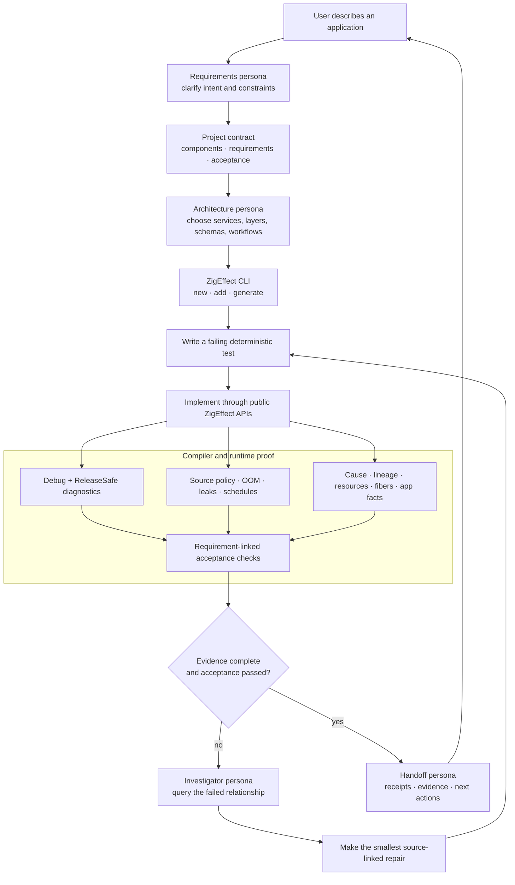
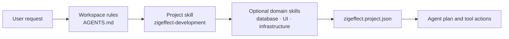
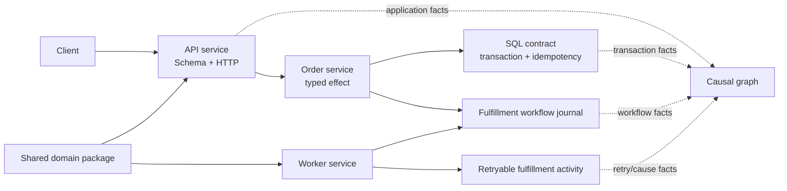
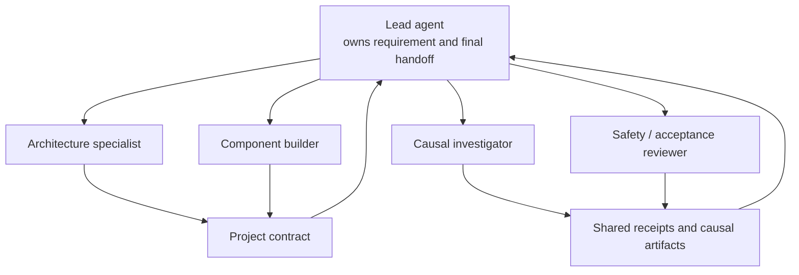

# How Codex Builds Applications With ZigEffect

This guide explains ZigEffect from my perspective as a coding agent. It shows
how a Codex-like agent harness turns a user's request into a governed project,
uses skills and tools to implement it, learns from compiler and runtime
evidence, and hands the result back with inspectable proof.

The short version is:

> You describe the application you want. I translate that intent into explicit
> requirements and acceptance checks, build against ZigEffect's typed runtime,
> and use the compiler, safety plane, causal graph, and Workbench as a continuous
> feedback system. I do not have to build from source code and logs alone.

Examples in this document come from the real CLI and causal dogfood artifact.
Long JSON examples are shortened only where they are marked “abridged.”

## The roles of Codex and ZigEffect

Codex and ZigEffect solve different parts of the problem:

| Participant | Responsibility |
| --- | --- |
| **You** | State the goal, constraints, priorities, product decisions, and authority boundary |
| **Codex or another coding agent** | Interpret intent, plan, edit source, run governed tools, query evidence, and explain decisions |
| **The agent harness** | Give the model controlled access to files, search, patches, commands, skills, browser surfaces, and optional specialist agents |
| **ZigEffect project contract** | Make components, requirements, commands, policies, safety posture, and acceptance checks machine-readable |
| **Zig compiler** | Provide static type, comptime, target, Debug, ReleaseSafe, and source-diagnostic evidence |
| **ZigEffect runtime** | Execute the program and expose scopes, resources, fibers, services, retries, workflows, and application boundaries causally |
| **ZigEffect safety plane** | Combine source policy, compiler output, ownership evidence, OOM testing, schedules, and completeness into one verdict |
| **Workbench** | Give humans and agents a visual view of the same project, runtime, safety, and session evidence |

Codex is not embedded inside the runtime as a privileged source mutator.
ZigEffect gives the agent a better interface to the project and running program;
the harness still owns file edits and command execution, and the user still owns
material product and deployment decisions.

## The end-to-end loop



This loop is the product. Effects, workflows, the causal graph, safety gates,
the CLI, and Workbench exist to make each transition faster and more legible to
the agent.

## What this feels like to the user

The harness does not need to expose private chain-of-thought to make the work
understandable. It exposes the useful operational record: assumptions, plan,
tool actions, requirement state, check results, causal evidence, safety
completeness, decisions that need approval, and the final handoff.

A typical conversation looks like this:

> **User:** Build an order service with an idempotent create endpoint and a
> durable fulfillment workflow.

> **Codex — orientation:** I mapped this to API, worker, and shared-domain
> components. The two acceptance-critical requirements are idempotent order
> creation and restart-safe workflow replay. Network deployment is outside the
> current request, so I will use deterministic HTTP/SQL adapters locally and
> preserve the production adapter boundary.

> **Codex — implementation update:** The create-order acceptance test now fails
> for the expected reason. I generated the Schema and HTTP modules, added the
> repository service, and am implementing the transaction boundary. No runtime
> claim yet.

> **Codex — investigation update:** The check compiled, but the causal receipt
> reports `service_required Config status=missing`. The failure belongs to the
> layer graph, not the order handler. I am adding the missing provider and
> rerunning the same acceptance command.

> **Codex — handoff:** Both requirements are satisfied. Debug, ReleaseSafe,
> allocation, leak, causal-invariant, schedule, and executor-equivalence gates
> passed for the recorded source revision. ThreadSanitizer and fuzz remain
> optional unsupported capabilities. The handoff links the acceptance checks,
> safety receipt, workflow recovery artifact, and next production-adapter work.

The user can interrupt or redirect at any point. A new product constraint changes
the requirements and plan; it does not get buried as an informal note in the
agent's terminal history.

## What the user gives me

A useful request describes outcomes rather than implementation trivia. For
example:

> Build an order-processing system. It needs an HTTP API to create and inspect
> orders, idempotent persistence, a durable fulfillment workflow, retryable
> activities, and an audit trail. It must survive worker restarts, never expose
> database credentials, and include deterministic tests. Optimize for simple
> local development now, with a clean path to production adapters later.

From that request I extract:

- **product behavior** — create an order, inspect status, execute fulfillment;
- **quality attributes** — idempotency, recovery, redaction, deterministic
  tests;
- **boundaries** — HTTP, Schema, SQL, workflow journal, external activities;
- **operational constraints** — local-first now, production adapters explicit;
- **acceptance** — exact scenarios that must pass before I can say “done”;
- **authority** — what I may edit and test, and what still needs human approval.

If one of those choices materially changes the product, I ask. If it is a small,
reversible implementation detail inside the stated boundary, I make a documented
assumption and continue.

ZigEffect does not pretend natural language is already a formal specification.
The agent interprets the request; the project contract makes that interpretation
visible and reviewable before it becomes a completion claim.

## How skills guide the agent

A skill is a focused operating manual loaded by the agent harness. Generated
ZigEffect projects include matching Codex and Claude skills so different agents
follow the same project discipline.

The ZigEffect development skill tells me to:

1. read `zigeffect.project.json` before editing;
2. map the request to a requirement, acceptance check, and component;
3. use public `zigeffect_std` APIs and component facades;
4. add a failing deterministic test before behavior;
5. use `zigeffect add` and `zigeffect generate` for conventional structure;
6. run `zigeffect project check --agent --json`;
7. query source-linked safety and causal evidence before guessing from text;
8. treat failed, incomplete, truncated, or unsupported required evidence as
   unpassed;
9. leave a bounded, redacted handoff.

### Instruction layers



Skills improve consistency; they do not grant new authority. A database skill
can teach me the repository's migration conventions, but it does not authorize a
production migration. A deployment skill can describe a safe release flow, but
it does not override the user's approval boundary. The validated project
contract remains the source of truth for ZigEffect commands and acceptance.

## Tools available to an agent harness

A Codex-like harness may expose more tools than ZigEffect itself. I use each for
a different kind of evidence:

| Tool class | How I use it |
| --- | --- |
| **Semantic and exact search** | Find the public facade, owning module, tests, schemas, and existing patterns before editing |
| **File reads** | Inspect project rules, skills, manifests, source, tests, receipts, and causal artifacts |
| **Patch editing** | Make surgical, reviewable changes without rewriting unrelated work |
| **Shell commands** | Run only declared project checks, Zig builds, causal queries, and local release gates |
| **ZigEffect CLI** | Scaffold, generate modules, validate the contract, run safety, inspect requirements, and create handoffs |
| **Causal query interface** | Ask structural questions about a running or recorded program |
| **Workbench/browser** | Inspect the evidence visually and verify user-facing behavior when a UI exists |
| **Specialist agents** | Parallelize bounded research or review when the harness and user permit it |
| **Connected services** | Read or change external systems only when explicitly in scope and authorized |

The portable part is the ZigEffect contract and evidence. Whether the harness is
Codex, Claude Code, or another agent, it can consume the same JSON, JSONL,
source references, commands, and receipts.

## Agentic developer personas

“Persona” means an explicit operating mode with a question, tools, and exit
condition. One agent can move through all personas. A multi-agent harness can
assign them to separate specialists, but they still communicate through shared
artifacts rather than unstructured summaries.

| Persona | Primary question | Main tools and evidence | Exit condition |
| --- | --- | --- | --- |
| **Requirements interpreter** | What does the user actually need? | User request, existing requirements, product constraints, acceptance examples | Every material behavior maps to a reviewable requirement |
| **Application architect** | What is the smallest sound system shape? | Component graph, service/layer model, Schema, HTTP/SQL/workflow contracts | Components and dependency direction are explicit and acyclic |
| **Domain implementer** | What code satisfies this requirement? | Public facades, generated modules, direct-style effects, typed errors | A focused failing test becomes green without unrelated changes |
| **Boundary specialist** | Are external inputs and effects governed? | Schema, config, HTTP, SQL, process, filesystem, redaction, fake/live adapters | Boundary failures are typed, tested, and causally recorded |
| **Fault engineer** | What happens under hostile conditions? | OOM sweeps, schedule explorer, crash recovery, retry/timeout/cancel tests | Declared fault models pass or produce a bounded counterexample |
| **Causal investigator** | Why did the running program behave this way? | `cause`, `lineage`, `resources`, `fibers`, `requirements`, `retries`, semantic diff | The responsible relationship and source boundary are identified |
| **Safety reviewer** | Is this governed Zig safe enough to hand off? | AST policy, allowances, Debug, ReleaseSafe, memory facts, safety receipt | All required gates pass with complete evidence |
| **Acceptance auditor** | Does the evidence prove the user-visible outcome? | Requirement/check links, application facts, receipts, browser proof | Every claimed requirement has passing acceptance evidence |
| **Handoff steward** | Can another person or agent continue immediately? | Tasks, evidence IDs, blockers, next actions, redacted artifacts | Handoff is truthful, bounded, and source-linked |

These personas prevent a common agent failure: the builder persona declaring
success simply because compilation passed. Only the acceptance auditor can turn
implementation evidence into a feature-complete claim.

## The exact lifecycle I follow

### 1. Orient to the project

I read the workspace rules, the generated skill, and
`zigeffect.project.json`. Then I ask the CLI for machine-readable state:

```sh
zigeffect compatibility --json
zigeffect project validate --json
zigeffect agent status --json
zigeffect agent next --json
```

A newly generated application currently returns output like this:

```json
{
  "schema": "zigeffect.project-status.v1",
  "project": "order-service",
  "requirements_total": 1,
  "requirements_open": 1,
  "checks_total": 1,
  "checks_pending": 1,
  "checks_failed": 0,
  "tasks": [{
    "id": "task-req-bootstrap",
    "requirement": "req-bootstrap",
    "component": "order-service",
    "summary": "Keep every generated boundary compiling with causal evidence",
    "status": "active"
  }],
  "evidence": [],
  "next_actions": [{
    "id": "next-req-bootstrap",
    "requirement": "req-bootstrap",
    "component": "order-service",
    "summary": "Keep every generated boundary compiling with causal evidence",
    "command": "check"
  }]
}
```

That tells me there is work to do, which component owns it, which declared
command provides the next proof, and that no evidence exists yet. I do not need
to infer status from a TODO list.

### 2. Convert intent into the project contract

For the order system, I would turn the user request into requirements such as:

- `req-create-order` — validate and persist an idempotent order request;
- `req-order-status` — return current order and fulfillment state;
- `req-fulfillment-workflow` — resume fulfillment after worker restart;
- `req-secret-posture` — keep credentials out of artifacts and responses.

Each requirement gets one or more command-backed acceptance checks. A
representative manifest excerpt looks like this:

```json
{
  "schema": "zigeffect.project.v1",
  "name": "order-platform",
  "version": "0.1.0",
  "kind": "system",
  "components": [
    {
      "id": "api-service",
      "kind": "service",
      "path": "services/api",
      "depends_on": ["shared-domain"]
    },
    {
      "id": "worker-service",
      "kind": "service",
      "path": "services/worker",
      "depends_on": ["shared-domain"]
    },
    {
      "id": "shared-domain",
      "kind": "package",
      "path": "packages/shared"
    }
  ],
  "commands": [
    { "id": "check", "argv": ["zig", "build", "test"] },
    { "id": "check-debug", "argv": ["zig", "build", "test", "-Doptimize=Debug"] },
    { "id": "check-safe", "argv": ["zig", "build", "test", "-Doptimize=ReleaseSafe"] }
  ],
  "requirements": [
    {
      "id": "req-create-order",
      "summary": "Validate and persist an idempotent order request",
      "component": "api-service",
      "status": "active"
    },
    {
      "id": "req-fulfillment-workflow",
      "summary": "Resume fulfillment from the journal after worker restart",
      "component": "worker-service",
      "status": "planned"
    }
  ],
  "acceptance_checks": [
    {
      "id": "check-create-order",
      "requirement": "req-create-order",
      "command": "check",
      "expectation": "Duplicate request keys return one durable order",
      "status": "pending"
    },
    {
      "id": "check-workflow-recovery",
      "requirement": "req-fulfillment-workflow",
      "command": "check",
      "expectation": "Reopened journal resumes without repeating completed activities",
      "status": "pending"
    }
  ]
}
```

The full generated manifest also carries project policy and the
`agent_safe_v1` gate matrix. The CLI rejects malformed identifiers, secret
values, unknown schemas, broken references, duplicate components, arbitrary
paths, and dependency cycles before implementation proceeds.

### 3. Scaffold the architecture

I use conventional generators before hand-writing framework wiring:

```sh
zigeffect new system order-platform \
  --target ./order-platform \
  --zigeffect-path ../packages/zigeffect \
  --zigeffect-std-path ../packages/zigeffect-std

zigeffect generate schema order \
  --component api-service \
  --root ./order-platform

zigeffect generate http orders \
  --component api-service \
  --root ./order-platform
```

The initial shape is:



The shared package contains values, errors, schemas, and contracts—not live
database or HTTP behavior. Services depend inward on that package rather than
importing one another's internals.

### 4. Write a failing acceptance-oriented test

Before implementation, I make the requirement executable. For example:

```zig
test "duplicate idempotency key creates one order" {
    // FakeOrderRepository is an application-owned deterministic test adapter.
    var repository = FakeOrderRepository.init(std.testing.allocator);
    defer repository.deinit();

    const first = try runCreateOrder(&repository, request("order-key-42"));
    const second = try runCreateOrder(&repository, request("order-key-42"));

    try std.testing.expectEqual(first.id, second.id);
    try std.testing.expectEqual(@as(usize, 1), repository.orderCount());
}
```

The exact fake API depends on the owning module, but the principle is fixed:
the test describes the user-visible invariant, not an internal function call
that can pass while the feature is broken.

### 5. Implement through typed boundaries

I keep application functions direct-style and expose dependencies through the
effect type:

```zig
const CreateOrderEnv = zstd.fx.ServiceEnv(.{
    OrderRepository,
    zstd.Observability.Recorder,
});

fn createOrder(
    ctx: *zstd.fx.Context(CreateOrderEnv),
    input: CreateOrderInput,
) CreateOrderError!Order {
    const repository = ctx.service(OrderRepository);
    const observability = ctx.service(zstd.Observability.Recorder);

    const order = try repository.createIdempotent(input);
    try observability.increment("orders.created", 1);
    return order;
}
```

Config, Schema, HTTP, SQL, external process, artifact, dependency, and acceptance
boundaries emit stable semantic application facts. Those facts let the agent
compare business intent across executor-specific IDs and scheduling order.

### 6. Run the governed checks

I do not invent an ad hoc shell pipeline at handoff time. I run commands declared
by the project:

```sh
zigeffect project check --agent --json
zigeffect project test --json
```

The agent check joins source analysis and compiler/runtime gates, writes bounded
compiler artifacts, and creates `.zigeffect/receipts/latest-safety.json`.

### 7. Query the program instead of guessing

Suppose a readiness run fails. I first ask for missing requirements:

```sh
zig build causal-query -- requirements 1
```

Real output from the dogfood artifact:

```text
causal.query: requirements 1
events: 1
- event id=3 kind=service_required run=1 label=Config type=services.config.Config status=missing
```

This tells me the failure is a missing `Config` provider in run `1`. It is not
evidence that the HTTP parser, order schema, or SQL implementation is wrong. I
inspect the layer graph and provider construction first.

Now suppose the run completes but leaves work pending:

```sh
zig build causal-query -- fibers pending
```

```text
causal.query: fibers pending
events: 1
- event id=5 kind=fiber_forked run=1 scope=1 fiber=42 label=dogfood child fiber status=pending
```

I can explain that event:

```sh
zig build causal-query -- explain_event 5
```

```text
causal.query: explain_event 5
events: 3
- event id=1 kind=run_started run=1 label=zigeffect dogfood type=DogfoodHarness
- event id=2 kind=scope_opened run=1 scope=1 label=dogfood scope status=opened
- event id=5 kind=fiber_forked run=1 scope=1 fiber=42 label=dogfood child fiber status=pending
```

The relationship is now explicit: run `1` opened scope `1`, and that scope owns
pending fiber `42`. I inspect the fork/join or interruption boundary rather than
adding arbitrary sleeps.

### 8. Use machine output for the next decision

With `--agent`, the same query becomes a bounded JSON contract. This is an
abridged form of the real pending-fiber response:

```json
{
  "schema": "zigeffect.causal.agent-query.v1",
  "schema_version": 1,
  "query": "fibers",
  "arguments": ["pending"],
  "bounded": true,
  "truncated": false,
  "limit": 8,
  "total_matched_events": 1,
  "returned_events": 1,
  "confidence": "complete",
  "policy": {
    "retention": { "metadata_available": true, "dropped_events": 0 },
    "sampling": { "metadata_available": true, "sampled_events": 0 },
    "truncation": { "metadata_available": true, "truncated_fields": 0 }
  },
  "events": [{
    "id": 5,
    "kind": "fiber_forked",
    "run_id": 1,
    "fiber_id": 42,
    "scope_id": 1,
    "label": "dogfood child fiber",
    "status": "pending"
  }],
  "relationships": [{
    "relationship": "owns",
    "event_id": 5,
    "from_event_id": 1,
    "to_event_id": 42,
    "run_id": 1,
    "scope_id": 1,
    "fiber_id": 42
  }],
  "next_queries": [
    "zig build causal-query -- --agent --file <artifact.json> explain_event 5",
    "zig build causal-query -- --agent --file <artifact.json> trace_cause 5",
    "zig build causal-query -- --agent --file <artifact.json> summarize_run 1"
  ]
}
```

Three details matter to an agent:

1. **The relationship is typed.** The event is connected to an owning scope and
   fiber, not merely adjacent in a log.
2. **The result declares completeness.** No events were dropped, sampled, or
   truncated in this query, so `confidence` can be `complete`.
3. **The next search is bounded.** The response proposes exact follow-up queries
   instead of encouraging an unbounded artifact dump.

If retention, sampling, or truncation makes the evidence incomplete, I must
weaken the conclusion, capture a better artifact, or report the limitation.

### 9. Review the safety receipt

A real passing receipt contains the source revision, toolchain, memory facts,
completeness, and every declared gate:

```json
{
  "schema": "zigeffect.safety-receipt.v1",
  "project": "safety-e2e",
  "profile": "agent_safe_v1",
  "verdict": "passed",
  "source_revision": "sha256:a3070ae2...",
  "toolchain": {
    "zig_version": "0.16.0",
    "target": "aarch64-macos",
    "optimize": "Debug"
  },
  "memory": {
    "live_allocations": 0,
    "live_bytes": 0,
    "invalid_frees": 0,
    "out_of_memory": 0
  },
  "completeness": {
    "dropped_diagnostics": 0,
    "dropped_findings": 0,
    "dropped_runtime_events": 0,
    "stale_source_refs": 0,
    "truncated_artifacts": 0
  },
  "gates": [
    { "kind": "source_policy", "required": true, "status": "passed" },
    { "kind": "compile_debug", "required": true, "status": "passed" },
    { "kind": "compile_release_safe", "required": true, "status": "passed" },
    { "kind": "allocation_failures", "required": true, "status": "passed" },
    { "kind": "leak_detection", "required": true, "status": "passed" },
    { "kind": "causal_invariants", "required": true, "status": "passed" },
    { "kind": "schedule_exploration", "required": true, "status": "passed" },
    { "kind": "executor_equivalence", "required": true, "status": "passed" },
    { "kind": "thread_sanitizer", "required": false, "status": "unsupported" },
    { "kind": "fuzz", "required": false, "status": "unsupported" }
  ]
}
```

I can truthfully say the required declared gates passed for that source revision.
I cannot claim ThreadSanitizer or fuzz coverage, because those optional
capabilities are explicitly unsupported in this receipt.

### 10. Prove acceptance and hand off

Once implementation and evidence agree, I update the requirement and acceptance
state and ask ZigEffect to produce the handoff:

```sh
zigeffect agent evidence --jsonl
zigeffect agent handoff --provider codex --session order-42 --json
```

A handoff connects:

- tasks to requirement IDs;
- acceptance checks to declared commands;
- safety results to the exact source revision;
- runtime findings to event and source IDs;
- artifacts to bounded paths;
- blockers and next actions to the remaining project state.

If a check was not run, failed, or produced incomplete evidence, I state that
plainly. “I wrote the code” is not the completion condition.

## How personas collaborate in a multi-agent harness

A larger task can use specialist agents without losing a single source of
truth:



Good delegation is bounded:

- the architect can research component boundaries without editing them;
- builders own disjoint components or tests;
- the investigator receives a specific artifact and question;
- the reviewer checks claims against receipts but does not rewrite unrelated
  code;
- the lead integrates results and owns the final acceptance statement.

Agents do not pass authority through prose. The shared project contract and
evidence artifacts determine what is open, passed, blocked, or incomplete.

## What the Workbench adds

Machine JSON is ideal for the harness; the Workbench lets a user inspect the
same reasoning surface:

- project requirements, tasks, sessions, and acceptance state;
- the causal timeline and selected event detail;
- graph ownership, cause, lineage, and cross-service relationships;
- findings and recommended queries;
- semantic before/after diffs;
- the safety verdict, compiler spans, unsafe inventory, memory facts, and gate
  matrix;
- local Codex and Claude turns, commands, checks, artifacts, guardrails, and
  retained PTY state.

The user can therefore challenge an agent's conclusion at the evidence level:
“Show me the event that caused this,” “Which scope owned that fiber?”, “Was the
ReleaseSafe gate run?”, or “Which acceptance check proves recovery?”

## Human control and security boundaries

An agent-first runtime is not an agent-uncontrolled runtime.

- The user request and repository rules define scope.
- Skills provide procedure, not authority.
- Governed project commands use fixed manifest IDs; HTTP callers cannot submit
  arbitrary `argv`.
- Network access is off by default in generated project policy.
- Process execution can require approval.
- Raw terminal persistence is off by default.
- Secrets are rejected or redacted before artifacts and Workbench payloads.
- Causal inspection is read-only.
- Remediation and intervention are record-only/default-deny unless an explicit
  apply policy and structural verification both succeed.
- Deployment, migrations, external messages, and production mutations remain
  separate user-authorized boundaries.

These controls let the runtime provide deep insight without turning observation
into silent authority.

## How to ask an agent to build with ZigEffect

You do not need to prescribe every file. A strong request looks like:

```text
Build a ZigEffect system for <users and problem>.

Required behavior:
- <user-visible capability>
- <user-visible capability>

Constraints:
- <performance, durability, privacy, deployment, compatibility>

Acceptance:
- <scenario that must pass>
- <failure/recovery scenario that must pass>

Authority:
- You may edit <scope> and run local checks.
- Ask before <deployment, migration, external communication, destructive action>.

Use the zigeffect-development skill, keep the manifest requirements and checks
current, query causal evidence before diagnosing runtime failures, and attach the
agent safety receipt to the handoff.
```

For exploratory work, it is also valid to say:

> Build the smallest production-shaped version, document assumptions, and show
> me the project graph, runtime evidence, safety receipt, and remaining gaps.

That gives the agent freedom over reversible implementation details while
keeping product decisions and completion evidence visible.

## What exists today and what remains the promise

### Available now

- five compile-tested project scaffolds;
- validated project manifests, requirements, acceptance checks, fixed commands,
  agent status/next/evidence/handoff protocols;
- generated Codex and Claude project skills;
- Effect, services, layers, scopes, concurrency, workflows, local clustering,
  standard-library boundaries, and adapters;
- causal artifacts, typed queries, bounded machine responses, semantic diffs,
  and a live/static Workbench;
- AST source policy, compiler capture, tracked allocation, OOM tests, schedule
  exploration, safety receipts, and executor equivalence;
- a local allowlisted Codex/Claude control host and agent-session UI.

### Still being completed

- a fully productized path from an arbitrary natural-language request to a
  reviewed multi-requirement manifest without agent-authored contract edits;
- production-ready adapters for every application platform;
- long-lived deployed engine hosts and complete multi-node TLS operation;
- external deployment, telemetry, alerting, and durable-learning integrations;
- controlled studies proving general development-speed or safety advantages over
  Rust, C, or other stacks;
- broader autonomous remediation while preserving human approval and evidence
  quality.

The direction is clear: reduce the amount of application state an agent must
guess, increase the amount it can query structurally, and make every completion
claim traceable to compiler, runtime, and acceptance evidence.

## Try the loop locally

Verify the complete local distribution:

```sh
bun run zigeffect:local-release
```

Generate an application:

```sh
zigeffect new application example-app \
  --target ./example-app \
  --zigeffect-path ../packages/zigeffect \
  --zigeffect-std-path ../packages/zigeffect-std

cd example-app
zigeffect project validate --json
zigeffect agent status --json
zigeffect agent next --json
zigeffect project check --agent --json
```

Generate and inspect core causal evidence:

```sh
cd packages/zigeffect
zig build causal-test
zig build causal-query -- --agent list_findings 1
zig build causal-query -- --agent requirements 1
zig build causal-query -- --agent fibers pending
zig build causal-workbench -- .zig-cache/causal-artifacts/zigeffect-causal-dogfood.json
```

## Related documentation

- [Agent safety plane](agent-safety-plane.md)
- [Agent-observable causal runtime](agent-observable-runtime.md)
- [Agent guide](agent-guide.md)
- [Local agentic development](local-agentic-development.md)
- [Local agent adapters](local-agent-adapters.md)
- [Architecture](architecture.md)
- [Operations](operations.md)
- [Compatibility and upgrades](compatibility.md)
- [Roadmap](roadmap.md)
- [Agent-first testing and deterministic replay](agent-first-testing.md)

## The promise in one sentence

**ZigEffect is the runtime I want as a coding agent: one that helps me build the
application, shows me how it is actually running, tells me when my evidence is
incomplete, and lets me hand the result to you with proof instead of confidence
alone.**
