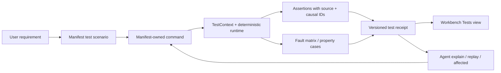

# Agent-First Testing with ZigEffect

ZigEffect testing is designed for a coding agent that needs to answer more than
“did the command exit zero?” An agent needs to know which requirement was
tested, which source and runtime facts support the result, which hostile case
failed, whether evidence was dropped, and the exact command that reproduces the
smallest failure.

The public entry point is `zstd.Testing`. It complements Zig's `std.testing`; it
does not replace Zig's compiler, test runner, runtime safety checks, or allocator
instrumentation.

## Two evidence levels

Testing v2 upgrades both existing Zig tests and new semantic scenarios:

1. The `zigeffect_test_runner` executes ordinary `std.testing` functions using
   Zig's server protocol and atomically writes
   `.zigeffect/tests/suites/<artifact>.json`. The suite receipt records every
   discovered test, execution status, error name, leaks, logged errors,
   duration, target, optimization mode, seed, and replay command. A missing
   result, leak, error log, or incomplete run cannot be a pass.
2. `zstd.Testing.TestContext` emits requirement-linked native scenario receipts
   with semantic assertions, causal evidence, faults, schedules, models,
   coverage, and repair guidance.

Keep small value/type/unit assertions in `std.testing`; the V2 runner migrates
them without source churn. Use `TestContext` when a user-visible requirement or
runtime boundary needs evidence an agent can reason about. Generated project
template v14 configures the runner automatically through the runner module
exported by `zigeffect_std`.

After `zig build test`, inspect the suite receipt before terminal output:

```sh
jq '{status, complete, counts, execution}' \
  .zigeffect/tests/suites/<artifact>.json
```

Require `status == "passed"`, `complete == true`, discovered equal to executed,
and zero pending tests, failures, leaks, and logged errors.

For manifest-owned scenarios, `native_test_filter` selects one real Zig test at
compile time. The CLI accepts only the fixed manifest command plus its generated
filter and writes stable native evidence to
`.zigeffect/tests/process-receipts/<scenario>.json`. Acceptance reconciliation
also requires the current content-addressed source revision, manifest digest,
command digest, tool version, target, optimization mode, native execution, and
complete capture. The automatic proof handoff is written to
`.zigeffect/handoffs/tests/<scenario>.json`; `.zigeffect/tests/latest.json` is a
run view, not the stable proof location. Uncontrolled package-native semantic
receipts go to `.zigeffect/tests/raw-receipts/` and cannot overwrite the stable
CLI-controlled process receipt.

## The evidence loop



Every arrow is inspectable. A required test is not “passed” when assertions are
missing, runtime findings remain, memory evidence is unsafe, or bounded capture
reports dropped evidence.

## Declare intent in the project manifest

`zigeffect.project.json` owns scenarios alongside requirements, acceptance
checks, components, and commands:

```json
{
  "test_scenarios": [{
    "id": "create-order",
    "label": "duplicate keys create one durable order",
    "requirement": "req-create-order",
    "acceptance_check": "check-create-order",
    "component": "api-service",
    "command": "test",
    "source_roots": ["src/orders", "test/orders"],
    "tags": ["acceptance", "sql"],
    "default_seed": 42,
    "fault_profile": "standard",
    "required": true
  }]
}
```

The manifest validator rejects dangling requirement/check/command/component
references, duplicate scenarios, invalid paths, zero seeds, and uncovered
acceptance checks when the project opts into scenarios. Commands remain the
only executable authority: a scenario cannot smuggle arbitrary process text
past project policy.

## Build a scenario with `TestContext`

```zig
const std = @import("std");
const zstd = @import("zigeffect_std");

test "create order records causal acceptance evidence" {
    const scenario = zstd.Testing.Scenario{
        .id = "create-order",
        .label = "duplicate keys create one durable order",
        .requirement = "req-create-order",
        .acceptance_check = "check-create-order",
        .component = "api-service",
        .command = "test",
        .default_seed = 42,
    };
    var context = try zstd.Testing.TestContext.initFromProject(
        std.testing.allocator,
        std.testing.io,
        std.Io.Dir.cwd(),
        .{
        .project = "orders",
        .suite = "acceptance",
        .scenario = scenario,
        .seed = 42,
        },
    );
    defer context.deinit();

    // Effects executed through the controlled managed runtime automatically
    // record to its real causal store and project-mounted graph.
    const assertions = zstd.Testing.AssertionRecorder.init(&context);
    try assertions.boolean(.{
        .id = "one-order",
        .label = "exactly one order exists",
        .source = .{ .id = "src-one-order", .path = "src/orders.zig", .line = 84, .column = 5 },
        .repair_hint = "make idempotency-key insertion atomic",
    }, true);
    try assertions.noPendingFibers(.{ .id = "fibers-clean", .label = "no work escaped its scope" });
    try assertions.noFindings(.{ .id = "causal-clean", .label = "runtime invariants remain clean" });

    try context.publish(std.testing.io, std.Io.Dir.cwd(), 1);
}
```

`TestContext` owns the standard fake clock, logger, config, metrics, tracing,
memory filesystem, ID generator, scope, typed fixture registries, assertion
evidence, artifacts, limitations, and a bounded causal store. Application-owned
providers can still be composed through public service layers.

## Assertions are evidence, including failures

An assertion is recorded before a failed matcher returns. Its stable receipt
shape includes:

- ID and human label;
- pass/fail/skip status;
- source reference;
- causal event IDs;
- the causal ID space and, for durable IDs, graph session;
- bounded expected and actual summaries;
- diagnostic detail and a repair hint.

Public matchers cover booleans, generic values, strings, containment, semantic
JSON, secret scans, `Exit` variants, `Cause` defects/interruption/finalizer
failures, event patterns, ordered event subsequences, findings, and pending
fibers. The underlying causal store continues to expose resource, service,
retry, workflow, statechart, application-fact, and lineage queries for domain
specific assertions.

## Explore hostile cases deterministically

`zstd.Testing.Faults` creates stable case IDs and replay tokens for:

- allocation failure;
- schedule choice;
- timeout, cancellation, and interruption;
- spawn and executor failure;
- retry exhaustion;
- process, HTTP, and SQL adapter failure;
- journal crash and corrupt artifacts.

```zig
var matrix = try zstd.Testing.FaultMatrix.exhaustive(
    std.testing.allocator,
    42,
    .{ .allocation_failures = 64, .schedules = 128, .cases = 256 },
);
defer matrix.deinit();

var receipt = try zstd.Testing.runFaultMatrix(
    std.testing.allocator,
    matrix,
    &state,
    runOneCase,
    .{ .stop_on_failure = false },
);
defer receipt.deinit();
```

Bounds and truncation are part of the result. Platform cases that cannot run
are `unsupported`; they are never silently counted as passed. Zig's exhaustive
allocator-failure helper and the core schedule explorer remain available for
deeper engine-native exploration.

## Generate data from Schema

`zstd.Testing.Generators.generate` derives deterministic valid values from
Schema string constraints, bounded integers, booleans, enums, optionals,
arrays, explicit structs, and derived structs. Transforms are refused unless
the caller supplies a lawful custom generator because an arbitrary decode
transform cannot be safely inverted.

```zig
const Property = struct {
    fn check(_: void, value: i64) !void {
        if (value * 2 < value) return error.OverflowInvariant;
    }
};

var property = try zstd.Testing.Generators.runProperty(
    std.testing.allocator,
    zstd.Schema.integer().min(0).max(1_000_000),
    {},
    Property.check,
    .{ .seed = 93, .cases = 500, .max_shrinks = 64 },
);
defer property.deinit();
```

On failure the receipt records the seed, failing index, minimal encoded input,
shrink count, structural/custom shrink path, and replay metadata. Primitive
boundary generation is explicit; schemas that cannot honestly produce an exact
boundary return `BoundaryGeneratorRequired`.

## Compose advanced evidence

Testing v2 makes independent proof techniques share one receipt contract:

| Module | What the agent learns |
|---|---|
| `Coverage` | Required and advisory semantic gaps, repair hints, and next commands |
| `Models.StatechartExplorer` | Executable transition paths, invariant failures, unreachable transitions, and bounds |
| `Schedules` | Explored interleavings and the smallest failing schedule |
| `Differential` | Normalized cross-executor mismatches with ignored volatile JSON fields |
| `VirtualWorld` | Deterministic time, network, queue, store, crash, and recovery behavior |
| `Mutation` | Which stable requirement-linked mutants survived, without source writes |
| `Budgets` | Absolute and relative deterministic performance regressions |
| `Sandbox.Firewall` | Every fake/real side-effect decision with source and causal identity |

Attach any report with `try context.recordReport(.<kind>, report)`. A failed
report fails the receipt; unsupported or truncated exploration cannot become a
pass. The side-effect firewall denies real filesystem, network, process,
environment, database, clock, and randomness adapters unless explicitly
granted. Direct OS calls outside guarded adapters cannot be intercepted, so the
receipt discloses that boundary.

```zig
var firewall = zstd.Testing.Sandbox.Firewall.init(std.testing.allocator);
defer firewall.deinit();
try firewall.authorize(.{ .effect = .database, .adapter = .fake, .causal_event_id = 81 });
try context.recordReport(.sandbox, firewall);

var budget = try zstd.Testing.Budgets.evaluateAlloc(
    std.testing.allocator,
    &.{.{ .id = "workflow-steps", .kind = .deterministic_steps, .value = 93 }},
    &.{.{ .id = "workflow-budget", .metric_id = "workflow-steps", .absolute_max = 100 }},
);
defer budget.deinit();
try context.recordReport(.performance, budget);
```

## Compare semantics, not incidental formatting

Snapshots support normalized text, semantic JSON, unordered JSONL sets, causal
shapes, application facts, workflow receipts, statechart receipts, and test
receipts. Object keys are sorted; explicitly ignored volatile fields are
removed; contents are redacted and SHA-256 checked.

Normal comparison never writes. Updating is a separate plan/apply operation
with an expected digest, so an agent cannot overwrite a fixture that changed
after it inspected the diff:

```sh
zigeffect test snapshot create-order --json
zigeffect test snapshot create-order --apply --json
```

Fixtures are restricted to `.zigeffect/tests/snapshots/` and safe extensions.

## The agent CLI

```sh
# Discover intent without running code.
zigeffect test list --requirement req-create-order --json

# Select the smallest declared set after an edit.
zigeffect test affected --changed src/orders/service.zig --json

# Run a requirement through manifest-owned commands.
zigeffect test run --requirement req-create-order --json

# Explain ownership, evidence paths, and the next replay command.
zigeffect test explain create-order --json

# Reproduce one exact hostile case.
zigeffect test replay create-order \
  --seed 42 --fault allocation_failure:17 --json

# Ask what behavior is still unproved.
zigeffect test coverage --requirement req-create-order --json
zigeffect test gaps --requirement req-create-order --json

# Explore a bounded sequence of seeds and inspect regressions over time.
zigeffect test stress --requirement req-create-order --runs 32 --seed 42 --json
zigeffect test history --json
```

Before each command the CLI writes a run-scoped control under
`.zigeffect/tests/controls/` and passes its exact path to the child process.
`TestContext.initFromProject` reads only that control and publishes the native
receipt to its run-scoped path under `.zigeffect/tests/process-runs/`. This
keeps concurrent agents and safety checks in the same project from exchanging
selection metadata or overwriting authoritative process proof. Exit zero
without the exact matching native receipt is `incomplete`, never passed. The
CLI then atomically persists canonical per-scenario receipts under
`.zigeffect/tests/receipts/` and the aggregate run at
`.zigeffect/tests/latest.json`; append-only validated history lives at
`.zigeffect/tests/history.jsonl`. Raw stdout/stderr is persisted only when the
manifest explicitly enables `policy.persist_raw_terminal`; otherwise the
receipt discloses that limitation.

## Reading the result as an agent

The decision order is deliberately mechanical:

1. Validate `schema` and `schema_version`.
2. Require the selected scenario count and status counters to agree.
3. Treat `failed`, `incomplete`, and unsupported required evidence as unpassed.
4. Inspect the first failed assertion and its source reference.
5. Check `causal_event_id_space`. Query cited IDs and their cause/children only
   when it is `graph_durable`; `runtime_local` IDs address the bounded in-memory
   execution and are not valid graph cursors.
6. Copy the exact replay command.
7. Repair the smallest responsible boundary.
8. Close every required semantic gap.
9. Run `test affected`, stress when appropriate, the full requirement, then the
   project safety gate.

The Workbench Tests view performs the same reading visually. It renders native
protocol identity, coverage gaps, model/schedule exploration, differential and
virtual-world evidence, mutants, budgets, firewall decisions, shrink paths,
regression counts, and replay controls, while linking assertion event IDs back
to the shared execution graph.

## What this proves—and what it does not

A passed, complete receipt proves the declared scenario and explored cases
passed under the recorded Zig version, seed, executor, bounds, and evidence
capture. It does not prove arbitrary Zig memory safety, all possible schedules,
all inputs, all platforms, or Rust-equivalent language soundness. The receipt's
completeness counters, unsupported cases, and limitations are part of the
verdict precisely so agents cannot erase those boundaries in prose.

The long-term promise is stronger application development, not magical source
code: combine Zig compiler diagnostics, scoped runtime ownership, causal
execution facts, deterministic hostile testing, semantic diffs, and explicit
agent protocols so an agent can iterate quickly while making fewer guesses.
