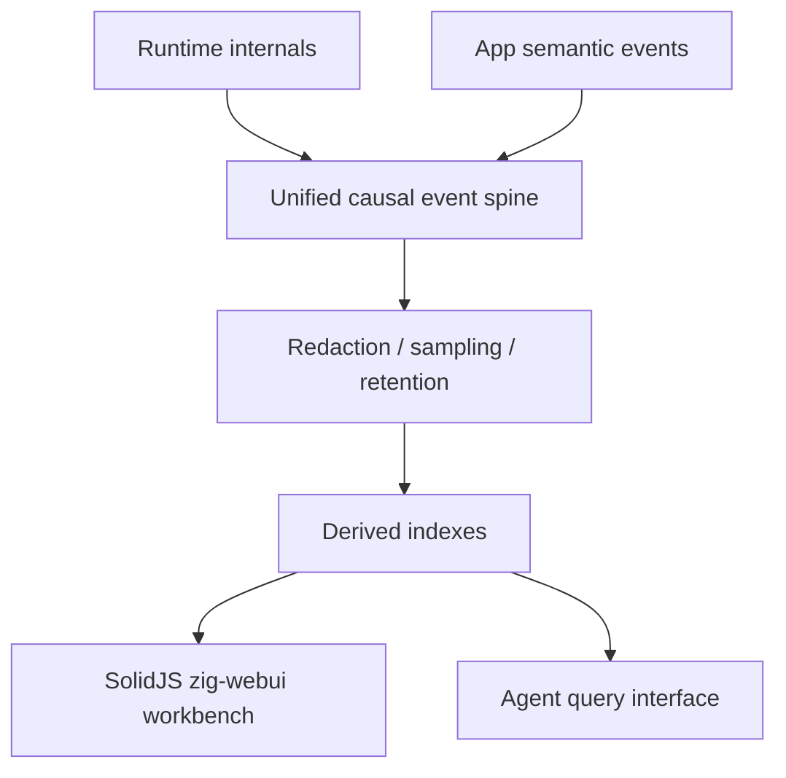

# Agent-Observable Causal Runtime

Date: 2026-06-05

This document defines the long-term `zigeffect` direction for an
agent-observable Effect runtime: a Zig-native runtime that exposes effect
execution as a structured causal graph rather than as unstructured logs.

The goal is not to make an LLM execute arbitrary runtime magic. The goal is to
make effectful Zig programs understandable to agents and humans through the
same typed runtime facts the engine already owns: effects, services, scopes,
fibers, resources, schedules, exits, causes, logs, metrics, and traces.

## Thesis

Most agentic coding and operations loops still observe software from the
outside. They run commands, parse stdout, inspect stack traces, and infer what
probably happened. That is expensive in tokens, fragile under formatting
changes, and often misses the true runtime cause.

`zigeffect` can make the runtime itself agent-readable. When an effect runs,
the engine can emit compact structural events into a causal graph. An agent can
then ask precise questions:

- Which service requirement was missing or replaced?
- Which effect opened this resource?
- Which fiber was interrupted by which parent scope?
- Which retry policy hid the first typed failure?
- Which finalizer failed after the program failure?
- Which config value, layer provider, or app dependency changed the outcome?

The runtime becomes a debuggable, queryable execution model instead of a black
box that agents reconstruct from logs.

## Novelty Position

The individual pieces are not new:

- Distributed tracing already models span graphs.
- Effect systems already model typed failure, scopes, fibers, and supervision.
- Workflow engines already persist execution histories for replay.
- Dynamic tracing systems already inspect live processes.
- Agent frameworks already display chain, tool, and graph execution traces.

The novel wedge for `zigeffect` is the combination:

> A Zig-native Effect runtime where typed errors, service requirements, layer
> providers, scopes, resources, fibers, schedules, logs, metrics, and traces
> emit into one allocator-aware causal execution graph that agents can query
> structurally.

The claim should stay precise. Do not claim that `zigeffect` invents tracing,
time travel, supervision, or self-healing software. Claim that it can become
the first Zig-native agent-observable Effect runtime with a first-class causal
execution graph.

## Landscape Anchors

This direction should learn from adjacent systems without copying their shape.

- OpenTelemetry treats traces as span DAGs and defines span events, links,
  context propagation, sampling, and limits. `zigeffect` should interoperate
  with that world, but it should keep effect-specific facts such as scopes,
  typed errors, finalizers, service providers, schedules, and fibers as richer
  runtime data rather than flattening them into generic attributes too early.
- LangGraph-style checkpoint replay and forking show why agents need to revisit
  past execution points. `zigeffect` should approach replay through typed effect
  inputs, deterministic stores, and sandboxed reruns instead of implying
  arbitrary stack-frame resurrection.
- Temporal-style durable execution shows the value of event histories for
  long-running workflows. `zigeffect` should not try to become a workflow
  platform first, but it can make selected effect histories durable when an app
  needs replay or audit.
- Agent SDK tracing shows that agent workflows need traces for LLM calls, tool
  calls, handoffs, guardrails, and custom events. `zigeffect` can complement
  that by making the application runtime the agent is using equally queryable.

The opportunity is between these systems: effect-native causality for agents
working inside Zig application runtimes.

## Current Foundation

The current package already has the runtime ingredients:

- Direct-style effects with typed success and failure channels.
- Service requirements and provider declarations.
- Layer graph validation, startup ordering, and memoized graph environments.
- Runtime-managed scopes and reverse-order finalizers.
- Exit-aware cleanup and structured `Exit` / `Cause` reports.
- Deterministic fiber lifecycle semantics for fork, join, interrupt, and
  scoped leases.
- Deterministic coordination primitives with wait-state inspection.
- Schedules, retry/repeat policies, and fake-clock integration.
- Logger, metrics, tracing, and observability report services.
- Test helpers and agent-readable reports.

The first shared causal event model now exists. `CausalStore` records
deterministic events; runtime, scope, fiber, layer graph, resource, schedule,
exit, service, and app-level observability facts can attach to it; and agents
can query snapshot, lineage, cause, resources, fibers, requirements, retries,
and findings. Future work is about production adapters, durable histories,
replay, workbench UI, and policy-controlled remediation rather than inventing
the core event shape.

The production-hardening surface now includes deterministic contracts for
artifact aggregation, NenDB-only durable retention, manual production
deployment runbooks, record-only artifact access control, and the unified
causal spine. Agents can use those contracts to reason about deploy, rollback,
causal verification, incident-response readiness, visibility, denied-view audit
posture, shared ids, relationship vocabulary, projection boundaries, and next
runtime work without assuming zigeffect can mutate production systems or
enforce live RBAC.

## Two Agent Audiences

The causal runtime should serve two related but different users.

### Agents Maintaining `zigeffect`

Agents working on the engine need to understand how runtime internals interact.
The causal graph should make engine bugs easier to locate:

- A scope finalizer did not run: inspect the scope lifecycle and owning effect.
- A fiber status is wrong: inspect fork, run, interrupt, join, and child-scope
  events.
- A graph startup failure leaks resources: inspect layer startup order and
  graph startup finalizers.
- A schedule behaves incorrectly: inspect retry decisions, delays, clock
  reads, and reset state.
- A test assertion fails: query the exact runtime path rather than scanning a
  long text report.

This turns engine tests into executable traces that explain themselves.

### Agents Understanding Apps Built With `zigeffect`

Agents working on Yachdee or third-party apps need app-level understanding:

- Which app service failed and what declared requirement supplied it?
- Which layer built the database, cache, queue, AI client, or config service?
- Which domain effect produced a typed app error?
- Which resource was still open at request or job completion?
- Which retry loop is masking upstream instability?
- Which trace/span connects a user-visible failure to a dependency, schedule,
  or finalizer?

This lets app agents surface issues, propose fixes, and produce better incident
summaries without guessing from logs.

## Use-Case Atlas

The runtime graph should be designed around concrete jobs, not around generic
telemetry collection.

### 1. Engine Development And Regression Diagnosis

When a `zigeffect` test fails, an agent should be able to inspect the exact
runtime path:

- the effect that ran
- the runtime or graph environment that provided services
- the scope that owned resources
- the child fibers that were forked
- the schedule decisions that retried work
- the finalizer that failed or did not run
- the `Exit` / `Cause` tree that explains the final result

This turns engine work from "read several files and infer state" into "query
the execution graph and edit the owning subsystem."

Example questions:

- Why did `forkScoped` leave a pending fiber?
- Which finalizer changed a success into a cleanup failure?
- Did graph validation happen before startup builders ran?
- Did a retry test use fake time or wall-clock time?
- Which service requirement was narrowed incorrectly?

### 2. App Debugging And Support

For apps built with `zigeffect`, the graph should explain the path from a
user-visible failure back to typed runtime facts.

Example questions:

- Which domain effect returned `error.InvalidVesselDocument`?
- Which layer supplied the document-analysis service?
- Was the AI extractor retried, and did it fail before or after storage?
- Which request trace owns the failing fiber?
- Which resource was still open when the request scope closed?
- Did an invalid config read happen during graph startup or per request?

This is especially useful for Yachdee-style systems where a user action may
cross auth, vessel registry, document vault, AI extraction, storage, and
matching services.

### 3. CI Failure Triage

CI should be able to emit a causal artifact when a deterministic `zigeffect`
test fails. An agent can then load the artifact and answer:

- Was the failure a typed program error, defect, interruption, or finalizer
  failure?
- Which events occurred immediately before the assertion failed?
- Did a service provider change between the passing and failing run?
- Did the failure come from an app effect, a layer builder, or cleanup?

The artifact should be small enough to attach to CI and structured enough to
drive automatic issue summaries.

### 4. Production Incident Understanding

In production, the graph should be bounded and sampled, but still useful at
breaker points: typed failures, timeouts, finalizer failures, retry exhaustion,
or explicit diagnostic probes.

Example questions:

- Which service dependency caused the request to fail?
- Did retries hide a degraded upstream dependency?
- Which resource scope owned the connection or object that failed cleanup?
- Did a graph-started singleton leak into a per-request scope?
- Which trace span connects the user-visible failure to the effect cause?

The first production posture is "explain and propose," not "mutate live state."

### 5. Agent-Orchestrated Workflows

The runtime can eventually become a substrate for agentic workflow execution.
Instead of treating sub-agents as black-box command runners, each task can run
as a typed effect with:

- declared services
- scoped resources
- retry policies
- fork/join relationships
- structured exits
- causal event output

An agent manager can inspect bottlenecks, failed sub-tasks, leaked resources,
and retry exhaustion without scraping logs from each worker.

### 6. Performance And Cost Analysis

The graph can expose cost-shaped runtime facts:

- repeated retries against the same dependency
- long-lived fibers on the critical path
- resource scopes that stay open longer than expected
- high-cardinality spans or logs
- expensive effects that run when their result is not used
- schedule policies that create too much waiting or too much churn

This is not full profiling. It is effect-aware operational analysis: "which
semantic runtime decisions made this workflow slow or expensive?"

### 7. Security, Audit, And Data Hygiene

Because `zigeffect` already models config and services, the graph can help
agents answer safety questions:

- Did a secret-looking value enter an exported event?
- Which config descriptor supplied a value used by this effect?
- Which service boundary handled external input?
- Which effect emitted a log outside trace context?
- Which remediation operation was proposed, approved, and applied?

This matters if agents are allowed to suggest retries, provider replacement, or
configuration changes.

### 8. Teaching And Onboarding

The graph can teach the runtime. A new contributor can run an example and ask:

- What is the difference between graph startup scope and per-run scope?
- Why did this resource close after the effect finished?
- Why did this fiber get interrupted?
- Which layer provided `Logger`?
- Why is this failure a typed error rather than a defect?

The same machinery that helps agents can help humans form the right mental
model.

## Canonical Scenarios

These scenarios should drive examples, tests, and demos.

### Missing Config During Layer Startup

A database layer requires a DSN from `Config`. Startup fails with a typed
`MissingConfig` error. The graph shows:

- `ConfigLayer` provided `Config`
- `DatabaseLayer` required `Config`
- `DatabaseLayer` read `database.dsn`
- startup failed before the app graph became runnable
- already-started providers were finalized

Agent action: propose a config descriptor default, deployment config fix, or
test fixture update.

### Cleanup Failure After Program Failure

An effect fails with `error.InvalidInput`, then a finalizer also fails while
closing a resource. The graph shows:

- original typed program failure
- resource owner scope
- finalizer event
- combined `Cause.failure_then_finalizer_failure`

Agent action: preserve the original failure while fixing cleanup handling and
adding a regression test.

### Parent Scope Interrupts Child Fiber

A graph-backed service forks a child fiber under a startup or request scope.
The parent closes while the child is still pending. The graph shows:

- parent scope
- child fiber id
- fork event
- interrupt event caused by scope close
- child scope cleanup

Agent action: decide whether the child should be awaited, detached under a
longer-lived scope, or explicitly interrupted sooner.

### Retry Exhaustion Masks The First Failure

An HTTP-like service fails several times under a backoff schedule. The final
result is retry exhaustion, but the first typed failure explains the real
problem. The graph shows:

- first typed failure
- each schedule decision
- delay and attempt count
- final exhausted exit

Agent action: report the upstream issue, tune the schedule, or make the typed
failure more specific.

### App Incident With Trace Context

A request fails in an app effect. The graph connects:

- request span
- domain effect
- service provider
- resource scope
- retry policy
- typed failure
- emitted logs and metrics

Agent action: produce an incident summary with event ids, user impact, likely
cause, and a code or config patch.

## Maturity Ladder

The project should grow in deliberate levels.

### Level 0: Readable Reports

Use existing `formatExit`, `formatCause`, dependency reports, and observability
reports. Agents still read text, but the text is structured and stable.

### Level 1: Causal Event Store

Record bounded, deterministic events in memory. Export snapshots and text
reports. No runtime hooks are required beyond manual events.

### Level 2: Runtime Hooks

Runtime, scopes, fibers, resources, layers, schedules, and exits emit events
when a store is attached. Tests can assert event sequences.

### Level 3: Agent Queries

Expose lineage, cause, resource, fiber, requirement, retry, and finding
queries. Agents diagnose failures from structured facts.

### Level 4: CI And Local Tooling

Failed tests produce causal artifacts. A local CLI or MCP-style tool lets
agents ask runtime questions while working on code.

### Level 5: App Diagnostics

Apps label effects, layers, resources, and domains. Agents can explain
user-visible incidents and suggest targeted fixes.

### Level 6: Replay And Forking

Deterministic test inputs and selected effect snapshots can be replayed or
forked in a sandbox. This is inspired by workflow replay systems, but scoped to
`zigeffect`'s typed effect boundaries.

### Level 7: Policy-Controlled Remediation

Agents can propose and, under policy, apply controlled actions: retry, graph
restart, provider replacement, config-layer replacement, fiber interruption, or
deterministic replay. Arbitrary memory patching remains out of scope.

## Product And Tooling Directions

The causal runtime can become several things at once.

### Runtime Library

The core package exposes causal events, stores, queries, and reports. This is
the minimum useful layer and should remain dependency-light.

### CLI And CI Artifact

A CLI can run examples or tests and emit:

- causal text report
- causal CI report with event ids, findings, and next query suggestions
- causal JSON
- DOT graph
- derived findings
- regression hints

CI can attach those artifacts to failed jobs so agents and humans start from
the same evidence. The first formatter for this lane is
`formatCausalCiReport(allocator, label, store)`, and
`tools/causal_report.zig` is a small local demo harness that prints a sample
report through the same public API.

The first dogfood command is:

```sh
cd packages/zigeffect
zig build causal-test
```

It writes:

- `.zig-cache/causal-artifacts/zigeffect-causal-dogfood.txt`
- `.zig-cache/causal-artifacts/zigeffect-causal-dogfood.json`
- `.zig-cache/causal-artifacts/zigeffect-causal-dogfood.dot`

The companion retention command is:

```sh
cd packages/zigeffect
zig build causal-artifacts
```

It prints the causal artifact manifest for agents and CI, including upload
globs for `.zig-cache/causal-artifacts/*.txt`, `.json`, and `.dot`, known
scenario paths, and dev-loop before/after, compare, query, and advice paths.
CI should retain those causal artifacts on failures and after-phase development
loops, review them before public upload, and avoid uploading the rest of
`.zig-cache`.

The repository workflow `.github/workflows/zigeffect-causal.yml` is the first
CI version of this lane. It prints the manifest, generates dogfood artifacts,
compiles and tests examples, runs the causal package-test gate, writes a compact
`zigeffect-causal-ci-handoff.txt` report plus generated `*-advice.txt` reports
on failure, and uploads only the causal artifact globs when the job fails.

The current production operating model is documented in
[operations.md](operations.md). It is local/CI, record-only, and explicit about
artifact sharing, review gates, workbench operation, backend sink contracts,
and production gaps.

The causal JSON artifact is versioned at the root:

```json
{
  "schema": "zigeffect.causal.v1",
  "schema_version": 1,
  "event_taxonomy_version": 1,
  "retention": {
    "max_events": null,
    "dropped_events": 0,
    "oldest_retained_event_id": null
  },
  "sampling": {
    "log_every_n": null,
    "metric_every_n": null,
    "span_every_n": null,
    "sampled_events": 0
  },
  "events": []
}
```

Schema version `1` is the current event-array artifact shape.
`event_taxonomy_version` version `1` classifies event-kind roles: logs, metrics,
and spans are sampleable observability; runtime lifecycle events are structural
evidence; and service, scope, resource, fiber, schedule, and assertion events
are finding evidence. Finding evidence is never sampleable. Local tools keep
parsing legacy event-only artifacts so saved evidence remains useful. Query,
compare, and development-loop query reports warn when an artifact's taxonomy
version is newer than the tool understands.

For schemas beyond core causal JSON, use `zig build causal-schema-governance`
as the authoritative compatibility matrix. It records each official artifact
family, current version, producer, consumer, compatibility posture, migration
policy, and new-schema checklist. Update that registry and
`docs/schema-governance.md` before changing artifact fields or adding a
user-facing workbench mapping.

Bounded stores are opt-in through `CausalStore.initBounded(allocator,
max_events)`. Retention applies to the in-memory store, not attached backends.
Queries operate on retained events only, so `dropped_events` is the signal that
an agent may be looking at a truncated parent chain.

Causal sampling is opt-in through `CausalStore.initWithOptions`. The first
policy is deterministic `every_n` sampling for `log_recorded`,
`metric_recorded`, and `span_recorded` only. Runtime structure, service, scope,
resource, fiber, schedule, exit, and assertion events are retained before
bounded retention trimming. Sampled-out events consume event IDs, skip storage
and backend emission, and increment `sampled_events` in reports and JSON.

Causal event string fields are defensively redacted before the store retains
them or forwards them to attached backends. The first policy redacts common
secret-shaped key/value pairs, bearer token values, and URL credentials. This
is a deterministic backstop, not a complete PII classifier.

This command records a compact deterministic engine fixture with missing
service, resource, fiber, and retry findings. It exits successfully unless
artifact generation fails, because the findings are intentional evidence for
the development-agent workflow.

The first artifact query command is:

```sh
cd packages/zigeffect
zig build causal-query -- cause 3
```

It reads `.zig-cache/causal-artifacts/zigeffect-causal-dogfood.json` by
default and supports the query names emitted by `formatCausalCiReport`:
`snapshot`, `cause`, `lineage`, `resources`, `fibers`, `requirements`, and
`retries`. Use `--file <path>` after `--` to inspect an artifact from another
run.

### Agent Tool Surface

A local tool or MCP-style server can expose:

- `causal.snapshot`
- `causal.lineage`
- `causal.cause`
- `causal.resources`
- `causal.fibers`
- `causal.requirements`
- `causal.retries`
- `causal.findings`

This is where the idea becomes agent-native: the runtime becomes something an
agent can ask about directly.

### Dual-Interface Causal Spine

The unified spine contract now exists as
`zigeffect.causal.unified-spine-contract.v1` and is printed by:

```sh
cd packages/zigeffect
zig build causal-unified-spine-contract
zig build causal-unified-spine-contract -- --format json
```

The runtime should evolve around this one causal truth model with two consumer
surfaces:

- humans use the SolidJS `zig-webui` workbench to read, view, manage, and
  understand what happened;
- agents use a compact query interface that returns bounded graph slices,
  evidence ids, redaction state, truncation state, confidence, diffs, and
  recommended next queries.

Both surfaces consume the same spine. They should not share the same ergonomics.
The workbench can be rich, visual, and interactive. The agent interface should
be concise, schema-stable, loss-aware, and easy to cite in remediation records.

The spine preserves these stable ids:

- runtime ids: `run_id`, `event_id`, `parent_event_id`, `cause_id`,
  `fiber_id`, `scope_id`, `layer_id`, `service_key`, and `resource_id`;
- app semantic ids: `artifact_id`, `domain_entity_ref`, `data_subject_ref`,
  and `schema_ref`.

It also normalizes relationship types:

- `caused_by`
- `parent_of`
- `requires`
- `provides`
- `reads`
- `writes`
- `transforms`
- `emits`
- `owns`
- `finalizes`

The store remains append-only. Redaction, sampling, retention, and derived
indexes sit between `CausalStore` and every consumer. NenDB records are durable
projections, not source-of-truth events:



The first expanded agent query surface should include:

- `summarize_run(run_id)`
- `find_failures(run_id)`
- `explain_event(event_id)`
- `trace_cause(event_id)`
- `trace_data(data_subject_ref)`
- `compare_runs(left_run_id, right_run_id)`
- `list_findings(run_id)`
- `next_queries(context)`

### Causal Workbench

A future UI could visualize:

- effect runs
- scope trees
- fiber trees
- layer graphs
- resource ownership
- retry timelines
- cause trees
- trace/span overlays

This is not needed for the first implementation, but it is a strong demo and
developer-product direction.

The graph visualization path should start in the SolidJS `zig-webui` workbench
with `@dschz/solid-g6` as the adapter over the current causal graph model. Use
direct `@antv/g6` APIs only when the Solid adapter needs lower-level engine
capabilities. The initial layout modes should be:

- dagre or hierarchical for cause chains and parent-child event traces;
- force for runtime topology and service dependency exploration;
- radial for scope, fiber, and resource ownership.

`solid-flow` remains a later option for editable planning or remediation
surfaces. It should not be the default dependency for read-only causal
dashboarding.

### OpenTelemetry Bridge

OpenTelemetry spans already model trace DAGs, events, attributes, links, and
sampling. `zigeffect` should bridge to that ecosystem while keeping effect
semantics richer than generic spans.

The bridge should map:

- run/effect/fiber/layer events to spans or span events
- service and resource facts to attributes
- fork/join or batch relationships to span links where parent/child is not
  precise
- redaction and retention settings to exporter configuration

### Embedded Graph Backend

After the in-memory store proves the taxonomy, the correct database direction
is an explicit adapter boundary:

- the deterministic core keeps an in-memory event store and query API;
- JSON Lines and DOT exporters provide portable artifacts;
- OpenTelemetry export bridges production tracing ecosystems;
- an embedded graph adapter handles high-volume local and agent-session graph
  queries;
- package-backed NenDB storage can be wired behind the same graph query
  contract once the adapter boundary is proven.

NenDB is the current embedded graph adapter direction because it is Zig-native
and data-oriented. It should remain a backend adapter rather than a core
dependency: the event taxonomy, query protocol, and memory limits should stay
stable enough that storage can be swapped without changing runtime hooks.
SQL-backed durable history adapters are intentionally outside the current
causal-runtime sequence.

### Agentic Application Runtime

Longer term, apps can expose a safe agent-facing runtime contract:

- what services exist
- what effects are available
- what resources they own
- what typed errors they return
- what remediation actions are allowed

That lets agents understand app behavior through declared runtime structure,
not by wandering through source files first.

## Design Principles

- **Direct-style Zig stays the user boundary.** Users should still write
  `fn run(ctx) Error!A`. Instrumentation should not turn application code into
  a callback maze.
- **Typed facts beat text inference.** Runtime events should preserve Zig
  error-set names, service type names, fiber ids, scope ids, layer names, span
  ids, and schedule labels.
- **The graph is opt-in and bounded.** The deterministic core must remain
  usable without telemetry. Event retention, sampling, and memory limits must
  be explicit. Use `CausalStore.initBounded` when a harness needs capped
  retained memory.
- **Runtime hooks converge through services.** Add event sinks as services or
  runtime configuration. Do not create parallel lookup or cleanup systems.
- **Scopes still own cleanup.** Causal observation must describe scope cleanup,
  not replace it.
- **No hidden live mutation.** Agents may propose controlled retries,
  replacements, or config changes. They should not patch arbitrary runtime
  memory.
- **Secrets stay secret.** Config values, request payloads, headers, and AI
  prompts need redaction policies before they enter the graph. The causal store
  defensively redacts common secret-shaped strings, but callers should still
  avoid recording secrets.
- **Determinism remains the compatibility suite.** The deterministic backend is
  the reference implementation for causal events. Async backends must emit the
  same event semantics.
- **Causality must be earned.** Parent/child edges, links, and findings should
  only claim causal relationships the runtime actually knows. Correlation is
  useful, but the graph must label it honestly.
- **Agent actions need evidence ids.** Every diagnosis, finding, and proposed
  remediation should cite event ids or query results so humans can audit why
  the agent believes it.

## Causal Model

The runtime graph is a typed event graph. It can be stored as append-only events
plus derived indices, or as direct node/edge structures.

### Node Types

- `run`: one runtime invocation of an effect.
- `effect`: a named effect blueprint or direct-style function boundary.
- `layer`: a dependency layer declaration or startup node.
- `service`: a provided or required service type.
- `scope`: a runtime, graph startup, shared, or fiber-owned scope.
- `resource`: a scoped resource acquisition.
- `fiber`: a deterministic or async fiber.
- `schedule`: a retry/repeat schedule and its current decision state.
- `exit`: success, typed failure, defect, interruption, or cause.
- `cause`: structured failure, finalizer failure, defect, interruption, or
  nested cause.
- `log`: structured log entry.
- `metric`: counter, gauge, histogram, or snapshot observation.
- `span`: tracing span with trace id and parent id.
- `config`: config descriptor or redacted config read.
- `assertion`: test or agent assertion result.

### Edge Types

- `runs`: runtime invocation runs an effect.
- `requires`: effect or layer requires a service.
- `provides`: layer or runtime provides a service.
- `replaces`: layer replaces a previous provider.
- `opens_scope`: run, graph, or fiber opens a scope.
- `owns_scope`: parent scope owns a child scope.
- `acquires`: effect or scope acquires a resource.
- `finalizes`: scope runs a finalizer for a resource.
- `forks`: fiber or runtime forks a child fiber.
- `joins`: runtime or fiber joins another fiber.
- `interrupts`: scope, runtime, or fiber interrupts a fiber.
- `retries`: effect execution retries through a schedule.
- `emits`: effect, fiber, or runtime emits log, metric, or span events.
- `fails_with`: run, fiber, layer, finalizer, or effect exits with a cause.
- `derived_from`: diagnostic, assertion, or agent finding derives from graph
  facts.

### Event Shape

The first implementation should use an append-only event shape that is easy to
store in memory, serialize, and test.

```zig
pub const CausalEventKind = enum {
    run_started,
    run_completed,
    effect_started,
    effect_completed,
    layer_started,
    layer_completed,
    service_required,
    service_provided,
    service_replaced,
    scope_opened,
    scope_closed,
    resource_acquired,
    resource_finalized,
    fiber_forked,
    fiber_started,
    fiber_joined,
    fiber_interrupted,
    schedule_decision,
    exit_recorded,
    log_recorded,
    metric_recorded,
    span_recorded,
    assertion_recorded,
};

pub const CausalEvent = struct {
    id: u64,
    kind: CausalEventKind,
    run_id: ?u64 = null,
    parent_id: ?u64 = null,
    fiber_id: ?u64 = null,
    scope_id: ?u64 = null,
    trace_id: ?u64 = null,
    span_id: ?u64 = null,
    label: []const u8 = "",
    type_name: []const u8 = "",
    status: []const u8 = "",
    redacted_detail: []const u8 = "",
};
```

This shape is intentionally conservative. Richer payloads can be added through
tagged unions once the event taxonomy is stable.

## Agent Query Protocol

Agents should interact with the causal runtime through explicit query tools,
not arbitrary memory inspection.

### Required Queries

- `store.snapshot`: return bounded runtime state for active runs, scopes,
  fibers, layers, services, spans, and recent exits.
- `store.cause(event_id)`: return the causal parent chain for a run, fiber,
  layer, exit, or finalizer event.
- `store.lineage(event_id)`: return an event and its direct child events.
- `store.resources(scope_id)`: return resources owned by a scope and their
  finalizer state.
- `store.fibers(status?)`: return fibers filtered by status.
- `store.requirements(run_id)`: return required, provided, missing, duplicate,
  or replaced services.
- `store.retries(run_id)`: return schedule decisions and typed failures that
  led to retries.
- `store.findings`: return derived issues such as leaked resources,
  unexpected retries, missing providers, finalizer failures, and failed spans.

### Diagnostic Loop

1. Runtime records causal events while code runs.
2. A breaker condition occurs: typed failure, defect, finalizer failure,
   timeout, failed assertion, explicit breakpoint, or agent query.
3. The agent receives a compact pointer: run id, fiber id, scope id, span id,
   or exit id.
4. The agent queries lineage, cause, requirements, resources, and retries.
5. The agent produces a diagnosis with evidence linked to event ids.
6. The agent proposes a source code change, config change, test, or operational
   action.
7. The developer or policy layer approves and applies the action.
8. Tests or the runtime query suite verify the issue is resolved.

The shortest useful local loop is:

```text
run effect -> inspect causal snapshot -> query lineage -> inspect cause
-> propose test or code fix
```

### Executable Example

`examples/causal_readiness.zig` is the canonical first app example. It builds a
layer graph with config, logger, metrics, tracing, and a database-like service,
attaches a `CausalStore`, runs a readiness effect, preserves missing config as
a typed `error.MissingConfig`, and prints both `formatCausalReport` and
`formatCausalJson`.

Agents should use it as a small rehearsal before diagnosing real app failures:

1. Run `cd packages/zigeffect && zig build examples`.
2. Inspect the causal snapshot or JSON output from the example.
3. Query lineage around the failing `exit_recorded` or `assertion_recorded`
   event.
4. Query cause and requirements before proposing a config, layer, test, or code
   fix.

The scenario fixtures cover the first failure shapes agents should learn:

- `examples/causal_missing_config.zig`: graph startup failure from missing
  config, with service and layer evidence.
- `examples/causal_cleanup_failure.zig`: typed program failure followed by a
  failing finalizer, with resource lineage.
- `examples/causal_scoped_fiber.zig`: parent scope closure interrupting a
  scoped child fiber.
- `examples/causal_retry_exhaustion.zig`: retry exhaustion with schedule
  decisions and the first typed upstream failure.

### Controlled Remediation

The graph can support remediation, but it must be explicit:

- retry an effect through a declared schedule
- restart a layer graph with a new provider
- replace a config layer with approved values
- interrupt or drain a fiber tree
- snapshot and replay deterministic test inputs

The first implementation should not support arbitrary in-process mutation.

## Storage Strategy

The current backend boundary is `CausalBackend`. `CausalStore` remains the
authoritative in-memory deterministic event store: it assigns event ids, keeps
the test/query surface stable, and then calls an attached backend adapter after
the event is stored.

Backend callbacks are an adapter hook, not a durability guarantee. A failing
adapter must not make the deterministic store lose events. Future adapters can
adapt the same event sink contract:

- `memory`: reference deterministic store for tests and local development
- `json_lines`: artifact export for CLIs, CI, and agent tools
- `dot`: artifact export for visual graph debugging
- `opentelemetry`: dependency-free span-event/log-record bridge for production
  span and event ecosystems
- `nendb_graph`: embedded graph-history query adapter plus a NenDB-shaped
  storage writer contract for local agents
- `async_stream`: dependency-free bounded event stream for local agents,
  watch-mode tools, and future app runtime bridges

`zig build causal-backend-conformance` is the adapter contract gate. It proves
that a backend sees assigned, redacted, bounded stored events; does not receive
sampled-out events; can observe events before retention drops them; and cannot
make the deterministic store fail when a backend write fails.

The concrete `json_lines` adapter is `CausalJsonLinesBackendState`. It formats
`zigeffect.causal.event.v1` rows into a caller-owned byte buffer, with an
optional max-byte ceiling that fails closed before writing partial rows. Local
tools own filesystem persistence and rotation; the runtime service owns event
formatting and backend conformance. Its focused gate is
`zig build causal-jsonl-backend`.

The concrete `dot` adapter is `CausalDotBackendState`. It builds graph-tool DOT
output in a caller-owned byte buffer as events are recorded, and callers must
run `finish()` before writing the buffer as a complete `.dot` artifact. DOT is
visual evidence; JSON remains the structured source for agent queries and store
metadata. Its focused gate is `zig build causal-dot-backend`.

The concrete `opentelemetry` adapter is `CausalOtelBackendState`. It maps
stored causal events into typed `CausalOtelRecord` values with `span_event` or
`log_record` signal classification, OTel-style trace/span hex strings where
local ids exist, and `zigeffect.causal.*` attributes for runtime facts. This is
an exporter-neutral bridge; OTLP serialization, SDK integration, resources, and
collector delivery remain future adapter work. Its focused gate is
`zig build causal-otel-backend`.

The concrete `nendb_graph` adapter is `CausalGraphHistoryBackendState`. It
clones stored causal events into an adapter-owned history and answers
`snapshot`, `cause`, `lineage`, `eventsByKind`, `eventsByRun`, `eventsByScope`,
and `eventsByFiber` queries even after the deterministic store has trimmed its
retained event window. This scan-only adapter remains dependency-free. Its
focused gate is `zig build causal-graph-history-backend`.

The concrete NenDB storage contract is `CausalNendbStorageBackendState`. It
maps stored causal events into deterministic `CausalNendbWrite` values: one
event node plus an optional `causal_parent` edge. The backend calls an injected
`CausalNendbGraphWriter` before appending local history, so writer failures are
observable and fail closed. This branch does not add a direct upstream NenDB
dependency; a future wrapper can adapt `nendb.EmbeddedDB.addNode`, `addEdge`,
and `flush` once the upstream package can be pinned cleanly. Its focused gate is
`zig build causal-nendb-storage-backend`.

The same adapter exposes `CausalNendbRetentionPolicy` and
`CausalNendbRetentionReport` for record-only retention evaluation. The report
uses schema `zigeffect.causal.nendb-retention-report.v1` and records retained
event bounds, TTL policy, compaction threshold posture, and backup/recovery
requirements without deleting, compacting, restoring, or mutating durable
state.

The concrete `async_stream` adapter is `CausalAsyncStreamBackendState`. It
queues cloned stored events in order, optionally calls a caller-provided
`CausalAsyncStreamSink`, and exposes `peekSnapshot`, `drain`, `clear`, and
`flush` for explicit consumers. It is non-durable and has no scheduler,
filesystem, network, NenDB package, or SQL dependency. Its focused gate is
`zig build causal-async-stream-backend`.

## Derived Findings

The runtime should eventually compute findings from the graph:

- missing service requirement
- duplicate provider without explicit replacement
- layer startup failed after partial startup
- resource acquired without finalization
- finalizer failed after typed program failure
- fiber interrupted by parent scope close
- fiber remained pending at graph deinit
- retry budget exhausted
- schedule reset caused unexpected repeated work
- span started but did not end
- log or metric emitted outside expected trace context
- config read missing or invalid
- secret-looking value entered an unredacted field

Findings should be stable structured objects so agents can cite evidence.

## Implementation Phases

### Phase 0: Dogfood Development Feedback

Use existing deterministic reports and the first causal artifacts inside
`zigeffect` development itself. This is the internal feedback lane, not the end
state. It should help agents build the runtime by:

- capturing failing test artifacts;
- summarizing owning subsystem, event lineage, and likely invariant;
- proposing tests, docs, or implementation changes with evidence ids;
- comparing before/after causal traces;
- feeding new findings back into the invariant and scenario catalog.

The first concrete command for this phase is `zig build causal-test` from
`packages/zigeffect`. It writes text, JSON, and DOT artifacts to
`.zig-cache/causal-artifacts/` so a development agent can cite event ids before
proposing changes. The JSON artifact root includes
`schema: "zigeffect.causal.v1"`, `schema_version: 1`, and retention metadata,
and legacy event-only artifacts remain readable. The companion
`zig build causal-query -- <query> [argument]` command makes the saved JSON
artifact executable for the same next-query names shown in the text report.

The companion `zig build causal-check` command runs the same dogfood scenario in
fail-on-findings mode. It writes artifacts first, then exits nonzero when
findings exist. This is the first development-agent gate; real failing-test
capture should reuse the same policy with scenario-specific artifact names.

The first real command capture commands are
`zig build causal-capture-missing-service` and the default `zig build test`
package gate. The former proves scenario-specific artifacts against an existing
compile-fail fixture. The latter runs package tests through a causal harness and
writes `package-tests` artifacts if those tests fail during development.
`zig build test-raw` is the unwrapped package-test step, and
`zig build causal-dev-test` is an explicit alias for the causal package-test
harness.

`zig build causal-package-failure-fixture` is the package failure-lane
self-test. It runs an intentionally failing Zig test through the same causal
command harness and writes `package-tests-failure-fixture` artifacts while the
outer build step exits zero because that failure is expected.

`zig build causal-catalog` prints the current scenario registry and invariant
catalog. Agents should use it to choose the smallest relevant scenario before
changing runtime behavior, and should add a new scenario when a bug teaches a
new invariant.

`zig build causal-compare -- <before.json> <after.json>` compares two saved
causal JSON artifacts. It reports event deltas, finding deltas, added events,
removed events, and changed events so an agent can explain whether a patch
improved the runtime trace.

`zig build causal-snapshot -- capture <name> [scenario]` names an existing
causal JSON artifact with a `zigeffect.causal.snapshot-manifest.v1` JSON/text
pair. The command is read-only over the source artifact: it records the
snapshot name, artifact path, event count, event id range, finding count,
compatibility warnings, replay feasibility, and next query commands, but it
does not rerun tests or embed the event list. Use
`zig build causal-snapshot -- manifest <name> <artifact.json> --format text`
when you only want a stdout report for a specific artifact path.

`zig build causal-snapshot -- compare <left> <right>` compares two snapshot
manifests by name or path. It reports manifest identity, event/finding deltas,
manifest warnings, and then embeds `causal-compare` output for the referenced
causal JSON artifacts.

`zig build causal-snapshot -- replay-feasibility <snapshot>` is a read-only M5
report. It does not replay. It classifies event posture, counts blockers, keeps
`feasible: false`, and prints safe next query commands over the artifact.

`zig build causal-snapshot -- replay-scenario <snapshot> <scenario>` is the
first M5 replay execution path. It resolves a named snapshot manifest, reruns a
registered `causal_run` scenario command, writes replay-specific causal
artifacts, and embeds a `causal-compare` report between the baseline and replay
artifacts. Its schema is `zigeffect.causal.deterministic-replay.v1`, its mode is
`registered_scenario_rerun`, and it always states `arbitrary event replay:
false`. This keeps the feature useful for deterministic agent development
without implying closure, service, resource, fiber, clock, scheduler, external
IO, or runtime-memory reconstruction.

`zig build causal-snapshot -- fork-proposal <snapshot> <scenario> <fork>` closes
the first M5 forking boundary as a proposal artifact, not a runtime fork. It
writes `zigeffect.causal.scenario-fork-proposal.v1` JSON/text files with
`approved=false` and `executed=false`, names allowed replay/feasibility commands,
and blocks runtime memory forking, arbitrary event-log replay, source mutation,
and scenario registry mutation.

`zig build causal-workbench -- <artifact.json>` opens the first M6 read-only
workbench. The command builds the SolidJS renderer, launches it through
`zig-webui`, and serves the selected causal JSON artifact through bounded Zig
bindings. The workbench is local and non-mutating: it can inspect timelines,
findings, relationships, query commands, metadata, and selected event details,
but it cannot apply patches, update the registry, approve policy decisions, or
write remediation artifacts.

The first M7 app-facing adapter is `CausalAppTrace`. It wraps a caller-owned
`CausalStore` and maps request/job lifecycle facts onto existing causal event
kinds: `run_started`, `run_completed`, `service_required`, `layer_completed`,
`scope_opened`, `resource_acquired`, `resource_finalized`, `fiber_started`,
`fiber_joined`, `schedule_decision`, and `assertion_recorded`. Request paths
should initialize stores with `defaultRequestCausalStoreOptions`; background
jobs should use `defaultJobCausalStoreOptions`. Both defaults bound memory and
event string length, and both export standard `zigeffect.causal.v1` JSON for
the existing query, advice, diagnosis, and SolidJS workbench tools.

`deriveCausalAppIncidents` is the first app incident mapping layer. It derives
typed app incident categories from existing event fields and does not introduce
new event kinds. Advice and diagnosis tools use the same mapping posture to
prefer app-specific remediation prompts for config, requirement, response,
retry, resource, and fiber incidents.

`zig build causal-app-remediation-audit -- local --artifact <causal-json>
--target <app-target>` starts the app remediation-control lane. It writes
`zigeffect.causal.app-remediation-audit.v1` JSON/text artifacts with
`approval_status=pending`, `applied=false`, and `mutation_authority=none`.
The artifact cites app incident event ids, app query commands, claim guardrails,
and advisory gates such as `config-only` and `source-only` without applying
source, config, migration, or operational changes.

`zig build causal-app-policy-decision -- local --audit
<app-remediation-audit-json>` evaluates those gates into
`zigeffect.causal.app-policy-decision.v1`. Source/config-only gates can proceed
to proposal drafting; migration, operational-human, and rollback gates force
human review. The policy artifact is advisory and still records
`mutation_authority=none` plus `applied=false`.

`zig build causal-app-human-review -- local --policy
<app-policy-decision-json> --reviewer <actor> --decision approve --reason
<reason> --migration <path> --runbook <path> --rollback <path>` records
`zigeffect.causal.app-human-review.v1` evidence when policy says
`needs-human-review`. Approved human review can unblock draft proposal creation
for migration, operational, or rollback-required app work, but it still records
`mutation_authority=none` and `applied=false`.

`zig build causal-app-patch-proposal -- local --policy
<app-policy-decision-json> --review <app-human-review-json> --summary
<summary> --change <description> --file <path> --config <key>` turns an
approved low-risk app policy decision, or a high-risk policy with matching
approved human review, into a draft `zigeffect.causal.app-patch-proposal.v1`
artifact. The proposal cites app source files, config keys or bindings,
migration files, runbooks, and rollback plans, but keeps `approved=false`,
`applied=false`, and
`mutation_authority=none`. It is evidence for review, not permission to mutate
source, config, data, deployment state, or rollback plans.

`zig build causal-app-application-readiness -- local --proposal
<app-patch-proposal-json> approve --reason <reason> --verified <command>`
records `zigeffect.causal.app-application-readiness.v1` evidence before a real
app change is attempted. Readiness re-checks draft proposal state, source
links, app policy gates, citations, high-risk human-review links, and recorded
verification commands. `readiness_status=ready` and
`ready_for_application=true` mean the proposal is ready to attempt, not that it
was applied. The artifact still records `mutation_authority=none` and
`applied=false`.

`zig build causal-app-apply -- --from-readiness
<app-application-readiness-json> plan|record-applied --reason <reason>`
records `zigeffect.causal.app-application.v1` evidence after readiness. Plan
mode preserves `applied=false`. Record-applied mode can write `applied=true`
only after ready readiness, an approved decision, category-specific change
evidence, before/after evidence, and required post-application verification
are recorded. It is a record-only boundary; source, config, migrations,
operations, rollback plans, deployments, queues, databases, and external state
are still changed outside the command.

`zig build causal-dev-loop -- baseline` and
`zig build causal-dev-loop -- after` are the first orchestration layer around
those pieces. The no-scenario form captures before/after dogfood evidence and
runs package tests. The scenario form, such as
`zig build causal-dev-loop -- baseline causal-scoped-fiber`, captures
before/after command-level evidence for a registered scenario, writes a compare
report, writes an executed `causal-query` report, writes a deterministic
`causal-advice` report, reruns package tests, and prints the report paths.

`zig build causal-advice -- --file <artifact>` turns a saved causal JSON
artifact into bounded next actions. `zig build causal-advice -- --before
<before.json> --file <after.json>` makes that advice before-aware. It is
rule-based and non-mutating: it names event ids, explains why an event is
actionable, labels actions as `observed`, `persisting`, or `new`, and prints
exact `causal-query` commands instead of generating patches.

`zig build causal-artifacts` is the retention map for this phase. It makes the
artifact upload boundary explicit for agents and CI before traces are attached
to failed jobs or handed between development agents.

`.github/workflows/zigeffect-causal.yml` now applies that boundary in CI: it
runs the local causal harness and preserves `.txt`, `.json`, and `.dot` causal
artifacts only on failure. The failure path also runs
`zig build causal-ci-handoff` so the uploaded bundle contains a first-read
report and generated advice reports before any local rerun is needed.

This phase proves the agent workflow before production or app adapters exist.

### Phase 1: Causal Event Core

Add a deterministic `CausalStore` service, event types, snapshots, and a
formatter. Prove it with manual events and no runtime hooks.

### Phase 2: Runtime, Scope, And Fiber Hooks

Instrument `Runtime`, shared runner paths, `Scope`, and `FiberRuntime` to emit
run, scope, fiber, exit, and cleanup events when a causal store is present.

### Phase 3: Layer, Service, Resource, And Schedule Hooks

Connect layer graph startup, requirement validation, provider replacement,
resource acquisition, finalizers, and schedule decisions into the graph.

### Phase 4: Agent Query Surface

Add snapshot, lineage, cause, resources, fibers, requirements, retries, and
findings queries. Provide JSON output for tools and text output for humans.

### Phase 5: App-Level Diagnostics

Document the app pattern for labeling effects, services, layers, resources,
and traces. Add examples showing an agent diagnosing a failing app effect and a
resource leak.

Initial app diagnostic coverage exists in `examples/causal_readiness.zig`.
The first M7 request-path reference exists in
`examples/causal_app_request.zig`: it models a Worker-compatible app request
that returns a response plus owned causal JSON for caller-managed persistence.
App incident mapping now classifies app config, requirement, response, retry,
resource, and fiber failures over standard causal events. App remediation audit
artifacts now record pending app remediation evidence before policy gates or
patch proposals. Future examples should add richer resource leaks, retries, and
fiber interruption paths so agents can compare multiple failure shapes.

### Phase 6: Engine Improvement Harness

Use the graph inside `zigeffect` tests so agents can analyze engine regressions
with structured runtime evidence.

### Phase 7: Backend And Database Adapters

Add optional exporters and graph backends after the event model is stable.
Candidate adapters:

- JSON Lines artifact adapter for tools and CI;
- DOT adapter for visualization;
- OpenTelemetry adapter for production span ecosystems;
- NenDB embedded graph adapter for local/agent graph queries and storage-writer
  contracts;
- bounded async backend event streams.

### Phase 8: Controlled Remediation

Add approved operations for retry, graph restart with provider replacement,
fiber interruption, deterministic replay, and config-layer replacement.

## Success Criteria

The causal runtime is useful when:

- a failing effect can be diagnosed from structured graph queries without
  reading stdout;
- a failed test can show the exact fiber, scope, resource, and cause lineage;
- an app agent can connect a user-visible failure to a service provider, layer,
  resource, retry policy, and trace span;
- event storage remains bounded and deterministic under tests;
- secrets do not appear in exported reports;
- the same event semantics work for deterministic and async stream backends;
- the docs teach agents what to query before proposing fixes.

## Non-Goals

- No arbitrary hot-patching of runtime memory.
- No production self-healing without explicit approval or policy.
- No dependency on a graph database in the deterministic core.
- No replacement for Zig compile errors or typed error sets.
- No requirement that every local computation emits telemetry.
- No claim that `zigeffect` invented tracing, workflow replay, or supervision.

## Naming

`NeuroEffect` is a strong product or research-program name. Inside the package,
prefer neutral API names:

- `CausalStore`
- `CausalEvent`
- `CausalSnapshot`
- `CausalQuery`
- `formatCausalReport`
- `Runtime.withCausalStore`

That keeps the public API clear while leaving room for a stronger external
story.
